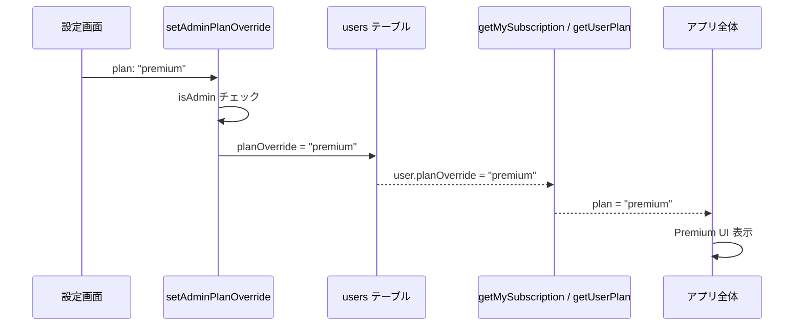

# 設計書: 管理者プラン切替機能

## Overview

管理者ユーザーが設定画面から Free/Premium プランを切り替えられるようにし、Stripe 契約なしでデザイン確認やテストを行えるようにする。

## Purpose

### 背景

現在、Premium プランの動作確認には以下の手順が必要:

1. Stripe テストモードで決済フローを完了
2. Convex ダッシュボードで手動でサブスクリプションを操作
3. CLI で `npx convex run subscriptions:setDeveloperPremium` を実行

いずれも開発者ツールへのアクセスが必要で、日常的なデザイン確認には手間がかかる。

### 目的

1. 管理者がアプリ内UIからワンタップでプラン表示を切り替えられるようにする
2. Stripe のサブスクリプション状態に影響を与えず、表示のみをオーバーライドする
3. 一般ユーザーには一切見えない管理者専用機能とする

### 代替案

| アプローチ                    | メリット         | デメリット             |
| ----------------------------- | ---------------- | ---------------------- |
| CLI コマンド                  | 実装が簡単       | 毎回ターミナルが必要   |
| Convex ダッシュボード直接編集 | 実装不要         | 事故リスク、手順が煩雑 |
| アプリ内 UI トグル            | ワンタップ、安全 | スキーマ変更が必要     |

→ アプリ内 UI トグルを採用。管理者のみに表示し、Stripe 状態とは独立して動作する。

## What to Do

### 機能要件

#### FR-1: 管理者フラグ

| 機能           | 説明                                                      |
| -------------- | --------------------------------------------------------- |
| isAdmin フラグ | users テーブルに `isAdmin` フィールドを追加               |
| CLI 設定       | `npx convex run` で管理者フラグを設定（internalMutation） |
| デフォルト     | 未設定時は `false`（一般ユーザー）                        |

#### FR-2: プランオーバーライド

| 機能         | 説明                                                                  |
| ------------ | --------------------------------------------------------------------- |
| planOverride | users テーブルに `planOverride` フィールドを追加                      |
| 優先順位     | `isAdmin && planOverride` が設定されている場合、Stripe の状態より優先 |
| 切替         | 設定画面の UI トグルで free ↔ premium を切替                          |
| 影響範囲     | 広告表示、Premium 限定機能の出し分けなど、全てのプラン判定に反映      |

#### FR-3: 設定画面 UI

| 機能             | 説明                                           |
| ---------------- | ---------------------------------------------- |
| 管理者セクション | `isAdmin` のユーザーのみに表示                 |
| トグル           | Switch コンポーネントで Free/Premium を切替    |
| 視覚的区別       | amber 系の配色で管理者専用 UI であることを明示 |

### 非機能要件

#### NFR-1: セキュリティ

- `isAdmin` フラグは internalMutation でのみ設定可能（公開 API なし）
- `planOverride` の変更は `isAdmin === true` のユーザーのみ実行可能
- 一般ユーザーにはトグル UI が一切表示されない

#### NFR-2: 独立性

- Stripe のサブスクリプションデータに一切影響しない
- `planOverride` を削除すれば、通常の Stripe ベースのプラン判定に戻る

## 実装方法

### データモデル変更

```typescript
// convex/schema.ts — users テーブル
users: defineTable({
  clerkId: v.string(),
  displayName: v.string(),
  avatarUrl: v.optional(v.string()),
  defaultGroupId: v.optional(v.id("groups")),
  isAdmin: v.optional(v.boolean()),           // 追加
  planOverride: v.optional(                    // 追加
    v.union(v.literal("free"), v.literal("premium"))
  ),
  createdAt: v.number(),
  updatedAt: v.number(),
}).index("by_clerk_id", ["clerkId"]),
```

### バックエンド変更

#### getMySubscription（変更）

```typescript
// convex/subscriptions.ts
// 戻り値に isAdmin を追加し、planOverride を反映

// isAdmin && planOverride が設定されている場合:
return {
  plan: user.planOverride, // override を優先
  status: null,
  currentPeriodEnd: null,
  cancelAtPeriodEnd: false,
  isAdmin: true,
};
```

#### getUserPlan（変更）

```typescript
// convex/lib/subscription.ts
// admin の planOverride を優先チェック
export async function getUserPlan(ctx, userId): Promise<"free" | "premium"> {
  const user = await ctx.db.get(userId);
  if (user?.isAdmin && user?.planOverride) {
    return user.planOverride;
  }
  // 以降は既存の Stripe ベースのロジック
}
```

#### 新規 API

```typescript
// convex/subscriptions.ts

// 管理者がUIからプランを切り替える（authMutation）
export const setAdminPlanOverride = authMutation({
  args: {
    plan: v.union(v.literal("free"), v.literal("premium")),
  },
  handler: async (ctx, args) => {
    if (!ctx.user.isAdmin) {
      throw new Error("管理者権限が必要です");
    }
    await ctx.db.patch(ctx.user._id, {
      planOverride: args.plan,
      updatedAt: Date.now(),
    });
  },
});

// CLIから管理者フラグを設定（internalMutation）
export const setAdminFlag = internalMutation({
  args: {
    userId: v.id("users"),
    isAdmin: v.boolean(),
  },
  handler: async (ctx, args) => {
    await ctx.db.patch(args.userId, {
      isAdmin: args.isAdmin,
      updatedAt: Date.now(),
    });
  },
});
```

### データフロー



### UI 設計

#### 設定画面（管理者のみ表示）

```
┌─────────────────────────────────────┐
│  ⚙️ 管理者モード                     │  ← amber 背景
│                                     │
│  プラン表示切替                      │
│  デザイン確認用にプラン表示を        │
│  切り替えます                        │
│                                     │
│  Free ━━━━━━━━●━━━━━━━━ Premium     │  ← Switch
│                                     │
│  ⚠️ Stripe の契約には影響しません    │
└─────────────────────────────────────┘
```

### ファイル構成

```
convex/
├── schema.ts              # 改修: users に isAdmin, planOverride 追加
├── subscriptions.ts       # 改修: getMySubscription, 新規 API 追加
└── lib/
    └── subscription.ts    # 改修: getUserPlan に override ロジック追加

components/groups/
└── GroupSettings.tsx       # 改修: 管理者モードセクション追加
```

### テスト計画

#### ユニットテスト

- `getUserPlan`
  - `isAdmin && planOverride` 設定時に override が返る
  - `isAdmin` だが `planOverride` 未設定時は通常の Stripe ロジック
  - 一般ユーザーは `planOverride` があっても無視される
- `setAdminPlanOverride`
  - 管理者が実行: 成功
  - 一般ユーザーが実行: エラー
- `setAdminFlag`
  - `isAdmin` の設定・解除

#### 手動テスト

- 管理者: 設定画面にトグルが表示される
- 一般ユーザー: トグルが表示されない
- トグル切替で広告表示が即座に変わる
- Stripe サブスクリプションに影響がないこと

## やらないこと

- **一般ユーザーへの公開**: 管理者フラグは CLI でのみ設定
- **UI からの管理者指定**: Web UI で他ユーザーを管理者にする機能
- **ロールベースのアクセス制御**: admin/member のような汎用的なロールシステム
- **監査ログ**: プラン切替の履歴記録

## 懸念事項

### 1. planOverride の消し忘れ

**懸念**: 管理者が Premium のまま放置し、本来は Free の挙動を確認すべき場面で気づかない。

**対応**:

- UI 上で現在のモードを常に明示表示（amber バッジ）
- override は Stripe の状態に影響しないので、実害はない

### 2. isAdmin の管理

**懸念**: CLI でしか設定できないため、管理者の追加・削除が煩雑。

**対応**:

- 現段階では開発者 = 管理者なので CLI で十分
- 将来的に必要であれば管理画面を作る

## 参考資料

- [サブスクリプション管理](../convex/subscriptions.ts)
- [プラン判定ユーティリティ](../convex/lib/subscription.ts)
- [認証ミドルウェア](../convex/lib/auth.ts)
- [グループ設定画面](../components/groups/GroupSettings.tsx)
- [スキーマ定義](../convex/schema.ts)
