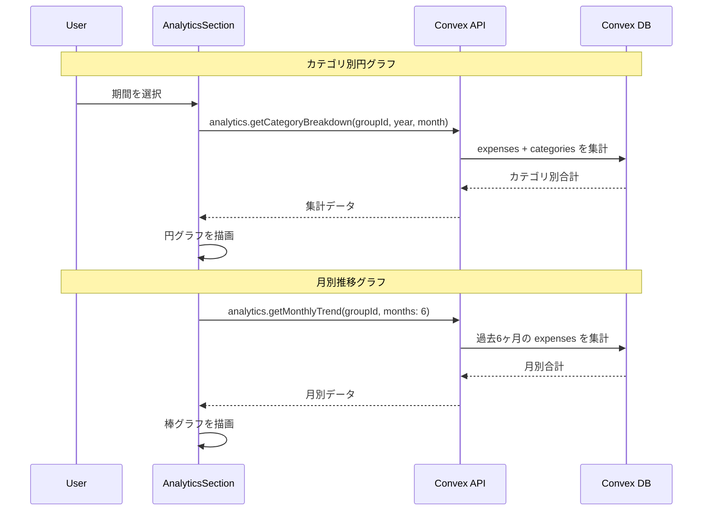
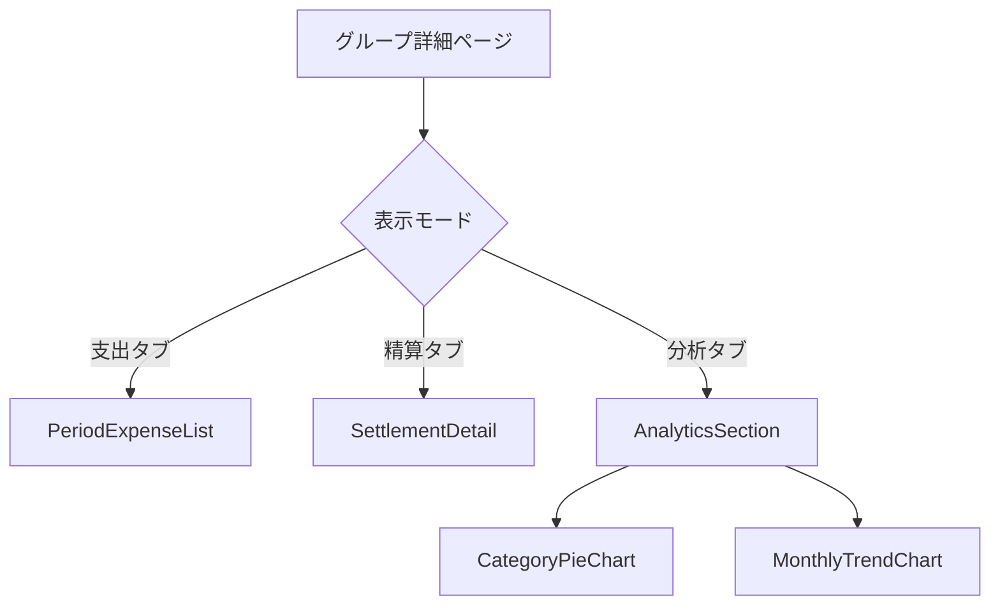

# 分析機能 設計書

## 概要

支出データの可視化機能を実装する。カテゴリ別の内訳を円グラフで、月別の推移を棒グラフで表示し、家計の傾向を把握しやすくする。

## 目的

現状、支出一覧は日付順のリスト表示のみで、以下の問題がある：

- どのカテゴリに多く支出しているか把握しづらい
- 月ごとの支出傾向が見えない
- 家計改善のための分析ができない

家計簿アプリとして「記録 → 確認 → 分析」のサイクルを完成させるため、分析機能は必須である。

## やること

### 機能要件

#### 1. カテゴリ別円グラフ

- 選択した精算期間の支出をカテゴリ別に集計
- 円グラフで割合を可視化
- カテゴリ名・金額・割合を表示
- カテゴリが0件の場合は「データなし」を表示

#### 2. 月別推移グラフ

- 過去6ヶ月分の月別支出合計を棒グラフで表示
- 各月の合計金額をラベル表示
- 現在の精算期間をハイライト

#### 3. UI/UX

- グループ詳細画面内にタブまたはセクションとして配置
- 精算期間と連動（期間ナビゲーターで切り替え）
- レスポンシブ対応（モバイルファースト）
- ローディング状態のスケルトン表示

### 非機能要件

- グラフ描画は軽量なライブラリを使用（Recharts）
- データ取得はConvex queryで効率的に集計
- グラフはインタラクティブ（ホバーで詳細表示）

## 実装方法

### データフロー



### API設計

#### `analytics.getCategoryBreakdown` query

```typescript
getCategoryBreakdown = authQuery({
  args: {
    groupId: v.id("groups"),
    year: v.number(),
    month: v.number(),
  },
  returns: v.object({
    period: v.object({
      startDate: v.string(),
      endDate: v.string(),
    }),
    totalAmount: v.number(),
    breakdown: v.array(
      v.object({
        categoryId: v.id("categories"),
        categoryName: v.string(),
        categoryIcon: v.string(),
        amount: v.number(),
        percentage: v.number(), // 0-100
      }),
    ),
  }),
  handler: async (ctx, args) => {
    // 1. メンバーシップチェック
    // 2. グループ取得 → closingDay
    // 3. 精算期間を計算
    // 4. 期間内の支出を取得
    // 5. カテゴリ別に集計
    // 6. パーセンテージを計算
    // 7. 金額降順でソート
  },
});
```

#### `analytics.getMonthlyTrend` query

```typescript
getMonthlyTrend = authQuery({
  args: {
    groupId: v.id("groups"),
    year: v.number(),
    month: v.number(),
    months: v.optional(v.number()), // デフォルト6
  },
  returns: v.object({
    trend: v.array(
      v.object({
        year: v.number(),
        month: v.number(),
        label: v.string(), // "12月"
        amount: v.number(),
        isCurrent: v.boolean(),
      }),
    ),
  }),
  handler: async (ctx, args) => {
    // 1. メンバーシップチェック
    // 2. グループ取得 → closingDay
    // 3. 過去N ヶ月分の期間を計算
    // 4. 各期間の支出合計を取得
    // 5. ラベルと共に返却
  },
});
```

### UI設計

#### 画面構成



#### グループ詳細ページの拡張

タブを追加して、支出一覧・精算・分析を切り替え可能にする。

```
┌─────────────────────────────────────┐
│ ← グループ名                         │
├─────────────────────────────────────┤
│  [支出]  [精算]  [分析]              │  ← タブ追加
├─────────────────────────────────────┤
│  ◀ 2024年12月 ▶                     │  ← 期間ナビゲーター
├─────────────────────────────────────┤
│                                     │
│  （タブに応じたコンテンツ）           │
│                                     │
└─────────────────────────────────────┘
```

#### 分析タブの構成

```
┌─────────────────────────────────────┐
│  カテゴリ別支出                      │
├─────────────────────────────────────┤
│                                     │
│      ┌───────┐                      │
│     ╱    🍔   ╲                     │
│    │  食費    │   ● 食費 ¥12,000    │
│    │  45%    │   ● 日用品 ¥6,000   │
│     ╲        ╱   ● 交通費 ¥4,000   │
│      └───────┘   ● その他 ¥2,000   │
│                                     │
│  合計: ¥24,000                       │
├─────────────────────────────────────┤
│  月別推移                            │
├─────────────────────────────────────┤
│                                     │
│   30k ┤                    ▓        │
│       │              ▓     ▓        │
│   20k ┤  ▓     ▓     ▓     ▓   ▓   │
│       │  ▓  ▓  ▓     ▓     ▓   ▓   │
│   10k ┤  ▓  ▓  ▓  ▓  ▓  ▓  ▓   ▓   │
│       │  ▓  ▓  ▓  ▓  ▓  ▓  ▓   ▓   │
│     0 └──7月─8月─9月─10月─11月─12月──│
│                          ↑ 現在     │
│                                     │
└─────────────────────────────────────┘
```

#### データなしの場合

```
┌─────────────────────────────────────┐
│  カテゴリ別支出                      │
├─────────────────────────────────────┤
│                                     │
│     この期間の支出データがありません   │
│                                     │
└─────────────────────────────────────┘
```

### チャートライブラリの選定

**Recharts** を採用する。

| ライブラリ | バンドルサイズ | React対応  | カスタマイズ性 | 採用理由             |
| ---------- | -------------- | ---------- | -------------- | -------------------- |
| Recharts   | ~140KB         | ネイティブ | 高             | React専用、宣言的API |
| Chart.js   | ~200KB         | ラッパー   | 中             | 汎用、やや冗長       |
| D3.js      | ~280KB         | 低レベル   | 最高           | 学習コスト高、過剰   |
| Victory    | ~180KB         | ネイティブ | 高             | Rechartsより重い     |

Rechartsの利点：

- React向けに設計された宣言的API
- レスポンシブ対応が組み込み
- TypeScriptサポート
- アクセシビリティ考慮
- SSR対応

### ファイル構成

```
convex/
├── analytics.ts            # 新規: 分析用クエリ

components/analytics/
├── index.ts               # 新規: エクスポート
├── AnalyticsSection.tsx   # 新規: 分析セクション全体
├── CategoryPieChart.tsx   # 新規: カテゴリ別円グラフ
├── MonthlyTrendChart.tsx  # 新規: 月別推移棒グラフ
└── ChartSkeleton.tsx      # 新規: ローディング表示

components/groups/
└── GroupDetail.tsx        # 改修: タブ追加

app/groups/[groupId]/
└── page.tsx              # 改修: タブ状態管理
```

### カラーパレット

カテゴリ別円グラフには、視覚的に区別しやすい色を使用。

```typescript
const CHART_COLORS = [
  "#2563eb", // blue-600
  "#16a34a", // green-600
  "#ea580c", // orange-600
  "#9333ea", // purple-600
  "#e11d48", // rose-600
  "#0891b2", // cyan-600
  "#ca8a04", // yellow-600
  "#4f46e5", // indigo-600
];
```

### テスト計画

#### ユニットテスト

- `analytics.getCategoryBreakdown`
  - 正常系: 期間内支出のカテゴリ別集計
  - 支出0件の場合: 空配列を返却
  - パーセンテージ計算の正確性
  - 金額降順ソートの確認
- `analytics.getMonthlyTrend`
  - 正常系: 過去6ヶ月分のデータ取得
  - 月をまたぐ精算期間の処理
  - 支出0件の月: amount=0で返却
  - `isCurrent`フラグの正確性

#### 統合テスト

- グループメンバー以外はアクセス不可
- 精算期間の境界値テスト

## やらないこと

- **ユーザー別分析**: 誰がいくら支払ったかの分析は対象外（精算画面で確認可能）
- **カスタム期間指定**: 任意の日付範囲での分析は対象外
- **エクスポート機能**: CSVやPDF出力は対象外
- **目標設定・予算管理**: カテゴリごとの予算上限設定は対象外
- **前年同月比較**: 過去データとの比較分析は対象外
- **グラフ種類の切り替え**: 円グラフ/棒グラフの変更オプションは対象外

## 懸念事項

### 1. グラフライブラリのバンドルサイズ

**懸念**: Recharts（~140KB）追加によるバンドルサイズ増加。

**対応**:

- 動的インポート（`next/dynamic`）でコード分割
- 分析タブを開いたときのみロード
- Tree shakingでPieChartとBarChartのみインポート

```typescript
const CategoryPieChart = dynamic(
  () => import("@/components/analytics/CategoryPieChart"),
  { loading: () => <ChartSkeleton /> }
);
```

### 2. 大量データ時のパフォーマンス

**懸念**: 支出件数が多い場合のクエリ性能。

**対応**:

- 集計はDB側で実施（Convex query内）
- インデックス `by_group_and_date` を活用
- 期間指定でデータ量を制限

### 3. 精算期間の月別集計

**懸念**: 締め日が月中の場合、月別推移の計算が複雑。

**対応**:

- 既存の `getSettlementPeriod` を使用して一貫性を保つ
- 各「月」は精算期間（例: 12/16〜1/15を「1月」とする）
- ラベルは精算期間のラベル（`getSettlementLabel`）を使用

### 4. 色覚多様性への配慮

**懸念**: 色のみで区別すると色覚特性のあるユーザーに不便。

**対応**:

- カテゴリ名とアイコンを凡例に併記
- ホバー時に詳細を表示
- 円グラフのセクションにパターン追加も将来検討

## 参考資料

- [Recharts公式ドキュメント](https://recharts.org/)
- [Next.js Dynamic Import](https://nextjs.org/docs/advanced-features/dynamic-import)
- [既存の精算期間計算ロジック](./design-expense-period-navigation.md)
- [MVP機能仕様](./mvp-features.md)
