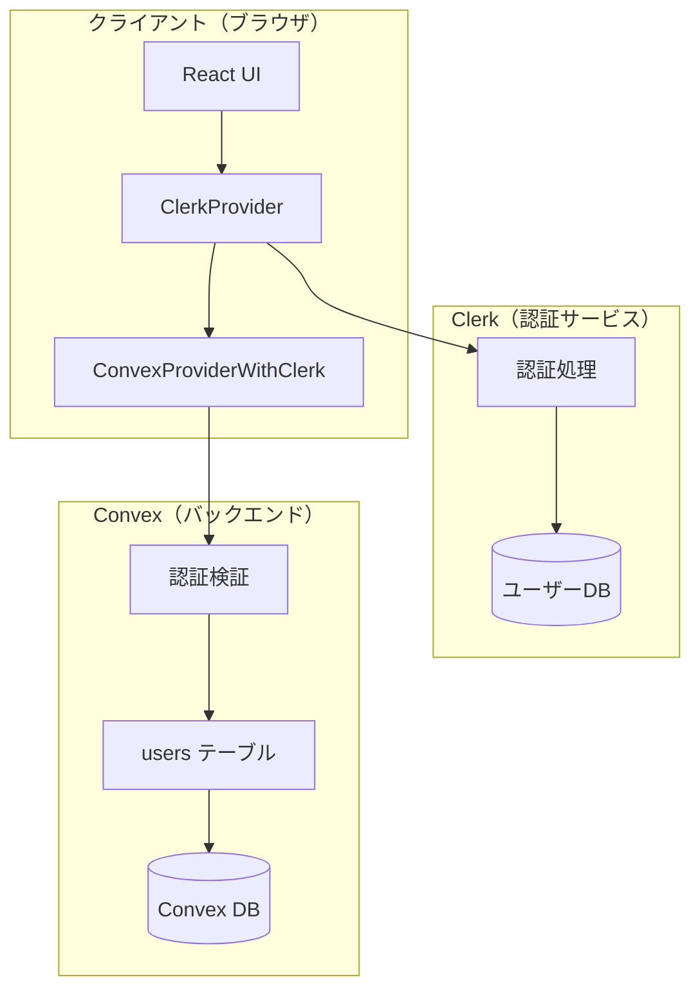
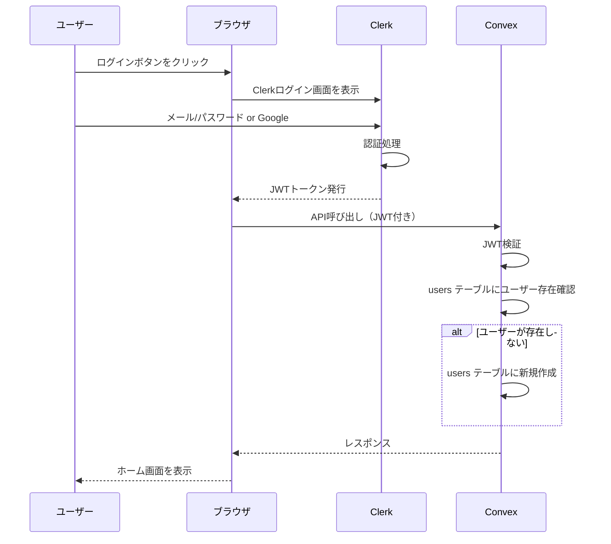
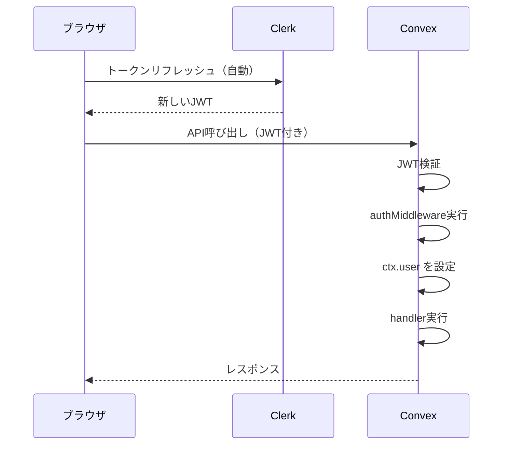

# Oaiko 認証設計書

> 作成日: 2024-12-30
> ステータス: 承認済み

---

## 概要

Oaikoの認証機能の設計書。ユーザーのログイン・ログアウト、セッション管理、Convexバックエンドとの連携方法を定義する。

**採用する認証方式**: Clerk（外部認証サービス）

---

## 目的

### なぜ認証が必要か

1. **ユーザーの識別**
   - 支出の登録者・支払者を特定する
   - グループメンバーを管理する

2. **データの保護**
   - 自分のグループの情報のみアクセス可能にする
   - 他人の支出データを見られないようにする

3. **グループ招待機能の実現**
   - 招待リンクを受け取ったユーザーがログインしてグループに参加

### なぜClerkを選んだか

| 観点             | Clerk                      | Convex Auth         |
| ---------------- | -------------------------- | ------------------- |
| 安定性           | 本番運用実績多数           | ベータ版（pre-1.0） |
| 機能             | パスキー、2FA、スパム対策  | 基本的な認証のみ    |
| UIコンポーネント | 提供あり（カスタマイズ可） | 自分で実装          |
| 無料枠           | 10,000 MAU/月              | 無制限              |
| 外部依存         | あり（Clerkサービス）      | なし                |
| セットアップ     | やや複雑                   | シンプル            |

**決定理由**:

- 個人開発で認証まわりのバグ対応に時間を取られたくない
- 10,000 MAU/月は個人〜小規模利用に十分
- Convex公式もClerkを推奨している

---

## やること（機能要件・非機能要件）

### 機能要件

#### 1. ユーザー登録・ログイン

| 方式                        | 対応 | 備考           |
| --------------------------- | ---- | -------------- |
| メールアドレス + パスワード | ○    | 基本の認証方式 |
| Googleログイン              | ○    | OAuth 2.0      |
| Appleログイン               | △    | MVP後に検討    |
| パスキー                    | △    | MVP後に検討    |

#### 2. セッション管理

- ログイン状態の維持（Clerkが自動管理）
- ログアウト機能
- セッションの有効期限管理

#### 3. ユーザープロフィール

- 表示名の設定・変更
- アバター画像の設定（Clerkのアップロード機能を利用）

#### 4. Convex連携

- Clerk認証後、Convexの `users` テーブルにユーザーを作成
- `ctx.auth.getUserIdentity()` で認証情報を取得

### 非機能要件

| 項目           | 要件                                      |
| -------------- | ----------------------------------------- |
| セキュリティ   | HTTPS必須、JWTトークンによる認証          |
| パフォーマンス | ログイン処理は3秒以内                     |
| 可用性         | Clerkのサービス稼働率に依存（99.99% SLA） |

---

## どうやるか（実装詳細）

### システムアーキテクチャ



### 認証フロー

#### 初回ログイン（ユーザー登録）



#### 通常のAPI呼び出し



### 実装コード

#### 1. Clerkのセットアップ

```typescript
// app/layout.tsx
import { ClerkProvider } from "@clerk/nextjs";
import { ConvexProviderWithClerk } from "convex/react-clerk";
import { ConvexReactClient } from "convex/react";
import { useAuth } from "@clerk/nextjs";

const convex = new ConvexReactClient(process.env.NEXT_PUBLIC_CONVEX_URL!);

export default function RootLayout({
  children,
}: {
  children: React.ReactNode;
}) {
  return (
    <ClerkProvider>
      <ConvexProviderWithClerk client={convex} useAuth={useAuth}>
        {children}
      </ConvexProviderWithClerk>
    </ClerkProvider>
  );
}
```

#### 2. 認証ミドルウェア（Convex側）

```typescript
// convex/lib/auth.ts
import {
  customQuery,
  customMutation,
} from "convex-helpers/server/customFunctions";
import { query, mutation } from "../_generated/server";
import { ConvexError } from "convex/values";

// 認証ミドルウェア
const authMiddleware = {
  args: {},
  input: async (ctx, args) => {
    // 1. Clerkから認証情報を取得
    const identity = await ctx.auth.getUserIdentity();
    if (!identity) {
      throw new ConvexError("認証が必要です");
    }

    // 2. usersテーブルからユーザーを取得（なければ作成）
    let user = await ctx.db
      .query("users")
      .withIndex("by_clerk_id", (q) => q.eq("clerkId", identity.subject))
      .unique();

    if (!user) {
      // 初回ログイン時：ユーザーを自動作成
      const now = Date.now();
      const userId = await ctx.db.insert("users", {
        clerkId: identity.subject,
        displayName: identity.name ?? identity.email ?? "名無し",
        avatarUrl: identity.pictureUrl,
        createdAt: now,
        updatedAt: now,
      });
      user = await ctx.db.get(userId);
    }

    // 3. ctx.user として利用可能にする
    return { ctx: { ...ctx, user: user! }, args };
  },
};

// 認証必須のquery/mutation
export const authQuery = customQuery(query, authMiddleware);
export const authMutation = customMutation(mutation, authMiddleware);
```

#### 3. ログイン状態の確認（フロントエンド）

```typescript
// app/components/AuthGuard.tsx
"use client";

import { useConvexAuth } from "convex/react";
import { useRouter } from "next/navigation";
import { useEffect } from "react";

export function AuthGuard({ children }: { children: React.ReactNode }) {
  const { isAuthenticated, isLoading } = useConvexAuth();
  const router = useRouter();

  useEffect(() => {
    if (!isLoading && !isAuthenticated) {
      router.push("/sign-in");
    }
  }, [isAuthenticated, isLoading, router]);

  if (isLoading) {
    return <div>読み込み中...</div>;
  }

  if (!isAuthenticated) {
    return null;
  }

  return <>{children}</>;
}
```

**重要**: `useAuth()`（Clerk）ではなく `useConvexAuth()`（Convex）を使う。
Convex側でJWTの検証が完了しているかを確認するため。

#### 4. ログインページ

```typescript
// app/sign-in/[[...sign-in]]/page.tsx
import { SignIn } from "@clerk/nextjs";

export default function SignInPage() {
  return (
    <div className="flex min-h-screen items-center justify-center">
      <SignIn
        appearance={{
          elements: {
            rootBox: "mx-auto",
            card: "shadow-lg",
          },
        }}
        redirectUrl="/"
      />
    </div>
  );
}
```

#### 5. 環境変数

```bash
# .env.local

# Clerk
NEXT_PUBLIC_CLERK_PUBLISHABLE_KEY=pk_test_xxx
CLERK_SECRET_KEY=sk_test_xxx
NEXT_PUBLIC_CLERK_SIGN_IN_URL=/sign-in
NEXT_PUBLIC_CLERK_SIGN_UP_URL=/sign-up
NEXT_PUBLIC_CLERK_AFTER_SIGN_IN_URL=/
NEXT_PUBLIC_CLERK_AFTER_SIGN_UP_URL=/

# Convex
NEXT_PUBLIC_CONVEX_URL=https://xxx.convex.cloud
```

### Clerkダッシュボードの設定

#### 1. アプリケーション作成

1. [Clerk Dashboard](https://dashboard.clerk.com/) でアカウント作成
2. 新規アプリケーションを作成（名前: `oaiko`）
3. API Keysをコピーして `.env.local` に設定

#### 2. OAuth設定（Googleログイン）

1. Clerk Dashboard → **Configure** → **SSO Connections**
2. **Google** を有効化
3. Google Cloud ConsoleでOAuth 2.0クライアントを作成
4. クライアントID/シークレットをClerkに設定

#### 3. Convex連携設定

1. Clerk Dashboard → **Configure** → **JWT Templates**
2. **Convex** テンプレートを選択
3. Issuer URLをコピー

```bash
# convex/.env.local
CLERK_ISSUER_URL=https://xxx.clerk.accounts.dev
```

```typescript
// convex/auth.config.ts
export default {
  providers: [
    {
      domain: process.env.CLERK_ISSUER_URL,
      applicationID: "convex",
    },
  ],
};
```

### ページ構成

```
app/
├── layout.tsx              # ClerkProvider + ConvexProvider
├── page.tsx                # ホーム（認証必須）
├── sign-in/
│   └── [[...sign-in]]/
│       └── page.tsx        # ログインページ
├── sign-up/
│   └── [[...sign-up]]/
│       └── page.tsx        # 登録ページ
└── (authenticated)/        # 認証必須ルート
    ├── layout.tsx          # AuthGuard
    ├── groups/
    │   └── page.tsx
    └── expenses/
        └── page.tsx
```

### データモデル（既存の設計を踏襲）

```typescript
// convex/schema.ts（users テーブル）
users: defineTable({
  clerkId: v.string(),        // Clerk の user ID
  displayName: v.string(),    // 表示名
  avatarUrl: v.optional(v.string()),  // アバターURL
  createdAt: v.number(),
  updatedAt: v.number(),
})
  .index("by_clerk_id", ["clerkId"]),
```

---

## やらないこと

### MVP外の機能

| 機能               | 理由                                 |
| ------------------ | ------------------------------------ |
| Appleログイン      | 実装コスト、MVP後に検討              |
| パスキー           | Clerk側で対応可能だが、MVP後に有効化 |
| 2要素認証（2FA）   | MVP後に有効化                        |
| メールアドレス変更 | Clerkのデフォルト機能で対応可        |
| アカウント削除     | MVP後に検討（GDPR対応等）            |

### 設計上の制限

| 項目                     | 制限内容               | 理由                     |
| ------------------------ | ---------------------- | ------------------------ |
| 匿名ユーザー             | 対応しない             | グループ機能には認証必須 |
| 複数デバイス同時ログイン | Clerk依存（許可）      | 特に制限しない           |
| セッション有効期限       | Clerkデフォルト（7日） | 変更しない               |

---

## 懸念事項

### 1. Clerkのベンダーロックイン

**問題**: Clerkに依存するため、将来的な移行が困難

**対応**:

- `clerkId` を `users` テーブルに保存し、Convex側でユーザー管理
- 認証ロジックを `convex/lib/auth.ts` に集約し、変更時の影響を最小化
- 移行が必要になった場合、`clerkId` を別の認証サービスのIDに置き換え

### 2. Clerkの料金

**問題**: 10,000 MAUを超えた場合の課金

**対応**:

- 個人〜小規模グループなら超える可能性は低い
- 超えた場合: Pro Plan $25/月 + $0.02/MAU
- 10,000 MAU超えが見えてきたら検討

### 3. 初回ログイン時のユーザー作成

**問題**: Clerkで認証成功してもConvexにユーザーがいない場合がある

**対応**:

- `authMiddleware` で自動作成する設計を採用
- Clerk Webhookでユーザー作成する方式もあるが、シンプルさ優先で不採用

### 4. Clerkの障害

**問題**: Clerkがダウンするとログインできなくなる

**対応**:

- Clerkは99.99% SLAを提供
- 障害時は待つしかない（個人開発の許容範囲）

---

## 参考資料・情報

### Clerk公式

- [Clerk + Convex 統合ガイド](https://clerk.com/docs/guides/development/integrations/databases/convex)
- [Clerk 料金プラン](https://clerk.com/pricing) - 10,000 MAU無料

### Convex公式

- [Authentication | Convex](https://docs.convex.dev/auth)
- [Convex & Clerk | Convex](https://docs.convex.dev/auth/clerk)
- [Authentication Best Practices](https://stack.convex.dev/authentication-best-practices-convex-clerk-and-nextjs)

### 比較記事

- [Convex Auth FAQ](https://labs.convex.dev/auth/faq)
- [Introducing Convex Auth](https://stack.convex.dev/convex-auth)

---

## 次のステップ

1. [ ] Clerkアカウント作成・アプリケーション設定
2. [ ] 環境変数の設定
3. [ ] `convex/auth.config.ts` の作成
4. [ ] `convex/lib/auth.ts` の実装
5. [ ] ClerkProvider + ConvexProvider のセットアップ
6. [ ] ログイン/登録ページの作成
7. [ ] Googleログインの設定（OAuth）

---

## 変更履歴

| 日付       | 変更内容 | 変更者 |
| ---------- | -------- | ------ |
| 2024-12-30 | 初版作成 | Claude |
