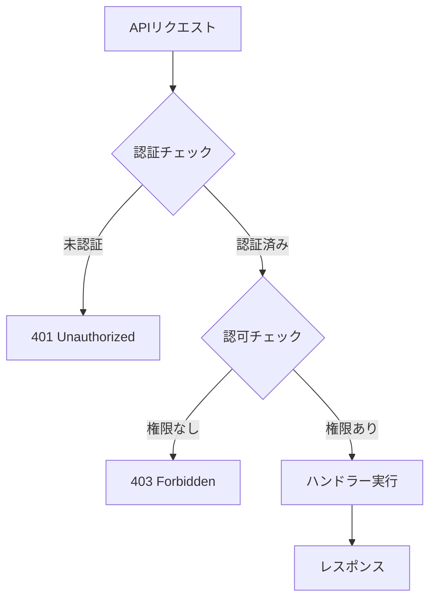
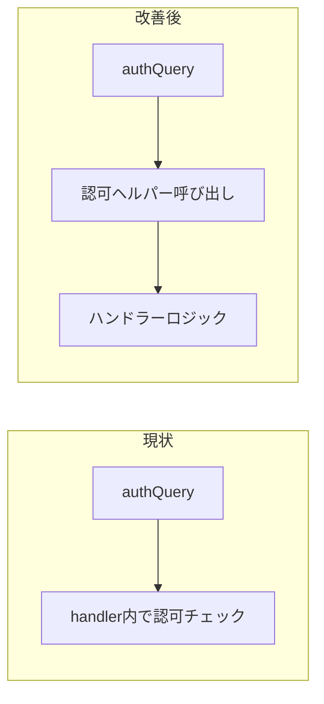
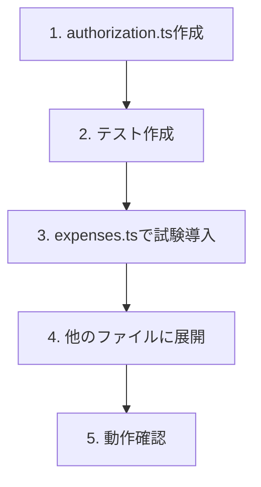

# 認可（Authorization）共通化・強化 設計ドキュメント

## 概要

Convex APIハンドラーに散在している認可チェックを共通化し、安全性と保守性を向上させる。

## 目的

### 現状の問題

現在、認可チェックは各APIハンドラー内で個別に実装されている：

```typescript
// 現状: 20箇所以上で同じようなコードが重複
const myMembership = await ctx.db
  .query("groupMembers")
  .withIndex("by_group_and_user", (q) =>
    q.eq("groupId", args.groupId).eq("userId", ctx.user._id),
  )
  .unique();

if (!myMembership) {
  throw new Error("このグループにアクセスする権限がありません");
}
```

### 問題点

| 問題                   | 影響                                                 |
| ---------------------- | ---------------------------------------------------- |
| **コード重複**         | 20箇所以上で同じコードを書いている                   |
| **チェック漏れリスク** | 新しいAPIを追加する際に認可チェックを忘れる可能性    |
| **一貫性のなさ**       | エラーメッセージやログ出力が統一されていない         |
| **テスト困難**         | 認可ロジックが分散しているため網羅的なテストが難しい |

### 解決したいこと

1. **DRY原則の適用**: 認可チェックを1箇所に集約
2. **安全なデフォルト**: 認可チェックを忘れにくい構造
3. **一貫性**: エラーメッセージとログの統一
4. **テスト容易性**: 認可ロジックを独立してテスト可能に

## やること

### 機能要件

#### 1. グループアクセス権チェックの共通化



#### 2. ロールベースアクセス制御

| 操作                 | member | owner |
| -------------------- | ------ | ----- |
| グループ情報閲覧     | ✅     | ✅    |
| 支出登録・編集・削除 | ✅     | ✅    |
| 精算プレビュー閲覧   | ✅     | ✅    |
| カテゴリ管理         | ✅     | ✅    |
| 買い物リスト管理     | ✅     | ✅    |
| **招待リンク作成**   | ❌     | ✅    |
| **精算確定**         | ❌     | ✅    |

#### 3. 認可ヘルパー関数

- `requireGroupMember(ctx, groupId)`: グループメンバーであることを確認
- `requireGroupOwner(ctx, groupId)`: グループオーナーであることを確認
- `getGroupMembership(ctx, groupId)`: メンバーシップを取得（null許容）

### 非機能要件

| 項目           | 要件                            |
| -------------- | ------------------------------- |
| パフォーマンス | 既存と同等（追加クエリなし）    |
| 後方互換性     | 既存のAPIシグネチャを変更しない |
| ログ出力       | 認可失敗時は必ずログを記録      |

## やり方

### 1. アーキテクチャ



### 2. ファイル構成

```
convex/lib/
├── auth.ts              # 既存: 認証ミドルウェア
├── authorization.ts     # 新規: 認可ヘルパー関数
└── errors.ts            # 新規: エラー定義（オプション）
```

### 3. 認可ヘルパーの実装

```typescript
// convex/lib/authorization.ts

import { ConvexError } from "convex/values";
import type { Id, Doc } from "../_generated/dataModel";
import type { AuthQueryCtx, AuthMutationCtx } from "./auth";

/**
 * グループメンバーシップの型
 */
export type GroupMembership = Doc<"groupMembers">;

/**
 * グループメンバーシップを取得
 * メンバーでない場合はnullを返す
 */
export async function getGroupMembership(
  ctx: AuthQueryCtx | AuthMutationCtx,
  groupId: Id<"groups">,
): Promise<GroupMembership | null> {
  return await ctx.db
    .query("groupMembers")
    .withIndex("by_group_and_user", (q) =>
      q.eq("groupId", groupId).eq("userId", ctx.user._id),
    )
    .unique();
}

/**
 * グループメンバーであることを要求
 * メンバーでない場合はエラーをスロー
 */
export async function requireGroupMember(
  ctx: AuthQueryCtx | AuthMutationCtx,
  groupId: Id<"groups">,
): Promise<GroupMembership> {
  const membership = await getGroupMembership(ctx, groupId);

  if (!membership) {
    ctx.logger.warn("AUTH", "group_access_denied", { groupId });
    throw new ConvexError("このグループにアクセスする権限がありません");
  }

  return membership;
}

/**
 * グループオーナーであることを要求
 * オーナーでない場合はエラーをスロー
 */
export async function requireGroupOwner(
  ctx: AuthQueryCtx | AuthMutationCtx,
  groupId: Id<"groups">,
): Promise<GroupMembership> {
  const membership = await requireGroupMember(ctx, groupId);

  if (membership.role !== "owner") {
    ctx.logger.warn("AUTH", "owner_required", { groupId });
    throw new ConvexError("この操作にはオーナー権限が必要です");
  }

  return membership;
}
```

### 4. 使用例

#### Before（現状）

```typescript
export const create = authMutation({
  args: { groupId: v.id("groups"), ... },
  handler: async (ctx, args) => {
    // 認可チェック（各ハンドラーで重複）
    const myMembership = await ctx.db
      .query("groupMembers")
      .withIndex("by_group_and_user", (q) =>
        q.eq("groupId", args.groupId).eq("userId", ctx.user._id),
      )
      .unique();

    if (!myMembership) {
      throw new Error("このグループにアクセスする権限がありません");
    }

    // ビジネスロジック
    ...
  },
});
```

#### After（改善後）

```typescript
import { requireGroupMember } from "./lib/authorization";

export const create = authMutation({
  args: { groupId: v.id("groups"), ... },
  handler: async (ctx, args) => {
    // 認可チェック（1行で完結）
    await requireGroupMember(ctx, args.groupId);

    // ビジネスロジック
    ...
  },
});
```

### 5. 移行計画



#### 対象ファイルと変更箇所

| ファイル        | 認可チェック箇所 | 優先度 |
| --------------- | ---------------- | ------ |
| expenses.ts     | 6箇所            | 高     |
| settlements.ts  | 4箇所            | 高     |
| shoppingList.ts | 7箇所            | 中     |
| categories.ts   | 4箇所            | 中     |
| analytics.ts    | 2箇所            | 低     |
| groups.ts       | 2箇所            | 低     |

### 6. エラーメッセージの統一

| 状況                   | エラーメッセージ                             |
| ---------------------- | -------------------------------------------- |
| グループメンバーでない | "このグループにアクセスする権限がありません" |
| オーナー権限が必要     | "この操作にはオーナー権限が必要です"         |
| グループが存在しない   | "グループが見つかりません"                   |

## やらないこと

| 項目                           | 理由                                                 |
| ------------------------------ | ---------------------------------------------------- |
| ミドルウェア方式への変更       | 既存のauthQuery/authMutationとの互換性を維持するため |
| 権限の細分化                   | 現状owner/memberの2段階で十分                        |
| リソースレベルの認可           | 支出の編集者制限などは今回のスコープ外               |
| フロントエンドでの認可チェック | バックエンドで完結させる                             |

## 懸念事項

### 1. パフォーマンスへの影響

**懸念**: ヘルパー関数を使うことでクエリが増えないか

**対応**:

- 既存と同じクエリを実行するだけなので影響なし
- メンバーシップを返すので、必要に応じて再利用可能

### 2. 段階的な移行

**懸念**: 一度に全ファイルを変更するとリスクが高い

**対応**:

- まずexpenses.tsで試験導入
- 動作確認後、他のファイルに展開
- 各ファイル単位でPRを分けることも検討

### 3. 既存テストへの影響

**懸念**: 認可ロジックを変更するとテストが壊れる可能性

**対応**:

- 認可ヘルパー自体のユニットテストを追加
- 既存の統合テストは変更不要のはず（外部動作は変わらない）

## 参考資料

- 現在の認証実装: `convex/lib/auth.ts`
- 認証設計書: `docs/design-authentication.md`
- Convex公式: [Authorization Best Practices](https://docs.convex.dev/auth/authorization)
