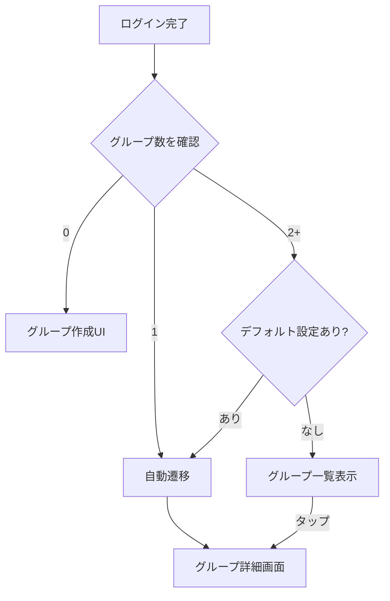

# グループ自動遷移 設計書

## Overview

ログイン後、ユーザーが所属するグループが1つの場合、または「デフォルトグループ」が設定されている場合、自動的にそのグループ詳細画面へ遷移する。グループ選択画面を省略し、UXを向上させる。

## Purpose

### なぜ必要か

1. **ターゲットユーザーの利用パターン**
   - 同棲カップル・夫婦は基本的に1グループのみ
   - 毎回グループを選択する必要がない

2. **操作ステップの削減**
   - Before: ログイン → グループ選択 → グループ詳細（2ステップ）
   - After: ログイン → グループ詳細（0ステップ）

3. **複数グループユーザーへの対応**
   - シェアハウスと夫婦など、複数グループに所属するケースも考慮
   - デフォルトグループを設定して自動遷移可能に

## What to Do

### 機能要件

| 条件                                  | 動作                           |
| ------------------------------------- | ------------------------------ |
| 所属グループ = 0                      | グループ作成を促すUI表示       |
| 所属グループ = 1                      | 自動的にそのグループ詳細へ遷移 |
| 所属グループ ≥ 2 & デフォルト設定あり | デフォルトグループへ自動遷移   |
| 所属グループ ≥ 2 & デフォルト設定なし | グループ一覧を表示             |

### デフォルトグループ設定

| 項目     | 内容                                               |
| -------- | -------------------------------------------------- |
| 設定場所 | グループ設定画面、またはグループ一覧画面           |
| 設定方法 | 「デフォルトに設定」ボタン/トグル                  |
| 解除方法 | 「デフォルトを解除」または別グループをデフォルトに |
| 保存先   | `users`テーブルに`defaultGroupId`フィールド追加    |

### ユーザーフロー



### 非機能要件

- 遷移はスムーズに（ローディング表示は最小限）
- 戻るボタンでホームに戻れる（グループ一覧へ）
- デフォルト設定は任意（設定しなくても使える）

## How to Do It

### 1. DBスキーマ変更

```typescript
// convex/schema.ts
users: defineTable({
  clerkId: v.string(),
  displayName: v.string(),
  avatarUrl: v.optional(v.string()),
  defaultGroupId: v.optional(v.id("groups")), // 追加
  createdAt: v.number(),
  updatedAt: v.number(),
}).index("by_clerk_id", ["clerkId"]),
```

### 2. API追加

```typescript
// convex/users.ts

// デフォルトグループ設定
export const setDefaultGroup = authMutation({
  args: {
    groupId: v.union(v.id("groups"), v.null()),
  },
  handler: async (ctx, args) => {
    // groupIdがnullでない場合、メンバーであることを確認
    if (args.groupId !== null) {
      await requireGroupMember(ctx, args.groupId);
    }

    await ctx.db.patch(ctx.user._id, {
      defaultGroupId: args.groupId ?? undefined,
      updatedAt: Date.now(),
    });
  },
});

// 現在のユーザー情報取得（デフォルトグループ含む）
export const getMe = authQuery({
  args: {},
  handler: async (ctx) => {
    return {
      ...ctx.user,
      // デフォルトグループが存在するか確認
      defaultGroupId: ctx.user.defaultGroupId,
    };
  },
});
```

### 3. ホーム画面の実装

```typescript
// app/page.tsx

export default function Home() {
  const { isAuthenticated, isLoading } = useConvexAuth();
  const router = useRouter();

  const me = useQuery(api.users.getMe, isAuthenticated ? {} : "skip");
  const groups = useQuery(api.groups.list, isAuthenticated ? {} : "skip");

  // 自動遷移処理
  useEffect(() => {
    if (groups === undefined || me === undefined) return;

    // グループ1つの場合
    if (groups.length === 1) {
      router.replace(`/groups/${groups[0]._id}`);
      return;
    }

    // デフォルトグループが設定されている場合
    if (me.defaultGroupId) {
      const defaultGroup = groups.find((g) => g._id === me.defaultGroupId);
      if (defaultGroup) {
        router.replace(`/groups/${defaultGroup._id}`);
      }
    }
  }, [groups, me, router]);

  // ... 以下、条件分岐でUI表示
}
```

### 4. デフォルトグループ設定UI

#### グループ一覧での設定

```typescript
// components/groups/GroupCard.tsx
// ドロップダウンメニューに「デフォルトに設定」を追加

<DropdownMenuItem onClick={() => setDefaultGroup(group._id)}>
  {isDefault ? "デフォルトを解除" : "デフォルトに設定"}
</DropdownMenuItem>
```

#### グループ設定画面での設定

```typescript
// components/groups/GroupSettings.tsx
// デフォルトグループ設定トグルを追加

<div className="flex items-center justify-between">
  <div>
    <p className="font-medium">デフォルトグループ</p>
    <p className="text-sm text-slate-500">
      ログイン時に自動でこのグループを開きます
    </p>
  </div>
  <Switch
    checked={isDefault}
    onCheckedChange={(checked) =>
      setDefaultGroup(checked ? groupId : null)
    }
  />
</div>
```

### 5. ファイル変更一覧

| ファイル                              | 操作 | 内容                           |
| ------------------------------------- | ---- | ------------------------------ |
| `convex/schema.ts`                    | 変更 | `users`に`defaultGroupId`追加  |
| `convex/users.ts`                     | 変更 | `setDefaultGroup`, `getMe`追加 |
| `app/page.tsx`                        | 変更 | 自動遷移ロジック追加           |
| `components/groups/GroupCard.tsx`     | 変更 | デフォルト設定メニュー追加     |
| `components/groups/GroupSettings.tsx` | 変更 | デフォルト設定トグル追加       |
| `convex/__tests__/users.test.ts`      | 変更 | デフォルトグループテスト追加   |

### 6. エッジケース

| ケース                         | 対応                 |
| ------------------------------ | -------------------- |
| デフォルトグループが削除された | 自動遷移せず一覧表示 |
| デフォルトグループから退出した | 同上                 |
| デフォルトグループが存在しない | 同上（DB不整合時）   |

## What We Won't Do

| 項目                       | 理由                            |
| -------------------------- | ------------------------------- |
| 最後に開いたグループを記憶 | デフォルト設定で十分            |
| グループごとの優先度設定   | 複雑になる。デフォルト1つで十分 |

## Concerns

### 懸念事項

| 懸念                       | リスク | 対策                       |
| -------------------------- | ------ | -------------------------- |
| 遷移のちらつき             | 中     | ローディング表示で対応     |
| デフォルトグループの不整合 | 低     | 存在チェックしてから遷移   |
| 戻るボタンの挙動           | 低     | router.replaceで履歴を置換 |

### 決定事項

| 項目                   | 決定                         |
| ---------------------- | ---------------------------- |
| デフォルト設定の保存先 | `users`テーブル              |
| 複数グループ時のUI     | デフォルト未設定なら一覧表示 |
| 履歴の扱い             | replaceで置換                |

## Reference Materials/Information

### 既存実装

- `app/page.tsx` - 現在のホーム画面実装
- `components/groups/GroupList.tsx` - グループ一覧コンポーネント
- `components/groups/GroupCard.tsx` - グループカード（メニューあり）
- `components/groups/GroupSettings.tsx` - グループ設定画面
- `convex/users.ts` - ユーザーAPI

## 変更履歴

| 日付       | 変更内容                   | 変更者 |
| ---------- | -------------------------- | ------ |
| 2026-02-04 | 初版作成                   | Claude |
| 2026-02-04 | デフォルトグループ機能追加 | Claude |
