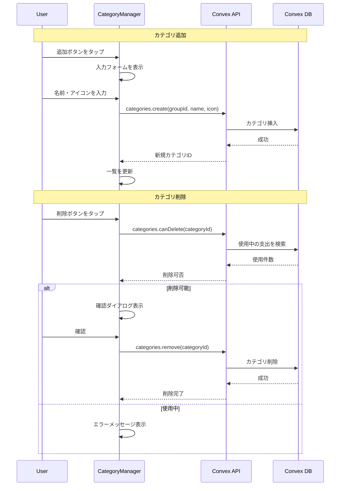
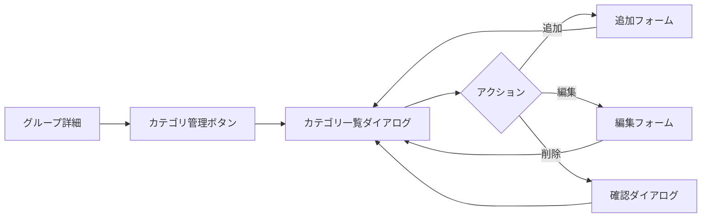

# カスタムカテゴリ機能 設計書

## 概要

グループごとにカスタムカテゴリを追加・編集・削除できる機能を実装する。プリセットカテゴリ（食費、日用品など）に加えて、ユーザーが独自のカテゴリを作成できるようにする。

## 目的

現状、カテゴリはグループ作成時にコピーされるプリセットのみで、以下の問題がある：

- グループ固有の支出カテゴリを作成できない（例：「家賃」「ペット費」「サブスク」）
- 使わないプリセットカテゴリを非表示にできない
- カテゴリの並び順を変更できない

家計簿アプリとして、ユーザーの生活スタイルに合わせたカスタマイズは必須である。

## やること

### 機能要件

#### 1. カテゴリ追加

- カテゴリ名（必須、1〜20文字）
- アイコン（必須、絵文字1文字）
- 追加権限は**グループメンバー全員**

#### 2. カテゴリ編集

- カテゴリ名とアイコンを変更可能
- **カスタムカテゴリのみ**編集可能（プリセットは編集不可）
- 編集権限は**グループメンバー全員**

#### 3. カテゴリ削除

- **カスタムカテゴリのみ**削除可能（プリセットは削除不可）
- **使用中のカテゴリは削除不可**（そのカテゴリを使った支出が存在する場合）
- 削除前に確認ダイアログを表示
- 削除権限は**グループメンバー全員**

#### 4. UI/UX

- グループ詳細画面に「カテゴリ管理」セクションまたはボタンを追加
- カテゴリ一覧画面でプリセット/カスタムを区別して表示
- アイコン選択は絵文字ピッカーを使用

### 非機能要件

- カテゴリ追加・編集・削除の監査ログ出力
- Optimistic UI による即時フィードバック

## 実装方法

### データモデル

既存のスキーマを確認：

```typescript
// convex/schema.ts（既存）
categories: defineTable({
  groupId: v.id("groups"),
  name: v.string(),
  icon: v.string(),
  isPreset: v.boolean(),  // プリセット判定に使用
  sortOrder: v.number(),
  createdAt: v.number(),
}).index("by_group", ["groupId"]),
```

スキーマ変更は不要。`isPreset: false` でカスタムカテゴリを区別する。

### データフロー



### API設計

#### `categories.create` mutation

```typescript
create = authMutation({
  args: {
    groupId: v.id("groups"),
    name: v.string(),
    icon: v.string(),
  },
  handler: async (ctx, args) => {
    // 1. グループメンバーかチェック
    // 2. バリデーション（名前1〜20文字、アイコン1文字）
    // 3. 同名カテゴリの重複チェック
    // 4. sortOrder計算（既存の最大値+1）
    // 5. カテゴリ挿入（isPreset: false）
    // 6. 監査ログ出力
  },
});
```

#### `categories.update` mutation

```typescript
update = authMutation({
  args: {
    categoryId: v.id("categories"),
    name: v.string(),
    icon: v.string(),
  },
  handler: async (ctx, args) => {
    // 1. カテゴリ取得
    // 2. グループメンバーかチェック
    // 3. プリセットでないことを確認
    // 4. バリデーション
    // 5. 同名カテゴリの重複チェック（自分以外）
    // 6. カテゴリ更新
    // 7. 監査ログ出力
  },
});
```

#### `categories.remove` mutation

```typescript
remove = authMutation({
  args: {
    categoryId: v.id("categories"),
  },
  handler: async (ctx, args) => {
    // 1. カテゴリ取得
    // 2. グループメンバーかチェック
    // 3. プリセットでないことを確認
    // 4. 使用中の支出がないことを確認
    // 5. カテゴリ削除
    // 6. 監査ログ出力
  },
});
```

#### `categories.canDelete` query

```typescript
canDelete = authQuery({
  args: {
    categoryId: v.id("categories"),
  },
  handler: async (ctx, args) => {
    // 1. カテゴリ取得
    // 2. グループメンバーかチェック
    // 3. プリセットなら false
    // 4. 使用中の支出件数を取得
    // 5. { canDelete: boolean, usageCount: number } を返却
  },
});
```

### UI設計

#### 画面遷移



#### カテゴリ一覧ダイアログ

```
┌─────────────────────────────────────┐
│ カテゴリ管理                    ✕  │
├─────────────────────────────────────┤
│                                     │
│  プリセット                         │
│  ┌─────────────────────────────┐   │
│  │ 🍽️ 食費                     │   │
│  │ 🧴 日用品                    │   │
│  │ 💡 光熱費                    │   │
│  │ ...                          │   │
│  └─────────────────────────────┘   │
│                                     │
│  カスタム                           │
│  ┌─────────────────────────────┐   │
│  │ 🏠 家賃           [編集][削除]│   │
│  │ 🐱 ペット費       [編集][削除]│   │
│  └─────────────────────────────┘   │
│                                     │
│  [+ カテゴリを追加]                 │
│                                     │
└─────────────────────────────────────┘
```

#### カテゴリ追加/編集フォーム

```
┌─────────────────────────────────────┐
│ カテゴリを追加                  ✕  │
├─────────────────────────────────────┤
│                                     │
│  アイコン                           │
│  ┌─────┐                           │
│  │ 🏠  │  [選択]                   │
│  └─────┘                           │
│                                     │
│  カテゴリ名                         │
│  ┌─────────────────────────────┐   │
│  │ 家賃                         │   │
│  └─────────────────────────────┘   │
│                                     │
│  [キャンセル]        [追加する]    │
│                                     │
└─────────────────────────────────────┘
```

#### 絵文字ピッカー

シンプルな実装として、よく使われる絵文字のグリッドを表示：

```
┌─────────────────────────────────────┐
│ アイコンを選択                  ✕  │
├─────────────────────────────────────┤
│                                     │
│  🏠 🚗 🐱 🐶 💼 📱 💻 🎵           │
│  🎬 📚 ✈️ 🏥 💄 👶 🎁 🏋️           │
│  🍺 ☕ 🎓 💒 🔧 🪴 📦 ➕           │
│                                     │
└─────────────────────────────────────┘
```

### ファイル構成

```
convex/
├── categories.ts           # 新規: カテゴリCRUD

components/categories/
├── index.ts               # 新規: エクスポート
├── CategoryManager.tsx    # 新規: カテゴリ管理ダイアログ
├── CategoryForm.tsx       # 新規: 追加/編集フォーム
├── CategoryList.tsx       # 新規: カテゴリ一覧
├── EmojiPicker.tsx        # 新規: 絵文字選択
└── DeleteCategoryDialog.tsx # 新規: 削除確認

components/groups/
└── GroupDetail.tsx        # 改修: カテゴリ管理ボタン追加
```

### バリデーションルール

```typescript
// convex/domain/category/rules.ts（新規）
export const CATEGORY_RULES = {
  NAME_MIN_LENGTH: 1,
  NAME_MAX_LENGTH: 20,
  ICON_LENGTH: 1, // 絵文字1文字（サロゲートペア考慮）
};

export function validateCategoryName(name: string): string {
  const trimmed = name.trim();
  if (trimmed.length < CATEGORY_RULES.NAME_MIN_LENGTH) {
    throw new CategoryValidationError("カテゴリ名を入力してください");
  }
  if (trimmed.length > CATEGORY_RULES.NAME_MAX_LENGTH) {
    throw new CategoryValidationError(
      `カテゴリ名は${CATEGORY_RULES.NAME_MAX_LENGTH}文字以内で入力してください`,
    );
  }
  return trimmed;
}

export function validateCategoryIcon(icon: string): string {
  // 絵文字1文字かチェック（サロゲートペア対応）
  const chars = [...icon];
  if (chars.length !== 1) {
    throw new CategoryValidationError(
      "アイコンは絵文字1文字で入力してください",
    );
  }
  return icon;
}
```

### テスト計画

#### ユニットテスト

- `validateCategoryName` / `validateCategoryIcon`
  - 正常系
  - 空文字、長すぎる名前、複数文字アイコン

#### 統合テスト

- `categories.create`
  - 正常に作成できる
  - 非メンバーはエラー
  - 同名カテゴリは作成できない
  - バリデーションエラー
- `categories.update`
  - 正常に更新できる
  - プリセットは更新できない
  - 非メンバーはエラー
- `categories.remove`
  - 正常に削除できる
  - プリセットは削除できない
  - 使用中のカテゴリは削除できない
  - 非メンバーはエラー

## やらないこと

- **プリセットカテゴリの編集/削除**: プリセットは読み取り専用
- **カテゴリの並び替え**: MVPでは固定順（追加順）
- **カテゴリのアーカイブ**: 非表示機能は対象外
- **カテゴリの色設定**: アイコン（絵文字）のみ
- **カテゴリのグループ間コピー**: 対象外
- **本格的な絵文字ピッカー**: ライブラリ導入せず、よく使う絵文字のみ表示

## 懸念事項

### 1. 絵文字の扱い

**懸念**: 絵文字はサロゲートペアや結合文字を含むため、文字数カウントが複雑。

**対応**:

- スプレッド構文 `[...str]` で文字単位に分割
- 入力時にバリデーションで弾く
- 絵文字ピッカーから選択させることで不正入力を防止

### 2. 同名カテゴリの重複

**懸念**: 「食費」と「食費 」（末尾スペース）など、意図しない重複。

**対応**:

- `trim()` で前後の空白を除去
- 重複チェック時も `trim()` 済みの名前で比較

### 3. 削除時のデータ整合性

**懸念**: カテゴリ削除後、そのカテゴリを参照する支出が存在するとエラー。

**対応**:

- 削除前に使用中の支出件数をチェック
- 使用中の場合は削除を拒否（エラーメッセージで案内）

### 4. 絵文字ピッカーのUX

**懸念**: よく使う絵文字リストでは足りない可能性。

**対応**:

- MVPでは最小限のリストで実装
- 将来的にはネイティブの絵文字入力やライブラリ導入を検討

## 参考資料

- [既存のプリセットカテゴリ](../convex/lib/presetCategories.ts)
- [スキーマ定義](../convex/schema.ts)
- [Convex Mutations](https://docs.convex.dev/functions/mutation-functions)
