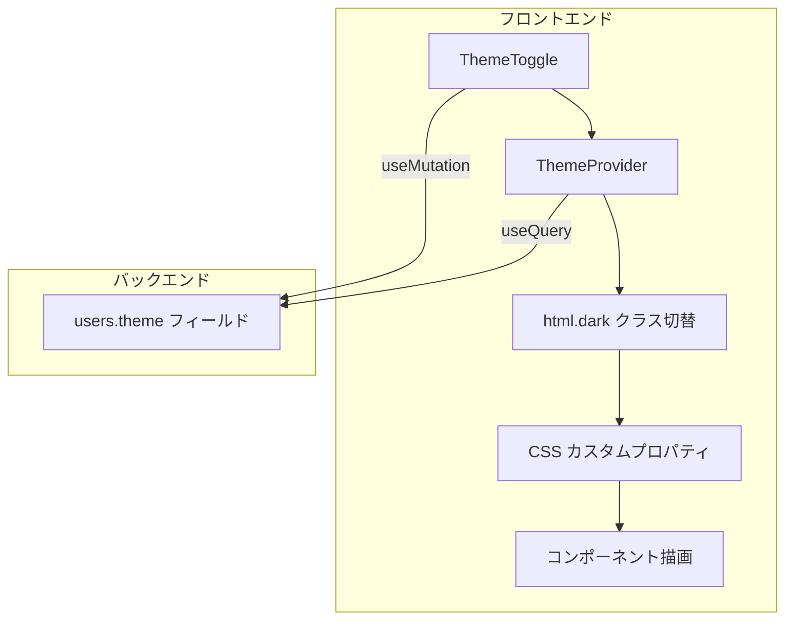
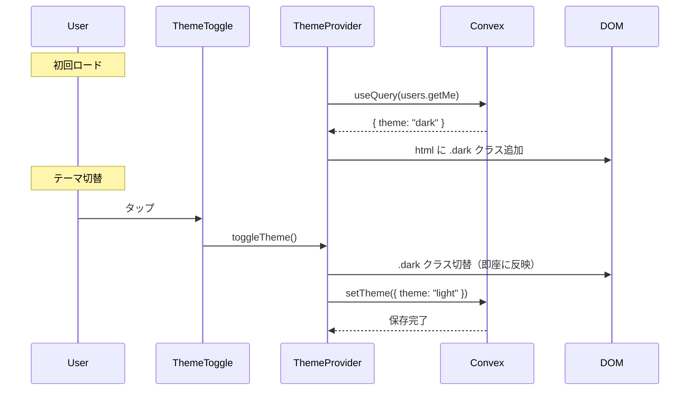
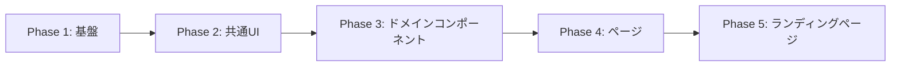

# 設計書: ダークモード

## Overview

アプリ全体にダークモードを追加する。ユーザーはヘッダーのトグルボタンでライト/ダークを切り替えられる。テーマ設定は Convex のユーザーテーブルに保存し、デバイス間で同期される。

## Purpose

### 背景

家計簿アプリは夜間の利用頻度が高い（帰宅後にその日の支出を記録するユースケース）。現在はライトモードのみで、暗い環境での使用時に画面が眩しい。

### 目的

1. 暗い環境での視認性・快適性を向上させる
2. ユーザーの好みに応じた外観カスタマイズを提供する
3. 有機ELディスプレイでのバッテリー消費を軽減する

### 代替案

| アプローチ                      | メリット           | デメリット               |
| ------------------------------- | ------------------ | ------------------------ |
| ライト / ダーク 切替（採用）    | シンプル、実装明確 | システム設定追従なし     |
| ライト / ダーク / システム      | OS設定に追従できる | 初期実装コスト増         |
| CSS `prefers-color-scheme` のみ | コード変更最小     | ユーザーが手動で切替不可 |

→ 最もシンプルな「ライト / ダーク 切替」を採用。将来的にシステム追従を追加可能。

## What to Do

### 機能要件

#### FR-1: テーマ切替

| 機能         | 説明                                                    |
| ------------ | ------------------------------------------------------- |
| トグルボタン | AppHeader / PageHeader の右側にテーマ切替アイコンを配置 |
| 切替動作     | タップでライト ↔ ダーク を即座に切り替え                |
| アイコン     | ライト時: `Moon`、ダーク時: `Sun`（Lucide）             |

#### FR-2: テーマ永続化

| 機能       | 説明                                              |
| ---------- | ------------------------------------------------- |
| 保存先     | Convex `users` テーブルの `theme` フィールド      |
| デフォルト | `"light"`（フィールド未設定時）                   |
| 同期       | Convex のリアルタイム同期により全デバイスで即反映 |

#### FR-3: ダークモード対応画面

アプリ内の全画面をダークモード対応にする。

### 非機能要件

| 要件             | 説明                                            |
| ---------------- | ----------------------------------------------- |
| ちらつき防止     | ページ遷移時にライト → ダークのフラッシュを防ぐ |
| パフォーマンス   | テーマ切替は即座に反映（再レンダリング最小化）  |
| アクセシビリティ | ダークモードでも WCAG AA コントラスト比を確保   |

## How to Do It

### アーキテクチャ



### 処理フロー



### データモデル変更

#### `convex/schema.ts` — users テーブル

```
追加フィールド:
  theme: v.optional(v.union(v.literal("light"), v.literal("dark")))
```

デフォルトは `undefined`（= ライトモード扱い）。

#### `convex/users.ts` — ミューテーション追加

`setTheme` ミューテーション。`setDefaultGroup` と同じパターン。

### テーマ基盤

#### CSS カスタムプロパティ（既存）

`globals.css` に既にダークモード用の CSS 変数が定義済み:

- `:root` — ライトモードの色定義（oklch）
- `.dark` — ダークモードの色定義（oklch）
- `@custom-variant dark (&:is(.dark *))` — Tailwind v4 のダーク対応

→ CSS 側の変更は不要。`.dark` クラスを `<html>` に付与するだけで機能する。

#### ThemeProvider（新規）

`components/ThemeProvider.tsx` を新規作成。

役割:

- Convex から `theme` を取得し、`<html>` 要素に `.dark` クラスを適用
- `toggleTheme` 関数を Context で提供
- 未認証時はデフォルト（ライト）で動作

`next-themes` ライブラリは使わない。Convex で状態管理するため、自前の薄い Provider で十分。

### UI変更

#### ThemeToggle コンポーネント（新規）

```
ライトモード時:
  [🌙] ← Moon アイコン（タップでダークへ）

ダークモード時:
  [☀️] ← Sun アイコン（タップでライトへ）
```

#### AppHeader への配置

```
変更前:
┌──────────────────────────────────────┐
│ Pairbo                    [👤]       │
└──────────────────────────────────────┘

変更後:
┌──────────────────────────────────────┐
│ Pairbo                 [🌙] [👤]    │
└──────────────────────────────────────┘
```

AppHeader の `rightElement` を拡張し、ThemeToggle + 既存の rightElement を横並びにする。

#### PageHeader への配置

```
変更前:
┌──────────────────────────────────────┐
│ [←]      支出を記録         [🗑]     │
└──────────────────────────────────────┘

変更後:
┌──────────────────────────────────────┐
│ [←]      支出を記録      [🌙] [🗑]  │
└──────────────────────────────────────┘
```

PageHeader の `rightElement` の左に ThemeToggle を配置。

### コンポーネントのダークモード対応

#### 対応方針

現在のコンポーネントはハードコードされた Tailwind カラークラス（`bg-white`, `text-slate-800` 等）を多用している。対応方法は2つ:

| 方法                        | 例                           | メリット                       | デメリット   |
| --------------------------- | ---------------------------- | ------------------------------ | ------------ |
| A: `dark:` バリアント追加   | `bg-white dark:bg-slate-900` | 既存コードへの影響最小         | クラスが冗長 |
| B: セマンティックトークン化 | `bg-white` → `bg-background` | クリーン、将来のテーマ拡張対応 | 変更量大     |

→ **方法 B（セマンティックトークン化）を採用**。全コンポーネントのカラークラスを CSS カスタムプロパティベースに置換する。

ただし、以下は1対1の機械的置換でカバーしきれない:

- `bg-slate-50`（ページ背景）→ `bg-muted` or 新規トークン
- `bg-slate-100`（セクション背景）→ `bg-muted`
- `hover:bg-red-50`、`hover:bg-blue-50`（アクションホバー）→ `dark:` バリアント併用
- `text-blue-600`、`bg-blue-500` 等のアクセントカラー → `dark:` バリアント併用
- `opacity-20` 等の透明度調整 → ダーク時に調整が必要な場合あり

#### カラーマッピング方針

| ライトモード（現在） | セマンティックトークン       | 用途                    |
| -------------------- | ---------------------------- | ----------------------- |
| `bg-white`           | `bg-background` or `bg-card` | ページ背景 / カード背景 |
| `bg-slate-50`        | `bg-muted`                   | セクション背景          |
| `bg-slate-100`       | `bg-muted`                   | ホバー / スケルトン     |
| `text-slate-800`     | `text-foreground`            | メインテキスト          |
| `text-slate-600`     | `text-muted-foreground`      | サブテキスト            |
| `text-slate-500`     | `text-muted-foreground`      | 補助テキスト            |
| `text-slate-400`     | `text-muted-foreground`      | プレースホルダー        |
| `border-slate-200`   | `border-border`              | ボーダー                |
| `border-slate-100`   | `border-border`              | 薄いボーダー            |

#### 対応ファイル数

| カテゴリ               | ファイル数       | 備考                   |
| ---------------------- | ---------------- | ---------------------- |
| コンポーネント（非UI） | 約42ファイル     | ハードコード色の置換   |
| コンポーネント（UI）   | 約2ファイル      | skeleton, popover      |
| ページ                 | 約17ファイル     | `bg-slate-50` 等の置換 |
| **合計**               | **約61ファイル** |                        |

### 実装順序



#### Phase 1: テーマ基盤（小）

- `convex/schema.ts` — `theme` フィールド追加
- `convex/users.ts` — `setTheme` ミューテーション、`getMe` に `theme` 追加
- `components/ThemeProvider.tsx` — 新規作成
- `components/ThemeToggle.tsx` — 新規作成
- `components/ConvexClientProvider.tsx` — ThemeProvider をラップ

#### Phase 2: 共通 UI コンポーネント（小）

- `components/ui/AppHeader.tsx` — ThemeToggle 配置
- `components/ui/PageHeader.tsx` — ThemeToggle 配置
- `components/ui/skeleton.tsx` — `bg-slate-100` → `bg-muted`
- `components/ui/popover.tsx` — `bg-white` → `bg-popover`
- `components/ui/TabNavigation.tsx` — ダーク対応
- `components/ui/FAB.tsx` — ダーク対応
- `components/ui/EmptyState.tsx` — ダーク対応

#### Phase 3: ドメインコンポーネント（大）

- expenses 系（ExpenseCard, ExpenseForm, ExpenseDetail 等）
- groups 系（GroupCard, GroupDetail, GroupSettings 等）
- settlements 系（SettlementCard, SettlementPreview 等）
- shopping 系（ShoppingList, ShoppingItem 等）
- analytics 系（CategoryPieChart, MonthlyTrendChart 等）
- categories 系（CategoryManager, CategoryForm 等）
- ads 系（AdBanner, ProPromoBanner 等）

#### Phase 4: ページ（中）

- 全ページの `bg-slate-50` → `bg-muted`
- ページ固有のハードコード色を置換

#### Phase 5: ランディングページ（中）

- `components/landing/LandingPage.tsx` — 独自のダークモードデザイン

### ちらつき防止

Convex からテーマを取得するまでの間、`<html>` にクラスが付与されず白い画面が表示される可能性がある。

対策:

- `ThemeProvider` でテーマ取得前は `<html>` のクラスを変更しない（デフォルトのライトモードを維持）
- テーマ取得後に `.dark` を適用
- ライトモードユーザーはちらつきなし。ダークモードユーザーは初回ロード時に一瞬ライトが見える可能性があるが、Convex のキャッシュにより2回目以降は即座に適用される

### 変更対象ファイル（基盤のみ）

| ファイル                              | 変更内容                        | 規模 |
| ------------------------------------- | ------------------------------- | ---- |
| `convex/schema.ts`                    | `theme` フィールド追加          | 小   |
| `convex/users.ts`                     | `setTheme` ミューテーション追加 | 小   |
| `components/ThemeProvider.tsx`        | 新規作成                        | 中   |
| `components/ThemeToggle.tsx`          | 新規作成                        | 小   |
| `components/ConvexClientProvider.tsx` | ThemeProvider ラップ            | 小   |
| `components/ui/AppHeader.tsx`         | ThemeToggle 配置                | 小   |
| `components/ui/PageHeader.tsx`        | ThemeToggle 配置                | 小   |
| 約61ファイル                          | カラークラス置換                | 大   |

## What We Won't Do

### スコープ外

1. **システム設定追従** — `prefers-color-scheme` によるOS設定連動は初期スコープ外。ユーザーからの要望があれば追加
2. **カスタムカラーテーマ** — ライト/ダーク以外のテーマ（ブルー、グリーン等）
3. **未認証ユーザーのテーマ切替** — ログイン前のランディングページは常にライトモード
4. **テーマのトランジションアニメーション** — 切替時のフェード効果等は不要。即座に切り替わる
5. **Clerk コンポーネントのダーク対応** — UserButton 等の Clerk UI は Clerk 側の設定に依存

## Concerns

### 未解決

#### 1. Clerk コンポーネントのテーマ同期

**問題**: Clerk の `<UserButton />` 等はアプリのダークモードに自動追従しない可能性がある

**調査必要**: Clerk の `appearance` prop でダークモード対応可能か確認。対応できない場合はスコープ外とする

#### 2. チャートライブラリのダーク対応

**問題**: Recharts（CategoryPieChart, MonthlyTrendChart）の色設定がハードコードされている可能性

**調査必要**: チャートの色がダークモードで十分なコントラストを持つか確認。必要に応じてチャート用のダークカラーパレットを定義

#### 3. PWA の theme-color

**問題**: `app/layout.tsx` の `viewport.themeColor` が `#3b82f6` 固定。ダークモード時にステータスバーの色が合わない可能性

**調査必要**: Next.js で `themeColor` を動的に切り替える方法を確認

#### 4. 実装規模

**問題**: 約61ファイル、約750箇所のカラークラス変更が必要。段階的にリリースするか一括で行うか

**方針案**: Phase ごとにPRを分けて段階的にマージする。中途半端な状態でも見た目が破綻しないよう、`dark:` バリアントを一部併用する

### 解決済み

#### 1. テーマの保存先

**問題**: localStorage vs Convex

→ **解決**: Convex に保存。デバイス間同期が可能で、既存の `defaultGroupId` と同じパターンを踏襲

#### 2. CSS 基盤

**問題**: ダークモード用のCSS変数が必要

→ **解決**: `globals.css` に既に `.dark` クラスの CSS 変数が定義済み。追加の CSS 変更は不要

#### 3. `next-themes` の採否

**問題**: `next-themes` ライブラリを使うべきか

→ **解決**: 使わない。テーマ状態を Convex で管理するため、`next-themes` の localStorage ベースの仕組みとは合わない。自前の薄い ThemeProvider で十分

## Reference Materials/Information

### 既存コード

- `app/globals.css` — `:root` と `.dark` の CSS 変数定義（lines 49-116）
- `convex/schema.ts` — `users` テーブル定義（lines 14-23）
- `convex/users.ts` — `setDefaultGroup` ミューテーション（テーマ保存のパターン参照）
- `components/ConvexClientProvider.tsx` — Provider ラップポイント
- `components/ui/AppHeader.tsx` — テーマトグル配置先
- `components/ui/PageHeader.tsx` — テーマトグル配置先

### 現状分析

- ハードコード色を持つコンポーネント: 約42ファイル
- ハードコード色を持つページ: 約17ファイル
- shadcn/ui コンポーネントでハードコード: 2ファイル（skeleton, popover）
- 主要なハードコードクラス: `bg-white`(72), `text-slate-800`(126), `text-slate-500`(131), `bg-slate-50`(62), `border-slate-200`(59)

---

## 決定事項まとめ

| 項目             | 決定                              |
| ---------------- | --------------------------------- |
| テーマ選択肢     | ライト / ダーク の2択             |
| 保存先           | Convex `users.theme` フィールド   |
| トグル配置       | AppHeader + PageHeader            |
| アイコン         | Lucide `Moon` / `Sun`             |
| CSS 方式         | `<html>` に `.dark` クラス付与    |
| カラー対応方式   | セマンティックトークン化（方法B） |
| テーマライブラリ | 使わない（自前 Provider）         |
| 実装単位         | Phase ごとにPR分割                |
| 未認証時         | ライトモード固定                  |
