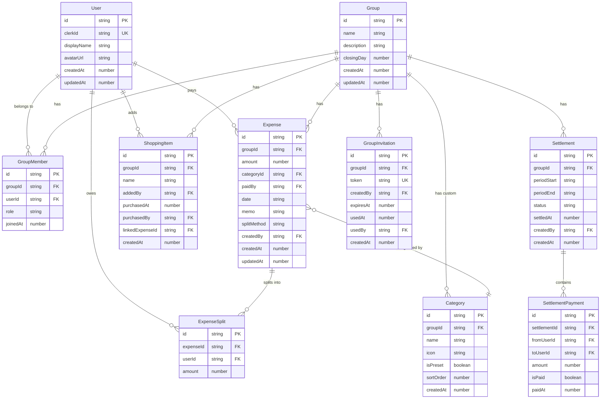
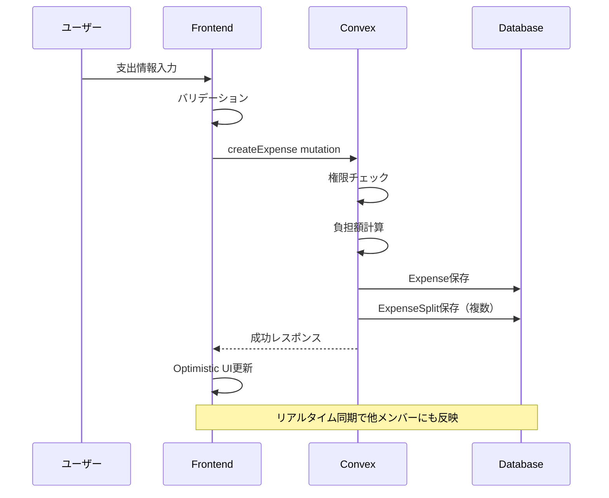
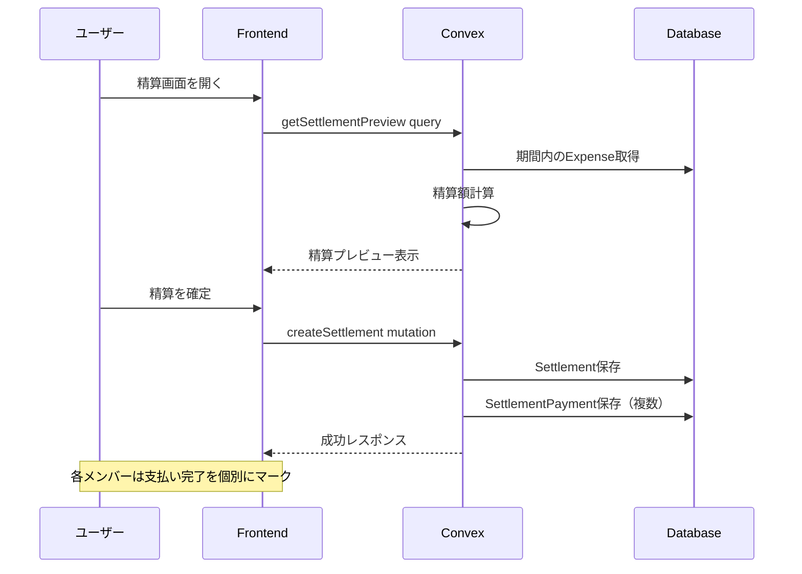

# Oaiko ドメインモデル設計書

> 作成日: 2024-12-30
> ステータス: 承認済み

---

## 概要

Oaiko（おあいこ）の共有家計簿機能を実現するためのドメインモデル設計書。
支出記録、負担配分、精算、買い物リストの各機能を支えるエンティティとその関連を定義する。

---

## 目的

### なぜこの設計が必要か

1. **MVP機能を正しく実装するための土台**
   - 支出記録、負担方法（均等/傾斜/全額負担）、精算機能を正しく実装するには、明確なドメインモデルが必要

2. **リアルタイム同期を前提とした設計**
   - Convexのリアルタイム同期を活かすため、データ構造を最適化

3. **将来の拡張性確保**
   - MVP外機能（レシートOCR、通知等）追加時に破綻しない設計

4. **テスト容易性**
   - ドメインロジックを明確に分離し、テストしやすい構造を実現

---

## やること（機能要件・非機能要件）

### 機能要件

#### 1. ユーザー管理

- ユーザー登録・認証
- プロフィール管理（表示名、アイコン）

#### 2. グループ管理

- グループ作成・編集・削除
- メンバー招待（URLリンク方式、有効期限付きトークン）
- メンバーの役割管理（オーナー/メンバー）
- 締め日設定（グループごとにカスタマイズ可能、デフォルト25日）

#### 3. 支出記録

- 支出の登録・編集・削除
- 必須項目: 金額、カテゴリ、支払者、日付
- 任意項目: メモ
- 負担方法の選択:
  - 均等分割（人数で等分、端数は支払者負担）
  - 傾斜分割（割合指定）
  - 傾斜分割（金額指定）
  - 全額負担（1人が全額負担）

#### 4. カテゴリ管理

- プリセットカテゴリ（食費、日用品、光熱費、交通費、娯楽、医療費、その他）
- カスタムカテゴリ追加（グループごと）

#### 5. 精算機能

- 精算期間: 締め日ベース（例: 25日締めなら11/26〜12/25が「12月分」）
- 精算額の自動計算（誰が誰にいくら払うか）
- 精算ステータス管理（未精算/精算済み）
- 精算履歴の記録

#### 6. 買い物リスト

- アイテム追加・編集・削除
- グループ内共有
- 購入時の支出連携（チェック → 支出登録）
- 購入履歴表示

#### 7. 分析・グラフ

- カテゴリ別支出（円グラフ）
- 月別推移（折れ線/棒グラフ）

**集計の基準**:

- 月別グラフは支出の `date` フィールドを基準に**暦月**でグルーピング
- 例: 12月のグラフ = `date` が `2024-12-01` 〜 `2024-12-31` の支出
- 精算期間（締め日ベース）とは別の概念として扱う

### 非機能要件

| 項目             | 要件                                                       |
| ---------------- | ---------------------------------------------------------- |
| パフォーマンス   | 初期ロード3秒以内、操作は即座にレスポンス（Optimistic UI） |
| データ整合性     | 金額計算は整数演算（円単位）、端数処理ルールを明確化       |
| リアルタイム性   | Convexによる自動同期                                       |
| スケーラビリティ | 個人利用〜小規模グループ（2〜10人程度）を想定              |

---

## どうやるか（実装詳細）

### 技術仕様

#### Convex ID について

ConvexはUUIDではなく**独自のID形式**を使用する。

```typescript
// ID は ctx.db.insert() 時に自動生成される
const expenseId = await ctx.db.insert("expenses", { ... });
// → "jd7s8k2m9n3p4q5r" のような文字列

// 型は Id<"テーブル名"> で表現される
type ExpenseId = Id<"expenses">;

// バリデーションは v.id("テーブル名") を使用
args: {
  expenseId: v.id("expenses"),
}
```

**注意点**:

- 開発者がUUIDを自分で生成してIDとして使うことはできない
- 招待トークンなど**自分で生成する一意キー**には `crypto.randomUUID()` を使用可能

#### タイムゾーンの扱い

| データ種別                  | 保存形式                | 表示                                 |
| --------------------------- | ----------------------- | ------------------------------------ |
| 支出日（date）              | `YYYY-MM-DD` 文字列     | そのまま表示（変換なし）             |
| 作成日時（createdAt）       | UTC Unix timestamp (ms) | ブラウザのタイムゾーンで変換して表示 |
| 精算期間（periodStart/End） | `YYYY-MM-DD` 文字列     | そのまま表示（変換なし）             |

**理由**:

- `date` はユーザーが入力した「その日」を表すため、タイムゾーン変換不要
- `createdAt` はシステムが記録する正確な時刻のため、UTC保存→ローカル表示

### エンティティ定義



### 各エンティティの詳細

#### User（ユーザー）

| フィールド  | 型      | 説明                            |
| ----------- | ------- | ------------------------------- |
| id          | string  | Convex自動生成ID                |
| clerkId     | string  | Clerk認証のユーザーID（認証用） |
| displayName | string  | 表示名                          |
| avatarUrl   | string? | アイコンURL                     |
| createdAt   | number  | 作成日時（Unix timestamp）      |
| updatedAt   | number  | 更新日時（Unix timestamp）      |

#### Group（グループ）

| フィールド  | 型      | 説明                          |
| ----------- | ------- | ----------------------------- |
| id          | string  | Convex自動生成ID              |
| name        | string  | グループ名（例: 「我が家」）  |
| description | string? | 説明文                        |
| closingDay  | number  | 締め日（1〜28、デフォルト25） |
| createdAt   | number  | 作成日時                      |
| updatedAt   | number  | 更新日時                      |

**備考**: 締め日は28日までに制限（29〜31日は月によって存在しないため）

#### GroupMember（グループメンバー）

| フィールド | 型                  | 説明             |
| ---------- | ------------------- | ---------------- |
| id         | string              | Convex自動生成ID |
| groupId    | string              | 所属グループID   |
| userId     | string              | ユーザーID       |
| role       | "owner" \| "member" | 役割             |
| joinedAt   | number              | 参加日時         |

**ビジネスルール**:

- グループには最低1人のownerが必要
- ownerは他メンバーの招待・削除が可能
- グループ作成者が自動的にownerになる

#### GroupInvitation（グループ招待）

| フィールド | 型      | 説明                            |
| ---------- | ------- | ------------------------------- |
| id         | string  | Convex自動生成ID                |
| groupId    | string  | 招待先グループID                |
| token      | string  | 招待トークン（URL用、ユニーク） |
| createdBy  | string  | 招待作成者のユーザーID          |
| expiresAt  | number  | 有効期限（Unix timestamp）      |
| usedAt     | number? | 使用日時                        |
| usedBy     | string? | 使用したユーザーID              |
| createdAt  | number  | 作成日時                        |

**ビジネスルール**:

- 有効期限はデフォルト7日
- 1回使用したら無効化（再利用不可）
- 招待URLの形式: `https://oaiko.vercel.app/invite/{token}`

#### Category（カテゴリ）

| フィールド | 型      | 説明                                             |
| ---------- | ------- | ------------------------------------------------ |
| id         | string  | Convex自動生成ID                                 |
| groupId    | string  | グループID（必須、グループごとにカテゴリを持つ） |
| name       | string  | カテゴリ名                                       |
| icon       | string  | 絵文字アイコン                                   |
| isPreset   | boolean | プリセット由来かどうか                           |
| sortOrder  | number  | 表示順                                           |
| createdAt  | number  | 作成日時                                         |

**プリセットカテゴリ**:
| name | icon | sortOrder |
|------|------|-----------|
| 食費 | 🍽️ | 1 |
| 日用品 | 🧴 | 2 |
| 光熱費 | 💡 | 3 |
| 交通費 | 🚃 | 4 |
| 娯楽 | 🎮 | 5 |
| 医療費 | 💊 | 6 |
| その他 | 📦 | 7 |

**プリセットカテゴリの扱い**:

- グループ作成時にプリセットカテゴリをDBにコピー
- 各グループが独自のカテゴリセットを持つ（カスタマイズ可能）
- `isPreset: true` でプリセット由来かどうかを識別

```typescript
// convex/lib/presetCategories.ts
export const PRESET_CATEGORIES = [
  { name: "食費", icon: "🍽️", sortOrder: 1 },
  { name: "日用品", icon: "🧴", sortOrder: 2 },
  { name: "光熱費", icon: "💡", sortOrder: 3 },
  { name: "交通費", icon: "🚃", sortOrder: 4 },
  { name: "娯楽", icon: "🎮", sortOrder: 5 },
  { name: "医療費", icon: "💊", sortOrder: 6 },
  { name: "その他", icon: "📦", sortOrder: 7 },
] as const;

// グループ作成時にプリセットをコピー
async function createGroupWithPresetCategories(ctx, groupData) {
  const groupId = await ctx.db.insert("groups", groupData);

  for (const preset of PRESET_CATEGORIES) {
    await ctx.db.insert("categories", {
      groupId,
      name: preset.name,
      icon: preset.icon,
      isPreset: true,
      sortOrder: preset.sortOrder,
      createdAt: Date.now(),
    });
  }

  return groupId;
}
```

#### Expense（支出）

| フィールド  | 型      | 説明                     |
| ----------- | ------- | ------------------------ |
| id          | string  | Convex自動生成ID         |
| groupId     | string  | グループID               |
| amount      | number  | 金額（円、整数）         |
| categoryId  | string  | カテゴリID               |
| paidBy      | string  | 支払者のユーザーID       |
| date        | string  | 支出日（YYYY-MM-DD形式） |
| memo        | string? | メモ                     |
| splitMethod | string  | 分割方法                 |
| createdBy   | string  | 登録者のユーザーID       |
| createdAt   | number  | 作成日時                 |
| updatedAt   | number  | 更新日時                 |

**splitMethod の値**:
| 値 | 説明 | splits の指定 |
|----|------|--------------|
| `"equal"` | 均等分割（人数で等分、端数は支払者負担） | 不要（自動計算） |
| `"ratio"` | 傾斜分割（割合指定、合計100%） | 必須: 各メンバーの割合(%) |
| `"amount"` | 傾斜分割（金額指定、合計=支出額） | 必須: 各メンバーの金額 |
| `"full"` | 全額負担（指定した1人が全額負担、他は0円） | 必須: 負担者1人を指定 |

**"full" の例**:

```
1000円の支出、Aさんが支払い、グループメンバーはA・B・C
splitMethod: "full", splits: [{ userId: "B", value: 1000 }]
→ Aが支払い、Bが全額負担（AはBに1000円請求できる）
→ Cの負担は0円
```

#### ExpenseSplit（支出分割）

| フィールド | 型     | 説明                 |
| ---------- | ------ | -------------------- |
| id         | string | Convex自動生成ID     |
| expenseId  | string | 支出ID               |
| userId     | string | 負担者のユーザーID   |
| amount     | number | 負担金額（円、整数） |

**ビジネスルール**:

- ExpenseSplitの合計金額 = Expenseのamount（必須）
- 均等分割の端数は支払者が負担

**端数処理の例**:

```
1000円を3人で均等分割
→ 333 + 333 + 334 = 1000円
→ 支払者が334円を負担
```

#### Settlement（精算）

| フィールド  | 型                     | 説明                         |
| ----------- | ---------------------- | ---------------------------- |
| id          | string                 | Convex自動生成ID             |
| groupId     | string                 | グループID                   |
| periodStart | string                 | 精算期間開始日（YYYY-MM-DD） |
| periodEnd   | string                 | 精算期間終了日（YYYY-MM-DD） |
| status      | "pending" \| "settled" | ステータス                   |
| settledAt   | number?                | 精算完了日時                 |
| createdBy   | string                 | 精算作成者のユーザーID       |
| createdAt   | number                 | 作成日時                     |

**ビジネスルール**:

- 締め日ベースで期間を計算
- 例: 締め日25日、12月分 → 11/26〜12/25
- 同じ期間の精算は1つのみ
- 精算済み期間の支出は編集・削除不可

**ステータス遷移**:

```
pending（作成直後）
   ↓ 全SettlementPaymentのisPaid=trueになったら自動遷移
settled（精算完了）
```

**ドメインロジック**:

```typescript
// 支払い完了時に精算ステータスを自動更新
async function markPaymentAsPaid(ctx, paymentId: Id<"settlementPayments">) {
  const payment = await ctx.db.get(paymentId);
  await ctx.db.patch(paymentId, { isPaid: true, paidAt: Date.now() });

  // 同じ精算の全支払いを取得
  const allPayments = await ctx.db
    .query("settlementPayments")
    .withIndex("by_settlement", (q) =>
      q.eq("settlementId", payment.settlementId),
    )
    .collect();

  // 全て支払い済みなら精算を完了に
  const allPaid = allPayments.every((p) => p._id === paymentId || p.isPaid);
  if (allPaid) {
    await ctx.db.patch(payment.settlementId, {
      status: "settled",
      settledAt: Date.now(),
    });
  }
}
```

#### SettlementPayment（精算支払い）

| フィールド   | 型      | 説明                   |
| ------------ | ------- | ---------------------- |
| id           | string  | Convex自動生成ID       |
| settlementId | string  | 精算ID                 |
| fromUserId   | string  | 支払い元ユーザーID     |
| toUserId     | string  | 支払い先ユーザーID     |
| amount       | number  | 支払い金額（円、整数） |
| isPaid       | boolean | 支払い完了フラグ       |
| paidAt       | number? | 支払い完了日時         |

#### ShoppingItem（買い物アイテム）

| フィールド      | 型      | 説明               |
| --------------- | ------- | ------------------ |
| id              | string  | Convex自動生成ID   |
| groupId         | string  | グループID         |
| name            | string  | アイテム名         |
| addedBy         | string  | 追加者のユーザーID |
| purchasedAt     | number? | 購入日時           |
| purchasedBy     | string? | 購入者のユーザーID |
| linkedExpenseId | string? | 紐付いた支出ID     |
| createdAt       | number  | 作成日時           |

### 主要なドメインロジック

#### 1. 精算額計算アルゴリズム

```typescript
// 精算額計算の流れ
function calculateSettlement(
  groupId: string,
  periodStart: Date,
  periodEnd: Date,
) {
  // 1. 期間内の全支出を取得
  const expenses = getExpenses(groupId, periodStart, periodEnd);

  // 2. 各ユーザーの「支払った金額」と「負担すべき金額」を集計
  const balances = new Map<UserId, { paid: number; owed: number }>();

  for (const expense of expenses) {
    // 支払者の paid を加算
    balances.get(expense.paidBy).paid += expense.amount;

    // 各負担者の owed を加算
    for (const split of expense.splits) {
      balances.get(split.userId).owed += split.amount;
    }
  }

  // 3. 各ユーザーの差額（paid - owed）を計算
  // プラス = 受け取るべき、マイナス = 支払うべき
  const netBalances = balances.map((userId, { paid, owed }) => ({
    userId,
    net: paid - owed,
  }));

  // 4. 最小送金回数で精算を計算（貪欲法）
  return minimizeTransfers(netBalances);
}
```

#### 2. 締め日からの精算期間計算

```typescript
function getSettlementPeriod(closingDay: number, year: number, month: number) {
  // 例: 締め日25日、2024年12月分
  // → 開始: 2024-11-26、終了: 2024-12-25

  const endDate = new Date(year, month - 1, closingDay);

  // 前月の締め日翌日が開始日
  const startDate = new Date(year, month - 2, closingDay + 1);

  return { startDate, endDate };
}
```

#### 3. 均等分割の端数処理

```typescript
function splitEqually(amount: number, memberIds: string[], payerId: string) {
  const count = memberIds.length;
  const base = Math.floor(amount / count);
  const remainder = amount % count;

  return memberIds.map((userId, index) => ({
    userId,
    // 支払者が端数を負担
    amount: userId === payerId ? base + remainder : base,
  }));
}
```

### データフロー

#### 支出登録フロー



#### 精算フロー



### Convex ベストプラクティス

Convex公式ドキュメントおよびコミュニティのベストプラクティスに基づいた設計指針。

#### 1. バリデーション戦略

Convexでは主に2つのバリデーション方式がある:

| 方式                      | 推奨用途                         | メリット                   | デメリット               |
| ------------------------- | -------------------------------- | -------------------------- | ------------------------ |
| **Convex組み込み (`v.`)** | 引数検証、スキーマ定義           | シンプル、型推論が効く     | 複雑なバリデーション不可 |
| **Zod**                   | 複雑なバリデーション、httpAction | 文字列長、カスタム検証可能 | 二重定義が必要な場合あり |

**本プロジェクトの方針**:

- **基本はConvex組み込みバリデータ (`v.`) を使用**
- Zodは以下のケースでのみ使用:
  - 文字列長制限（`v.`では未サポート）
  - 複雑なrefine（負担配分の合計チェック等）
  - フロントエンドのフォームバリデーション（react-hook-form連携）

```typescript
// convex/lib/validators.ts - 共通バリデータを再利用
import { v } from "convex/values";

// 共通バリデータフラグメント
export const splitMethodValidator = v.union(
  v.literal("equal"),
  v.literal("ratio"),
  v.literal("amount"),
  v.literal("full"),
);

export const memberRoleValidator = v.union(
  v.literal("owner"),
  v.literal("member"),
);

export const settlementStatusValidator = v.union(
  v.literal("pending"),
  v.literal("settled"),
);
```

#### 2. インデックス設計

**冗長なインデックスを避ける**:

- `by_foo` と `by_foo_and_bar` は冗長（後者のみで良い）
- インデックスは `["foo"]` → 実質 `["foo", "_creationTime"]`
- `_creationTime` での並び替えが必要な場合のみ単一インデックスを追加

```typescript
// NG: 冗長
.index("by_group", ["groupId"])
.index("by_group_and_date", ["groupId", "date"])

// OK: by_group_and_date で groupId のみの検索も可能
.index("by_group_and_date", ["groupId", "date"])
// ※ groupId のみで _creationTime 順が必要なら by_group も必要
```

**本プロジェクトのインデックス設計**:

- `expenses`: `by_group_and_date` のみ（日付範囲検索に使用）
- `groupMembers`: `by_group_and_user` のみで良いが、ユーザーの全グループ取得に `by_user` も必要

#### 3. クエリ最適化

**`.filter()` を避ける**:

- `.filter()` はDB帯域を消費（フィルタで除外されたドキュメントも含む）
- 1000件以上の可能性がある場合は必ずインデックスを使用
- TypeScriptでのフィルタリングは `.filter()` と同じ性能

```typescript
// NG: filter を使用
const expenses = await ctx.db
  .query("expenses")
  .filter((q) => q.eq(q.field("groupId"), args.groupId))
  .collect();

// OK: withIndex を使用
const expenses = await ctx.db
  .query("expenses")
  .withIndex("by_group_and_date", (q) => q.eq("groupId", args.groupId))
  .collect();
```

#### 4. 関数設計

**すべての公開関数にバリデータを設定**:

```typescript
// 必須: args と returns の両方を指定
export const create = mutation({
  args: {
    groupId: v.id("groups"),
    amount: v.number(),
    // ...
  },
  returns: v.id("expenses"),
  handler: async (ctx, args) => {
    // ...
  },
});
```

**内部関数の活用**:

```typescript
// 他のConvex関数からのみ呼び出し可能
export const internal = internalMutation({
  args: { ... },
  handler: async (ctx, args) => { ... },
});
```

#### 5. 認証ミドルウェア

`convex-helpers` の Custom Functions を使い、認証ロジックを共通化する。

**認証ミドルウェアの実装**:

```typescript
// convex/lib/auth.ts
import {
  customQuery,
  customMutation,
} from "convex-helpers/server/customFunctions";
import { query, mutation } from "../_generated/server";
import { Id } from "../_generated/dataModel";

// 認証済みユーザーの型
type AuthUser = {
  _id: Id<"users">;
  clerkId: string;
  displayName: string;
  avatarUrl?: string;
};

// 認証済みコンテキストの型
type AuthCtx = {
  user: AuthUser;
};

// 認証ミドルウェア
const authMiddleware = {
  args: {},
  input: async (ctx, args) => {
    // 1. Clerk から認証情報を取得
    const identity = await ctx.auth.getUserIdentity();
    if (!identity) {
      throw new Error("認証が必要です");
    }

    // 2. users テーブルからユーザーを取得
    const user = await ctx.db
      .query("users")
      .withIndex("by_clerk_id", (q) => q.eq("clerkId", identity.subject))
      .unique();
    if (!user) {
      throw new Error("ユーザーが見つかりません");
    }

    // 3. ctx.user として利用可能にする
    return { ctx: { ...ctx, user }, args };
  },
};

// 認証必須の query / mutation
export const authQuery = customQuery(query, authMiddleware);
export const authMutation = customMutation(mutation, authMiddleware);
```

**使用例**:

```typescript
// convex/expenses.ts
import { authMutation } from "./lib/auth";
import { v } from "convex/values";

export const create = authMutation({
  args: {
    groupId: v.id("groups"),
    amount: v.number(),
    // ...
  },
  handler: async (ctx, args) => {
    // ctx.user は認証済みユーザー（ミドルウェアで設定済み）
    const { user } = ctx;

    // グループメンバーかチェック（認可）
    const member = await ctx.db
      .query("groupMembers")
      .withIndex("by_group_and_user", (q) =>
        q.eq("groupId", args.groupId).eq("userId", user._id),
      )
      .unique();
    if (!member) {
      throw new Error("グループのメンバーではありません");
    }

    // 本来のロジックを実行
    return await ctx.db.insert("expenses", {
      ...args,
      createdBy: user._id,
      createdAt: Date.now(),
      updatedAt: Date.now(),
    });
  },
});
```

**関数の使い分け**:
| 関数 | 用途 | 例 |
|------|------|-----|
| `query` / `mutation` | 認証不要 | 招待リンクの検証 |
| `authQuery` / `authMutation` | 認証必須 | 支出登録、グループ操作 |
| `internalQuery` / `internalMutation` | 内部専用 | スケジュール処理 |

### Zod スキーマ定義（フロントエンド・複雑なバリデーション用）

フロントエンドのフォームバリデーション（react-hook-form）や複雑なバリデーションにZodを使用する。

```typescript
// convex/lib/schemas.ts
import { z } from "zod";

// ========================================
// 共通バリデーション
// ========================================

/** 日付文字列（YYYY-MM-DD形式） */
export const dateStringSchema = z
  .string()
  .regex(/^\d{4}-\d{2}-\d{2}$/, "日付はYYYY-MM-DD形式で入力してください");

/** 正の整数（金額用） */
export const positiveIntSchema = z
  .number()
  .int("整数で入力してください")
  .positive("1以上の値を入力してください");

/** 締め日（1〜28） */
export const closingDaySchema = z
  .number()
  .int()
  .min(1, "締め日は1〜28の間で設定してください")
  .max(28, "締め日は1〜28の間で設定してください");

// ========================================
// User（ユーザー）
// ========================================

export const userSchema = z.object({
  clerkId: z.string().min(1, "Clerk IDは必須です"),
  displayName: z
    .string()
    .min(1, "表示名を入力してください")
    .max(50, "表示名は50文字以内で入力してください"),
  avatarUrl: z.string().url("有効なURLを入力してください").optional(),
});

export const createUserInputSchema = userSchema;

export const updateUserInputSchema = userSchema
  .partial()
  .omit({ clerkId: true });

// ========================================
// Group（グループ）
// ========================================

export const groupSchema = z.object({
  name: z
    .string()
    .min(1, "グループ名を入力してください")
    .max(50, "グループ名は50文字以内で入力してください"),
  description: z
    .string()
    .max(200, "説明は200文字以内で入力してください")
    .optional(),
  closingDay: closingDaySchema.default(25),
});

export const createGroupInputSchema = groupSchema;

export const updateGroupInputSchema = groupSchema.partial();

// ========================================
// GroupMember（グループメンバー）
// ========================================

export const memberRoleSchema = z.enum(["owner", "member"]);

export type MemberRole = z.infer<typeof memberRoleSchema>;

// ========================================
// GroupInvitation（グループ招待）
// ========================================

export const createInvitationInputSchema = z.object({
  /** 有効期限（日数）、デフォルト7日 */
  expiresInDays: z
    .number()
    .int()
    .min(1, "有効期限は1日以上に設定してください")
    .max(30, "有効期限は30日以内に設定してください")
    .default(7),
});

// ========================================
// Category（カテゴリ）
// ========================================

export const categorySchema = z.object({
  name: z
    .string()
    .min(1, "カテゴリ名を入力してください")
    .max(30, "カテゴリ名は30文字以内で入力してください"),
  icon: z
    .string()
    .min(1, "アイコンを選択してください")
    .max(10, "アイコンは10文字以内で入力してください"),
  sortOrder: z.number().int().min(0).default(0),
});

export const createCategoryInputSchema = categorySchema;

// ========================================
// Expense（支出）
// ========================================

export const splitMethodSchema = z.enum(["equal", "ratio", "amount", "full"]);

export type SplitMethod = z.infer<typeof splitMethodSchema>;

/** 負担配分の入力スキーマ（ratio/amount/full用） */
export const splitDetailSchema = z.object({
  userId: z.string(), // Convex IDは zid() で検証
  /** ratio: 割合(%), amount: 金額(円), full: 不要 */
  value: z.number().optional(),
});

export const expenseSchema = z.object({
  amount: positiveIntSchema.max(
    100_000_000,
    "金額は1億円以下で入力してください",
  ),
  categoryId: z.string(), // Convex IDは zid() で検証
  paidBy: z.string(), // Convex IDは zid() で検証
  date: dateStringSchema,
  memo: z.string().max(500, "メモは500文字以内で入力してください").optional(),
  splitMethod: splitMethodSchema,
  /** splitMethodがratio/amount/fullの場合に必要 */
  splits: z.array(splitDetailSchema).optional(),
});

export const createExpenseInputSchema = expenseSchema.refine(
  (data) => {
    // equal以外は splits が必要
    if (
      data.splitMethod !== "equal" &&
      (!data.splits || data.splits.length === 0)
    ) {
      return false;
    }
    // ratioの場合、合計が100%であること
    if (data.splitMethod === "ratio") {
      const total =
        data.splits?.reduce((sum, s) => sum + (s.value ?? 0), 0) ?? 0;
      return total === 100;
    }
    // amountの場合、合計がamountと一致すること
    if (data.splitMethod === "amount") {
      const total =
        data.splits?.reduce((sum, s) => sum + (s.value ?? 0), 0) ?? 0;
      return total === data.amount;
    }
    // fullの場合、splitsに1人だけ指定されていること
    if (data.splitMethod === "full") {
      return data.splits?.length === 1;
    }
    return true;
  },
  {
    message: "負担配分の設定が不正です",
    path: ["splits"],
  },
);

export const updateExpenseInputSchema = expenseSchema.partial();

// ========================================
// Settlement（精算）
// ========================================

export const settlementStatusSchema = z.enum(["pending", "settled"]);

export type SettlementStatus = z.infer<typeof settlementStatusSchema>;

export const createSettlementInputSchema = z.object({
  /** 精算対象の年月（例: 2024-12 → 12月分を精算） */
  targetMonth: z
    .string()
    .regex(/^\d{4}-\d{2}$/, "年月はYYYY-MM形式で入力してください"),
});

// ========================================
// SettlementPayment（精算支払い）
// ========================================

export const markPaymentPaidInputSchema = z.object({
  paymentId: z.string(),
});

// ========================================
// ShoppingItem（買い物アイテム）
// ========================================

export const shoppingItemSchema = z.object({
  name: z
    .string()
    .min(1, "アイテム名を入力してください")
    .max(100, "アイテム名は100文字以内で入力してください"),
});

export const createShoppingItemInputSchema = shoppingItemSchema;

export const purchaseShoppingItemInputSchema = z.object({
  itemIds: z.array(z.string()).min(1, "購入するアイテムを選択してください"),
  /** 支出登録する場合の情報 */
  expense: z
    .object({
      amount: positiveIntSchema,
      categoryId: z.string(),
      splitMethod: splitMethodSchema,
      splits: z.array(splitDetailSchema).optional(),
    })
    .optional(),
});
```

### Convex 関数でのZod利用例

```typescript
// convex/expenses.ts
import { zCustomMutation, zCustomQuery } from "convex-helpers/server/zod";
import { zid } from "convex-helpers/server/zod";
import { mutation, query } from "./_generated/server";
import { createExpenseInputSchema } from "./lib/schemas";

// Zod対応のmutation/queryを作成
const zMutation = zCustomMutation(mutation, {
  /* middleware options */
});
const zQuery = zCustomQuery(query, {
  /* middleware options */
});

export const create = zMutation({
  args: {
    groupId: zid("groups"),
    ...createExpenseInputSchema.shape,
  },
  handler: async (ctx, args) => {
    // args は既にZodでバリデーション済み
    const {
      groupId,
      amount,
      categoryId,
      paidBy,
      date,
      memo,
      splitMethod,
      splits,
    } = args;

    // 1. 権限チェック
    const member = await ctx.db
      .query("groupMembers")
      .withIndex("by_group_and_user", (q) =>
        q.eq("groupId", groupId).eq("userId", ctx.user._id),
      )
      .unique();
    if (!member) {
      throw new Error("グループのメンバーではありません");
    }

    // 2. 支出を保存
    const now = Date.now();
    const expenseId = await ctx.db.insert("expenses", {
      groupId,
      amount,
      categoryId,
      paidBy,
      date,
      memo,
      splitMethod,
      createdBy: ctx.user._id,
      createdAt: now,
      updatedAt: now,
    });

    // 3. ExpenseSplit を保存
    const calculatedSplits = calculateSplits(
      amount,
      splitMethod,
      splits,
      members,
    );
    for (const split of calculatedSplits) {
      await ctx.db.insert("expenseSplits", {
        expenseId,
        userId: split.userId,
        amount: split.amount,
      });
    }

    return expenseId;
  },
});

export const listByGroup = zQuery({
  args: {
    groupId: zid("groups"),
    startDate: dateStringSchema.optional(),
    endDate: dateStringSchema.optional(),
  },
  handler: async (ctx, args) => {
    // クエリ実行（by_group_and_date インデックスを使用）
    let query = ctx.db.query("expenses").withIndex("by_group_and_date", (q) => {
      let q2 = q.eq("groupId", args.groupId);
      // 日付範囲がある場合はインデックスで絞り込み
      if (args.startDate) q2 = q2.gte("date", args.startDate);
      if (args.endDate) q2 = q2.lte("date", args.endDate);
      return q2;
    });

    return await query.collect();
  },
});
```

### Convex スキーマ定義（テーブル定義）

ベストプラクティスに従い、冗長なインデックスを削除した最適化版。

```typescript
// convex/schema.ts
import { defineSchema, defineTable } from "convex/server";
import { v } from "convex/values";
import {
  splitMethodValidator,
  memberRoleValidator,
  settlementStatusValidator,
} from "./lib/validators";

export default defineSchema({
  // ========================================
  // ユーザー
  // ========================================
  users: defineTable({
    clerkId: v.string(),
    displayName: v.string(),
    avatarUrl: v.optional(v.string()),
    createdAt: v.number(),
    updatedAt: v.number(),
  }).index("by_clerk_id", ["clerkId"]),
  // 用途: Clerk認証後のユーザー取得

  // ========================================
  // グループ
  // ========================================
  groups: defineTable({
    name: v.string(),
    description: v.optional(v.string()),
    closingDay: v.number(), // 1-28
    createdAt: v.number(),
    updatedAt: v.number(),
  }),
  // インデックス不要: IDで直接取得、一覧はgroupMembersから

  // ========================================
  // グループメンバー
  // ========================================
  groupMembers: defineTable({
    groupId: v.id("groups"),
    userId: v.id("users"),
    role: memberRoleValidator,
    joinedAt: v.number(),
  })
    .index("by_user", ["userId"])
    // 用途: ユーザーの所属グループ一覧取得
    .index("by_group_and_user", ["groupId", "userId"]),
  // 用途: 権限チェック、グループメンバー一覧（groupIdのみでも使用可）

  // ========================================
  // グループ招待
  // ========================================
  groupInvitations: defineTable({
    groupId: v.id("groups"),
    token: v.string(),
    createdBy: v.id("users"),
    expiresAt: v.number(),
    usedAt: v.optional(v.number()),
    usedBy: v.optional(v.id("users")),
    createdAt: v.number(),
  }).index("by_token", ["token"]),
  // 用途: トークンから招待情報取得
  // by_group は不要: 招待一覧表示のユースケースはMVPでは不要

  // ========================================
  // カテゴリ
  // ========================================
  categories: defineTable({
    groupId: v.id("groups"), // 必須（グループ作成時にプリセットをコピー）
    name: v.string(),
    icon: v.string(),
    isPreset: v.boolean(), // プリセット由来かどうか
    sortOrder: v.number(),
    createdAt: v.number(),
  }).index("by_group", ["groupId"]),
  // 用途: グループのカテゴリ一覧

  // ========================================
  // 支出
  // ========================================
  expenses: defineTable({
    groupId: v.id("groups"),
    amount: v.number(),
    categoryId: v.id("categories"),
    paidBy: v.id("users"),
    date: v.string(), // YYYY-MM-DD
    memo: v.optional(v.string()),
    splitMethod: splitMethodValidator,
    createdBy: v.id("users"),
    createdAt: v.number(),
    updatedAt: v.number(),
  }).index("by_group_and_date", ["groupId", "date"]),
  // 用途: グループの支出一覧（日付範囲検索、グループのみでも使用可）
  // by_group 単独は不要（by_group_and_date で代用可能）

  // ========================================
  // 支出分割
  // ========================================
  expenseSplits: defineTable({
    expenseId: v.id("expenses"),
    userId: v.id("users"),
    amount: v.number(),
  }).index("by_expense", ["expenseId"]),
  // 用途: 支出の負担配分取得
  // by_user は精算計算時に必要だが、expenses経由で取得する設計のため不要

  // ========================================
  // 精算
  // ========================================
  settlements: defineTable({
    groupId: v.id("groups"),
    periodStart: v.string(), // YYYY-MM-DD
    periodEnd: v.string(), // YYYY-MM-DD
    status: settlementStatusValidator,
    settledAt: v.optional(v.number()),
    createdBy: v.id("users"),
    createdAt: v.number(),
  }).index("by_group_and_period", ["groupId", "periodStart"]),
  // 用途: グループの精算履歴、期間重複チェック
  // periodEnd は不要（periodStart で十分）

  // ========================================
  // 精算支払い
  // ========================================
  settlementPayments: defineTable({
    settlementId: v.id("settlements"),
    fromUserId: v.id("users"),
    toUserId: v.id("users"),
    amount: v.number(),
    isPaid: v.boolean(),
    paidAt: v.optional(v.number()),
  }).index("by_settlement", ["settlementId"]),
  // 用途: 精算の支払い詳細取得

  // ========================================
  // 買い物リスト
  // ========================================
  shoppingItems: defineTable({
    groupId: v.id("groups"),
    name: v.string(),
    addedBy: v.id("users"),
    purchasedAt: v.optional(v.number()),
    purchasedBy: v.optional(v.id("users")),
    linkedExpenseId: v.optional(v.id("expenses")),
    createdAt: v.number(),
  }).index("by_group_and_purchased", ["groupId", "purchasedAt"]),
  // 用途: グループの買い物リスト（未購入: purchasedAt=null、履歴: purchasedAt!=null）
});
```

**インデックス設計の判断基準**:
| テーブル | インデックス | 用途 | 備考 |
|----------|--------------|------|------|
| users | by_clerk_id | 認証後のユーザー取得 | 必須 |
| groupMembers | by_user | ユーザーの所属グループ取得 | 必須 |
| groupMembers | by_group_and_user | 権限チェック、メンバー一覧 | groupIdのみでも使用 |
| groupInvitations | by_token | トークンから招待取得 | 必須 |
| categories | by_group | グループのカテゴリ一覧 | 必須 |
| expenses | by_group_and_date | 支出一覧、期間検索 | groupIdのみでも使用 |
| expenseSplits | by_expense | 支出の負担配分取得 | 必須 |
| settlements | by_group_and_period | 精算履歴、重複チェック | 必須 |
| settlementPayments | by_settlement | 支払い詳細取得 | 必須 |
| shoppingItems | by_group_and_purchased | 買い物リスト、履歴 | 必須 |

### フロントエンドでのZodバリデーション活用

```typescript
// app/components/ExpenseForm.tsx
"use client";

import { useForm } from "react-hook-form";
import { zodResolver } from "@hookform/resolvers/zod";
import { useMutation } from "convex/react";
import { api } from "@/convex/_generated/api";
import { createExpenseInputSchema } from "@/convex/lib/schemas";
import type { z } from "zod";

type ExpenseFormData = z.infer<typeof createExpenseInputSchema>;

export function ExpenseForm({ groupId }: { groupId: string }) {
  const createExpense = useMutation(api.expenses.create);

  const {
    register,
    handleSubmit,
    formState: { errors },
  } = useForm<ExpenseFormData>({
    resolver: zodResolver(createExpenseInputSchema),
    defaultValues: {
      splitMethod: "equal",
    },
  });

  const onSubmit = async (data: ExpenseFormData) => {
    try {
      await createExpense({ groupId, ...data });
    } catch (error) {
      // エラーハンドリング
    }
  };

  return (
    <form onSubmit={handleSubmit(onSubmit)}>
      {/* フォームフィールド */}
      <input type="number" {...register("amount", { valueAsNumber: true })} />
      {errors.amount && <span>{errors.amount.message}</span>}
      {/* ... */}
    </form>
  );
}
```

### ディレクトリ構成（案）

```
convex/
├── _generated/          # 自動生成（触らない）
├── lib/
│   ├── auth.ts          # 認証ミドルウェア（authQuery, authMutation）
│   ├── schemas.ts       # Zodスキーマ定義
│   ├── validators.ts    # Convexバリデータ定義
│   ├── presetCategories.ts  # プリセットカテゴリ定数
│   └── helpers.ts       # ユーティリティ関数
├── schema.ts            # Convexテーブル定義
├── users.ts             # ユーザー関連のmutation/query
├── groups.ts            # グループ関連のmutation/query
├── expenses.ts          # 支出関連のmutation/query
├── categories.ts        # カテゴリ関連のmutation/query
├── settlements.ts       # 精算関連のmutation/query
└── shoppingItems.ts     # 買い物リスト関連のmutation/query
```

---

## やらないこと

### MVP外の機能

| 機能                       | 理由                            |
| -------------------------- | ------------------------------- |
| レシートOCR                | 実装コストが高い、MVP後に検討   |
| 通知機能                   | PWA通知は複雑、MVP後に検討      |
| 収入記録                   | 支出管理を優先、MVP後に検討     |
| 買い物リストの個別金額入力 | 合計金額入力で十分、MVP後に検討 |
| グループ間の送金           | スコープ外                      |
| 多通貨対応                 | 円のみ対応、国際化はMVP後       |

### 設計上の制限

| 項目           | 制限内容               | 理由                         |
| -------------- | ---------------------- | ---------------------------- |
| グループ人数   | 最大10人を想定         | 精算UIの複雑化を避ける       |
| 締め日         | 1〜28日のみ            | 月末日は月によって異なるため |
| 過去の支出編集 | 精算済み期間は編集不可 | 整合性維持                   |
| 招待リンク     | 1回限り使用            | セキュリティ                 |
| カテゴリ削除   | MVPでは削除機能なし    | 使用中カテゴリの扱いが複雑   |
| グループ削除   | MVPでは削除機能なし    | 関連データの扱いが複雑       |
| メンバー退会   | MVPでは退会機能なし    | 未精算支出の扱いが複雑       |

---

## 懸念事項

### 1. 精算済み支出の取り扱い

**問題**: 精算済み期間の支出を編集・削除した場合、精算金額が不整合になる

**対応案**:

- A案: 精算済み期間の支出は編集・削除不可（採用候補）
- B案: 編集・削除可能だが、差額を次回精算に繰り越し
- C案: 精算済みでも支出は編集可能、精算は再計算を促す

**決定**: A案（シンプル優先）

### 2. グループ退会時の処理

**問題**: メンバーがグループを退会した場合、未精算の支出はどうするか

**対応案**:

- 退会前に精算を完了することを必須にする
- 未精算分は「元メンバー」として記録を残す

**決定**: 未決定 - MVP時点では退会機能を制限し、後で検討

### 3. Convexの無料枠制限

**問題**: Convexの無料枠（DB 0.5GB、関数100万回/月）を超える可能性

**対応**:

- 個人利用〜小規模グループなら問題なし
- 大規模化時は有料プランへ移行

### 4. オフライン対応

**問題**: Convexはオンライン前提、オフライン時の操作は失敗する

**対応**:

- Phase 1（MVP）: オンライン必須
- Phase 2: ローカルストレージにキューイング、復帰時に同期

### 5. 日付とタイムゾーン

**問題**: 支出日付をどのタイムゾーンで解釈するか

**決定**:

- `date`（支出日）: `YYYY-MM-DD` 文字列で保存、タイムゾーン変換なし
- `createdAt` 等: UTC Unix timestamp で保存、表示時にブラウザのタイムゾーンで変換
- 締め日計算: `YYYY-MM-DD` 文字列比較で行うため、タイムゾーン問題なし

---

## 参考資料・情報

### 競合アプリ

| アプリ    | 参考ポイント                   |
| --------- | ------------------------------ |
| Shareroo  | 全体的なUX、機能セット         |
| Splitwise | 精算アルゴリズム、グループ管理 |
| Warikani  | 2人向けのシンプルなUI          |

### Convex公式ドキュメント

- [Schema定義](https://docs.convex.dev/database/schemas)
- [認証](https://docs.convex.dev/auth)
- [リアルタイム同期](https://docs.convex.dev/client/react)
- [Best Practices](https://docs.convex.dev/understanding/best-practices/) - 公式ベストプラクティス

### Convex + Zod 連携

- [Zod with TypeScript for Server-side Validation](https://stack.convex.dev/typescript-zod-function-validation) - zCustomQuery/zCustomMutationの使い方
- [Zod Validation: Wrappers as "Middleware"](https://stack.convex.dev/wrappers-as-middleware-zod-validation) - withZodラッパーの実装
- [convex-helpers Validation Tools](https://deepwiki.com/get-convex/convex-helpers/4-validation-tools) - 各種バリデーションツールの解説

### コミュニティガイドライン

- [Convex Project Building Guidelines](https://gist.github.com/srizvi/966e583693271d874bf65c2a95466339) - スキーマ設計、クエリ、ミューテーションのベストプラクティス

### 参考記事

- [Splitwise algorithm](https://medium.com/@mithunmk93/algorithm-behind-splitwises-debt-simplification-feature-8ac485e97688) - 精算の最小化アルゴリズム

---

## 次のステップ

1. [ ] このドキュメントのレビュー・承認
2. [ ] 認証方式決定（Clerk vs Convex Auth）
3. [ ] `convex/schema.ts` の実装
4. [ ] プリセットカテゴリのシードデータ作成
5. [ ] 基本的なCRUD mutationの実装

---

## 変更履歴

| 日付       | 変更内容                                                                                                                     | 変更者 |
| ---------- | ---------------------------------------------------------------------------------------------------------------------------- | ------ |
| 2024-12-30 | 初版作成                                                                                                                     | Claude |
| 2024-12-30 | レビュー反映: 技術仕様追加（Convex ID、タイムゾーン）、splitMethod説明明確化、ビジネスルール追加、プリセットカテゴリ方式変更 | Claude |
| 2024-12-30 | Settlement自動完了ロジック追加、認証ミドルウェア方式に変更                                                                   | Claude |
