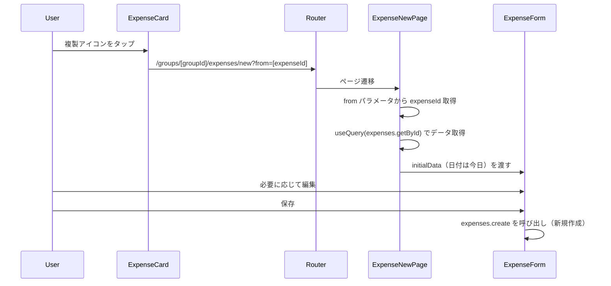

# 設計書: 支出の複製機能

## Overview

支出一覧のカードにある削除アイコンの横に複製アイコンを追加し、タップすると同じ内容で新規支出作成画面が開く機能。

## Purpose

### 背景

同棲カップルの家計簿では、似た支出を繰り返し入力することが多い。

例えば:

- 毎週同じスーパーで同じくらいの金額の買い物をする
- いつものレストランで同じような支払いをする
- 先月と同じ光熱費を入力する

現在は毎回ゼロから入力する必要があり、金額・カテゴリ・支払者・負担方法を都度設定するのは手間。

### 目的

1. 既存の支出をベースに、最小操作で類似支出を記録できるようにする
2. 「3タップ以内で記録完了」のUX目標に近づける

### 代替案

| アプローチ           | メリット             | デメリット             |
| -------------------- | -------------------- | ---------------------- |
| 複製ボタン（採用）   | シンプル、直感的     | 完全な自動化ではない   |
| テンプレート機能     | 名前付きで管理できる | 過剰な機能、管理コスト |
| 定期支出（自動作成） | 完全自動化           | 固定費以外には不向き   |

→ 最もシンプルな「複製ボタン」を採用

## What to Do

### 機能要件

#### FR-1: 複製操作

| 機能           | 説明                                                     |
| -------------- | -------------------------------------------------------- |
| 複製アイコン   | 支出カードの削除アイコン(🗑)の左に複製アイコン(📋)を配置 |
| タップ時の動作 | 新規作成画面に遷移し、元の支出のデータをプリフィル       |
| 日付           | 今日の日付をデフォルトに（元の日付ではない）             |

#### FR-2: プリフィルされるデータ

| フィールド       | コピーする | 備考                     |
| ---------------- | ---------- | ------------------------ |
| 金額             | ✅         |                          |
| カテゴリ         | ✅         |                          |
| 支払者           | ✅         |                          |
| 負担方法         | ✅         | equal/ratio/amount/full  |
| 負担詳細         | ✅         | 割合・金額指定もコピー   |
| タイトル         | ✅         |                          |
| メモ             | ✅         |                          |
| 日付             | ❌         | 今日の日付を使用         |
| タグ             | ❌         | コピーしない（都度選択） |
| 買い物リスト連携 | ❌         | 元の支出固有のため       |

### 非機能要件

なし（既存のUIパターンに追加するだけ）

## How to Do It

### 処理フロー



### データフロー

新しいバックエンドAPIは不要。既存の `expenses.getById` と `expenses.create` をそのまま使う。

フロントエンド側のみの変更:

1. **ExpenseCard** に `onDuplicate` コールバックを追加
2. **PeriodExpenseList** に `onDuplicate` を伝播
3. **GroupDetail** で `onDuplicate` ハンドラを定義（`router.push` でクエリパラメータ付き遷移）
4. **ExpenseNewPage** で `from` クエリパラメータを読み取り、元の支出データを取得してフォームにプリフィル

### UI変更

#### ExpenseCard（支出カード）

```
変更前:
┌──────────────────────────────────────┐
│ 🍽️  ランチ          ¥1,200   [🗑]  │
│     12/15 · Aが支払い                │
└──────────────────────────────────────┘

変更後:
┌──────────────────────────────────────┐
│ 🍽️  ランチ          ¥1,200 [📋][🗑]│
│     12/15 · Aが支払い                │
└──────────────────────────────────────┘
```

複製アイコンには Lucide の `Copy` を使用。

#### ExpenseNewPage（新規作成ページ）

`from` クエリパラメータがある場合:

- `expenses.getById` で元の支出を取得
- 取得データを `initialData` に変換（`expenseId` は含めない → create モードのまま）
- 日付は今日をデフォルト

### 変更対象ファイル

| ファイル                                     | 変更内容                                          | 規模 |
| -------------------------------------------- | ------------------------------------------------- | ---- |
| `components/expenses/ExpenseCard.tsx`        | `onDuplicate` prop追加、`Copy`アイコン配置        | 小   |
| `components/expenses/PeriodExpenseList.tsx`  | `onDuplicate` prop追加、コールバック伝播          | 小   |
| `components/groups/GroupDetail.tsx`          | `handleDuplicate` 追加、`PeriodExpenseList`に渡す | 小   |
| `app/groups/[groupId]/expenses/new/page.tsx` | `from`パラメータ対応、元データ取得・プリフィル    | 中   |

### 既存コード（再利用）

- `convex/expenses.ts` — `getById` クエリ（元データ取得）、`create` ミューテーション（新規作成）
- `components/expenses/ExpenseForm.tsx` — `initialData` propで既にプリフィルに対応済み（`mode`を渡さなければcreateモード）
- `components/ui/` — 既存UIコンポーネントをそのまま使用

## What We Won't Do

### スコープ外

1. **バックエンドの`duplicate` mutation** — フロント側で `getById` + `create` を使えば十分。専用APIは過剰
2. **複製元の追跡** — 「この支出はXXから複製された」という情報は保持しない
3. **一括複製** — 複数の支出をまとめて複製する機能
4. **タグのコピー** — タグは支出ごとに意味が異なることが多いため、都度選択
5. **精算済み支出からの複製** — 精算済み支出は詳細画面（ExpenseDetail）から表示される。一覧のカードにはそもそも表示されないため、スコープ外

## Concerns

### 解決済み

#### 1. 支払者やカテゴリが削除されていた場合

**問題**: コピー元の支払者がグループを脱退、またはカテゴリが削除されている可能性

→ **解決**: ExpenseForm が既にバリデーション済み。無効なIDが渡された場合はフォームのデフォルト値にフォールバック

#### 2. splitDetailsの復元

**問題**: ratio/amount splitの詳細データを正しくプリフィルできるか

→ **解決**: `getById` が `splits` を返し、ExpenseNewPage で `splitMethod` に応じて `ratios`/`amounts`/`bearerId` を構築。この変換ロジックは既に支出編集ページ（`expenses/[expenseId]/page.tsx`）の `initialData` 構築で実装済み。同じパターンを再利用

## Reference Materials/Information

### 既存コード

- `app/groups/[groupId]/expenses/[expenseId]/page.tsx` — `initialData` の構築パターン（lines 176-208）を再利用
- `components/expenses/ExpenseForm.tsx` — `InitialData` 型定義、`mode?: "create" | "edit"` の挙動
- `components/expenses/ExpenseCard.tsx` — 複製アイコンを追加する対象
- `components/groups/GroupDetail.tsx` — `handleEdit` / `handleDelete` のコールバックパターン

---

## 決定事項まとめ

| 項目             | 決定                                              |
| ---------------- | ------------------------------------------------- |
| 複製の起点       | 支出一覧カードの削除アイコンの左                  |
| アイコン         | Lucide `Copy`                                     |
| 遷移先           | `/groups/[groupId]/expenses/new?from=[expenseId]` |
| 日付             | 今日の日付（元の日付はコピーしない）              |
| タグ             | コピーしない                                      |
| バックエンド変更 | なし（既存API再利用）                             |
| 新規ファイル     | なし                                              |
