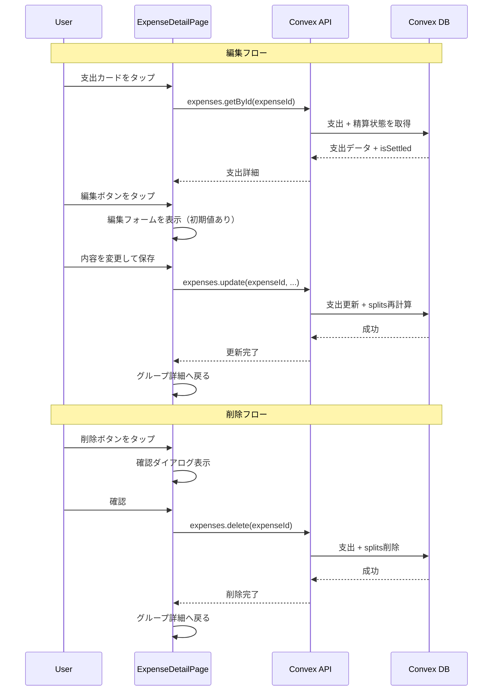
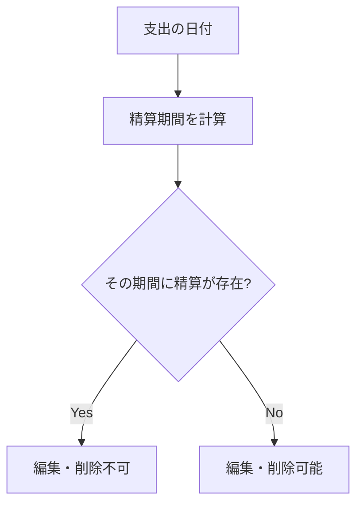
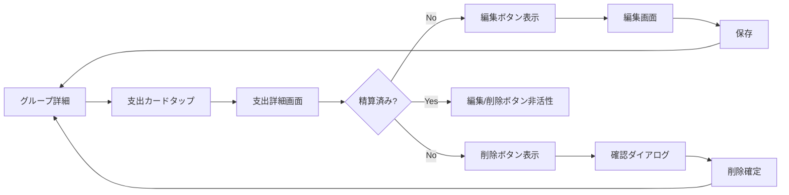

# 支出編集・削除機能 設計書

## 概要

支出記録の編集と削除機能を実装する。記録ミスの修正や誤登録の取り消しを可能にし、実用的な家計簿アプリとしての基本要件を満たす。

## 目的

現状、支出を一度登録すると変更や取り消しができない。これにより以下の問題が発生している：

- 金額の入力ミスを修正できない
- カテゴリや日付の選択ミスを修正できない
- 誤って登録した支出を削除できない
- テストデータを手動で削除できない

家計簿アプリとして最低限の編集機能は必須である。

## やること

### 機能要件

#### 1. 支出編集機能

- 以下のフィールドを編集可能にする：
  - 金額
  - カテゴリ
  - 支払者
  - 日付
  - メモ
  - 負担方法（均等/割合/金額/全額）
- 編集は支出が属する**精算が未確定**の場合のみ可能
- 編集権限は**グループメンバー全員**に付与

#### 2. 支出削除機能

- 支出を完全に削除（関連する `expenseSplits` も削除）
- 削除は支出が属する**精算が未確定**の場合のみ可能
- 削除権限は**グループメンバー全員**に付与
- 削除前に確認ダイアログを表示

#### 3. UI/UX

- 支出カードタップ → 支出詳細画面 → 編集/削除ボタン
- 編集画面は新規登録画面を流用（初期値を設定）
- 精算済みの場合は編集/削除ボタンを非活性化

### 非機能要件

- 編集・削除操作の監査ログ出力
- Optimistic UI による即時フィードバック

## 実装方法

### データフロー



### API設計

#### `expenses.update` mutation

```typescript
update = authMutation({
  args: {
    expenseId: v.id("expenses"),
    amount: v.number(),
    categoryId: v.id("categories"),
    paidBy: v.id("users"),
    date: v.string(),
    memo: v.optional(v.string()),
    splitDetails: v.optional(splitDetailsValidator),
  },
  handler: async (ctx, args) => {
    // 1. 支出の存在確認
    // 2. グループメンバーかチェック
    // 3. 精算済みでないかチェック
    // 4. バリデーション
    // 5. 既存のsplitsを削除
    // 6. 支出を更新
    // 7. 新しいsplitsを作成
    // 8. 監査ログ出力
  },
});
```

#### `expenses.delete` mutation

```typescript
remove = authMutation({
  args: {
    expenseId: v.id("expenses"),
  },
  handler: async (ctx, args) => {
    // 1. 支出の存在確認
    // 2. グループメンバーかチェック
    // 3. 精算済みでないかチェック
    // 4. 関連するsplitsを削除
    // 5. 支出を削除
    // 6. 監査ログ出力
  },
});
```

### 精算済みチェックのロジック

支出の日付が属する精算期間に、確定済みの精算が存在するかをチェックする。



```typescript
// ドメイン層に追加
function isExpenseSettled(
  expenseDate: string,
  closingDay: number,
  settlements: Settlement[],
): boolean {
  // expenseDateが属する精算期間を特定
  const { year, month } = getSettlementYearMonthForDate(
    expenseDate,
    closingDay,
  );
  const period = getSettlementPeriod(closingDay, year, month);

  // その期間に精算が存在するかチェック
  return settlements.some(
    (s) => s.periodStart === period.startDate && s.periodEnd === period.endDate,
  );
}
```

### UI設計

#### 画面遷移



#### 支出詳細画面（新規）

`/groups/[groupId]/expenses/[expenseId]` に詳細画面を追加。

```
┌─────────────────────────────┐
│ ← 戻る                      │
├─────────────────────────────┤
│  🍔 食費                    │
│  ¥1,500                     │
│  2024/12/25                 │
├─────────────────────────────┤
│  支払者: 太郎               │
│  メモ: ランチ代             │
├─────────────────────────────┤
│  負担配分                   │
│  ・太郎: ¥750               │
│  ・花子: ¥750               │
├─────────────────────────────┤
│  [編集]     [削除]          │  ← 精算済みの場合は非活性
└─────────────────────────────┘
```

#### 編集画面

既存の `ExpenseForm` を拡張し、編集モードをサポート。

```typescript
type ExpenseFormProps = {
  groupId: Id<"groups">;
  categories: Category[];
  members: Member[];
  onCancel: () => void;
  // 編集モード用
  mode?: "create" | "edit";
  initialData?: {
    expenseId: Id<"expenses">;
    amount: number;
    categoryId: Id<"categories">;
    paidBy: Id<"users">;
    date: string;
    memo?: string;
    splitMethod: SplitMethod;
    // 割合・金額指定の場合の詳細
    ratios?: { userId: Id<"users">; ratio: number }[];
    amounts?: { userId: Id<"users">; amount: number }[];
    bearerId?: Id<"users">;
  };
};
```

#### 削除確認ダイアログ

```
┌─────────────────────────────┐
│  この支出を削除しますか？   │
│                             │
│  🍔 食費 ¥1,500            │
│  2024/12/25                 │
│                             │
│  この操作は取り消せません   │
│                             │
│  [キャンセル]  [削除する]   │
└─────────────────────────────┘
```

### ファイル構成

```
convex/
├── expenses.ts              # update, remove mutation追加
├── domain/expense/
│   └── rules.ts            # 精算済みチェック関数追加

components/expenses/
├── ExpenseForm.tsx          # 編集モード対応
├── ExpenseDetail.tsx        # 新規: 支出詳細コンポーネント
└── DeleteExpenseDialog.tsx  # 新規: 削除確認ダイアログ

app/groups/[groupId]/expenses/
├── [expenseId]/
│   ├── page.tsx            # 新規: 支出詳細ページ
│   └── edit/
│       └── page.tsx        # 新規: 支出編集ページ
└── new/
    └── page.tsx            # 既存
```

### テスト計画

#### ユニットテスト

- `isExpenseSettled` 関数のテスト
  - 精算済み期間の支出 → true
  - 未精算期間の支出 → false
  - 期間境界のケース

#### 統合テスト

- `expenses.update`
  - 正常に更新できる
  - 精算済みの場合はエラー
  - 非メンバーはエラー
  - バリデーションエラー
- `expenses.delete`
  - 正常に削除できる
  - 精算済みの場合はエラー
  - 非メンバーはエラー
  - 関連するsplitsも削除される

## やらないこと

- **編集履歴の保存**: 誰がいつ何を変更したかの履歴は保存しない（監査ログのみ）
- **ソフトデリート**: 論理削除ではなく物理削除を採用（シンプルさ優先）
- **精算済み支出の編集**: 精算確定後の変更は一切不可とする
- **編集権限の細分化**: 作成者のみ編集可能などの制限は設けない
- **バッチ編集/削除**: 複数支出の一括操作は対象外

## 懸念事項

### 1. 精算済みチェックのパフォーマンス

**懸念**: 支出の編集/削除のたびに精算テーブルを検索する必要がある。

**対応**:

- 精算は月1回程度なのでレコード数は少ない
- `by_group_and_period` インデックスで効率的に検索可能
- 問題になった場合は支出テーブルに `isSettled` フラグを追加検討

### 2. 精算期間の判定ロジック

**懸念**: 支出日から精算期間を逆算するロジックが必要。

**対応**:

- `getSettlementYearMonthForDate(date, closingDay)` 関数を新規追加
- 既存の `getSettlementPeriod` と対になる関数として実装

### 3. 同時編集の競合

**懸念**: 2人が同時に同じ支出を編集した場合。

**対応**:

- Convexは楽観的ロックを採用しており、後勝ちになる
- MVPでは許容し、将来的に `updatedAt` による競合検知を検討

### 4. 削除の取り消し

**懸念**: 誤って削除した場合に復元できない。

**対応**:

- 確認ダイアログで二重確認を実施
- MVPでは物理削除を採用（シンプルさ優先）
- 将来的にゴミ箱機能の追加を検討

## 参考資料

- [既存の支出記録機能設計書](./design-expense-feature.md)
- [精算機能設計書](./design-settlement-feature.md)
- [Convex Mutations](https://docs.convex.dev/functions/mutation-functions)
