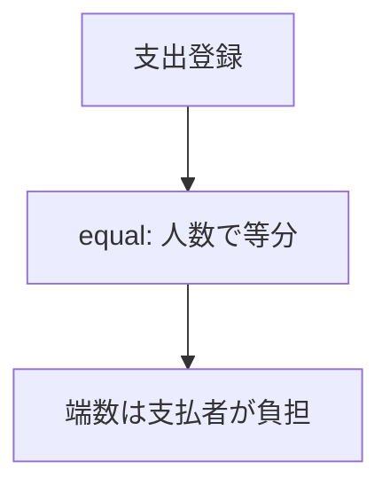
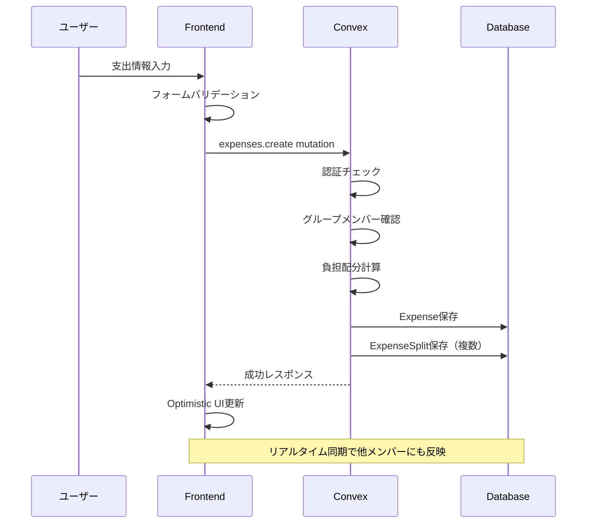

# 支出記録機能 設計書（Phase 1）

## Overview

グループ内で発生した支出を記録し、メンバー間の負担配分を管理する機能。MVPの核となる機能であり、精算機能の基盤となる。

### Phase 1 スコープ

| 機能           | Phase 1 | Phase 2 |
| -------------- | ------- | ------- |
| 支出登録       | ◯       | -       |
| 支出一覧表示   | ◯       | -       |
| 均等分割       | ◯       | -       |
| 傾斜分割(割合) | -       | ◯       |
| 傾斜分割(金額) | -       | ◯       |
| 全額負担       | -       | ◯       |
| 支出編集       | -       | ◯       |
| 支出削除       | -       | ◯       |

## Purpose

### なぜ必要か

1. **共有家計簿の基本機能**: 支出を記録しないと、誰がいくら払って誰が負担すべきかを追跡できない
2. **精算機能の前提**: 支出データがないと精算計算ができない
3. **ユーザー価値の即時提供**: グループ作成・参加後、すぐに支出記録を開始できる

### ユーザーストーリー

- グループメンバーとして、支出を記録して誰が払ったか、誰が負担すべきかを管理したい
- 支払者として、自分が立て替えた金額を記録し、後で精算したい
- グループメンバーとして、過去の支出一覧を確認したい

## What to Do

### 機能要件（Phase 1）

#### 1. 支出登録

| 項目     | 必須 | 説明                        |
| -------- | ---- | --------------------------- |
| 金額     | ◯    | 1〜100,000,000円（整数）    |
| カテゴリ | ◯    | グループのカテゴリから選択  |
| 支払者   | ◯    | グループメンバーから選択    |
| 日付     | ◯    | デフォルトは当日            |
| メモ     | ×    | 自由入力（500文字以内）     |
| 負担方法 | -    | **Phase 1では均等分割固定** |

#### 2. 負担方法（Phase 1: 均等分割のみ）



**均等分割の例（1000円、A/B/Cの3人グループ、Aが支払い）**:

| 方法  | 計算                               | 結果                |
| ----- | ---------------------------------- | ------------------- |
| equal | 1000 ÷ 3 = 333余り1、端数は支払者A | A:334, B:333, C:333 |

> **Phase 2で追加予定**: ratio（割合指定）, amount（金額指定）, full（全額負担）

#### 3. 支出一覧表示

- **グループ詳細ページに統合**して表示
- グループ内の支出を日付降順で表示
- 各支出の詳細情報（金額、カテゴリ、支払者、負担配分）を表示

#### 4. 支出編集・削除（Phase 2）

> Phase 1ではスコープ外。Phase 2で実装予定。

### 非機能要件

- **UX目標**: 3タップ以内で支出登録完了
- **パフォーマンス**: Optimistic UIで即座にレスポンス
- **モバイルファースト**: スマホでの入力に最適化
- **リアルタイム同期**: 他メンバーの支出が即座に反映

## How to Do It

### データフロー



### 画面構成（ワイヤーフレーム）

#### 支出登録フォーム

```
┌─────────────────────────────────┐
│  ←  支出を記録                  │
├─────────────────────────────────┤
│                                 │
│  金額                           │
│  ┌─────────────────────────┐   │
│  │ ¥ 1,500                 │   │
│  └─────────────────────────┘   │
│                                 │
│  カテゴリ                       │
│  ┌─────────────────────────┐   │
│  │ 🍽️ 食費               ▼ │   │
│  └─────────────────────────┘   │
│                                 │
│  支払者                         │
│  ┌─────────────────────────┐   │
│  │ 👤 自分                ▼ │   │
│  └─────────────────────────┘   │
│                                 │
│  日付                           │
│  ┌─────────────────────────┐   │
│  │ 📅 2024-12-30          ▼ │   │
│  └─────────────────────────┘   │
│                                 │
│  ※ 均等分割で負担配分されます  │
│                                 │
│  メモ（任意）                   │
│  ┌─────────────────────────┐   │
│  │ ランチ代                │   │
│  └─────────────────────────┘   │
│                                 │
│  ┌─────────────────────────┐   │
│  │      記録する            │   │
│  └─────────────────────────┘   │
│                                 │
└─────────────────────────────────┘
```

#### 支出一覧画面（グループ詳細ページに統合）

```
┌─────────────────────────────────┐
│  テスト家計簿グループ           │
├─────────────────────────────────┤
│                                 │
│  ─────── 2024年12月 ─────────   │
│                                 │
│  ┌─────────────────────────┐   │
│  │ 🍽️ 食費        ¥1,500   │   │
│  │ Aさんが支払い            │   │
│  │ 12/30 ・ ランチ代        │   │
│  │ 均等分割 (A:500 B:500...)│   │
│  └─────────────────────────┘   │
│                                 │
│  ┌─────────────────────────┐   │
│  │ 🧴 日用品      ¥2,400   │   │
│  │ Bさんが支払い            │   │
│  │ 12/29 ・ シャンプー等    │   │
│  │ 均等分割 (A:800 B:800...)│   │
│  └─────────────────────────┘   │
│                                 │
│  ─────── 2024年11月 ─────────   │
│  ...                            │
│                                 │
│                     [＋]        │
└─────────────────────────────────┘
```

### ファイル構成（Phase 1）

```
app/
└── groups/
    └── [groupId]/
        ├── page.tsx                    # グループ詳細（支出一覧を統合）
        └── expenses/
            └── new/
                └── page.tsx            # 支出登録

components/
└── expenses/
    ├── ExpenseForm.tsx                 # 支出登録フォーム
    ├── ExpenseList.tsx                 # 支出一覧
    └── ExpenseCard.tsx                 # 支出カード

convex/
├── expenses.ts                         # 支出関連のmutation/query
└── lib/
    └── splitCalculator.ts              # 負担配分計算ロジック
```

> **Phase 2で追加予定**: `SplitMethodSelector.tsx`, `RatioSplitInput.tsx`, `AmountSplitInput.tsx`

### Convex関数（Phase 1）

#### expenses.ts

```typescript
// 支出登録（Phase 1: 均等分割のみ）
export const create = authMutation({
  args: {
    groupId: v.id("groups"),
    amount: v.number(),
    categoryId: v.id("categories"),
    paidBy: v.id("users"),
    date: v.string(),
    memo: v.optional(v.string()),
    // Phase 1では splitMethod は常に "equal"
  },
  handler: async (ctx, args) => {
    // 1. グループメンバー確認
    // 2. 均等分割で負担配分計算
    // 3. Expense保存
    // 4. ExpenseSplit保存
    return expenseId;
  },
});

// 支出一覧取得
export const listByGroup = authQuery({
  args: {
    groupId: v.id("groups"),
    limit: v.optional(v.number()),
  },
  handler: async (ctx, args) => {
    // グループの支出を日付降順で取得
    // カテゴリ、支払者、負担配分も含めて返す
  },
});

// 支出詳細取得
export const getById = authQuery({
  args: { expenseId: v.id("expenses") },
  handler: async (ctx, args) => {
    // 支出詳細と負担配分を取得
  },
});
```

> **Phase 2で追加予定**: `update`, `remove` mutation

### 負担配分計算ロジック（Phase 1）

```typescript
// convex/lib/splitCalculator.ts

interface SplitResult {
  userId: Id<"users">;
  amount: number;
}

/**
 * 均等分割（端数は支払者が負担）
 * Phase 1ではこの関数のみ実装
 */
export function calculateEqualSplit(
  amount: number,
  memberIds: Id<"users">[],
  payerId: Id<"users">,
): SplitResult[] {
  const count = memberIds.length;
  const base = Math.floor(amount / count);
  const remainder = amount % count;

  return memberIds.map((userId) => ({
    userId,
    amount: userId === payerId ? base + remainder : base,
  }));
}
```

> **Phase 2で追加予定**: `calculateRatioSplit`, `calculateAmountSplit`, `calculateFullSplit`

### バリデーションルール（Phase 1）

```typescript
// 金額
const amountValidation = {
  min: 1,
  max: 100_000_000,
  integer: true,
};

// メモ
const memoValidation = {
  maxLength: 500,
};

// 日付
const dateValidation = {
  format: "YYYY-MM-DD",
  maxFuture: 0, // 未来日は不可
};
```

> **Phase 2で追加予定**: 負担配分バリデーション（ratio: 合計100%, amount: 合計一致, full: 1人指定）

## What We Won't Do

### Phase 1 スコープ外（Phase 2で実装予定）

1. **傾斜分割（割合指定）**: 70%/30%のような割合指定による負担配分
2. **傾斜分割（金額指定）**: 特定金額を直接指定する負担配分
3. **全額負担**: 1人が全額を負担する負担配分
4. **支出編集**: 登録済み支出の編集機能
5. **支出削除**: 登録済み支出の削除機能

### MVP外（今後の検討事項）

1. **レシートOCR**: 画像から金額・カテゴリを自動読み取り（実装コスト高）
2. **定期支出**: 毎月同じ支出を自動登録
3. **支出テンプレート**: よく使う支出パターンを保存
4. **複数通貨対応**: 円以外の通貨
5. **支出の分割登録**: 1回の買い物を複数カテゴリに分割

### シードデータ更新

今回の実装でシードデータの更新が**必要**。

- テスト用の支出データを追加
- Phase 1では均等分割（equal）のサンプルデータのみ

## Concerns

### 懸念事項と対策（Phase 1）

| 懸念                        | 対策                                 |
| --------------------------- | ------------------------------------ |
| 均等分割の端数処理ミス      | ユニットテストで検証                 |
| Optimistic UIと実際の不整合 | エラー時のロールバック処理を実装     |
| 大量の支出データでの性能    | ページネーション、インデックスの活用 |

> Phase 1では編集・削除機能がないため、誤登録時は精算前に対処する必要がある

### 設計判断

1. **端数処理**: 支払者が端数を負担（シンプル・公平）
2. **未来日の支出**: 許可しない（予定機能は別途検討）
3. **負担配分**: Phase 1では均等分割のみ（最もよく使われる）

> **Phase 2で決定予定**: 支出の編集・削除権限（登録者のみ or グループメンバー全員）

## Reference Materials/Information

- 既存スキーマ: `convex/schema.ts` - expenses, expenseSplits テーブル
- ドメインモデル: `docs/design-domain-model.md` - 負担配分ロジック詳細
- 既存実装: `convex/groups.ts` - authMutationの使い方参考
- MVP仕様: `docs/mvp-features.md` - 支出記録の要件
