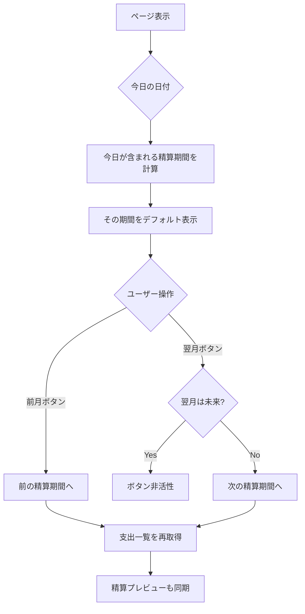
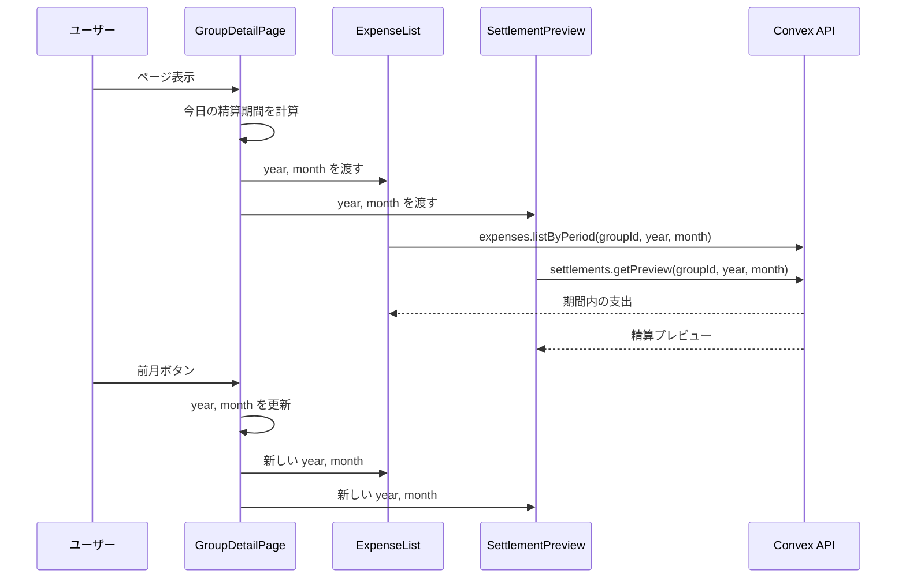
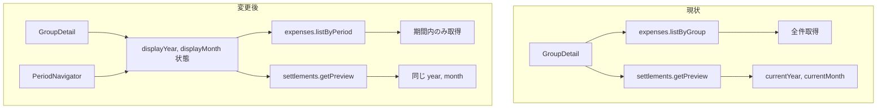

# 精算起点のグループ詳細画面 設計書

## Overview

グループ詳細画面のレイアウトを「精算起点」に変更し、精算と支出の関係を明確にする。精算を画面上部に配置し、その下に同じ期間の支出を表示することで、「どの支出がどの精算に含まれるか」を直感的に理解できるようにする。

### 現状

```
┌─────────────────────────────────────────┐
│  グループ情報                           │
│  締め日: 毎月25日                       │
├─────────────────────────────────────────┤
│  メンバー (2人)                         │
├─────────────────────────────────────────┤
│  支出履歴（主役）                       │
│  ├── 2024年12月 ─────────────────       │
│  │   ├── 12/31 食費 ¥3,500             │ ← どの精算？
│  │   ├── 12/20 日用品 ¥1,200           │
│  │   └── ...                           │
│  ├── 2024年11月 ─────────────────       │
│  │   └── ...                           │
│  └── （無限に続く）                     │
├─────────────────────────────────────────┤
│  今月の精算（おまけ扱い）               │
│  12月分: 11/26〜12/25                   │
│  ※ 12/31の支出は含まれていない！       │
├─────────────────────────────────────────┤
│  過去の精算                             │
└─────────────────────────────────────────┘

問題点:
1. 支出履歴が主役で、精算は下の方に追いやられている
2. 暦月表示 vs 精算期間（締め日ベース）のズレで混乱
3. 「支出を登録したのに精算に反映されない」という誤解
4. 無限に増える支出でパフォーマンス悪化
```

### 変更後

```
┌─────────────────────────────────────────┐
│  グループ情報                           │
│  締め日: 毎月25日                       │
├─────────────────────────────────────────┤
│  メンバー (2人)                         │
├─────────────────────────────────────────┤
│  今期の精算（主役）                     │
│  ◀ 12月 │ 1月分 (12/26〜1/25) │ ▶     │
│  ─────────────────────────────────────  │
│  A → B ¥3,150                          │
│  [精算を確定]                           │
├─────────────────────────────────────────┤
│  この期間の支出 (3件 / ¥7,300)          │
│  ├── 12/31 食費 ¥3,500                 │
│  ├── 12/28 外食 ¥2,800                 │
│  └── 12/26 日用品 ¥1,000               │
├─────────────────────────────────────────┤
│  過去の精算                             │
└─────────────────────────────────────────┘
                                    [＋]

改善点:
1. 精算が主役（ユーザーが一番知りたい情報）
2. 支出と精算が同じ期間を表示（連動）
3. 期間ナビで過去も確認可能
4. 記録後に「今期の支出」に即反映される安心感
5. 期間内の支出のみ取得（パフォーマンス向上）
```

## Purpose

### なぜ必要か

1. **ユーザーの一番の関心に応える**
   - ユーザーが最も知りたいのは「今月、誰が誰にいくら払う？」
   - 現状は精算が画面下部で目立たない
   - 精算を主役にすることで、核心情報にすぐアクセス

2. **支出と精算の関係を明確に**
   - 「支出を登録したのに精算に反映されない」という誤解が発生
   - 暦月と精算期間（締め日ベース）のズレが原因
   - 同じ期間を表示することで、1対1の対応を明確に

3. **記録後の安心感**
   - 支出を登録したら、すぐに「今期の支出」に表示される
   - 精算額もリアルタイムで更新
   - 「ちゃんと入った」という確認感

4. **パフォーマンスの確保**
   - 現状は全支出を取得して表示
   - 期間ごとに取得すれば、常に一定のデータ量に

### ユーザーストーリー

- ユーザーとして、今月いくら払えばいいか一目で分かりたい
- ユーザーとして、登録した支出がどの精算に含まれるか確認したい
- ユーザーとして、支出記録を素早く行いたい（動線は変えない）
- ユーザーとして、先月の精算と支出を振り返りたい

## What to Do

### 機能要件

#### 期間ナビゲーション

| 要素 | 説明 |
|------|------|
| 現在期間表示 | 「1月分 (12/26〜1/25)」形式で表示 |
| 前月ボタン | 前の精算期間へ移動 |
| 翌月ボタン | 次の精算期間へ移動（未来は制限） |
| デフォルト表示 | 今日が含まれる精算期間を表示 |

#### 支出一覧

| 要素 | 説明 |
|------|------|
| 期間フィルタ | 選択した精算期間内の支出のみ表示 |
| 件数・合計 | 期間内の支出件数と合計金額を表示 |
| ソート | 日付の新しい順 |
| 空状態 | 「この期間の支出はありません」 |

#### 精算プレビューとの連動

| 要素 | 説明 |
|------|------|
| 期間の同期 | 支出履歴と精算プレビューが同じ期間を表示 |
| ラベル統一 | 「今月の精算」→「今期の精算」に変更 |

### 非機能要件

- **パフォーマンス**: 期間内の支出のみ取得（全件取得しない）
- **レスポンシブ**: モバイルでも快適に操作可能
- **アクセシビリティ**: ボタンにaria-labelを設定

### UI要件

```
グループ詳細画面（変更後）
┌─────────────────────────────────────────┐
│  ← グループ名                           │
├─────────────────────────────────────────┤
│  グループ情報                           │
│  締め日: 毎月25日                       │
├─────────────────────────────────────────┤
│  メンバー (2人)                    [招待]│
│  ├── パートナーA (オーナー)             │
│  └── パートナーB                        │
├─────────────────────────────────────────┤
│  今期の精算                             │
│  ┌─────────────────────────────────┐   │
│  │ ◀ │   1月分 (12/26〜1/25)   │ ▶ │   │
│  └─────────────────────────────────┘   │
│  A → B ¥3,150                          │
│  [精算を確定]                           │
├─────────────────────────────────────────┤
│  この期間の支出 (3件 / ¥7,300)          │
│  ┌─────────────────────────────────┐   │
│  │ 12/31 🍽️ 食費                    │   │
│  │ ¥3,500  パートナーA              │   │
│  └─────────────────────────────────┘   │
│  ┌─────────────────────────────────┐   │
│  │ 12/28 🍽️ 外食                    │   │
│  │ ¥2,800  パートナーB              │   │
│  └─────────────────────────────────┘   │
│  ┌─────────────────────────────────┐   │
│  │ 12/26 🏠 日用品                   │   │
│  │ ¥1,000  パートナーA              │   │
│  └─────────────────────────────────┘   │
├─────────────────────────────────────────┤
│  過去の精算                             │
│  ├── 12月分 精算済み                   │
│  └── 11月分 精算済み                   │
└─────────────────────────────────────────┘
                                    [＋]
```

### ナビゲーション動作



## How to Do It

### データフロー



### 状態管理

```typescript
// GroupDetail.tsx

// 現在表示中の精算期間（年月）
const [displayYear, setDisplayYear] = useState<number>();
const [displayMonth, setDisplayMonth] = useState<number>();

// 初期化: 今日が含まれる精算期間を計算
useEffect(() => {
  const { year, month } = getCurrentSettlementPeriod(group.closingDay);
  setDisplayYear(year);
  setDisplayMonth(month);
}, [group.closingDay]);

// ナビゲーション
const goToPreviousMonth = () => {
  if (displayMonth === 1) {
    setDisplayYear(displayYear - 1);
    setDisplayMonth(12);
  } else {
    setDisplayMonth(displayMonth - 1);
  }
};

const goToNextMonth = () => {
  // 未来月は許可しない
  const { year: currentYear, month: currentMonth } = getCurrentSettlementPeriod(group.closingDay);
  if (displayYear > currentYear || (displayYear === currentYear && displayMonth >= currentMonth)) {
    return;
  }
  // ...
};
```

### 新規API: expenses.listByPeriod

```typescript
// convex/expenses.ts

export const listByPeriod = authQuery({
  args: {
    groupId: v.id("groups"),
    year: v.number(),
    month: v.number(),
  },
  handler: async (ctx, args) => {
    // 権限チェック
    const myMembership = await ctx.db
      .query("groupMembers")
      .withIndex("by_group_and_user", (q) =>
        q.eq("groupId", args.groupId).eq("userId", ctx.user._id),
      )
      .unique();

    if (!myMembership) {
      throw new Error("このグループにアクセスする権限がありません");
    }

    // グループの締め日を取得
    const group = await ctx.db.get(args.groupId);
    if (!group) {
      throw new Error("グループが見つかりません");
    }

    // 精算期間を計算
    const period = getSettlementPeriod(group.closingDay, args.year, args.month);

    // 期間内の支出を取得
    const allExpenses = await ctx.db
      .query("expenses")
      .withIndex("by_group_and_date", (q) => q.eq("groupId", args.groupId))
      .collect();

    const expenses = allExpenses.filter(
      (e) => e.date >= period.startDate && e.date <= period.endDate,
    );

    // ... 既存のマッピング処理

    return {
      period,
      expenses: mappedExpenses,
      totalCount: expenses.length,
      totalAmount: expenses.reduce((sum, e) => sum + e.amount, 0),
    };
  },
});
```

### 今期の計算ロジック

```typescript
// convex/domain/settlement/calculator.ts

/**
 * 今日が含まれる精算期間の年月を取得
 */
export function getCurrentSettlementPeriod(closingDay: number): { year: number; month: number } {
  const now = new Date();
  const today = now.getDate();
  const currentMonth = now.getMonth() + 1;
  const currentYear = now.getFullYear();

  // 締め日を過ぎている場合は翌月分
  if (today > closingDay) {
    if (currentMonth === 12) {
      return { year: currentYear + 1, month: 1 };
    }
    return { year: currentYear, month: currentMonth + 1 };
  }

  // 締め日以前の場合は今月分
  return { year: currentYear, month: currentMonth };
}
```

### コンポーネント構成

```
components/
├── groups/
│   └── GroupDetail.tsx          # レイアウト変更 + 状態管理追加
├── expenses/
│   ├── ExpenseList.tsx          # 簡略化（グルーピング削除）
│   └── PeriodExpenseList.tsx    # 新規: 期間ベースの支出リスト
├── settlements/
│   ├── SettlementPreview.tsx    # 変更: PeriodNavigator を内包
│   └── PeriodNavigator.tsx      # 新規: 期間ナビゲーション
└── ui/
    └── ...
```

### レイアウト変更（GroupDetail）

```
現状の順序:
1. グループ情報
2. メンバー
3. 支出履歴（全件）    ← 主役
4. 今月の精算
5. 過去の精算

変更後の順序:
1. グループ情報
2. メンバー
3. 今期の精算          ← 主役（期間ナビ付き）
4. この期間の支出      ← 精算と同じ期間
5. 過去の精算
```

### PeriodNavigator コンポーネント

```typescript
// components/expenses/PeriodNavigator.tsx

type PeriodNavigatorProps = {
  year: number;
  month: number;
  startDate: string;
  endDate: string;
  onPrevious: () => void;
  onNext: () => void;
  canGoNext: boolean;
};

export function PeriodNavigator({
  year,
  month,
  startDate,
  endDate,
  onPrevious,
  onNext,
  canGoNext,
}: PeriodNavigatorProps) {
  const formatPeriod = (start: string, end: string) => {
    const s = new Date(start);
    const e = new Date(end);
    return `${s.getMonth() + 1}/${s.getDate()}〜${e.getMonth() + 1}/${e.getDate()}`;
  };

  return (
    <div className="flex items-center justify-between bg-slate-50 rounded-lg p-3">
      <button
        onClick={onPrevious}
        className="p-2 hover:bg-slate-200 rounded-full transition-colors"
        aria-label="前の月へ"
      >
        ◀
      </button>

      <div className="text-center">
        <div className="font-medium">{year}年{month}月分</div>
        <div className="text-sm text-slate-500">
          {formatPeriod(startDate, endDate)}
        </div>
      </div>

      <button
        onClick={onNext}
        disabled={!canGoNext}
        className="p-2 hover:bg-slate-200 rounded-full transition-colors disabled:opacity-30 disabled:cursor-not-allowed"
        aria-label="次の月へ"
      >
        ▶
      </button>
    </div>
  );
}
```

### GroupDetail の変更



## What We Won't Do

### スコープ外

| 項目 | 理由 |
|------|------|
| 無限スクロール | 実装複雑、精算期間との連動が難しい |
| カレンダーピッカー | 月単位ナビゲーションで十分 |
| 複数期間の同時表示 | UIが複雑になる |
| 過去X件表示 | 精算期間ベースの方が分かりやすい |
| 検索・フィルター | 別機能として検討 |

### 設計上の制限

| 項目 | 制限 |
|------|------|
| 未来月の表示 | 不可（意味がない） |
| 過去の上限 | なし（データがある限り遡れる） |
| 精算期間の変更 | 締め日変更時は現在の表示をリセット |

## Concerns

### 懸念事項と対策

| 懸念 | 対策 |
|------|------|
| 初期表示のフラッシュ | useState の初期値を計算で設定、またはローディング表示 |
| 期間計算のズレ | settlementCalculator.ts の関数を共通利用 |
| クライアント/サーバーの日付ズレ | サーバー側で期間計算、クライアントはUIのみ |
| 締め日変更時の動作 | 表示中の期間をリセットして再取得 |

### 未決定事項

| 項目 | 選択肢 | 決定 |
|------|--------|------|
| ラベル表記 | 「今月の精算」vs「今期の精算」 | 「今期の精算」を推奨 |
| 空期間の扱い | スキップ vs 空表示 | 空表示（期間は存在する） |
| 過去月への移動上限 | グループ作成日 vs 最初の支出日 vs 無制限 | 最初の支出がある月まで |

## Reference Materials/Information

- 精算機能設計: `docs/design-settlement-feature.md`（存在する場合）
- 締め日計算: `convex/domain/settlement/calculator.ts`
- 現在の支出一覧: `components/expenses/ExpenseList.tsx`
- MVP機能仕様: `docs/mvp-features.md`

---

## 実装ステップ

1. **ドメイン層**: `getCurrentSettlementPeriod` 関数を追加
2. **API**: `expenses.listByPeriod` クエリを追加
3. **UI**: `PeriodNavigator` コンポーネントを作成
4. **UI**: `PeriodExpenseList` コンポーネントを作成
5. **統合**: `GroupDetail` のレイアウト変更
   - 精算セクションを上に移動
   - 支出セクションを精算の下に配置
   - 期間ナビゲーションで両者を連動
6. **ラベル変更**: 「今月の精算」→「今期の精算」、「支出履歴」→「この期間の支出」
7. **テスト**: 期間計算のユニットテスト、UIの動作確認
