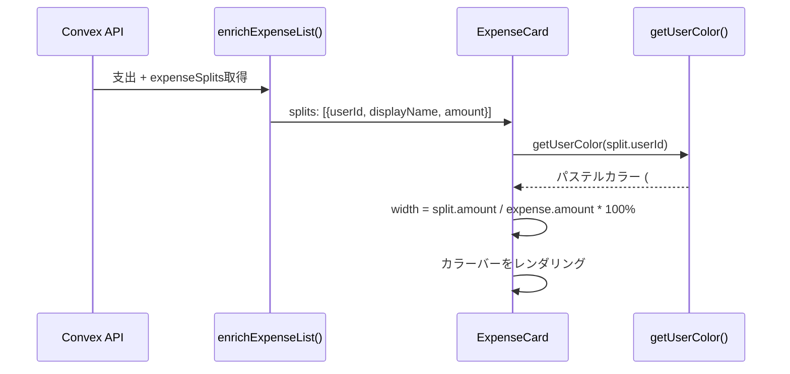

# 設計書: 支出カードの負担割合カラーバー

## Overview

支出一覧画面の各カードに、だれがどの割合で負担しているかを色で視覚的に表示するカラーバーを追加する。

## Purpose

### 背景

現在、支出一覧の各カードには「○○が支払い」と支払者名のみが表示されている。負担割合（均等/傾斜/全額負担）を確認するには詳細画面を開く必要があり、一覧性が低い。

例えば:

- 1,000円の支出で「りょう 60% / あい 40%」の傾斜割合を一目で把握したい
- 全額負担なのか均等割りなのかをカードレベルで区別したい
- 2人暮らしアプリのため、割合のバランス感覚を素早く掴みたい

### 目的

1. 支出一覧での情報密度を上げ、詳細画面に行かなくても負担割合を把握可能にする
2. 数字ではなく色で直感的に表現し、カード表示をシンプルに保つ
3. ユーザーごとの色を統一し、アプリ全体で「自分の色」を認識できるようにする

### 代替案

| アプローチ                  | メリット           | デメリット             |
| --------------------------- | ------------------ | ---------------------- |
| 数字でパーセント表示        | 正確な割合がわかる | カードが情報過多になる |
| アバターアイコンを2つ並べる | 人物がわかりやすい | 割合の表現が困難       |
| カラーバーで割合表示        | 直感的、省スペース | 正確な数値は読めない   |

→ カラーバーを採用。2人のアプリなので色だけで十分認識可能。正確な数値は詳細画面で確認できる。

## What to Do

### 機能要件

#### FR-1: カラーバー表示

| 機能           | 説明                                           |
| -------------- | ---------------------------------------------- |
| 割合バー       | カードの下部にユーザーごとの色で負担割合を表示 |
| 色の一貫性     | 同じユーザーはアプリ全体で同じ色を使用         |
| パステルカラー | 目に優しいパステル系の配色                     |

#### FR-2: 割合計算

| splitMethod | バーの表示                     |
| ----------- | ------------------------------ |
| equal       | メンバー数で均等分割した幅     |
| ratio       | 指定された比率で分割した幅     |
| amount      | 各人の負担額の比率で分割した幅 |
| full        | 負担者100%で単色表示           |

#### FR-3: エッジケース

| ケース              | 表示                 |
| ------------------- | -------------------- |
| splits が空         | バー非表示           |
| amount が 0         | バー非表示           |
| 負担額 0 のユーザー | そのセグメント非表示 |

### 非機能要件

#### NFR-1: パフォーマンス

- カラーバーは純粋なCSS/HTML（Canvas/SVG不使用）
- ユーザーカラーの計算はハッシュベースで O(1)

#### NFR-2: デザイン

- バーの高さ: 4px（`h-1`）
- 角丸: full（`rounded-full`）
- カード本体コンテンツとの間隔: 8px（`mt-2`）

## 実装方法

### ユーザーカラーユーティリティ

```typescript
// lib/userColors.ts（新規）

const PASTEL_COLORS = [
  "#93c5fd", // blue-300
  "#f9a8d4", // pink-300
  "#86efac", // green-300
  "#fcd34d", // amber-300
  "#c4b5fd", // violet-300
  "#67e8f9", // cyan-300
  "#fdba74", // orange-300
  "#a5b4fc", // indigo-300
] as const;

/**
 * userId文字列から一意のパステルカラーを返す
 * ハッシュベースで同じuserIdは常に同じ色
 */
export function getUserColor(userId: string): string {
  let hash = 0;
  for (let i = 0; i < userId.length; i++) {
    hash = ((hash << 5) - hash + userId.charCodeAt(i)) | 0;
  }
  return PASTEL_COLORS[Math.abs(hash) % PASTEL_COLORS.length];
}
```

既存の `lib/tagColors.ts` と同じパターンで、色ユーティリティを `lib/` に配置。

### データフロー



### UI設計

#### 支出カード（変更後）

```
┌─────────────────────────────────────┐
│  🛒  食費 - スーパーで買い物   ¥3,500│
│      2/14 ・ りょうが支払い          │
│  ████████████████████░░░░░░░░░      │  ← 新規追加（4px）
│  りょう60%          あい40%          │  ← 色の意味（実際には数字は非表示）
└─────────────────────────────────────┘
```

カラーバーの実装:

```tsx
{
  expense.splits.length > 0 && expense.amount > 0 && (
    <div className="flex mt-2 h-1 rounded-full overflow-hidden">
      {expense.splits
        .filter((split) => split.amount > 0)
        .map((split) => (
          <div
            key={split.userId}
            style={{
              width: `${(split.amount / expense.amount) * 100}%`,
              backgroundColor: getUserColor(split.userId),
            }}
          />
        ))}
    </div>
  );
}
```

### ファイル構成

```
lib/
└── userColors.ts           # 新規: ユーザーカラーユーティリティ

components/expenses/
└── ExpenseCard.tsx          # 改修: カラーバー追加
```

### テスト計画

#### ユニットテスト

- `getUserColor`
  - 同じuserIdに対して常に同じ色を返す
  - 返り値が有効なhexカラーコード
  - 異なるuserIdに対して（高確率で）異なる色を返す

#### 手動テスト

- 均等割り: 2人のバーが同じ幅
- 傾斜割り: 比率に応じて幅が異なる
- 全額負担: 単色バー
- 1人のみの支出: 単色バー

## やらないこと

- **数値表示**: バー上にパーセンテージや金額のテキストは表示しない
- **ツールチップ**: ホバーやタップでの詳細表示はしない（詳細画面で確認）
- **アニメーション**: バーの表示にアニメーションは付けない
- **カラーカスタマイズ**: ユーザーが色を選ぶ機能は対象外
- **凡例表示**: どの色がどのユーザーかの凡例は表示しない（2人なので自明）

## 懸念事項

### 1. 色の衝突

**懸念**: ハッシュベースの色割り当てで、2人のユーザーが同じ色になる可能性。

**対応**:

- パレットに8色あり、2人の場合の衝突確率は 1/8（12.5%）
- 衝突した場合でもバーの境界（幅の区切り）で割合は認識可能
- 将来的にグループメンバー一覧の順序ベースに変更することも可能

### 2. 3人以上のグループ

**懸念**: 3人以上の場合、色だけでは誰の分かわかりにくい。

**対応**:

- 現在のターゲットは2人（カップル・夫婦）なので十分
- 3人以上は詳細画面で確認する運用

## 参考資料

- [ExpenseCard コンポーネント](../components/expenses/ExpenseCard.tsx)
- [データエンリッチメント](../convex/lib/enrichment.ts)
- [既存カラーユーティリティ](../lib/tagColors.ts)
