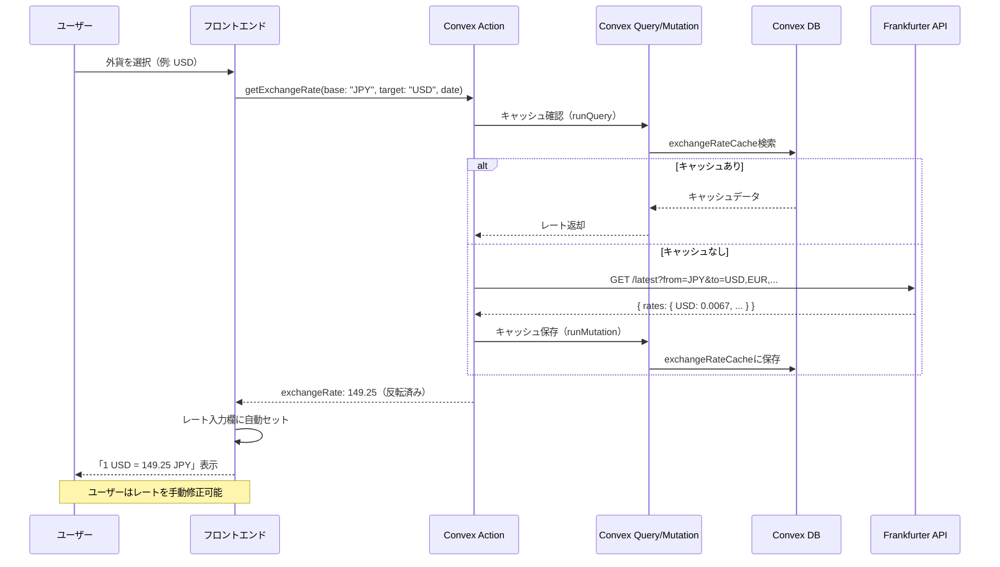
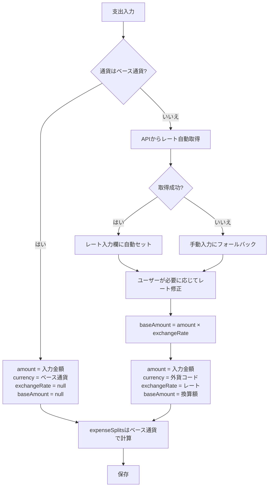
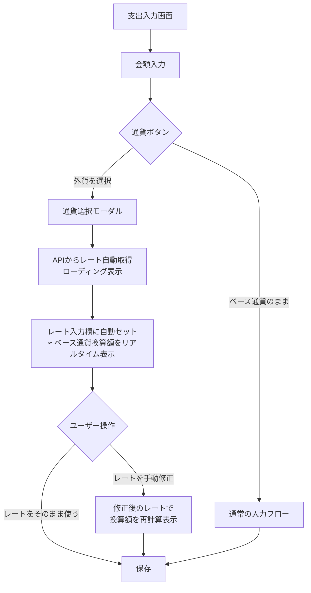
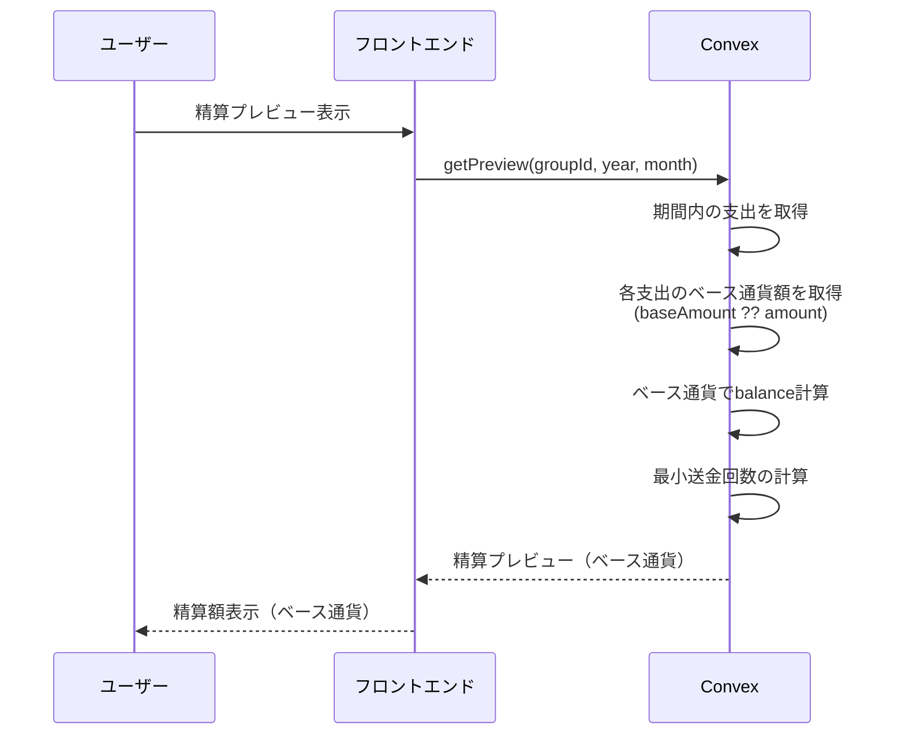
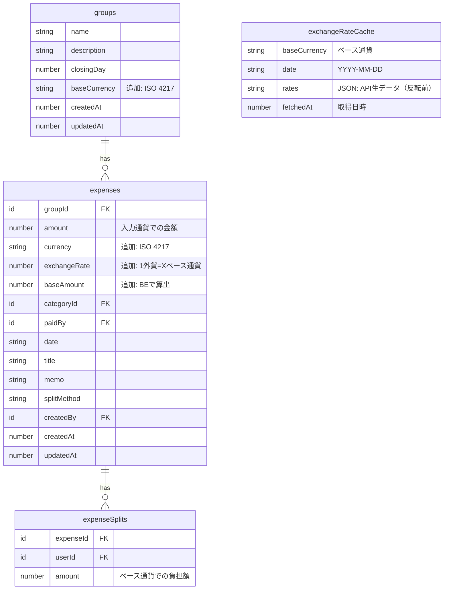
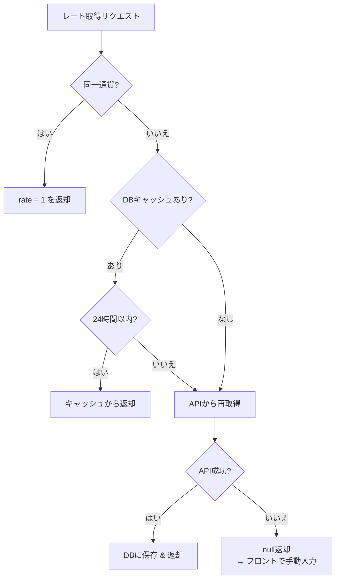

# 外貨対応 設計ドキュメント

## Overview

Pairboの支出記録において、日本円（JPY）以外の通貨（USD、EUR、THBなど）での支出を記録・管理できるようにする。旅行中の海外支出や、海外在住カップルの日常的な多通貨利用に対応する。

為替レートは **Frankfurter API（ECB公式データ）** から自動取得し、ユーザーの入力負担を最小限にする。

## Purpose

### なぜ必要か

- **旅行時の利用**: 海外旅行中に現地通貨で支払った費用を記録したい
- **海外在住ユーザー**: 日本円以外を主通貨とするカップルへの対応
- **複数通貨の混在**: 同じグループ内で複数通貨の支出が発生するケース（例: 日本在住で海外旅行時）

### 代替案の検討

| 方法                                  | メリット               | デメリット               |
| ------------------------------------- | ---------------------- | ------------------------ |
| **A. ユーザーが手動で円換算して入力** | 実装不要               | UXが悪い、正確性に欠ける |
| **B. メモ欄に通貨情報を記載**         | 実装不要               | 精算計算に反映されない   |
| **C. 外貨対応（本設計）**             | 正確な記録・精算が可能 | 実装コストあり           |

→ 家計簿アプリとしての正確性とUXを考慮し、**C. 外貨対応**を採用する。

### 為替レート取得方法の検討

| 方法                                      | メリット           | デメリット                           |
| ----------------------------------------- | ------------------ | ------------------------------------ |
| **A. 完全手動入力**                       | 外部依存なし       | UXが悪い、誤入力リスク               |
| **B. API自動取得 + 手動修正可能（採用）** | UX良好、正確、柔軟 | 外部API依存                          |
| **C. API自動取得のみ（修正不可）**        | シンプル           | 実際のレートと乖離する場合に対応不可 |

→ **B案**を採用。APIで参考レートを自動取得しつつ、ユーザーが実際のレートに修正可能にする。

## What to Do

### 機能要件

#### 1. グループのベース通貨設定

- グループ作成時にベース通貨（デフォルト: JPY）を設定できる
- ベース通貨は後から変更可能
- 精算はベース通貨で行う

#### 2. 支出の通貨指定

- 支出記録時にベース通貨以外の通貨を選択できる
- 外貨を選択すると、**為替レートが自動取得されて入力欄にセットされる**
- ユーザーはレートを手動で修正することも可能（実際のカード決済レート等に合わせるため）

#### 3. 為替レート自動取得

- **Frankfurter API**（ECBデータ）から日次レートを取得
- レートはConvex DBにキャッシュし、同日の再リクエストを回避
- APIが利用不可の場合は手動入力にフォールバック

#### 4. 精算時の通貨統一

- すべての支出をベース通貨に換算して精算額を計算する
- 精算プレビューではベース通貨で表示する
- 元の通貨・金額も参照可能

#### 5. 表示

- 支出一覧で通貨記号を表示（例: ¥1,200、$15.00、€20.00）
- 外貨支出の場合、ベース通貨換算額も併記
- 分析画面ではベース通貨に統一して集計

### 非機能要件

- 小数点対応: 通貨によって小数点以下の桁数が異なる（JPY: 0桁、USD: 2桁）
- パフォーマンス: 換算処理による遅延を感じさせない
- データ整合性: 換算レートは支出記録時に確定し、後から変動しない
- 可用性: 為替レートAPIがダウンしても支出記録は可能（手動入力フォールバック）

## How to Do It

### データモデルの変更

#### groupsテーブル

```typescript
groups: defineTable({
  name: v.string(),
  description: v.optional(v.string()),
  closingDay: v.number(),
  baseCurrency: v.string(), // 追加: "JPY", "USD", "EUR" etc.（ISO 4217）
  createdAt: v.number(),
  updatedAt: v.number(),
}),
```

#### expensesテーブル

```typescript
expenses: defineTable({
  groupId: v.id("groups"),
  amount: v.number(),           // 入力通貨での金額
  currency: v.string(),         // 追加: 入力通貨コード（ISO 4217）
  exchangeRate: v.optional(v.number()), // 追加: 1外貨 = X ベース通貨（例: 1 USD = 149.50 JPY なら 149.50）
  baseAmount: v.optional(v.number()),   // 追加: ベース通貨換算額（バックエンドで算出）
  categoryId: v.id("categories"),
  paidBy: v.id("users"),
  date: v.string(),
  title: v.optional(v.string()),
  memo: v.optional(v.string()),
  splitMethod: splitMethodValidator,
  createdBy: v.id("users"),
  createdAt: v.number(),
  updatedAt: v.number(),
}).index("by_group_and_date", ["groupId", "date"]),
```

#### expenseSplitsテーブル

```typescript
expenseSplits: defineTable({
  expenseId: v.id("expenses"),
  userId: v.id("users"),
  amount: v.number(),           // ベース通貨での負担額
}).index("by_expense", ["expenseId"]),
```

> **設計判断**: `expenseSplits.amount` は常にベース通貨で保存する。これにより精算計算がシンプルになる。

#### exchangeRateCacheテーブル（新規）

為替レートのキャッシュ用テーブル。APIへの不要なリクエストを回避する。

```typescript
exchangeRateCache: defineTable({
  baseCurrency: v.string(),    // ベース通貨コード（例: "JPY"）
  date: v.string(),            // レート日付（YYYY-MM-DD）
  rates: v.string(),           // JSON文字列（API生データ、反転前）: { "USD": 0.0067, "EUR": 0.0061, ... }
  fetchedAt: v.number(),       // 取得日時
}).index("by_base_and_date", ["baseCurrency", "date"]),
```

### 設計上の重要な決定事項

#### exchangeRate の方向（レートの意味）

`exchangeRate` は **「1 外貨 = X ベース通貨」** で保存する。

| 例                           | 意味               | exchangeRate |
| ---------------------------- | ------------------ | ------------ |
| ベース通貨 JPY, 支出通貨 USD | 1 USD = 149.50 JPY | `149.50`     |
| ベース通貨 JPY, 支出通貨 EUR | 1 EUR = 163.20 JPY | `163.20`     |
| ベース通貨 USD, 支出通貨 JPY | 1 JPY = 0.0067 USD | `0.0067`     |

この方向にする理由:

- `baseAmount = amount × exchangeRate` の計算が直感的
- UIの「1 USD = 149.50 JPY」表示とデータの値が一致する

**Frankfurter API との方向変換**: APIは `from=baseCurrency` で呼び出すため、返却値は逆方向（1ベース通貨 = X外貨）。取得時に `1 / apiRate` で反転してからキャッシュ or 返却する。

```
API: from=JPY → { "USD": 0.0067 }（1 JPY = 0.0067 USD）
反転: 1 / 0.0067 = 149.25
保存: exchangeRate = 149.25（1 USD = 149.25 JPY）
```

#### baseAmount の計算主体

`baseAmount` は **バックエンドの mutation（create/update）内で算出**する。フロントエンドからは `amount` と `exchangeRate` のみ送信し、`baseAmount` は受け取らない。

- **理由**: 計算の信頼できる単一拠点（Single Source of Truth）を確保するため
- **フロントエンド**: プレビュー用に `amount × exchangeRate` を表示するが、あくまで参考値
- **バックエンド**: `baseAmount = amount × exchangeRate` を算出し、ベース通貨の最小単位で丸めて保存

#### レート取得タイミング

レートは**常に最新（latest）を取得**し、支出日に連動した過去レートの自動取得は行わない。

- **理由**: 大半の支出は当日〜直近に記録される。過去日付のレート取得は土日祝のハンドリングが複雑になる割にメリットが小さい
- **ユーザー操作**: 過去の支出を入力する場合、自動セットされた最新レートを手動で修正できる（カード明細のレートを転記するなど）
- **将来拡張**: 過去日付レートの自動取得は将来の拡張候補として残す

#### 支出編集時のレート扱い

| 変更内容               | レートの挙動                                         |
| ---------------------- | ---------------------------------------------------- |
| 金額のみ変更           | レート据え置き → `baseAmount` をバックエンドで再計算 |
| 通貨を変更             | レートをリセット → 新しい通貨のレートを自動取得      |
| 通貨をベース通貨に戻す | `exchangeRate`・`baseAmount` を `undefined` に       |
| 日付を変更             | レート据え置き（過去レート自動取得はしない）         |
| レートを手動修正       | 修正値で `baseAmount` をバックエンドで再計算         |

#### exchangeRate の精度

- **保存**: APIから取得した値をそのまま保持（float64 の全精度）。丸めない
- **表示**: 通貨ペアに応じて適切な桁数で表示
  - レートが1以上の場合: 小数点以下2桁（例: `149.50`）
  - レートが1未満の場合: 有効数字4桁（例: `0.006711`）
- **baseAmount の丸め**: ベース通貨の `decimalDigits` に従って丸める（JPY: 整数、USD: 小数2桁）

### 為替レートAPI

#### Frankfurter API を採用

| 項目             | 詳細                          |
| ---------------- | ----------------------------- |
| **URL**          | `https://api.frankfurter.dev` |
| **データソース** | 欧州中央銀行（ECB）公式データ |
| **料金**         | 完全無料・レート制限なし      |
| **APIキー**      | 不要                          |
| **更新頻度**     | 毎営業日 16:00 CET            |
| **対応通貨**     | 30+（必要な通貨すべてカバー） |
| **信頼性**       | 10年以上の稼働実績            |

#### API比較（選定理由）

| API                 | 無料枠     | APIキー  | 信頼性    | 選定     |
| ------------------- | ---------- | -------- | --------- | -------- |
| **Frankfurter**     | **無制限** | **不要** | 高（ECB） | **採用** |
| ExchangeRate-API    | 1,500回/月 | 要       | 高        | -        |
| Open Exchange Rates | 1,000回/月 | 要       | 高        | -        |
| Fixer.io            | 100回/月   | 要       | 中        | -        |

→ APIキー管理不要・無制限・高信頼の **Frankfurter** が最適。

### 為替レート取得アーキテクチャ



### 為替レート取得の実装

```typescript
// convex/exchangeRates.ts

import { action, internalQuery, internalMutation } from "./_generated/server";
import { v } from "convex/values";
import { internal } from "./_generated/api";

const FRANKFURTER_API = "https://api.frankfurter.dev";

// キャッシュの有効期限（24時間）
const CACHE_TTL_MS = 24 * 60 * 60 * 1000;

/** 為替レートを取得する（キャッシュ優先） */
export const getRate = action({
  args: {
    baseCurrency: v.string(),
    targetCurrency: v.string(),
    date: v.optional(v.string()), // YYYY-MM-DD、省略時は最新
  },
  handler: async (
    ctx,
    args,
  ): Promise<{ rate: number; date: string } | null> => {
    const dateStr = args.date ?? new Date().toISOString().split("T")[0];

    // 同一通貨の場合
    if (args.baseCurrency === args.targetCurrency) {
      return { rate: 1, date: dateStr };
    }

    // キャッシュを確認
    const cached = await ctx.runQuery(internal.exchangeRates.getCachedRate, {
      baseCurrency: args.baseCurrency,
      date: dateStr,
    });

    if (cached) {
      const rates = JSON.parse(cached.rates) as Record<string, number>;
      const apiRate = rates[args.targetCurrency];
      // APIレートは「1ベース通貨=X外貨」なので反転して「1外貨=Xベース通貨」にする
      if (apiRate) return { rate: 1 / apiRate, date: cached.date };
    }

    // APIから取得（latestを使用。dateパラメータは将来の拡張用）
    try {
      const url = `${FRANKFURTER_API}/latest?from=${args.baseCurrency}`;
      const response = await fetch(url);

      if (!response.ok) return null;

      const data = (await response.json()) as {
        base: string;
        date: string;
        rates: Record<string, number>;
      };

      // キャッシュに保存（APIの生データをそのまま保存）
      await ctx.runMutation(internal.exchangeRates.saveCache, {
        baseCurrency: args.baseCurrency,
        date: data.date,
        rates: JSON.stringify(data.rates),
      });

      const apiRate = data.rates[args.targetCurrency];
      // 反転: 「1ベース通貨=X外貨」→「1外貨=Xベース通貨」
      return apiRate ? { rate: 1 / apiRate, date: data.date } : null;
    } catch {
      return null; // API失敗時はnull → フロントで手動入力にフォールバック
    }
  },
});

/** キャッシュからレートを取得（internal query） */
export const getCachedRate = internalQuery({
  args: {
    baseCurrency: v.string(),
    date: v.string(),
  },
  handler: async (ctx, args) => {
    const cached = await ctx.db
      .query("exchangeRateCache")
      .withIndex("by_base_and_date", (q) =>
        q.eq("baseCurrency", args.baseCurrency).eq("date", args.date),
      )
      .unique();

    if (!cached) return null;

    // TTLチェック
    if (Date.now() - cached.fetchedAt > CACHE_TTL_MS) return null;

    return cached;
  },
});

/** キャッシュにレートを保存（internal mutation） */
export const saveCache = internalMutation({
  args: {
    baseCurrency: v.string(),
    date: v.string(),
    rates: v.string(),
  },
  handler: async (ctx, args) => {
    // 既存キャッシュがあれば更新
    const existing = await ctx.db
      .query("exchangeRateCache")
      .withIndex("by_base_and_date", (q) =>
        q.eq("baseCurrency", args.baseCurrency).eq("date", args.date),
      )
      .unique();

    if (existing) {
      await ctx.db.patch(existing._id, {
        rates: args.rates,
        fetchedAt: Date.now(),
      });
    } else {
      await ctx.db.insert("exchangeRateCache", {
        baseCurrency: args.baseCurrency,
        date: args.date,
        rates: args.rates,
        fetchedAt: Date.now(),
      });
    }
  },
});
```

### 通貨マスター

対応通貨は定数として定義する（DB管理ではなくコード管理）。

```typescript
// convex/lib/currencies.ts

export type CurrencyCode = string; // ISO 4217

export interface CurrencyInfo {
  code: CurrencyCode;
  symbol: string;
  name: string; // 日本語名
  decimalDigits: number;
}

export const CURRENCIES: CurrencyInfo[] = [
  { code: "JPY", symbol: "¥", name: "日本円", decimalDigits: 0 },
  { code: "USD", symbol: "$", name: "米ドル", decimalDigits: 2 },
  { code: "EUR", symbol: "€", name: "ユーロ", decimalDigits: 2 },
  { code: "GBP", symbol: "£", name: "英ポンド", decimalDigits: 2 },
  { code: "KRW", symbol: "₩", name: "韓国ウォン", decimalDigits: 0 },
  { code: "TWD", symbol: "NT$", name: "台湾ドル", decimalDigits: 0 },
  { code: "THB", symbol: "฿", name: "タイバーツ", decimalDigits: 2 },
  { code: "CNY", symbol: "¥", name: "中国元", decimalDigits: 2 },
  { code: "AUD", symbol: "A$", name: "豪ドル", decimalDigits: 2 },
  { code: "SGD", symbol: "S$", name: "シンガポールドル", decimalDigits: 2 },
];

export function getCurrency(code: CurrencyCode): CurrencyInfo | undefined {
  return CURRENCIES.find((c) => c.code === code);
}

export function formatCurrency(
  amount: number,
  currencyCode: CurrencyCode,
): string {
  const currency = getCurrency(currencyCode);
  if (!currency) return `${amount}`;

  return new Intl.NumberFormat("ja-JP", {
    style: "currency",
    currency: currencyCode,
    minimumFractionDigits: currency.decimalDigits,
    maximumFractionDigits: currency.decimalDigits,
  }).format(amount);
}
```

### 換算ロジック



- ベース通貨の場合: `exchangeRate`・`baseAmount` は `undefined`（省スペース）
- 外貨の場合: フロントからは `amount`・`currency`・`exchangeRate` のみ送信。`baseAmount` はバックエンドで算出
- 精算・分析ではベース通貨（`baseAmount` or `amount`）を使用

### 支出入力UIフロー



### 支出入力UIイメージ

```
┌─────────────────────────────────┐
│ 金額                             │
│ ┌───────────┐ ┌─────┐          │
│ │   15.00   │ │ USD ▼│          │
│ └───────────┘ └─────┘          │
│                                  │
│ 換算レート（ECBレート自動取得）      │
│ ┌──────────────────────┐        │
│ │ 1 USD = 149.50 JPY   │ ← 編集可│
│ └──────────────────────┘        │
│                                  │
│ ≈ ¥2,243（ベース通貨換算額）       │
│                                  │
│ ※ ECBの参考レートです。            │
│   実際の決済レートに合わせて        │
│   修正できます。                   │
└─────────────────────────────────┘
```

### 精算フロー



### 主要な変更箇所

#### バックエンド（Convex）

| ファイル                   | 変更内容                                                                                                  |
| -------------------------- | --------------------------------------------------------------------------------------------------------- |
| `convex/schema.ts`         | `groups.baseCurrency`、`expenses.currency`・`exchangeRate`・`baseAmount`、`exchangeRateCache`テーブル追加 |
| `convex/exchangeRates.ts`  | **新規**: 為替レート取得action、キャッシュquery/mutation                                                  |
| `convex/lib/currencies.ts` | **新規**: 通貨マスター、フォーマット関数                                                                  |
| `convex/lib/validators.ts` | `currencyCodeValidator` 追加                                                                              |
| `convex/expenses.ts`       | `create`・`update` に通貨・換算レート処理追加                                                             |
| `convex/expenses.ts`       | `calculateSplits` でベース通貨額を使用                                                                    |
| `convex/settlements.ts`    | `getPreview` でベース通貨集計                                                                             |
| `convex/groups.ts`         | `create`・`update` に `baseCurrency` 追加                                                                 |
| `convex/seed.ts`           | シードデータに通貨情報追加                                                                                |

#### フロントエンド

| ファイル         | 変更内容                                                         |
| ---------------- | ---------------------------------------------------------------- |
| 支出入力フォーム | 通貨選択UI、レート自動取得・表示、手動修正、リアルタイム換算表示 |
| 支出一覧         | 通貨記号の表示、外貨時の換算額併記                               |
| 精算画面         | ベース通貨での表示（変更は軽微）                                 |
| 分析画面         | ベース通貨での集計（変更は軽微）                                 |
| グループ設定     | ベース通貨の設定UI                                               |

### ER図（変更箇所）



### キャッシュ戦略



- **1リクエストで全通貨取得**: `from=JPY` でリクエストすると全対応通貨のレートが返る → 通貨切り替え時の再リクエスト不要
- **キャッシュ粒度**: `baseCurrency + date` 単位。同じベース通貨・同じ日付なら1レコードですべての通貨ペアをカバー
- **TTL**: 24時間（ECBは毎営業日1回更新のため十分）

### マイグレーション

既存データへの影響を最小限にするため、新フィールドはすべてoptionalまたはデフォルト値付きで追加する。

1. `groups.baseCurrency`: 既存グループには `"JPY"` をデフォルト設定するマイグレーション実行
2. `expenses.currency`: 既存支出には `"JPY"` をデフォルト設定するマイグレーション実行
3. `expenses.exchangeRate`・`expenses.baseAmount`: optional のため既存データに影響なし
4. `exchangeRateCache`: 新規テーブルのため影響なし

```typescript
// マイグレーション例
export const migrateGroupsCurrency = internalMutation({
  handler: async (ctx) => {
    const groups = await ctx.db.query("groups").collect();
    for (const group of groups) {
      if (!group.baseCurrency) {
        await ctx.db.patch(group._id, { baseCurrency: "JPY" });
      }
    }
  },
});

export const migrateExpensesCurrency = internalMutation({
  handler: async (ctx) => {
    const expenses = await ctx.db.query("expenses").collect();
    for (const expense of expenses) {
      if (!expense.currency) {
        await ctx.db.patch(expense._id, { currency: "JPY" });
      }
    }
  },
});
```

### ベース通貨額の取得ヘルパー

精算・分析で頻出するため、ヘルパー関数を用意する。

```typescript
// convex/lib/currencyHelpers.ts

/** 支出のベース通貨額を取得する */
export function getBaseAmount(expense: {
  amount: number;
  baseAmount?: number;
}): number {
  return expense.baseAmount ?? expense.amount;
}
```

## What We Won't Do

### 今回対応しない項目

| 項目                                | 理由                                                       |
| ----------------------------------- | ---------------------------------------------------------- |
| **通貨別の分析グラフ**              | まずはベース通貨統一の集計のみ                             |
| **精算通貨の選択**                  | 精算はベース通貨固定。複数通貨での精算は複雑すぎる         |
| **通貨間の直接換算**                | すべてベース通貨を経由する（USD→EUR ではなく USD→JPY→EUR） |
| **対応通貨のユーザー追加**          | 定数リストで管理。要望があれば追加                         |
| **expenseSplitsの外貨保存**         | ベース通貨のみで保存し、精算をシンプルに保つ               |
| **Frankfurterのセルフホスティング** | 公式APIで十分。トラフィックが増えた場合に検討              |

### 将来の拡張候補

- よく使う通貨の記憶・クイック選択
- 通貨別の支出分析
- 過去日付の為替レート自動取得（支出日に基づくレート取得）
- レート取得元の切り替え（Frankfurter以外のAPI対応）

## Concerns

### 1. Frankfurter API の可用性

- **懸念**: 外部APIがダウンした場合、レートが取得できない
- **対策**: APIがnullを返した場合は手動入力にフォールバック。UIで「レートを取得できませんでした。手動で入力してください」と表示
- **緩和策**: DBキャッシュにより、同日中は再リクエスト不要。直近のキャッシュがあれば前日レートを参考値として表示することも可能

### 2. ECBレートと実際のレートの乖離

- **懸念**: ECBの参考レートはクレジットカード決済レートや両替所レートと異なる
- **対策**: UIで「ECBの参考レートです。実際の決済レートに合わせて修正できます」と明記。レート入力欄は常に編集可能
- **補足**: 家計簿としては概算で十分。厳密な換算が必要なケースではユーザーが修正できる

### 3. 小数点の丸め誤差

- **懸念**: 換算時の丸めにより、分割額の合計がベース通貨額と一致しない可能性
- **対策**: 既存の `calculateSplits` と同様に、端数は特定メンバー（支払者）に寄せる
- **方針**: ベース通貨の最小単位で丸める（JPY: 1円、USD: 0.01ドル）

### 4. グループのベース通貨変更

- **懸念**: ベース通貨を変更した場合、過去の支出の換算額との整合性が取れなくなる
- **決定**: **C案 — 変更は許可するが、過去のデータはそのまま**（変更以降の新規支出のみ影響）。過去の支出は記録時のレートで確定しているため、再計算は不要。UIで「ベース通貨変更は今後の支出にのみ影響します」と注意表示する

### 5. 通貨記号の重複

- **懸念**: JPY と CNY がともに「¥」を使用する
- **対策**: 通貨コード（JPY、CNY）を併記するか、表示時に区別できるようにする

### 6. 既存テストへの影響

- **懸念**: `currency` フィールド追加により既存のテストが壊れる可能性
- **対策**: マイグレーション後にテスト実行。フィールドをoptionalにすることで影響を最小化

### 7. Premium機能とするか

- **決定**: **Freeプラン（全ユーザー）に開放**。基本的な家計簿機能として、通貨対応は制限しない

### 8. exchangeRateCacheの肥大化

- **懸念**: キャッシュデータが際限なく増える
- **対策**: 定期的に古いキャッシュを削除するcron（例: 30日以上前のレコードを削除）。もしくはTTLチェック時に古いレコードを遅延削除

## Reference Materials/Information

- [Frankfurter API ドキュメント](https://frankfurter.dev/)
- [ISO 4217 通貨コード一覧](https://www.iso.org/iso-4217-currency-codes.html)
- [Intl.NumberFormat - MDN](https://developer.mozilla.org/ja/docs/Web/JavaScript/Reference/Global_Objects/Intl/NumberFormat)
- [Convex Actions（HTTP呼び出し）](https://docs.convex.dev/functions/actions)
- [Convex Schema Migration](https://docs.convex.dev/database/migrations)
- 既存設計ドキュメント:
  - `docs/design-domain-model.md` - ドメインモデル設計
  - `docs/design-split-methods.md` - 分割方法の設計
  - `docs/design-settlement-feature.md` - 精算機能の設計
