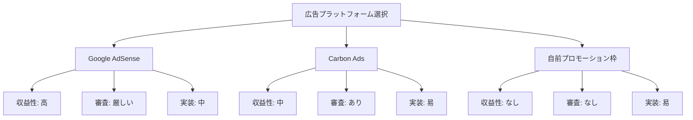
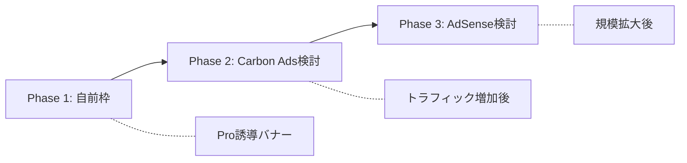
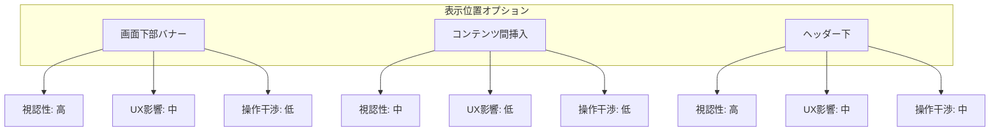
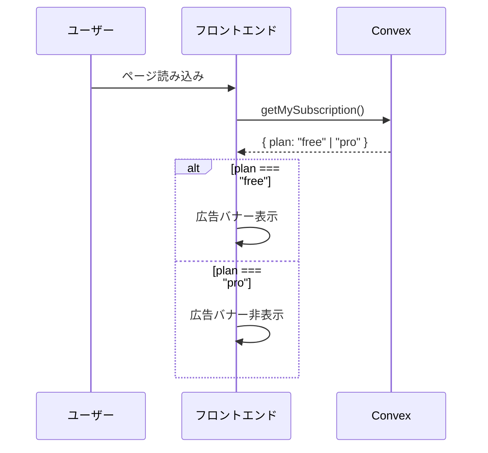

# 設計書: Free向け広告表示機能

## Overview

Oaikoの無料プラン（Free）ユーザーに対して広告を表示し、Proプランとの差別化を図る機能。
広告非表示はProプランの特典となる。

## Purpose

### 背景

現在のFree/Pro差別化ポイント:

| 機能               | Free | Pro |
| ------------------ | ---- | --- |
| 基本機能           | ○    | ○   |
| 詳細分析           | -    | ○   |
| データエクスポート | -    | ○   |
| **広告非表示**     | -    | ○   |

グループ数・メンバー数制限は同棲カップル向けアプリのため廃止済み。
広告表示は、Proプランへのアップグレード動機となる重要な差別化要素。

### 目的

1. **収益源の多角化**: サブスク収益に加え、広告収益を確保
2. **Pro差別化**: 広告非表示がProの明確なメリットに
3. **持続可能性**: 無料ユーザーからも最低限の収益を得る

### 代替案

| アプローチ           | メリット            | デメリット         |
| -------------------- | ------------------- | ------------------ |
| 広告表示             | 追加収益、Pro差別化 | UX低下、実装コスト |
| 機能制限のみ         | UX維持              | 差別化が弱い       |
| 広告なし（現状維持） | 開発不要            | 収益機会の損失     |

## What to Do

### 機能要件

1. **広告表示（Freeユーザーのみ）**
   - ログイン済みFreeユーザーに広告を表示
   - Proユーザーには広告を表示しない
   - 未ログインユーザーにも広告を表示（アプリ利用促進のため）

2. **広告非表示（Proユーザー）**
   - Proプランユーザーは広告が一切表示されない
   - プラン変更時に即座に反映

3. **Proへの誘導**
   - 広告近くに「広告非表示にする」リンクを配置
   - 料金ページへ誘導

### 非機能要件

1. **パフォーマンス**: 広告読み込みによる初期表示の遅延を最小化
2. **UX**: 操作の邪魔にならない配置
3. **プライバシー**: 過度なトラッキングを避ける
4. **アクセシビリティ**: スクリーンリーダー対応

## How to Do It

### 広告プラットフォームの比較



#### 1. Google AdSense

| 項目         | 評価                                   |
| ------------ | -------------------------------------- |
| 収益性       | ◎ 最も高い（CPM/CPC）                  |
| 審査         | △ 厳格（コンテンツ・トラフィック要件） |
| 実装難度     | ○ 公式ドキュメント充実                 |
| 広告品質     | ○ Googleのフィルタリング               |
| プライバシー | △ Cookie使用、GDPR対応必要             |

**必要なトラフィック**: 月間1,000PV以上が目安
**審査期間**: 数日〜数週間

#### 2. Carbon Ads

| 項目         | 評価                     |
| ------------ | ------------------------ |
| 収益性       | ○ 開発者向けサイトに適正 |
| 審査         | ○ 比較的通りやすい       |
| 実装難度     | ◎ スクリプト1行          |
| 広告品質     | ◎ 開発者向け広告のみ     |
| プライバシー | ◎ 最小限のトラッキング   |

**特徴**: デザインがシンプルでUXへの影響が小さい

#### 3. 自前プロモーション枠（推奨：MVP）

| 項目         | 評価               |
| ------------ | ------------------ |
| 収益性       | × 直接収益なし     |
| 審査         | ◎ 不要             |
| 実装難度     | ◎ 最も簡単         |
| 広告品質     | ◎ 完全コントロール |
| プライバシー | ◎ 外部サービス不要 |

**用途**:

- Proプランへの誘導バナー
- 自分の他サービス宣伝
- 将来的な外部広告への移行準備

### 推奨: 段階的アプローチ



**Phase 1（今回実装）**: 自前プロモーション枠

- Proプランへの誘導バナーを表示
- 外部サービス依存なし
- 将来の広告枠として活用可能

### 表示位置の比較



#### オプション1: 画面下部固定バナー（推奨）

```
┌─────────────────────────┐
│ ヘッダー                │
├─────────────────────────┤
│                         │
│    メインコンテンツ     │
│                         │
├─────────────────────────┤
│ 広告バナー | Pro →      │  ← 高さ50-60px
└─────────────────────────┘
```

**メリット**:

- 常に表示されるため視認性が高い
- コンテンツの操作を妨げない
- モバイルアプリでの標準的なパターン

**デメリット**:

- 画面の有効領域が狭くなる
- スクロール時も追従するとうるさい

#### オプション2: コンテンツ間挿入

```
┌─────────────────────────┐
│ グループカード1         │
├─────────────────────────┤
│ 広告バナー              │  ← リスト間に挿入
├─────────────────────────┤
│ グループカード2         │
└─────────────────────────┘
```

**メリット**:

- 自然な見た目
- スクロール時に流れる

**デメリット**:

- リストが短いと表示されない
- 実装がやや複雑

#### オプション3: 特定ページのみ表示

```
分析ページ・設定ページなど
操作頻度の低いページに限定
```

**メリット**:

- 主要操作への影響ゼロ
- UX最優先

**デメリット**:

- 視認性が低い
- 広告効果が薄い

### 推奨: オプション1（画面下部固定）

理由:

1. 実装がシンプル
2. 視認性とUXのバランスが良い
3. Proへの誘導効果が高い

### アーキテクチャ



### コンポーネント設計

```
components/
└── ads/
    ├── index.ts
    ├── AdBanner.tsx        # 広告バナーコンポーネント
    └── ProPromoBanner.tsx  # Pro誘導バナー（Phase 1）
```

#### AdBanner.tsx（ラッパー）

```typescript
// 概念的なコード
function AdBanner() {
  const subscription = useQuery(api.subscriptions.getMySubscription);

  // Proユーザーには表示しない
  if (subscription?.plan === "pro") {
    return null;
  }

  // Freeユーザーまたは未ログイン
  return <ProPromoBanner />;
}
```

#### ProPromoBanner.tsx（Phase 1）

```typescript
// 概念的なコード
function ProPromoBanner() {
  return (
    <div className="fixed bottom-0 left-0 right-0 h-14 bg-slate-100 border-t">
      <div className="flex items-center justify-between px-4 h-full">
        <span>広告なしでもっと快適に</span>
        <Link href="/pricing">Proプランを見る →</Link>
      </div>
    </div>
  );
}
```

### レイアウト調整

広告バナー分のパディングをメインコンテンツに追加:

```typescript
// app/layout.tsx または各ページ
<main className="pb-16"> {/* 広告バナーの高さ分 */}
  {children}
</main>
<AdBanner />
```

### データフロー

```mermaid
flowchart TD
    A[ページ読み込み] --> B{認証状態}
    B -->|未認証| C[広告表示]
    B -->|認証済み| D[サブスク確認]
    D --> E{plan}
    E -->|free| C
    E -->|pro| F[広告非表示]
    C --> G[ProPromoBanner]
    G --> H[クリック]
    H --> I[/pricing ページ]
```

### 変更対象ファイル

| ファイル                            | 変更内容           | 規模 |
| ----------------------------------- | ------------------ | ---- |
| `components/ads/AdBanner.tsx`       | 新規作成           | 小   |
| `components/ads/ProPromoBanner.tsx` | 新規作成           | 小   |
| `components/ads/index.ts`           | 新規作成           | 極小 |
| `app/layout.tsx`                    | AdBanner追加       | 小   |
| `app/globals.css`                   | 広告用スタイル追加 | 極小 |

### 将来の拡張（Phase 2以降）

```typescript
// 将来的に外部広告に切り替える場合
function AdBanner() {
  const subscription = useQuery(api.subscriptions.getMySubscription);

  if (subscription?.plan === "pro") {
    return null;
  }

  // 環境変数で切り替え
  if (process.env.NEXT_PUBLIC_AD_PROVIDER === "carbon") {
    return <CarbonAd />;
  }

  return <ProPromoBanner />;
}
```

## What We Won't Do

### スコープ外

1. **外部広告サービスの統合（Phase 1）**
   - Google AdSense、Carbon Ads等は今回実装しない
   - まずは自前のPro誘導バナーで効果を検証

2. **広告のA/Bテスト**
   - バナーのデザイン・文言の最適化は後回し

3. **広告表示回数の分析**
   - 詳細なアナリティクスは実装しない

4. **Cookie同意バナー**
   - 自前バナーのみなら不要
   - 外部広告導入時に検討

5. **インタースティシャル広告**
   - 全画面広告はUXを著しく損なうため実装しない

## Concerns

### 未解決の懸念点

1. **広告ブロッカー対応**
   - 自前バナーでも広告ブロッカーに検知される可能性
   - クラス名に "ad" を含めないなどの対策が必要

2. **PWA時の表示**
   - ホーム画面追加時も広告が表示されるか確認必要
   - Service Worker キャッシュとの兼ね合い

3. **モバイル時のタップ領域**
   - 広告とFABボタンの位置が被らないよう調整が必要

4. **将来の外部広告への移行**
   - トラフィックがどの程度になったら外部広告を検討するか
   - 月間1,000 MAU程度を目安に検討

### 決定事項

| 項目             | 決定            | 理由                         |
| ---------------- | --------------- | ---------------------------- |
| プラットフォーム | 自前（Phase 1） | 実装シンプル、審査不要       |
| 表示位置         | 画面下部固定    | 視認性とUXのバランス         |
| バナー高さ       | 56px            | 標準的なモバイルバナーサイズ |

## Reference Materials/Information

### 広告プラットフォーム

- [Google AdSense](https://www.google.com/adsense/) - 最大手広告ネットワーク
- [Carbon Ads](https://www.carbonads.net/) - 開発者向け広告
- [EthicalAds](https://www.ethicalads.io/) - プライバシー重視の広告

### デザインパターン

- [Mobile Ad Banner Best Practices](https://support.google.com/admob/answer/6128877) - Googleのガイドライン
- [Tailwind CSS Fixed Footer](https://tailwindcss.com/docs/position#fixed-positioning)

### 競合調査

- Shareroo: 無料版に広告表示あり（バナー型）
- Splitwise: 無料版に広告表示あり（コンテンツ間挿入型）
