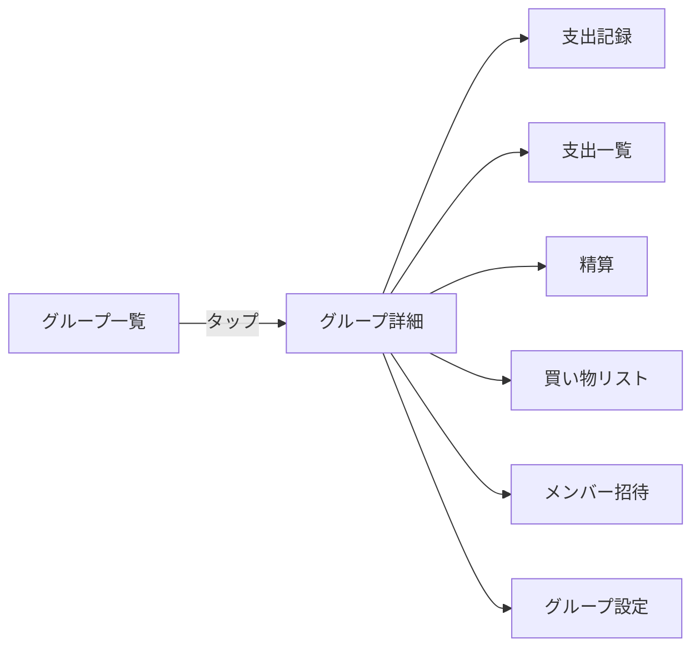
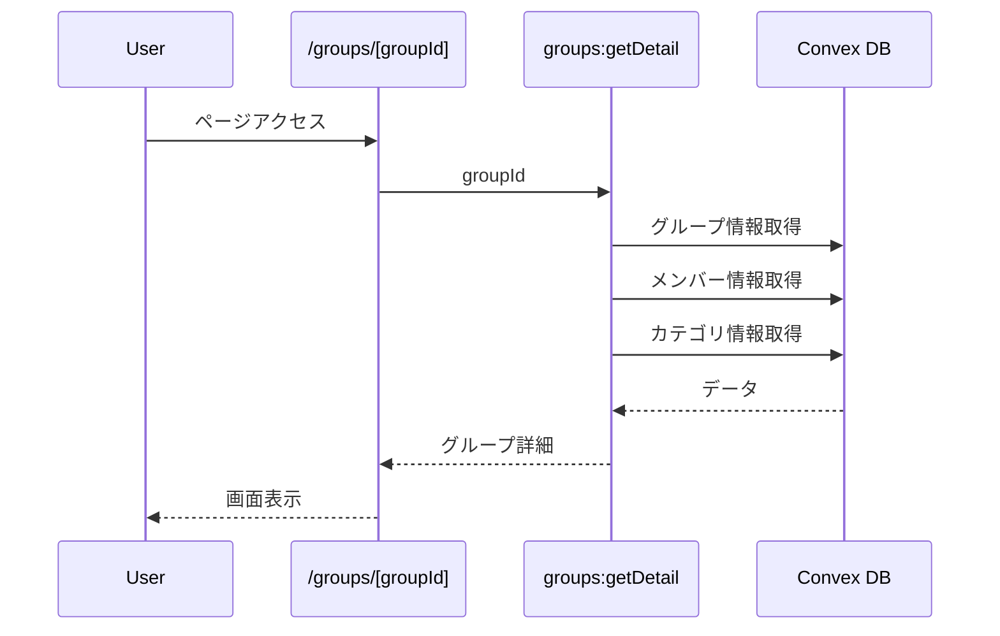
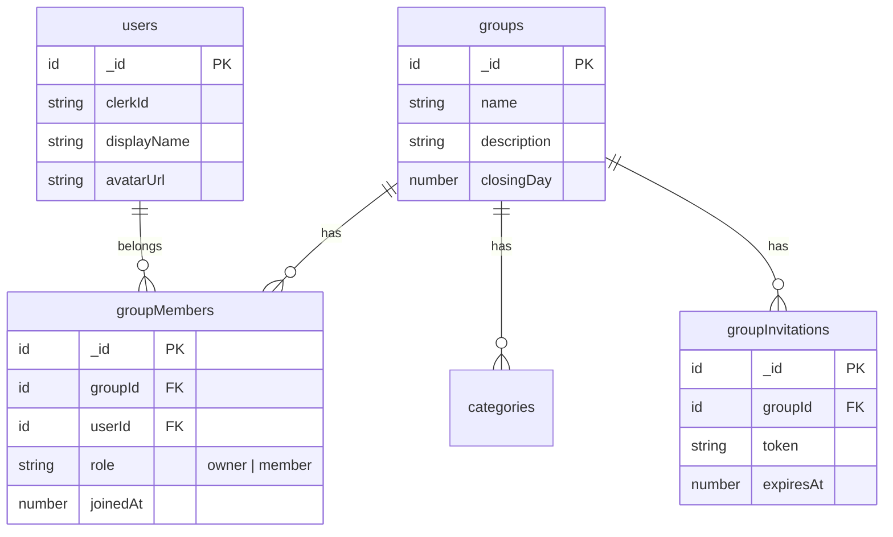
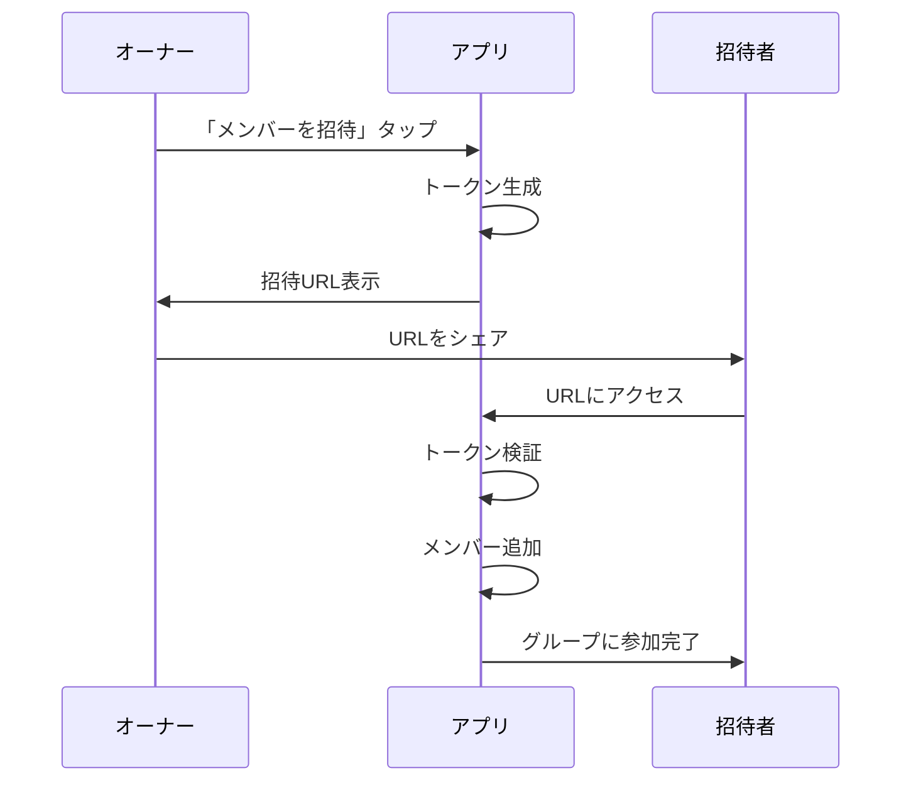

# グループ詳細画面 設計書

## Overview

グループをタップした後に表示される詳細画面。グループの情報確認、メンバー管理、および支出記録への導線を提供する。

## Purpose

### なぜ必要か

1. **グループ情報の確認**: グループ名、メンバー一覧、締め日などを確認できる場所が必要
2. **支出記録への導線**: 支出を記録するにはまずグループを選択する必要がある
3. **メンバー管理**: メンバーの招待・確認ができる場所が必要
4. **将来機能の土台**: 支出一覧、精算、買い物リストなどの機能はこの画面から遷移する

### 画面遷移



## What to Do

### 機能要件

#### 1. グループ情報表示

- グループ名
- メンバー一覧（アイコン、名前、役割）
- 締め日

#### 2. メンバー招待（今回のスコープ）

- 招待リンク生成
- リンクをコピー / シェア

#### 3. 支出記録への導線（今回のスコープ）

- 「支出を記録」ボタン（フローティング or 固定）
- タップで支出記録画面へ遷移（次フェーズで実装）

#### 4. 今後の機能への導線（プレースホルダー）

- 支出一覧タブ
- 精算タブ
- 買い物リストタブ

### 非機能要件

- モバイルファースト（スマホで使いやすいUI）
- ローディング状態の表示
- エラーハンドリング

## How to Do It

### 画面構成（ワイヤーフレーム）

```
┌─────────────────────────────────┐
│ ← グループ名                    │ ← ヘッダー
├─────────────────────────────────┤
│                                 │
│  📅 締め日: 25日               │
│                                 │
│  ──────────────────────────     │
│                                 │
│  メンバー (3人)                 │
│  ┌─────────────────────────┐   │
│  │ 👤 パートナーA (オーナー)│   │
│  │ 👤 パートナーB           │   │
│  │ 👤 自分                  │   │
│  └─────────────────────────┘   │
│                                 │
│  [+ メンバーを招待]             │
│                                 │
├─────────────────────────────────┤
│  [支出] [精算] [買い物]         │ ← タブ（将来）
├─────────────────────────────────┤
│                                 │
│     (支出一覧がここに表示)      │
│                                 │
│                                 │
└─────────────────────────────────┘
        [+ 支出を記録]             ← FAB
```

### URL設計

```
/groups/[groupId]          - グループ詳細
/groups/[groupId]/expenses - 支出一覧（将来）
/groups/[groupId]/settle   - 精算（将来）
/groups/[groupId]/shopping - 買い物リスト（将来）
```

### データフロー



### ER図（関連テーブル）



### ファイル構成

```
app/
└── groups/
    └── [groupId]/
        └── page.tsx           # グループ詳細ページ

components/
└── groups/
    ├── GroupDetail.tsx        # グループ詳細コンポーネント
    ├── MemberList.tsx         # メンバー一覧
    ├── MemberCard.tsx         # メンバーカード
    └── InviteDialog.tsx       # 招待ダイアログ

convex/
└── groups.ts                  # getDetail, createInvitation を追加
```

### Convex関数

#### groups:getDetail

```typescript
export const getDetail = authQuery({
  args: { groupId: v.id("groups") },
  handler: async (ctx, args) => {
    // 1. グループ情報取得
    // 2. メンバー一覧取得（ユーザー情報含む）
    // 3. 自分がメンバーかチェック（権限確認）
    // 4. カテゴリ一覧取得
    return {
      group: { ... },
      members: [ ... ],
      categories: [ ... ],
      myRole: "owner" | "member",
    };
  },
});
```

#### groups:createInvitation

```typescript
export const createInvitation = authMutation({
  args: { groupId: v.id("groups") },
  handler: async (ctx, args) => {
    // 1. 権限チェック（オーナーのみ）
    // 2. トークン生成
    // 3. 招待レコード作成（有効期限: 7日）
    return { token, expiresAt };
  },
});
```

### 招待フロー



### 招待URL形式

```
https://oaiko.vercel.app/invite/[token]
```

## What We Won't Do

### 今回のスコープ外

1. **支出記録画面**: 次フェーズで実装（ボタンのみ配置）
2. **支出一覧表示**: 次フェーズで実装（タブのみ配置）
3. **精算機能**: 後続フェーズ
4. **買い物リスト**: 後続フェーズ
5. **グループ設定編集**: 名前変更、締め日変更は後回し
6. **メンバー削除**: 後回し
7. **グループ削除**: 後回し
8. **招待の取り消し**: 後回し

### シードデータ更新

今回の実装でシードデータの更新は**不要**。

- グループ、メンバー、カテゴリは既に作成済み
- 招待データはテスト不要（UI操作で確認可能）

## Concerns

### 懸念事項と対策

| 懸念                   | 対策                                                |
| ---------------------- | --------------------------------------------------- |
| 招待トークンの安全性   | 十分な長さのランダム文字列（UUID v4）、有効期限設定 |
| 招待URLの共有方法      | Web Share API対応、フォールバックでコピーボタン     |
| メンバーが多い場合のUI | 最初は単純なリスト表示、必要に応じてスクロール      |
| 権限によるUI出し分け   | オーナーのみ招待ボタン表示、メンバーは閲覧のみ      |

### 未解決の疑問

1. **招待の有効期限**: 7日で良いか？
2. **招待できる人数制限**: MVPでは制限なしで良いか？

## Reference Materials/Information

- 既存実装: `convex/groups.ts` - グループ作成、一覧取得
- 既存実装: `components/groups/` - グループ関連コンポーネント
- スキーマ: `convex/schema.ts` - groupInvitations テーブル定義
- MVP仕様: `docs/mvp-features.md`
