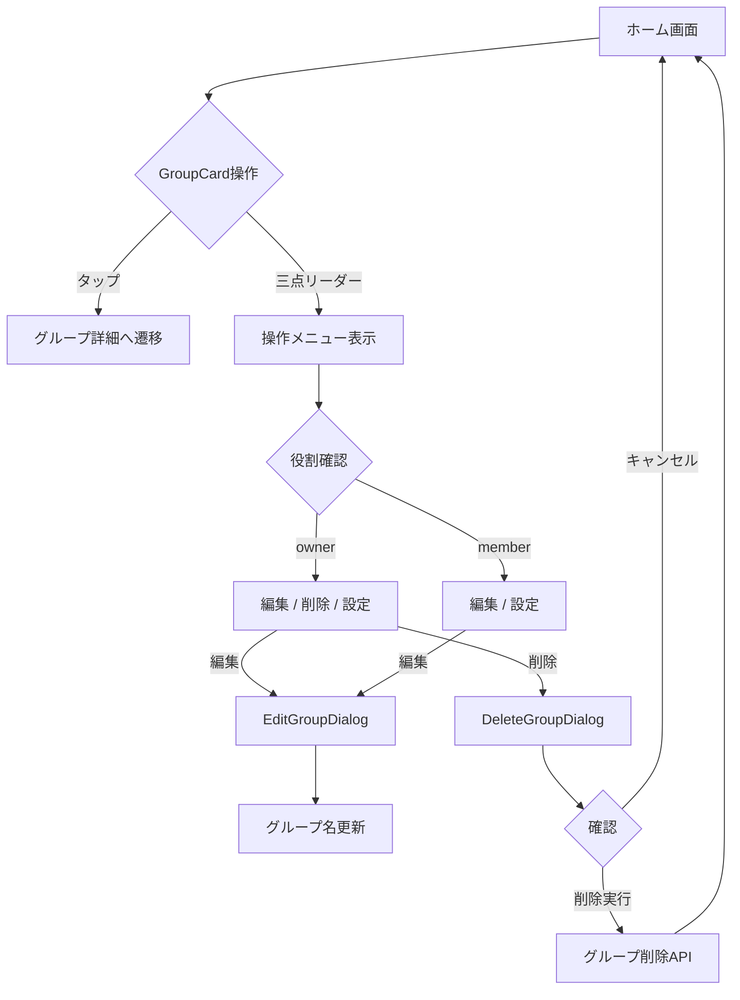
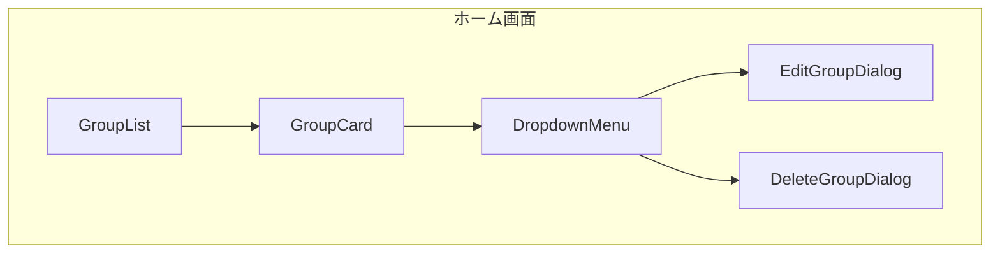
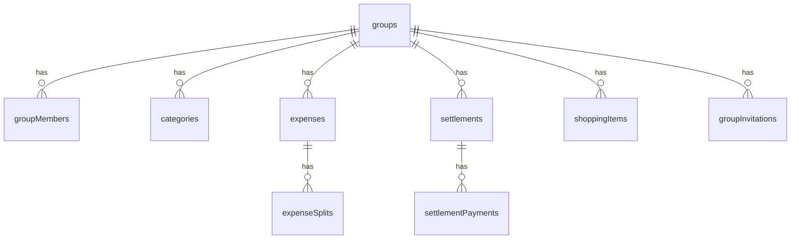
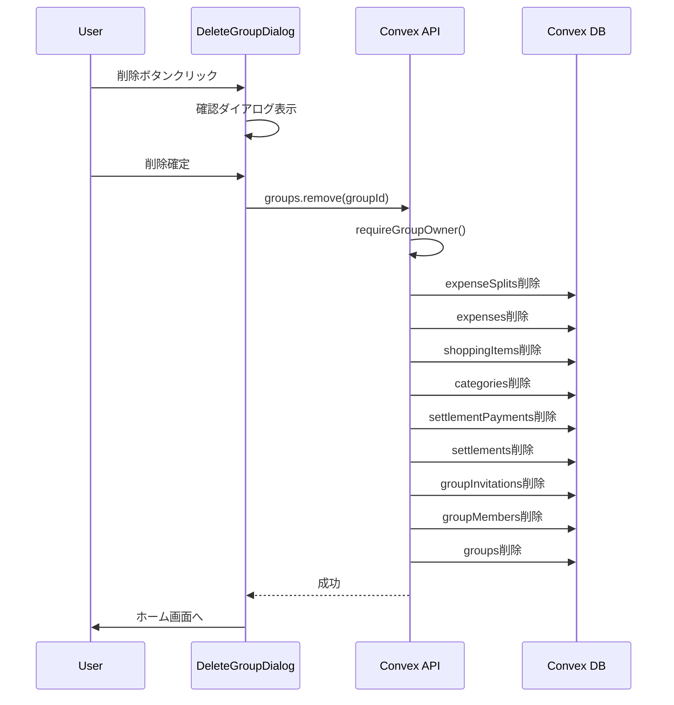

# グループ編集・削除機能 設計書

## Overview

ホーム画面からグループの編集・削除を可能にする機能を追加する。現状はグループ設定画面（`/groups/[groupId]/settings`）でのみ編集が可能だが、ホーム画面のGroupCardから直接アクセスできるようにすることで、操作性を向上させる。

## Purpose

### なぜ必要か

1. **操作ステップの削減**
   - 現状: ホーム → グループ詳細 → 設定 → 編集（3ステップ）
   - 改善後: ホーム → 編集（1ステップ）

2. **グループ削除機能の追加**
   - 現在、グループを削除する手段がない
   - 不要になったグループを整理できない

3. **直感的なUI**
   - 多くのアプリで長押しやスワイプによる編集・削除が可能
   - ユーザーの期待に沿ったUX

## What to Do

### 機能要件

| 機能           | 説明                           | 権限         |
| -------------- | ------------------------------ | ------------ |
| グループ名編集 | ホーム画面からダイアログで編集 | 全メンバー   |
| グループ削除   | 確認ダイアログ後に削除         | オーナーのみ |
| メニュー表示   | 三点リーダーで表示             | 全メンバー   |

### ユーザーフロー



### 非機能要件

- 削除確認は必須（誤操作防止）
- 削除中はローディング表示
- オーナー以外には編集・削除オプションを非表示
- 削除完了後はホーム画面に自動リダイレクト

## How to Do It

### 1. UI構成



### 2. コンポーネント設計

#### GroupCard（変更）

```
components/groups/GroupCard.tsx
- 三点リーダーアイコン（MoreVertical）を追加
- DropdownMenuで操作メニュー表示
- 役割に応じてメニュー項目を出し分け
```

| メニュー項目 | owner | member |
| ------------ | ----- | ------ |
| 編集         | ✅    | ✅     |
| 削除         | ✅    | -      |
| 設定         | ✅    | ✅     |

#### EditGroupDialog（新規）

```
components/groups/EditGroupDialog.tsx
Props:
  - open: boolean
  - onOpenChange: (open: boolean) => void
  - group: { _id, name }
  - onSave: (name: string) => void
  - isSaving: boolean
```

#### DeleteGroupDialog（新規）

```
components/groups/DeleteGroupDialog.tsx
Props:
  - open: boolean
  - onOpenChange: (open: boolean) => void
  - group: { _id, name, memberCount }
  - onConfirm: () => void
  - isDeleting: boolean
```

### 3. Convex API設計

#### groups.remove（新規）

```typescript
// convex/groups.ts

export const remove = authMutation({
  args: {
    groupId: v.id("groups"),
  },
  handler: async (ctx, args) => {
    // 1. オーナー権限チェック
    await requireGroupOwner(ctx, args.groupId);

    // 2. 関連データ削除（順序重要）
    // - expenseSplits（支出分割）
    // - expenses（支出）
    // - shoppingItems（買い物リスト）
    // - categories（カテゴリ）
    // - settlements（精算）
    // - settlementPayments（精算支払い）
    // - groupInvitations（招待）
    // - groupMembers（メンバー）
    // - groups（グループ本体）

    // 3. 監査ログ
    ctx.logger.audit("GROUP", "deleted", { groupId });
  },
});
```

#### 削除時のデータ依存関係



### 4. 削除処理フロー



### 5. ファイル変更一覧

| ファイル                                  | 操作 | 内容                                                     |
| ----------------------------------------- | ---- | -------------------------------------------------------- |
| `components/groups/GroupCard.tsx`         | 変更 | DropdownMenu追加                                         |
| `components/groups/EditGroupDialog.tsx`   | 新規 | グループ名編集ダイアログ                                 |
| `components/groups/DeleteGroupDialog.tsx` | 新規 | グループ削除確認ダイアログ                               |
| `components/groups/index.ts`              | 変更 | export追加                                               |
| `convex/groups.ts`                        | 変更 | remove追加、updateNameの権限を`requireGroupMember`に変更 |
| `convex/__tests__/groups.test.ts`         | 変更 | 削除テスト追加、編集権限テスト更新                       |

## What We Won't Do

### MVP外

| 機能               | 理由                 |
| ------------------ | -------------------- |
| グループからの退出 | 別機能として検討     |
| オーナー権限の移譲 | 複雑になるため後回し |
| ソフトデリート     | シンプルに物理削除   |
| 削除の取り消し     | 実装コストが高い     |
| 長押しジェスチャー | モバイル実装の複雑さ |

### 実装しない理由

- **長押しジェスチャー**: Web標準ではなく、実装が複雑。三点リーダーメニューで十分。
- **スワイプアクション**: 同上。モバイルアプリ化時に検討。
- **ソフトデリート**: データ復旧機能は現時点では不要。KISS原則。

## Concerns

### 懸念事項

| 懸念                   | リスク         | 対策                                             |
| ---------------------- | -------------- | ------------------------------------------------ |
| 誤削除                 | データ永久消失 | 確認ダイアログ必須、削除ボタンを目立たせすぎない |
| 大量データ削除         | タイムアウト   | Convexの制限内なら問題なし（検証必要）           |
| 削除中の他ユーザー操作 | 不整合         | トランザクション的に処理                         |
| 削除権限の漏れ         | 不正削除       | requireGroupOwnerで確実にチェック                |

### 決定事項

| 項目                         | 決定                            |
| ---------------------------- | ------------------------------- |
| 未精算があっても削除可能か？ | ✅ 可能。ダイアログで簡単に確認 |
| メンバーへの通知             | 不要                            |

## Reference Materials/Information

### 既存実装

- `components/expenses/DeleteExpenseDialog.tsx` - 削除ダイアログパターン
- `components/categories/DeleteCategoryDialog.tsx` - 同上
- `convex/lib/authorization.ts` - 権限チェック関数
- `convex/expenses.ts` の `remove` - 関連データ削除パターン

### UI/UXパターン

- shadcn/ui Dialog - 確認ダイアログ
- shadcn/ui DropdownMenu - 操作メニュー
- lucide-react - アイコン（MoreVertical, Pencil, Trash2, Settings）

## 変更履歴

| 日付       | 変更内容 | 変更者 |
| ---------- | -------- | ------ |
| 2026-01-01 | 初版作成 | Claude |
