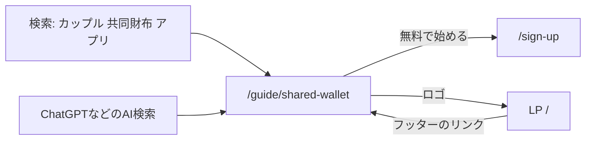

# Overview

「カップル 共同財布 アプリ」などで検索する人向けに、ふたりのお金の管理方法を比較する静的ガイドページ `/guide/shared-wallet` を追加する。LP以外で初めての、検索からの入口になるページで、一度作れば手入れ不要な低コスト・低運用の構成にする。

## Purpose

GA4で2026年1月〜10月の流入を見ると、外部からの流入は「Google自然検索」と「ChatGPT」の2本だけで、着地ページはどちらもLP（`/`）の1枚しかない。Google自然検索は登録率25%と質が高いが、月40クリック前後で頭打ちになっている。

Search Consoleで表示回数が一番多いのは「共同財布・共有財布アプリ」系の検索で、1月以降で約1,150回ある。LPは9〜10位に表示されているが、クリック率は約1%にとどまる。

| クエリ                    | 表示回数 | 順位 |
| ------------------------- | -------: | ---: |
| カップル 共同 財布 アプリ |      448 |  9.3 |
| 共同財布 アプリ           |      345 |  9.5 |
| カップル 共同財布 アプリ  |       99 |  9.1 |
| カップル 財布 アプリ      |       92 |  9.3 |
| 共有財布 アプリ           |       85 |  9.8 |
| カップル お財布 アプリ    |       81 | 10.2 |

この検索をする人は「ふたりのお金をまとめて管理したい」層で、Pairboの「共同口座や共同財布を作らず、別々の財布のまま共有する」という立ち位置が、そのまま答えの一つになる。一方でLPは、同棲・割り勘・傾斜折半という複数の検索意図に1枚で対応していて、この系統に特化できない。そこで専用ページを作り、順位とクリック率を上げて登録につなげる。

ChatGPTなどのAI検索もWeb上のページを参照して回答するので、AI経由の流入の回復にもつながる可能性がある。ただし、AIの回答に載るかどうかは直接は制御できない。

## What to Do

### 機能要件

- `/guide/shared-wallet` に静的ページを1枚追加する
- ページの中身
  1. ふたりのお金を管理する3つの方法の比較（共同口座 / 共同財布アプリ・プリペイドカード / 各自で払って記録・精算）
  2. 各方法が向いている人
  3. Pairboでの始め方（LPの「使い方3ステップ」を流用）
  4. よくある質問
  5. 登録ボタン（ページ内と、スマホの画面下に追従するボタン）
- 検索向けの設定
  - `title`・`description`・canonical（自分自身）・OGPを設定する
  - sitemapに追加する
  - LPのフッターからリンクする。Googleがページを見つけやすくなり、LPの評価もこのページに伝わる

### 非機能要件

運用の手間はほぼゼロにする。他社のサービス名・料金・仕様は、変わっても気付けず古い情報になるので書かない。日付や「最新」のような時期に依存する表現も使わない。

デザインは新しく作らず、LPのフォント・色・部品を流用する。ページはサーバー側で描画し、JSを読み込まなくても検索エンジンやAIが本文を取得できるようにする。

機能の記載は実装と一致させる。傾斜折半はPremiumの機能で、均等割り・全額負担は無料で使える。

### 文言案

LPコピーの方針（売りだけ載せる・初見に分かる言葉・自明な詳細は書かない）に沿って書いた。

#### title（検索結果の見出し）

`カップルの共同財布アプリ、どう選ぶ？ふたりのお金を管理する3つの方法｜Pairbo`

もう一つの候補だった `カップルの共同財布、作らなくても大丈夫｜別々のお財布で生活費を分けるPairbo` は採用しなかった。共同財布アプリを探している人に最初から否定で答えるより、比較を見せてから別の選択肢として示す方が、クリックされやすく本文とも一致するため。

#### description

`共同口座・共同財布アプリ・各自で払って精算する方法を比較します。お財布を別々にしたまま、ふたりの生活費を公平に分けられる無料の共有家計簿Pairboの使い方も紹介します。`

#### H1

`ふたりのお金、共同財布にする？別々のままにする？`

#### リード文

`同棲や結婚で生活費を一緒に払うようになると、まずお金の分け方に悩みます。ふたりのお金を管理する方法は、大きく分けて3つあります。`

#### 3つの方法の比較（表）

|              | 共同口座                                        | 共同財布アプリ・プリペイドカード       | 各自で払って記録・精算                                   |
| ------------ | ----------------------------------------------- | -------------------------------------- | -------------------------------------------------------- |
| しくみ       | ふたりで1つの口座に生活費を入れて、そこから払う | ふたりでチャージした残高やカードで払う | いつも通り各自で払い、記録して月ごとに差額をやりとりする |
| 準備         | 口座の開設と毎月の入金                          | アプリの登録と毎月のチャージ           | アプリに記録するだけ                                     |
| 支払い方法   | 口座のカードや引き落とし                        | 共通のカードや残高                     | 各自のいつものカード・現金・ポイント                     |
| 負担の割合   | 入金額で調整                                    | チャージ額で調整                       | 支出ごとに変えられる                                     |
| 向いている人 | 生活費をまとめて管理したい                      | 支払いを1か所にまとめたい              | お財布は別々のまま、公平に分けたい                       |

#### 「各自で払って記録・精算」が向いている人

- お財布や口座は別々にしておきたい
- いつものカードやポイントをそのまま使いたい
- 収入差に合わせて、負担の割合を調整したい
- 口座開設やチャージの手間をかけたくない

リストの下に `Pairboなら、支出を記録するだけで月ごとの精算額を自動で計算します。` を置き、Pairboの説明につなげる。

#### Pairboでの始め方

LPの「使い方はかんたん、3ステップ」（グループを作成 → 支出を記録 → 月ごとに精算）をそのまま使う。

#### よくある質問

- Q: 共同口座がなくても生活費を分けられますか？
  A: はい。それぞれが払った支出を記録すると、月ごとにどちらがいくら払えばよいかを自動で計算します。
- Q: 収入に差があっても公平に分けられますか？
  A: 均等割り・全額負担に加えて、割合や金額を指定する傾斜折半（Premium）で、ふたりに合った負担にできます。
- Q: 相手もアプリをインストールする必要がありますか？
  A: いいえ。招待URLを送るだけで、ブラウザからすぐに参加できます。
- Q: 無料で使えますか？
  A: 記録・精算などの基本機能は無料です。

#### 登録ボタン

LPと同じ `無料で始める` にする。ページ末尾の登録セクションは、見出しをLPと同じ `基本機能は、ずっと無料。`、説明文を `URLを送るだけで、ふたりですぐに始められます。` とし、LPへのリンク `Pairboの機能を見る` も並べる。

## How to Do It

### ユーザーの流れ

### 変更対象

| ファイル                                       | 変更内容                                                                                                                                         |
| ---------------------------------------------- | ------------------------------------------------------------------------------------------------------------------------------------------------ |
| `app/(marketing)/guide/shared-wallet/page.tsx` | 新規。`metadata` で title・description・canonical・OGP を設定し、`SharedWalletGuide` を描画する                                                  |
| `components/landing/SharedWalletGuide.tsx`     | 新規。ガイドページ本体のサーバーコンポーネント                                                                                                   |
| `components/landing/LandingPage.tsx`           | `HowItWorksSection`・`FooterSection`・`StickyCta`・`PairDots` を `export` する。フッターにガイドページへのリンク「共同財布アプリの選び方」を追加 |
| `components/landing/index.ts`                  | `SharedWalletGuide` を再エクスポート                                                                                                             |
| `app/sitemap.ts`                               | `/guide/shared-wallet` を追加                                                                                                                    |
| `middleware.ts`                                | 公開ルートに `/guide/(.*)` を追加（未追加だとログインを求められる）                                                                              |
| `app/layout.tsx`・`app/(marketing)/page.tsx`   | FAQの構造化データ（JSON-LD）をルートlayoutからLPのページへ移す                                                                                   |

LPのページ（`app/(marketing)/page.tsx` → `LandingPage`）と同じ構成にし、比較表・向いている人・よくある質問は、コンポーネントファイル内の定数配列にしてJSXで描画する。フォント（`zenMaru`・`zenKaku`）と色はLPの値をそのまま使う。

比較表は、スマホで4列の表が読みにくいため、方法ごとのカード3枚にする。各カードは `dl` で項目と値を並べ、Pairboの方法（3枚目）だけ枠の色とバッジで目立たせる。

よくある質問は、LPの `FaqItem`（開閉式）を使わず、質問と答えを最初から全部表示する。`FaqItem` は開くまで答えをHTMLに出さないので、検索エンジンやAIが答えを読めないため。

FAQの構造化データは、これまでルートlayoutにあり、全ページに出力されていた。構造化データはページに表示している内容と一致させる必要があるので、LPのページに移し、ガイドページには出さない。

### 効果測定

計測の追加実装は要らず、既存の仕組みで測れる。

- Search Console（`analytics/search-console/search_analytics.py`）: このページの「共同財布」系クエリの表示回数・順位・クリック数
- GA4（`analytics-mcp`）: 着地ページが `/guide/shared-wallet` のセッションからの `sign_up` 数

公開から4〜6週間後に判断する。目安は、このページが「共同財布」系クエリでLPより上位に表示され、クリックと登録が発生していること。

## What We Won't Do

- ブログやCMSの仕組み、記事の継続的な追加（運用コストがかかるため）
- 他社サービスの名前・料金・機能の比較（情報が古くなり、正確さを保てないため）
- FAQの構造化データ（JSON-LD）の追加。GoogleはFAQのリッチリザルトを一部の公的なサイトに限定しているので、効果が小さい
- 「同棲」系のガイドページ（この結果を見てから判断する）
- LPのタイトルや構成の変更（効果測定が混ざらないように分ける）
- 口コミの掲載（別施策として、アプリ内での収集から進める）

## Alternatives Considered

| 案                                       | 概要                                             | 不採用の理由                                                                                       |
| ---------------------------------------- | ------------------------------------------------ | -------------------------------------------------------------------------------------------------- |
| LPを「共同財布」向けに寄せる             | 新しいページを作らず、LPのタイトルや本文を変える | LPは同棲・割り勘など他の検索にも表示されているので、一つの系統に寄せると他の検索での表示が弱くなる |
| 外部サービス（note・Zenn）に記事を書く   | コードを書かずに公開できる                       | 検索の評価が外部サービス側に付き、pairbo.appには残らない                                           |
| サブドメイン（`guide.pairbo.app`）に置く | ガイドを別サイトとして運用する                   | Search Consoleのプロパティが別になり、構成も増える。評価もpairbo.appと分かれる                     |
| ブログ形式で複数記事を作る               | キーワードごとに記事を量産する                   | 継続的な執筆が必要で、低運用の方針に合わない                                                       |

## Concerns

LPの言い換えだけのページは、中身が薄いとみなされて評価されない。LPにない「3つの方法の比較」を中心に置いて、これを避ける。

同じ検索でLPとガイドページが競合し、どちらも順位が上がらない可能性がある。LPのタイトルは今のまま広い検索意図に対応させ、ガイドは「共同財布」に絞って役割を分ける。公開後にSearch Consoleで確認する。

新しいページは、Googleに見つけてもらうまで時間がかかる。sitemapへの追加、LPからのリンク、Search Consoleでのインデックス登録リクエストで早める。

順位やクリック率が上がる保証はない。効果が出なくても、ページを1枚残すだけなので損失は小さい。

## Reference Materials/Information

- Search Console 検索パフォーマンス（2026-01-01〜2026-10-04）: `analytics/search-console/search_analytics.py`
- GA4 流入元別の初回訪問・登録数（2026年1月〜10月）: `analytics-mcp` の `run_report`
- canonical修正（v1.11.2、#283）: LP以外のページがインデックスされるようになった前提
- LPコピーの方針: 売りだけ載せる・初見に分かる言葉・自明な詳細は書かない
