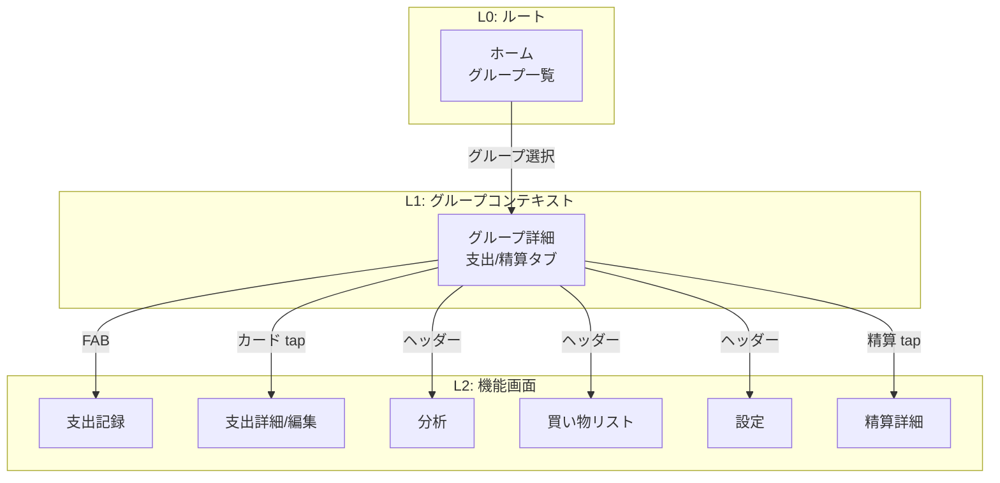
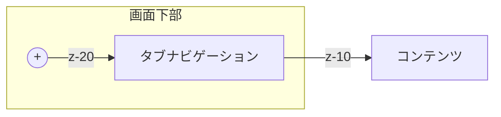
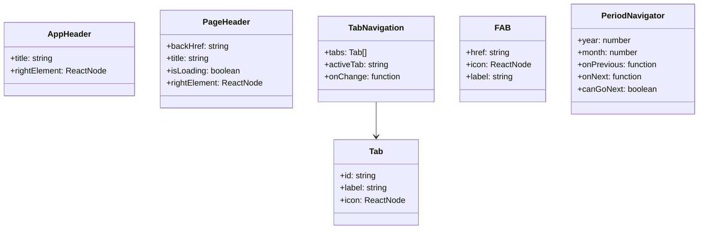

# ヘッダー・フッターUX設計

## 概要

Oaikoアプリにおけるヘッダーとフッター（ナビゲーション）の統一的なUX設計。
**「3タップ以内で支出記録完了」** を最優先目標とし、モバイルファーストの観点から最適なナビゲーション配置を定義する。

## 目的

### アプリの核心価値
- **割り勘・傾斜折半ができる共有家計簿**
- 同棲カップル、夫婦、シェアハウス住人がターゲット
- プラットフォーム非依存（Web）でURLで招待可能

### ナビゲーション設計の目的
1. **最速の支出記録**: メイン機能への最短アクセス
2. **直感的な精算確認**: 誰が誰にいくら払うかを即座に把握
3. **一貫した体験**: 全画面で統一されたナビゲーション
4. **片手操作**: モバイルでの親指リーチを考慮

## やること

### 画面階層の整理



### ナビゲーションパターン

#### パターン1: ホーム画面（AppHeader）

```
┌─────────────────────────────────────────┐
│  🏠 Oaiko                     [Avatar]  │
└─────────────────────────────────────────┘
│                                         │
│   グループ一覧                           │
│                                         │
└─────────────────────────────────────────┘
```

**設計意図**:
- 左: アプリブランド表示
- 右: ユーザー認証状態 & アカウント設定へのアクセス
- シンプルに保ち、グループ選択に集中させる

#### パターン2: グループ詳細（メイン画面）

```
┌─────────────────────────────────────────┐
│  ←    グループ名     📊  🛒  ⚙️        │  ← ヘッダー
├─────────────────────────────────────────┤
│  ◀  2025年1月分 (12/26〜1/25)  ▶      │  ← 期間ナビ
├─────────────────────────────────────────┤
│                                         │
│   支出一覧 / 精算プレビュー              │
│                                         │
│                                   [+]   │  ← FAB
├─────────────────────────────────────────┤
│       支出        │        精算         │  ← タブ
└─────────────────────────────────────────┘
```

**設計意図**:
- **ヘッダー右のアイコン**: 頻度の低い機能（分析・買い物・設定）
- **FAB**: 最頻出アクション「支出記録」への1タップアクセス
- **下部タブ**: コンテンツ切り替え（支出一覧 ↔ 精算）
- **期間ナビ**: sticky配置で常にコンテキストを把握

**3タップで支出記録完了**:
1. グループ選択（ホーム → グループ詳細）
2. FABタップ（グループ詳細 → 支出記録）
3. 保存（金額入力 → 保存）

#### パターン3: サブ画面（PageHeader）

```
┌─────────────────────────────────────────┐
│  ←       ページタイトル       [Action]  │
└─────────────────────────────────────────┘
│                                         │
│   コンテンツ                             │
│                                         │
└─────────────────────────────────────────┘
```

**各画面のAction配置**:

| 画面 | タイトル | Action |
|------|---------|--------|
| 支出記録 | 支出を記録 | - |
| 支出編集 | 支出を編集 | 🗑️ 削除 |
| 支出詳細（精算済み） | 支出詳細 | 「精算済み」ラベル |
| 分析 | 分析 | - |
| 買い物リスト | 買い物リスト / 購入履歴 | 📋/🛒 切替 |
| グループ設定 | グループ設定 | - |
| 精算詳細 | 精算詳細 | - |

### ベストプラクティスの適用

#### 1. ボトムナビゲーション（タブ）

**Material Design / iOS HIG準拠**:
- 高さ: 48-56px（h-12〜h-14）
- タブ数: 2〜5個（現状2個で最適）
- アイコン + ラベルの組み合わせ（認識性向上）
- アクティブ状態の明確な視覚フィードバック

```
┌─────────────────────────────────────────┐
│    📋 支出      │     💰 精算          │
└─────────────────────────────────────────┘
```

**改善点**: テキストのみ → アイコン + テキストに変更

#### 2. FAB（Floating Action Button）

**配置の最適化**:
- 右下配置（親指リーチ最適）
- タブの上に配置（bottom-16〜20）
- サイズ: 56px（タッチターゲット最低48px以上）
- 影付きで浮遊感を演出



#### 3. ヘッダーアイコン

**3アイコンルール**:
- 右側に最大3つまで
- 頻度の低い機能を配置
- アイコンのみ（ラベルなし）でスペース効率化

現状の構成（最適）:
| アイコン | 機能 | 優先度 |
|---------|------|--------|
| 📊 | 分析 | 中 |
| 🛒 | 買い物リスト | 中 |
| ⚙️ | 設定 | 低 |

#### 4. スクロール時の挙動

**推奨パターン**:
- ヘッダー: 常に表示（sticky）
- 期間ナビ: 常に表示（sticky、ヘッダー直下）
- タブ: 常に表示（fixed bottom）
- FAB: 常に表示

**見送り**: スクロールでの自動非表示
- 理由: 支出記録への常時アクセスを優先

### コンポーネント設計



### 実装タスク

| 優先度 | タスク | 状態 |
|--------|--------|------|
| P0 | PageHeader統一 | ✅ 完了 |
| P1 | TabNavigationコンポーネント化 | 🔲 未着手 |
| P1 | タブにアイコン追加 | 🔲 未着手 |
| P2 | FABコンポーネント化 | 🔲 未着手 |
| P2 | AppHeaderコンポーネント化 | 🔲 未着手 |
| P3 | PeriodNavigatorの改善 | 🔲 未着手 |

## どうやるか

### 1. TabNavigationコンポーネント

```tsx
// components/ui/TabNavigation.tsx
type Tab = {
  id: string;
  label: string;
  icon: ReactNode;
};

type TabNavigationProps = {
  tabs: Tab[];
  activeTab: string;
  onChange: (tabId: string) => void;
};

export function TabNavigation({ tabs, activeTab, onChange }: TabNavigationProps) {
  return (
    <nav className="fixed bottom-0 left-0 right-0 z-10 bg-white border-t border-slate-200">
      <div className="max-w-lg mx-auto flex" role="tablist">
        {tabs.map((tab) => (
          <button
            key={tab.id}
            role="tab"
            aria-selected={activeTab === tab.id}
            onClick={() => onChange(tab.id)}
            className={`flex-1 flex flex-col items-center gap-1 py-3 text-xs font-medium transition-colors ${
              activeTab === tab.id
                ? "text-blue-600 border-t-2 border-blue-500 -mt-px"
                : "text-slate-500 hover:text-slate-700"
            }`}
          >
            {tab.icon}
            <span>{tab.label}</span>
          </button>
        ))}
      </div>
    </nav>
  );
}
```

### 2. FABコンポーネント

```tsx
// components/ui/FAB.tsx
type FABProps = {
  href: string;
  icon: ReactNode;
  label: string;
};

export function FAB({ href, icon, label }: FABProps) {
  return (
    <Link
      href={href}
      className="fixed bottom-20 right-4 z-20 w-14 h-14 bg-blue-500 text-white rounded-full shadow-lg hover:bg-blue-600 transition-colors flex items-center justify-center"
      aria-label={label}
    >
      {icon}
    </Link>
  );
}
```

### スタイル仕様

| 要素 | 高さ | z-index | 位置 |
|------|------|---------|------|
| ヘッダー | 56px (h-14) | z-10 | sticky top-0 |
| 期間ナビ | 48px | z-10 | sticky top-14 |
| タブ | 56px (h-14) | z-10 | fixed bottom-0 |
| FAB | 56px (w-14 h-14) | z-20 | fixed bottom-20 right-4 |

### セーフエリア考慮

```css
/* タブナビゲーション */
.tab-navigation {
  padding-bottom: env(safe-area-inset-bottom);
}

/* FAB */
.fab {
  bottom: calc(5rem + env(safe-area-inset-bottom));
}
```

## やらないこと

| 機能 | 理由 |
|------|------|
| グローバルナビ（全グループ切替） | 多くのユーザーは1グループのみ使用 |
| ハンバーガーメニュー | モバイルでは非推奨、必要機能はヘッダーで十分 |
| スワイプナビゲーション | 実装コスト vs 効果を考慮 |
| スクロール時のナビ非表示 | 支出記録への常時アクセスを優先 |
| 5タブ以上のナビ | 認知負荷が高くなる |

## 懸念事項

### 1. ホーム画面のシンプルさ

**現状**: グループ一覧のみ
**将来**: 機能追加時に複雑化の可能性

**対策**:
- AppHeaderコンポーネントで拡張に備える
- ホームはあくまでグループ選択に特化

### 2. 複数グループ利用時のUX

**課題**: グループ間の移動が「← → ホーム → グループ選択」と遠い

**対策案**:
- A: 現状維持（多くは1グループ利用）
- B: ヘッダーにグループ切替ドロップダウン追加
- C: スワイプでグループ切替

→ **決定**: A案。MVPでは1グループ利用を想定。複数グループ対応は利用データを見て判断。

### 3. 買い物リストへのアクセス

**現状**: ヘッダーアイコンからのみ
**検討**: タブに追加すべきか？

**決定**: 現状維持
- 理由: 支出記録と精算が最優先機能
- 買い物リストは補助機能として位置づけ

## 参考資料

### UXベストプラクティス
- [Bottom Navigation Bar Guide 2025 - AppMySite](https://blog.appmysite.com/bottom-navigation-bar-in-mobile-apps-heres-all-you-need-to-know/)
- [Bottom Tab Bar Navigation Best Practices - UX Planet](https://uxplanet.org/bottom-tab-bar-navigation-design-best-practices-48d46a3b0c36)
- [Mobile Navigation Design Golden Rules - Smashing Magazine](https://www.smashingmagazine.com/2016/11/the-golden-rules-of-mobile-navigation-design/)
- [45 Mobile App Best Practices 2025 - UXCam](https://uxcam.com/blog/mobile-app-best-practices/)

### 家計簿アプリUI参考
- [Expense Tracker App UI/UX Design - Ramotion](https://www.ramotion.com/expense-tracker-app-ui-ux-design-concept/)
- [Home Budget App UI Case Study - Tubik Studio](https://blog.tubikstudio.com/case-study-home-budget-app-ui-for-finance/)
- [UI Design for Finance Apps - Design4Users](https://design4users.com/ui-design-finance-apps/)

### 競合分析
- [Shareroo - App Store](https://apps.apple.com/us/app/shared-budget-planner-shareroo/id1475406336)

## 次のステップ

1. [ ] TabNavigationコンポーネント作成（アイコン付き）
2. [ ] FABコンポーネント抽出
3. [ ] AppHeaderコンポーネント作成
4. [ ] グループ詳細画面の調整
5. [ ] safe-area-inset対応
