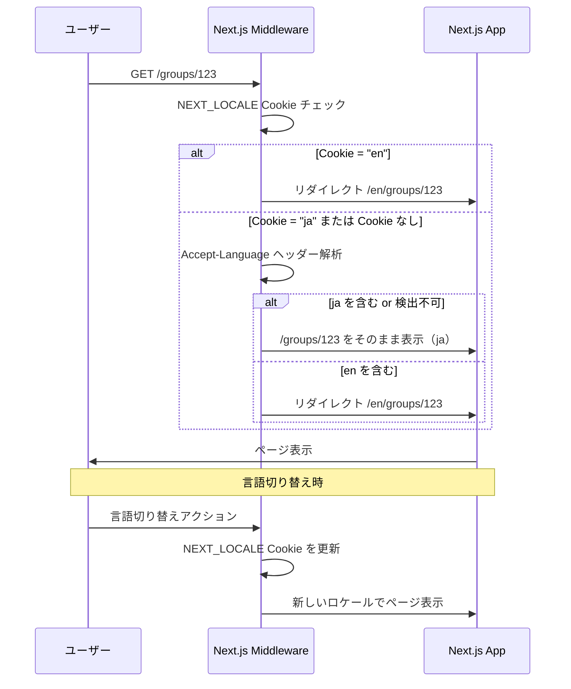
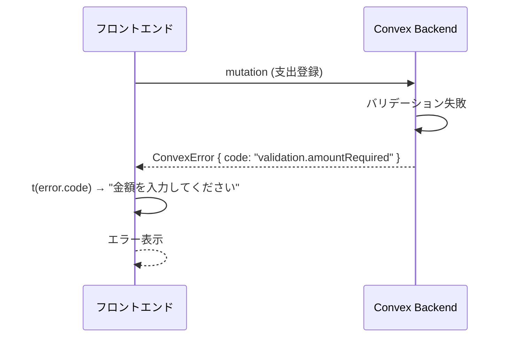
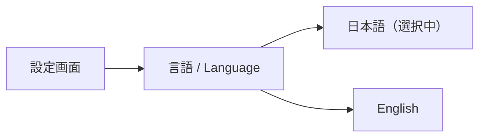
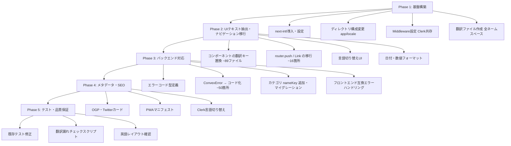

# 設計書: 多言語対応（i18n）

## Overview

Pairboアプリを多言語対応し、日本語以外のユーザーにもサービスを提供できるようにする。初期対応言語は日本語（ja）と英語（en）。将来的に他言語への拡張も可能な設計とする。

## Purpose

### 背景

Pairboは「割り勘・傾斜折半ができる共有家計簿」としてWebアプリで提供中。現在は全UIテキスト・エラーメッセージ・メタデータが日本語ハードコードで実装されている。

国際カップル（日本人×外国人）や海外在住の日本人など、日本語以外のユーザーがPairboを利用できないという課題がある。

### 目的

1. **ユーザー層の拡大**: 英語圏ユーザーへのリーチ
2. **国際カップル対応**: パートナー間で異なる言語設定を使用可能にする
3. **競合との差別化**: Sharerooは日本語のみ。多言語対応で優位性を獲得

### 代替案

| アプローチ           | メリット                         | デメリット                           |
| -------------------- | -------------------------------- | ------------------------------------ |
| 多言語対応（採用）   | ユーザー層拡大、国際カップル対応 | 実装コスト大、翻訳管理コスト         |
| 英語のみに切替       | 実装シンプル                     | 既存ユーザーへの影響大               |
| 機械翻訳API利用      | 翻訳ファイル不要                 | 品質不安定、コスト、オフライン非対応 |
| ブラウザ翻訳に委ねる | 実装コストゼロ                   | UX品質が低い、レイアウト崩れ         |

→ 将来の拡張性とUX品質を考慮し、**アプリ内多言語対応**を採用

## What to Do

### 機能要件

#### FR-1: 言語切り替え

- ユーザーが言語を手動で切り替えられる
- 設定は Cookie（`NEXT_LOCALE`）に永続化し、Middlewareで参照する
- 初回アクセス時はブラウザの `Accept-Language` ヘッダーで自動検出
- 対応言語: 日本語（ja）、英語（en）
- デフォルト言語: 日本語（ja）

#### FR-2: UIテキストの多言語化

- すべてのUIテキスト（ラベル、ボタン、プレースホルダー等）を翻訳対象とする
- フォーマット（日付、数値、通貨）をロケールに応じて変更する
- 複数形（pluralization）はICUメッセージフォーマットで対応する

#### FR-3: バリデーションエラーの多言語化

- Convex側のバリデーションエラーメッセージを翻訳キーとして返却
- フロントエンドで翻訳キーから表示文字列に変換

#### FR-4: プリセットカテゴリの多言語化

- グループ作成時のプリセットカテゴリ名をユーザーの言語で表示
- DB上はカテゴリ名を翻訳キーで保持し、表示時に翻訳
- カスタムカテゴリ（ユーザー作成）はユーザーが入力した言語のままそのまま表示する

#### FR-5: メタデータの多言語化

- HTML `lang` 属性を動的に設定
- OGP / Twitterカードのタイトル・説明文をロケール対応
- PWAマニフェストのロケール対応

#### FR-6: Clerk認証UIの多言語化

- 既存の `@clerk/localizations` を活用し、選択言語に応じてClerk UIの表示言語を切り替え

### 非機能要件

#### NFR-1: パフォーマンス

- 翻訳ファイルのロードがページ表示を遅延させない
- 翻訳ファイルはネームスペースごとに分割し、ページが必要な分だけロード
- バンドルサイズ増加を最小限に抑える

#### NFR-2: 開発者体験

- 翻訳キーにTypeScript型安全性を提供
- 翻訳漏れをビルド時に検出（ja/enのキー差分チェックスクリプト）
- 翻訳ファイルの追加が容易な構造

#### NFR-3: 拡張性

- 新しい言語の追加が翻訳ファイル追加のみで完結
- ルーティング構造の変更を最小限に

## How to Do It

### ライブラリ選定: next-intl

Next.js App Routerとの親和性が最も高い `next-intl` を採用する。

| ライブラリ            | App Router対応     | 型安全性 | バンドルサイズ | 備考              |
| --------------------- | ------------------ | -------- | -------------- | ----------------- |
| **next-intl（採用）** | ◎ ネイティブ対応   | ◎        | 小             | App Router最適化  |
| react-i18next         | △ クライアント中心 | ○        | 中             | SSR設定が煩雑     |
| @lingui/react         | ○                  | ○        | 小             | ICUメッセージ構文 |
| react-intl (FormatJS) | △                  | ○        | 大             | 設定が重い        |

**選定理由**:

- Next.js App Router（Server Components / Client Components）をネイティブサポート
- ミドルウェアによるロケール検出・ルーティング
- TypeScript型安全の翻訳キー
- ICUメッセージフォーマット対応（複数形等）
- 軽量でパフォーマンスに優れる

### URLプレフィックス戦略: `as-needed`

デフォルト言語（ja）ではURLプレフィックスを付けず、非デフォルト言語のみプレフィックスを付ける。

```
日本語: /groups/123           ← プレフィックスなし（既存URL維持）
英語:   /en/groups/123        ← プレフィックスあり
```

**選定理由**:

| 戦略                                 | メリット                        | デメリット                                        |
| ------------------------------------ | ------------------------------- | ------------------------------------------------- |
| `always`（全言語プレフィックスあり） | URL構造が対称的、SEOクリーン    | 既存URL全破壊、ブックマーク・PWA・Clerk設定全変更 |
| **`as-needed`（採用）**              | **既存URL互換**、移行コスト最小 | URL構造が非対称                                   |
| `never`（プレフィックスなし）        | URL変更ゼロ                     | 言語を含むURL共有不可、SEO不可                    |

- Pairboは日本発で既存ユーザーは日本語。ブックマーク・共有リンク・PWAホーム画面アイコンへの影響をゼロにする
- ログイン後アプリのためSEOの対称性メリットが活きにくい
- 将来 `always` への変更もリダイレクト追加だけで移行可能

### アーキテクチャ

```mermaid
graph TB
    subgraph "ブラウザ"
        A[ユーザーアクセス]
    end

    subgraph "Next.js Server"
        A --> B[Middleware]
        B -->|NEXT_LOCALE Cookie / Accept-Language| C{ロケール判定}
        C -->|ja| D[/groups/... ページ]
        C -->|en| E[/en/groups/... ページ]
        D --> F[翻訳ファイル ja/]
        E --> G[翻訳ファイル en/]
        F --> H[Server Component]
        G --> H
        H --> I[Client Component]
    end

    subgraph "Convex Backend"
        J[Mutation / Query] -->|エラーコード| I
        I -->|翻訳キー変換| I
    end
```

### ディレクトリ構成

```
app/
├── [locale]/                  # ロケールベースルーティング
│   ├── layout.tsx             # ロケール対応レイアウト（html lang={locale}）
│   ├── page.tsx               # ホーム
│   └── groups/
│       └── [groupId]/
│           ├── page.tsx
│           └── ...
├── layout.tsx                 # ルートレイアウト（最小限、html/body のみ）
└── not-found.tsx

messages/                      # 翻訳ファイル（ネームスペース分割）
├── ja/
│   ├── common.json
│   ├── expense.json
│   ├── settlement.json
│   ├── group.json
│   ├── category.json
│   ├── validation.json
│   ├── landing.json
│   ├── shopping.json
│   ├── analytics.json
│   └── metadata.json
└── en/
    ├── common.json
    ├── expense.json
    └── ...（同構成）

i18n/
├── config.ts                  # ロケール設定
├── request.ts                 # next-intl リクエスト設定
└── navigation.ts              # ローカライズ済み Link / useRouter / redirect

middleware.ts                  # Clerk認証 + ロケール検出・リダイレクト（既存を拡張）
```

### 翻訳ファイル構成

ネームスペースごとにファイルを分割する。ページが必要なネームスペースだけロードすることでバンドルサイズを最適化する。

**`messages/ja/common.json`**:

```json
{
  "save": "保存",
  "cancel": "キャンセル",
  "delete": "削除",
  "edit": "編集",
  "loading": "読み込み中...",
  "error": "エラーが発生しました",
  "confirm": "確認",
  "close": "閉じる",
  "back": "戻る"
}
```

**`messages/en/common.json`**:

```json
{
  "save": "Save",
  "cancel": "Cancel",
  "delete": "Delete",
  "edit": "Edit",
  "loading": "Loading...",
  "error": "An error occurred",
  "confirm": "Confirm",
  "close": "Close",
  "back": "Back"
}
```

**`messages/ja/expense.json`**:

```json
{
  "title": "タイトル",
  "amount": "金額",
  "category": "カテゴリ",
  "payer": "支払った人",
  "splitMethod": "負担方法",
  "memo": "メモ",
  "date": "日付",
  "record": "記録する",
  "update": "更新する",
  "deleteConfirm": "この支出を削除しますか？",
  "settledPeriodEdit": "精算済みの期間の支出は編集できません",
  "settledPeriodDelete": "精算済みの期間の支出は削除できません",
  "count": "{count, plural, =0 {支出なし} =1 {1件の支出} other {#件の支出}}"
}
```

**`messages/en/expense.json`**:

```json
{
  "title": "Title",
  "amount": "Amount",
  "category": "Category",
  "payer": "Paid by",
  "splitMethod": "Split method",
  "memo": "Memo",
  "date": "Date",
  "record": "Record",
  "update": "Update",
  "deleteConfirm": "Delete this expense?",
  "settledPeriodEdit": "Cannot edit expenses in a settled period",
  "settledPeriodDelete": "Cannot delete expenses in a settled period",
  "count": "{count, plural, =0 {No expenses} =1 {1 expense} other {# expenses}}"
}
```

**`messages/ja/validation.json`**:

```json
{
  "amountRequired": "金額を入力してください",
  "amountInteger": "金額は整数で入力してください",
  "amountRange": "金額は{min}円から{max}円の範囲で入力してください",
  "categoryRequired": "カテゴリを選択してください",
  "invalidDate": "日付の形式が正しくありません",
  "futureDate": "未来の日付は指定できません",
  "titleMaxLength": "タイトルは{max}文字以内で入力してください",
  "memoMaxLength": "メモは{max}文字以内で入力してください",
  "ratioSumMismatch": "割合の合計は100%である必要があります",
  "amountSumMismatch": "金額の合計が支出金額と一致しません",
  "duplicateCategoryName": "同じ名前のカテゴリが既に存在します",
  "presetCategoryCannotEdit": "プリセットカテゴリは編集できません",
  "presetCategoryCannotDelete": "プリセットカテゴリは削除できません",
  "displayNameRequired": "表示名を入力してください",
  "duplicateTagName": "同じ名前のタグが既に存在します"
}
```

**`messages/en/validation.json`**:

```json
{
  "amountRequired": "Please enter an amount",
  "amountInteger": "Amount must be a whole number",
  "amountRange": "Amount must be between {min} and {max}",
  "categoryRequired": "Please select a category",
  "invalidDate": "Invalid date format",
  "futureDate": "Future dates are not allowed",
  "titleMaxLength": "Title must be {max} characters or less",
  "memoMaxLength": "Memo must be {max} characters or less",
  "ratioSumMismatch": "Ratios must add up to 100%",
  "amountSumMismatch": "Split amounts must equal the total expense",
  "duplicateCategoryName": "A category with this name already exists",
  "presetCategoryCannotEdit": "Preset categories cannot be edited",
  "presetCategoryCannotDelete": "Preset categories cannot be deleted",
  "displayNameRequired": "Please enter a display name",
  "duplicateTagName": "A tag with this name already exists"
}
```

**`messages/ja/category.json`**:

```json
{
  "food": "食費",
  "diningOut": "外食",
  "dailyItems": "日用品",
  "housing": "住居費",
  "utilities": "光熱費",
  "communication": "通信費",
  "transportation": "交通費",
  "entertainment": "娯楽",
  "hobby": "趣味",
  "clothing": "衣服・美容",
  "social": "交際費",
  "medical": "医療費",
  "other": "その他"
}
```

**`messages/en/category.json`**:

```json
{
  "food": "Groceries",
  "diningOut": "Dining out",
  "dailyItems": "Daily items",
  "housing": "Housing",
  "utilities": "Utilities",
  "communication": "Internet & Phone",
  "transportation": "Transportation",
  "entertainment": "Entertainment",
  "hobby": "Hobbies",
  "clothing": "Clothing & Beauty",
  "social": "Social",
  "medical": "Medical",
  "other": "Other"
}
```

**`messages/ja/splitMethod.json`**:

```json
{
  "equal": "均等",
  "ratio": "割合",
  "amount": "金額",
  "full": "全額"
}
```

**`messages/en/splitMethod.json`**:

```json
{
  "equal": "Equal",
  "ratio": "Ratio",
  "amount": "Fixed",
  "full": "Full"
}
```

**`messages/ja/settlement.json`**:

```json
{
  "title": "精算",
  "completed": "精算完了",
  "reopen": "再オープン",
  "inProgress": "精算中",
  "alreadyCompleted": "この期間の精算は既に確定されています",
  "alreadyReopened": "この精算は既に再オープンされています",
  "notCompleted": "この精算はまだ完了していません",
  "noPermission": "支払い完了をマークする権限がありません"
}
```

**`messages/en/settlement.json`**:

```json
{
  "title": "Settlement",
  "completed": "Settled",
  "reopen": "Reopen",
  "inProgress": "Settling",
  "alreadyCompleted": "This period has already been settled",
  "alreadyReopened": "This settlement has already been reopened",
  "notCompleted": "This settlement has not been completed yet",
  "noPermission": "You don't have permission to mark this payment as completed"
}
```

**`messages/ja/group.json`**:

```json
{
  "create": "グループを作成",
  "name": "グループ名",
  "description": "説明（任意）",
  "creating": "作成中...",
  "notFound": "グループが見つかりません",
  "noAccess": "このグループにアクセスする権限がありません",
  "ownerRequired": "この操作にはオーナー権限が必要です"
}
```

**`messages/en/group.json`**:

```json
{
  "create": "Create group",
  "name": "Group name",
  "description": "Description (optional)",
  "creating": "Creating...",
  "notFound": "Group not found",
  "noAccess": "You don't have access to this group",
  "ownerRequired": "Owner permission is required for this action"
}
```

**`messages/ja/shopping.json`**:

```json
{
  "title": "買い物リスト",
  "addItem": "アイテムを追加",
  "purchased": "購入済み",
  "cannotDeletePurchased": "購入済みのアイテムは削除できません",
  "alreadyPurchased": "既に購入済みです",
  "notPurchased": "このアイテムは未購入です",
  "linkedToExpense": "支出と連携済みのため購入解除できません"
}
```

**`messages/en/shopping.json`**:

```json
{
  "title": "Shopping list",
  "addItem": "Add item",
  "purchased": "Purchased",
  "cannotDeletePurchased": "Cannot delete purchased items",
  "alreadyPurchased": "Already purchased",
  "notPurchased": "This item has not been purchased",
  "linkedToExpense": "Cannot undo purchase because it is linked to an expense"
}
```

**`messages/ja/landing.json`**:

```json
{
  "headline": "割り勘・傾斜折半ができる共有家計簿",
  "subheadline": "同棲カップル・夫婦・シェアハウスに",
  "cta": "無料で始める",
  "login": "ログイン"
}
```

**`messages/en/landing.json`**:

```json
{
  "headline": "Shared expense tracker with flexible splitting",
  "subheadline": "For couples, partners, and housemates",
  "cta": "Get started free",
  "login": "Log in"
}
```

**`messages/ja/metadata.json`**:

```json
{
  "title": "Pairbo - 2人のための共有家計簿",
  "description": "割り勘・傾斜折半ができる共有家計簿。アプリ不要、URLだけですぐ始められます。",
  "ogAlt": "Pairbo - 2人のための支出管理",
  "notFoundTitle": "ページが見つかりません",
  "notFoundDescription": "お探しのページは移動または削除された可能性があります",
  "backToHome": "ホームに戻る"
}
```

**`messages/en/metadata.json`**:

```json
{
  "title": "Pairbo - Shared Expense Tracker for Two",
  "description": "A shared expense tracker with flexible splitting. No app needed — just share a URL to get started.",
  "ogAlt": "Pairbo - Expense tracking for two",
  "notFoundTitle": "Page not found",
  "notFoundDescription": "The page you're looking for may have been moved or deleted",
  "backToHome": "Back to home"
}
```

**`messages/ja/auth.json`**:

```json
{
  "required": "認証が必要です",
  "userCreationFailed": "ユーザーの作成に失敗しました"
}
```

**`messages/en/auth.json`**:

```json
{
  "required": "Authentication is required",
  "userCreationFailed": "Failed to create user"
}
```

**`messages/ja/invitation.json`**:

```json
{
  "invalidToken": "無効な招待リンクです",
  "expired": "招待リンクの有効期限が切れています",
  "alreadyUsed": "この招待リンクは既に使用されています",
  "groupNotFound": "グループが見つかりません"
}
```

**`messages/en/invitation.json`**:

```json
{
  "invalidToken": "This invitation link is invalid",
  "expired": "This invitation link has expired",
  "alreadyUsed": "This invitation link has already been used",
  "groupNotFound": "Group not found"
}
```

**`messages/ja/premium.json`**:

```json
{
  "required": "Premiumプランでご利用いただけます",
  "tagFeature": "タグ機能はPremiumプランでご利用いただけます"
}
```

**`messages/en/premium.json`**:

```json
{
  "required": "Available with Premium plan",
  "tagFeature": "Tags are available with Premium plan"
}
```

### ロケール検出・ルーティングフロー

`as-needed` 戦略により、日本語ユーザーには既存URLがそのまま動作する。



### 主要実装箇所

#### 1. next-intl 設定

```typescript
// i18n/config.ts
export const locales = ["ja", "en"] as const;
export type Locale = (typeof locales)[number];
export const defaultLocale: Locale = "ja";
```

```typescript
// i18n/request.ts
import { getRequestConfig } from "next-intl/server";
import { routing } from "./navigation";

export default getRequestConfig(async ({ requestLocale }) => {
  let locale = await requestLocale;
  if (!locale || !routing.locales.includes(locale as any)) {
    locale = routing.defaultLocale;
  }
  return {
    locale,
    messages: {
      // ネームスペースごとに動的インポート
      ...(await import(`../messages/${locale}/common.json`)).default,
      ...(await import(`../messages/${locale}/expense.json`)).default,
      // ... 必要なネームスペースを追加
    },
  };
});
```

```typescript
// i18n/navigation.ts
import { createNavigation } from "next-intl/navigation";
import { defineRouting } from "next-intl/routing";

export const routing = defineRouting({
  locales: ["ja", "en"],
  defaultLocale: "ja",
  localePrefix: "as-needed", // jaではプレフィックスなし
});

// next/navigation の代わりにこちらを使用する
export const { Link, redirect, usePathname, useRouter } =
  createNavigation(routing);
```

#### 2. Middlewareの共存（next-intl + Clerk）

既存の `middleware.ts` はClerk認証ミドルウェアで構成されている。next-intlのミドルウェアをClerkの内部で呼び出す形で共存させる。

**現在の middleware.ts**:

```typescript
import { clerkMiddleware, createRouteMatcher } from "@clerk/nextjs/server";

const isPublicRoute = createRouteMatcher([
  "/",
  "/sign-in(.*)",
  "/sign-up(.*)",
  "/invite/(.*)",
  "/pricing",
  "/privacy",
  "/terms",
  "/legal/(.*)",
  "/offline",
]);

export default clerkMiddleware(async (auth, request) => {
  if (!isPublicRoute(request)) {
    await auth.protect();
  }
});
```

**変更後の middleware.ts**:

```typescript
import { clerkMiddleware, createRouteMatcher } from "@clerk/nextjs/server";
import createIntlMiddleware from "next-intl/middleware";
import { routing } from "./i18n/navigation";

const intlMiddleware = createIntlMiddleware(routing);

// 公開ルート（認証不要）- ロケールプレフィックス付きパターンも含める
const isPublicRoute = createRouteMatcher([
  "/",
  "/:locale",
  "/sign-in(.*)",
  "/:locale/sign-in(.*)",
  "/sign-up(.*)",
  "/:locale/sign-up(.*)",
  "/invite/(.*)",
  "/:locale/invite/(.*)",
  "/pricing",
  "/:locale/pricing",
  "/privacy",
  "/:locale/privacy",
  "/terms",
  "/:locale/terms",
  "/legal/(.*)",
  "/:locale/legal/(.*)",
  "/offline",
  "/:locale/offline",
]);

export default clerkMiddleware(async (auth, request) => {
  if (!isPublicRoute(request)) {
    await auth.protect();
  }
  // Clerk認証の後にi18nミドルウェアを実行
  return intlMiddleware(request);
});

export const config = {
  matcher: [
    "/((?!_next|[^?]*\\.(?:html?|css|js(?!on)|jpe?g|webp|png|gif|svg|ttf|woff2?|ico|csv|docx?|xlsx?|zip|webmanifest)).*)",
    "/(api|trpc)(.*)",
  ],
};
```

**ポイント**:

- Clerk → next-intl の順で実行（認証チェック後にロケール処理）
- 公開ルートのパターンにロケールプレフィックス付きバリアント（`/:locale/...`）を追加
- matcher は既存のClerk設定を維持

#### 3. ルートレイアウトの変更

```
変更前: app/layout.tsx         → <html lang="ja">
変更後: app/[locale]/layout.tsx → <html lang={locale}>
```

ルーティング構造を `app/[locale]/` 以下に移動し、`[locale]` パラメータでロケールを受け取る。

#### 4. ナビゲーションの移行

`next/navigation` の `useRouter`, `Link`, `usePathname` をすべて `i18n/navigation.ts` からのインポートに置き換える。

**変更前（現在のコード）**:

```tsx
import { useRouter } from "next/navigation";
import Link from "next/link";

router.push(`/groups/${groupId}`);
<Link href="/privacy">プライバシーポリシー</Link>;
```

**変更後**:

```tsx
import { useRouter, Link } from "@/i18n/navigation";

router.push(`/groups/${groupId}`); // ロケールプレフィックスは自動付与
<Link href="/privacy">{t("privacyPolicy")}</Link>;
```

これにより `router.push` や `Link` のパスを変更する必要はなく、next-intl が現在のロケールに応じて自動的にプレフィックスを付与する。

**影響箇所**:

- `components/` 内: `useRouter`（5箇所）、`usePathname`（1箇所）、`Link`（5箇所）
- `app/` 内: `useRouter`（4箇所）、`Link`（1箇所）

#### 5. コンポーネントでの使用例

**Server Component:**

```tsx
import { useTranslations } from "next-intl";

export default function ExpenseForm() {
  const t = useTranslations("expense");
  return <label>{t("amount")}</label>;
}
```

**Client Component:**

```tsx
"use client";
import { useTranslations } from "next-intl";

export default function SaveButton() {
  const t = useTranslations("common");
  return <button>{t("save")}</button>;
}
```

**複数形（ICU format）:**

```tsx
const t = useTranslations("expense");
// ja: "3件の支出" / en: "3 expenses"
t("count", { count: 3 });
```

#### 6. Convexバリデーションエラーの多言語化戦略

**方針**: Convex側はエラーコード（翻訳キー）を返し、フロントエンドで翻訳する。



**変更前（現在）**:

```typescript
throw new ConvexError("金額を入力してください");
```

**変更後**:

```typescript
throw new ConvexError({ code: "validation.amountRequired" });
```

**パラメータ付きエラーの場合**:

```typescript
throw new ConvexError({
  code: "validation.amountRange",
  params: { min: 1, max: 100_000_000 },
});
```

フロントエンドのエラーハンドリング:

```typescript
catch (error) {
  if (error instanceof ConvexError) {
    const { code, params } = error.data;
    const message = t(code, params);
    // 翻訳されたメッセージを表示
  }
}
```

**移行戦略（後方互換性の確保）**:

フロントエンドのエラーハンドリングを先に両形式対応にし、その後バックエンドを順次変更する。

```typescript
// 移行期間中の互換ハンドリング
catch (error) {
  if (error instanceof ConvexError) {
    if (typeof error.data === "string") {
      // 旧形式: 日本語文字列をそのまま表示
      showError(error.data);
    } else {
      // 新形式: 翻訳キーで変換
      showError(t(error.data.code, error.data.params));
    }
  }
}
```

**既存のエラーヘルパー関数の扱い**:

`getInvitationErrorMessage()` のようにエラータイプ→メッセージのマッピングが既にある箇所は、メッセージ文字列の代わりに翻訳キーを返すように変更する。

```typescript
// 変更前
export function getInvitationErrorMessage(
  errorType: InvitationErrorType,
): string {
  switch (errorType) {
    case "invalid_token":
      return "無効な招待リンクです";
    // ...
  }
}

// 変更後
export function getInvitationErrorCode(errorType: InvitationErrorType): string {
  switch (errorType) {
    case "invalid_token":
      return "invitation.invalidToken";
    // ...
  }
}
```

#### 7. プリセットカテゴリの多言語化

**方針**: DBには翻訳キーを保存し、表示時にフロントエンドで翻訳する。

**変更前**:

```typescript
const PRESET_CATEGORIES = [
  { name: "食費", icon: "shopping-cart", sortOrder: 1 },
];
```

**変更後**:

```typescript
const PRESET_CATEGORIES = [
  { nameKey: "food", icon: "shopping-cart", sortOrder: 1 },
];
```

**スキーマ変更**: `categories` テーブルに `nameKey` フィールドを追加。

```typescript
categories: defineTable({
  groupId: v.id("groups"),
  name: v.string(),               // カスタムカテゴリ: ユーザー入力名
  nameKey: v.optional(v.string()), // プリセットカテゴリ: 翻訳キー
  icon: v.string(),
  isPreset: v.boolean(),
  sortOrder: v.number(),
  createdAt: v.number(),
}).index("by_group", ["groupId"]),
```

**表示ロジック**:

```tsx
function CategoryName({ category }: { category: Category }) {
  const t = useTranslations("category");
  // プリセット → 翻訳キーで表示、カスタム → name をそのまま表示
  return <span>{category.nameKey ? t(category.nameKey) : category.name}</span>;
}
```

**既存データのマイグレーション**:

日本語名から翻訳キーへのマッピングテーブルを使い、既存のプリセットカテゴリに `nameKey` を付与する。

```typescript
const NAME_TO_KEY: Record<string, string> = {
  食費: "food",
  外食: "diningOut",
  日用品: "dailyItems",
  // ...
};
```

#### 8. 日付・数値フォーマット

```typescript
import { useFormatter } from "next-intl";

function ExpenseAmount({ amount }: { amount: number }) {
  const format = useFormatter();
  // ja: "¥1,200" / en: "¥1,200"
  return <span>{format.number(amount, { style: "currency", currency: "JPY" })}</span>;
}

function ExpenseDate({ date }: { date: Date }) {
  const format = useFormatter();
  // ja: "2026年2月16日" / en: "February 16, 2026"
  return <span>{format.dateTime(date, { dateStyle: "long" })}</span>;
}
```

#### 9. 言語切り替えUI

グループ設定画面に言語切り替えセクションを配置する。



切り替え時に `NEXT_LOCALE` Cookieを更新し、next-intlの `useRouter` でロケール付きURLにリダイレクトする。

#### 10. エラーコードの型定義

Convex側のエラーコードと翻訳キーの整合性をコンパイル時に保証する。

```typescript
// convex/domain/shared/errorCodes.ts
export const ERROR_CODES = {
  validation: {
    amountRequired: "validation.amountRequired",
    amountInteger: "validation.amountInteger",
    amountRange: "validation.amountRange",
    // ...
  },
  group: {
    notFound: "group.notFound",
    noAccess: "group.noAccess",
    // ...
  },
} as const;
```

#### 11. 翻訳漏れ検出

PR作成前のローカルチェックに追加するスクリプト。

```bash
# package.json scripts に追加
"i18n:check": "node scripts/check-translations.js"
```

ja/ と en/ の全JSONファイルのキー一覧を比較し、片方にしかないキーを報告する。

### 既存テストへの影響

エラーメッセージのコード化に伴い、既存テストのアサーションを更新する。

**変更前**:

```typescript
expect(getInvitationErrorMessage("invalid_token")).toBe("無効な招待リンクです");
```

**変更後**:

```typescript
expect(getInvitationErrorCode("invalid_token")).toBe("invitation.invalidToken");
```

### 実装フロー



### Phase別の詳細

| Phase   | 内容                                                             | 影響範囲                                                | 備考                                     |
| ------- | ---------------------------------------------------------------- | ------------------------------------------------------- | ---------------------------------------- |
| Phase 1 | next-intl導入、ルーティング変更、翻訳ファイル作成                | 全ページ                                                | Clerk Middleware共存の検証が重要         |
| Phase 2 | コンポーネントのテキスト置換、ナビゲーション移行、言語切り替えUI | 全コンポーネント（~89ファイル）、router/Link（~16箇所） | 最も作業量が多いPhase                    |
| Phase 3 | エラーコード化、カテゴリキー化、マイグレーション                 | Convex関数（~15ファイル、~50箇所）                      | 互換ハンドリングを先に入れてから段階的に |
| Phase 4 | OGP、PWAマニフェスト、Clerk対応                                  | layout.tsx、manifest.ts、ConvexClientProvider.tsx       | 比較的軽量                               |
| Phase 5 | テスト修正、翻訳漏れチェック、レイアウト確認                     | テストファイル、CIスクリプト                            | テスト修正は Phase 3 と並行可            |

### 既存URL構造への影響

`as-needed` 戦略により、日本語ユーザーへの影響はゼロ。

```
日本語（変更なし）:
  /groups/123/expenses          ← そのまま動作
  /invite/xxx                   ← そのまま動作
  /pricing                      ← そのまま動作

英語（新規）:
  /en/groups/123/expenses
  /en/invite/xxx
  /en/pricing
```

- 招待URLはロケールプレフィックスなしで生成し、Middlewareでユーザーのロケールにリダイレクト（招待URLの共有しやすさを維持）

## What We Won't Do

### 本タスクのスコープ外

1. **3言語以上の対応**: 初期は日本語・英語のみ。他言語は翻訳ファイル追加で対応可能な設計にとどめる
2. **ユーザー生成コンテンツの翻訳**: メモ、タイトル、カスタムカテゴリ名など、ユーザーが入力したテキストは翻訳しない（入力した言語のまま表示）
3. **通貨の多言語対応**: 通貨は円（JPY）固定。外貨対応は別設計書（`design-foreign-currency.md`）で対応
4. **RTL（右から左）言語対応**: アラビア語等のRTL言語は対象外
5. **翻訳管理ツール（Crowdin等）の導入**: JSONファイルでの手動管理で開始
6. **サーバーサイドのみでの翻訳完結**: Client Componentでの翻訳も許容（next-intlが対応）
7. **ランディングページのロケール別SEO最適化**: 基本的なOGP対応にとどめ、ロケール別のLP最適化は行わない

## Concerns

### 懸念事項と対策

| #   | 懸念                                     | リスク                                                                     | 対策                                                                                                                   |
| --- | ---------------------------------------- | -------------------------------------------------------------------------- | ---------------------------------------------------------------------------------------------------------------------- |
| 1   | **翻訳漏れ**                             | 一部テキストが日本語のまま残る可能性                                       | TypeScript型安全の翻訳キー＋CIでの翻訳漏れチェックスクリプト                                                           |
| 2   | **英語テキストのレイアウト崩れ**         | 英語は日本語より長くなる傾向。ボタンやラベルが溢れる                       | Tailwind CSSの `truncate`、`break-words` で対応。全画面の英語レイアウト確認                                            |
| 3   | **既存カテゴリデータのマイグレーション** | 既存グループのプリセットカテゴリに `nameKey` を付与する必要がある          | 日本語名→キーのマッピングテーブルでマイグレーション。`name` フィールドは残すためロールバック可能                       |
| 4   | **Convexエラーメッセージの後方互換性**   | エラーメッセージ形式の変更によりフロントエンドのエラーハンドリングが壊れる | フロントエンドの互換ハンドリング（string/object両対応）を先に入れてからバックエンドを段階的に変更                      |
| 5   | **Middleware共存（next-intl + Clerk）**  | 認証とi18nの2つのMiddlewareの実行順序                                      | `clerkMiddleware` 内で `intlMiddleware` を呼ぶチェーン方式を採用。公開ルートにロケールプレフィックス付きパターンを追加 |
| 6   | **翻訳の品質管理**                       | 英語翻訳の自然さ、一貫性                                                   | 翻訳ドラフトを作成後レビュー・修正。用語集（glossary）を作成                                                           |
| 7   | **国際カップルのカスタムカテゴリ**       | パートナーAが日本語で「ペット用品」と作成 → パートナーBには意味不明        | スコープ外。カスタムカテゴリは入力言語のまま表示。必要なら将来的にカテゴリ説明フィールドを追加                         |
| 8   | **既存テストの修正**                     | エラーメッセージのアサーションが日本語文字列で書かれている                 | Phase 3 と並行してテストを翻訳キーベースのアサーションに更新                                                           |

### 決定済み事項

| #   | 項目                            | 決定                                         | 理由                                     |
| --- | ------------------------------- | -------------------------------------------- | ---------------------------------------- |
| 1   | URLプレフィックス戦略           | `as-needed`（jaはプレフィックスなし）        | 既存URL互換、移行コスト最小              |
| 2   | ロケールなしURLのデフォルト言語 | ブラウザ検出→検出不可ならja                  | 既存ユーザー（日本語）への影響回避       |
| 3   | 招待URLのロケール扱い           | ロケールなしで生成、Middlewareでリダイレクト | 招待URLの共有しやすさを維持              |
| 4   | カスタムカテゴリの扱い          | 入力した言語のまま表示                       | ユーザー生成コンテンツの翻訳はスコープ外 |
| 5   | 翻訳のドラフト担当              | AIでドラフト → レビュー・修正                | 初期2言語は手動管理で十分                |
| 6   | 実装スコープ                    | 全体一括                                     | 言語が中途半端に混在するUXを避ける       |

### 未決定事項

| #   | 項目                     | 選択肢                                 | 備考                                                                           |
| --- | ------------------------ | -------------------------------------- | ------------------------------------------------------------------------------ |
| 1   | 言語切り替えUIの配置場所 | グループ設定画面 / ヘッダー / フッター | 使用頻度が低いため設定画面が妥当。ただし初回アクセス時のアクセシビリティを考慮 |

## Reference Materials/Information

- [next-intl ドキュメント](https://next-intl.dev/)
- [next-intl: Locale prefix `as-needed`](https://next-intl.dev/docs/routing#locale-prefix-as-needed)
- [next-intl: ICU message format](https://next-intl.dev/docs/usage/messages#icu-syntax)
- [Next.js App Router Internationalization](https://nextjs.org/docs/app/building-your-application/routing/internationalization)
- [Clerk Localization](https://clerk.com/docs/customization/localization)
- [MDN: Accept-Language](https://developer.mozilla.org/en-US/docs/Web/HTTP/Headers/Accept-Language)
- [Google: hreflang タグ](https://developers.google.com/search/docs/specialty/international/localized-versions)
- 関連設計書: `docs/design-foreign-currency.md`（外貨対応）
