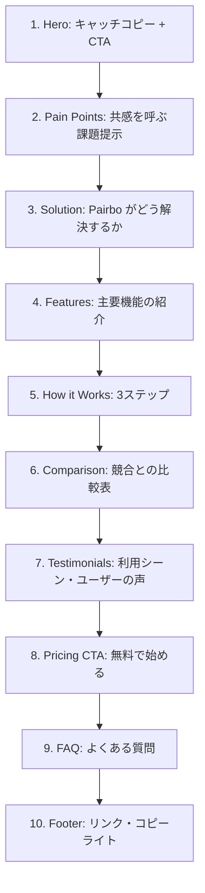
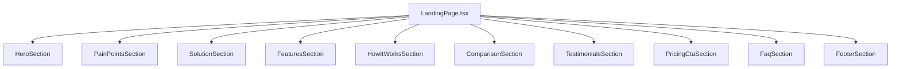

# 設計書: LP（ランディングページ）ブラッシュアップ

## Overview

Pairboのランディングページ（`components/landing/LandingPage.tsx`）を全面的にブラッシュアップする。
コピーライティング・ビジュアル・セクション構成のすべてを見直し、訪問者のコンバージョン（サインアップ）を最大化する。

## Purpose

### 背景

現在のLPは MVP リリース時の最小構成で、以下の課題がある。

| 課題       | 現状                                 | あるべき姿                                     |
| ---------- | ------------------------------------ | ---------------------------------------------- |
| コピー     | 機能説明的（「かんたん支出記録」）   | 感情に訴える（「収入差があっても、フェアに」） |
| 差別化     | Web版・URL招待が Feature の1つに埋没 | Hero レベルで差別化を打ち出す                  |
| ビジュアル | 静的モックデータ、イラストなし       | デバイスモックアップ、アイコンアニメーション   |
| 社会的証明 | なし                                 | ユーザーの声・利用シーン                       |
| 構成       | 5セクション                          | 問題提起→解決→信頼→CTA の最適化された構成      |

### 競合LP分析

| アプリ     | Hero メッセージ                       | 特徴的な手法                        |
| ---------- | ------------------------------------- | ----------------------------------- |
| Splitwise  | 「Less stress when sharing expenses」 | 感情訴求、ペルソナ別ローテーション  |
| OsidOri    | 「夫婦で一緒に、お金をカンタン管理」  | プライバシー訴求、Sticky CTA        |
| Zaim       | 「貯まる＆増える 家計簿アプリ」       | 定量的な成果証明（月 40,653円節約） |
| MoneyBoard | 「こんなお悩みありませんか？」        | 問題→解決の日本的LPパターン         |

### Pairbo の差別化ポイント（LP で前面に出すべき）

1. **Webアプリ = アプリインストール不要** — 全競合がアプリストア経由。唯一の Web ファースト
2. **PWA でアプリのように使える** — ホーム画面に追加すればネイティブアプリと同じ体験。ストレージも圧迫しない
3. **URL 招待で即開始** — 「アプリ入れて」のハードルがない
4. **傾斜折半** — 収入差のあるカップルの公平性問題を解決

### ターゲットのニュアンス

Pairbo は **お財布が別のカップル・夫婦** のための支出管理アプリ。
口座を一本化せず、それぞれのお財布から支払いつつ公平に精算したいペアがターゲット。
「共有口座」ではなく「別々のお財布のままでも、支出をフェアに管理できる」がコアメッセージ。

## What to Do

### 機能要件

#### セクション構成（上から順）



#### 1. Hero セクション

- **メインコピー**: 「アプリ不要。URLひとつで、今日から割り勘。」
- **サブコピー**: 「お財布が別でも、支出はフェアに。同棲カップル・夫婦のための共有家計簿」
- **CTA**: 「無料で始める」（プライマリ）+ 「ログイン」（セカンダリ）
- **ビジュアル**: スマートフォンデバイスモックアップ（実際のアプリ画面風の静的UI）
- 「アプリ不要」「ホーム画面に追加でアプリ化」「登録30秒」を明示するバッジ

#### 2. Pain Points（課題提示セクション）

「こんなお悩みありませんか？」形式（日本的LP定番パターン）。

| Pain Point                             | アイコン        | 説明                                               |
| -------------------------------------- | --------------- | -------------------------------------------------- |
| 収入差で50:50は不公平                  | Scale           | 「稼ぎが違うのに均等割り…モヤモヤしませんか？」    |
| スプレッドシートが続かない             | FileSpreadsheet | 「共有シートを作ったけど、入力が面倒で三日坊主に」 |
| 相手にアプリを入れてもらうのがハードル | Smartphone      | 「『このアプリ入れて』って言いづらい…」            |
| 月末の精算が面倒                       | Calculator      | 「結局いくら払えばいいの？毎月の計算がストレス」   |

#### 3. Solution（解決セクション）

「Pairbo なら、すべて解決。」

| 解決策                    | 対応する Pain Point        |
| ------------------------- | -------------------------- |
| 6:4 や金額指定の傾斜折半  | 収入差の不公平             |
| 3タップで記録完了         | スプレッドシートが続かない |
| URLを送るだけ。アプリ不要 | インストールのハードル     |
| 月末に自動で精算額を計算  | 精算が面倒                 |

#### 4. Features（主要機能）

現在の5機能を見直し、差別化ポイントを優先的に配置。

| #   | 機能          | アイコン     | 説明                                                       |
| --- | ------------- | ------------ | ---------------------------------------------------------- |
| 1   | URL招待       | Link         | 相手にURLを送るだけ。30秒で一緒に始められる                |
| 2   | 傾斜折半      | Scale        | 均等・割合・金額指定・全額負担。お財布が別でも公平に       |
| 3   | PWAでアプリ化 | Smartphone   | ホーム画面に追加すればアプリのように使える。ストレージ不要 |
| 4   | かんたん記録  | Zap          | 金額とカテゴリを選ぶだけ。3タップで記録完了                |
| 5   | 自動精算      | Calculator   | 月末に自動計算。誰が誰にいくら払うか一目瞭然               |
| 6   | 分析グラフ    | PieChart     | カテゴリ別・月別の支出を可視化                             |
| 7   | 買い物リスト  | ShoppingCart | 「ティッシュ買って」もアプリ内で完結                       |

#### 5. How it Works（使い方 3ステップ）

既存と同様だが、各ステップにミニイラスト（アイコン構成）を追加。

1. グループを作成 → 招待URLをパートナーに送る
2. 支出を記録 → 3タップで完了
3. 月末に精算 → アプリが自動計算

#### 6. Comparison（競合比較表）— 新規追加

マーケティング資料にある比較表をLP化。

| 特徴                     | Pairbo   | 一般的な割り勘アプリ | スプレッドシート |
| ------------------------ | -------- | -------------------- | ---------------- |
| アプリインストール       | 不要     | 必要                 | 不要             |
| ホーム画面追加でアプリ化 | ○（PWA） | ○                    | ×                |
| URL で招待               | ○        | ×                    | △                |
| 傾斜折半                 | ○        | △                    | 手動             |
| リアルタイム同期         | ○        | ○                    | ○                |
| 自動精算計算             | ○        | △                    | ×                |
| 買い物リスト             | ○        | ×                    | ×                |

※ 具体的な競合名は出さず「一般的な割り勘アプリ」とする（訴訟リスク回避）

#### 7. Testimonials（利用シーン）— 新規追加

実ユーザーが少ないため、具体的なペルソナベースの利用シーンとして表現。

| ペルソナ             | シーン                 | 引用                                                                              |
| -------------------- | ---------------------- | --------------------------------------------------------------------------------- |
| 同棲カップル（20代） | お財布別で収入差あり   | 「お財布は別のまま、収入に合わせて 7:3 で折半。傾斜折半のおかげで不公平感ゼロ！」 |
| 新婚夫婦（30代）     | 生活費を別会計で管理   | 「共有口座を作らなくても大丈夫。URLを送るだけで始められて楽すぎる。」             |
| シェアハウス（20代） | 光熱費・日用品の割り勘 | 「月末の精算が自動で出るから、もめることがなくなった。」                          |

※ 実ユーザーのレビューが集まったら差し替える

#### 8. Pricing CTA

既存とほぼ同様。「基本機能はすべて無料」+ Premium 誘導。

#### 9. FAQ — 新規追加

| 質問                               | 回答                                                                                                                  |
| ---------------------------------- | --------------------------------------------------------------------------------------------------------------------- |
| 本当に無料で使えますか？           | 基本機能はすべて無料です。傾斜折半や詳細分析が使えるPremiumプランもあります。                                         |
| アプリのインストールは必要ですか？ | 不要です。ブラウザからアクセスするだけで使えます。ホーム画面に追加すればネイティブアプリのように使えます（PWA対応）。 |
| 共有口座が必要ですか？             | いいえ。お財布は別々のままでOKです。それぞれが支払った支出を記録し、月末に差額を精算する仕組みです。                  |
| 2人以上でも使えますか？            | はい。シェアハウスなど複数人のグループにも対応しています。                                                            |
| データのセキュリティは？           | データは暗号化して保存しています。クレジットカード情報はStripe社が安全に管理します。                                  |

#### 10. Footer

既存と同一。プライバシーポリシー・利用規約・特定商取引法リンク。

### 非機能要件

| 項目             | 要件                                                |
| ---------------- | --------------------------------------------------- |
| パフォーマンス   | LCP 2.5秒以内。画像は next/image で最適化           |
| レスポンシブ     | モバイルファースト。sm/lg ブレークポイントで対応    |
| アクセシビリティ | セマンティックHTML、alt テキスト、キーボード操作    |
| SEO              | 構造化見出し（h1→h2→h3）、meta description 反映済み |

## How to Do It

### コンポーネント構成



セクション数が多いため、`LandingPage.tsx` 内にインラインで全セクションを定義する。
新規ファイルは作成せず、既存の1ファイル内で完結させる（ルーティングが不要なため）。

### ビジュアルアプローチ

- **Lucide アイコン** を活用（既存依存）。新規イラストアセットは作成しない
- **Tailwind CSS** のグラデーション・シャドウ・アニメーションで視覚的リッチさを実現
- **デバイスモックアップ**: CSS で iPhone 風のフレームを構築し、中に静的 UI を配置
- **配色**: 既存の blue-500 をベースに、slate 系のニュートラルカラーとの組み合わせを維持

### Hero セクションのデバイスモックアップ

現在のApp Previewを改善。実際のアプリ画面に近い見た目の静的UIを CSS デバイスフレーム内に配置。

```
┌──────────────────────────────────────┐
│  アプリ不要。URLひとつで、今日から割り勘。  │
│  同棲カップル・夫婦のための共有家計簿      │
│                                          │
│  [無料で始める]  [ログイン]              │
│                                          │
│  ┌─────────────┐  ← iPhone風フレーム    │
│  │  12月の支出  │                        │
│  │  ¥156,800   │                        │
│  │  ━━━━━━━━━  │  支出バー              │
│  │  食費  ¥45K │                        │
│  │  住居  ¥80K │                        │
│  │  交通  ¥12K │                        │
│  └─────────────┘                        │
│                                          │
│  🚀 アプリ不要  ⚡ 登録30秒  🔒 安全    │
└──────────────────────────────────────┘
```

### Pain Points のレイアウト

2列グリッド（モバイルでは1列）。各カードにアイコン + テキスト。

```
┌─────────────────┐ ┌─────────────────┐
│  ⚖️             │ │  📄             │
│  収入差で50:50は │ │  スプレッドシート │
│  不公平…        │ │  が続かない…    │
└─────────────────┘ └─────────────────┘
┌─────────────────┐ ┌─────────────────┐
│  📱             │ │  🧮             │
│  アプリ入れてと  │ │  月末の精算が    │
│  言いづらい…    │ │  面倒…          │
└─────────────────┘ └─────────────────┘
```

### Comparison テーブル

レスポンシブ対応のため、モバイルではカード形式に切り替えることも検討するが、
初期実装ではシンプルなテーブルで実装し、水平スクロール対応とする。

### FAQ のインタラクション

既存の pricing ページにある `FaqItem` コンポーネントのパターンを再利用。
アコーディオン形式（クリックで展開/折りたたみ）。

### 変更対象ファイル

| ファイル                             | 変更内容             | 規模 |
| ------------------------------------ | -------------------- | ---- |
| `components/landing/LandingPage.tsx` | 全セクション書き直し | 大   |

### セクション間の視覚的リズム

背景色を交互に変えてセクションの区切りを明確にする。

| セクション   | 背景色                 |
| ------------ | ---------------------- |
| Hero         | white + グラデーション |
| Pain Points  | slate-50               |
| Solution     | white                  |
| Features     | slate-50               |
| How it Works | white                  |
| Comparison   | slate-50               |
| Testimonials | white                  |
| Pricing CTA  | slate-800（ダーク）    |
| FAQ          | white                  |
| Footer       | slate-900（ダーク）    |

## What We Won't Do

### スコープ外

1. **実際のスクリーンショット画像の作成**
   - デバイスモックアップは CSS + 静的 UI で構築
   - Figma 等での画像作成は行わない

2. **アニメーションライブラリの導入**
   - Framer Motion 等は導入しない
   - Tailwind CSS の `animate-*` と `transition-*` のみで対応

3. **多言語対応**
   - 日本語のみ。i18n は別タスク

4. **A/B テスト基盤**
   - コピーやレイアウトのA/Bテストは実装しない

5. **OGP画像のリニューアル**
   - 既存の `/og-image.png` をそのまま使用
   - OGP画像の更新は別タスクとして検討

6. **チャット/問い合わせウィジェット**
   - サポート系機能は LP に含めない

## Concerns

### 未解決の懸念点

#### 1. Testimonials の信頼性

**懸念**: 実ユーザーのレビューがまだない段階で「利用シーン」として掲載することの是非。

**対応案**:

- 「こんなシーンで使われています」という表現にする（ユーザーの直接引用ではなく利用イメージ）
- 実ユーザーが増えたら実際のレビューに差し替え
- もしくは Testimonials セクション自体をリリース初期は非表示にし、後日追加

**決定**: 「利用シーン」として掲載し、実レビュー取得後に差し替え

#### 2. 競合比較表の表現

**懸念**: 「一般的な割り勘アプリ」という表現が曖昧で、訪問者に伝わらない可能性。

**対応案**:

- 「割り勘アプリ A」のように匿名化
- 具体的な機能差をより詳しく説明
- 比較表ではなく「Pairbo だけの特徴」として差別化ポイントのみ列挙

**決定**: 「よくある割り勘アプリ」として掲載。曖昧さは許容し、Pairbo のメリットが伝わることを優先

#### 3. コピーの最終決定

**懸念**: メインコピー案が複数あり、どれが最も効果的か不明。

候補:

- A: 「アプリ不要。URLひとつで、今日から割り勘。」 — Web ファーストの差別化
- B: 「収入差があっても、フェアに。」 — 傾斜折半の感情訴求
- C: 「2人の家計、もっとシンプルに。」 — シンプルさ訴求

**決定**: A を採用。Pairbo 最大の差別化である「Web ファースト・インストール不要」を Hero で訴求。B はサブコピーまたは Solution セクションで活用

#### 4. セクション量とスクロール長

**懸念**: 10セクションは長すぎる可能性。離脱率が高くなるリスク。

**対応案**:

- 各セクションをコンパクトに保つ（padding を抑える）
- Sticky CTA の導入（OsidOri パターン）で途中離脱を防ぐ
- GA でスクロール深度を計測して効果検証

**決定**: まず全セクション実装し、GA のスクロール深度データを見て後日削減・統合を検討。Sticky CTA は初期実装に含める

## Reference Materials/Information

### 競合LP

- [Splitwise](https://www.splitwise.com/) — 感情訴求型、ペルソナローテーション
- [OsidOri](https://www.osidori.co/) — 日本市場特化、Sticky CTA、インタラクティブ診断
- [Zaim](https://zaim.net/) — 定量成果証明、12M DL の信頼性
- [MoneyBoard](https://moneyboard.lancerdog.com/lp/money-board/) — 問題→解決パターン、日本的LP構成

### Pairbo 既存資料

- `docs/marketing-strategy.md` — マーケティング戦略（キャッチコピー案、ターゲット層）
- `docs/design-monetization.md` — マネタイズ計画（Free/Premium の機能差）
- `docs/design-free-ads.md` — 広告表示設計

### LP設計参考

- 日本のWebサービスLP の定番構成: 課題提起 → 解決策 → 機能紹介 → 社会的証明 → CTA
- [LPの作り方ガイド](https://lp-web.com/) — 日本語LPのベストプラクティス
