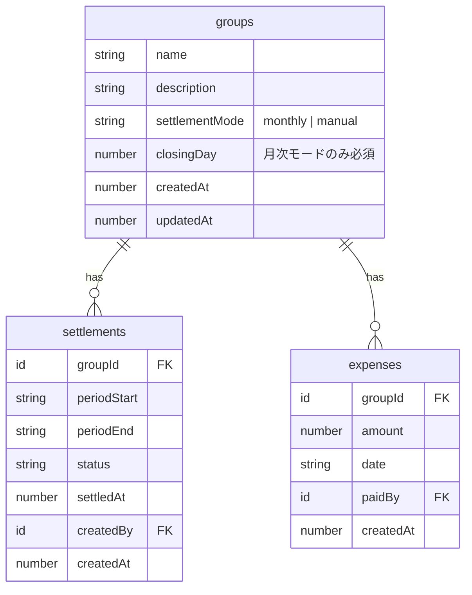
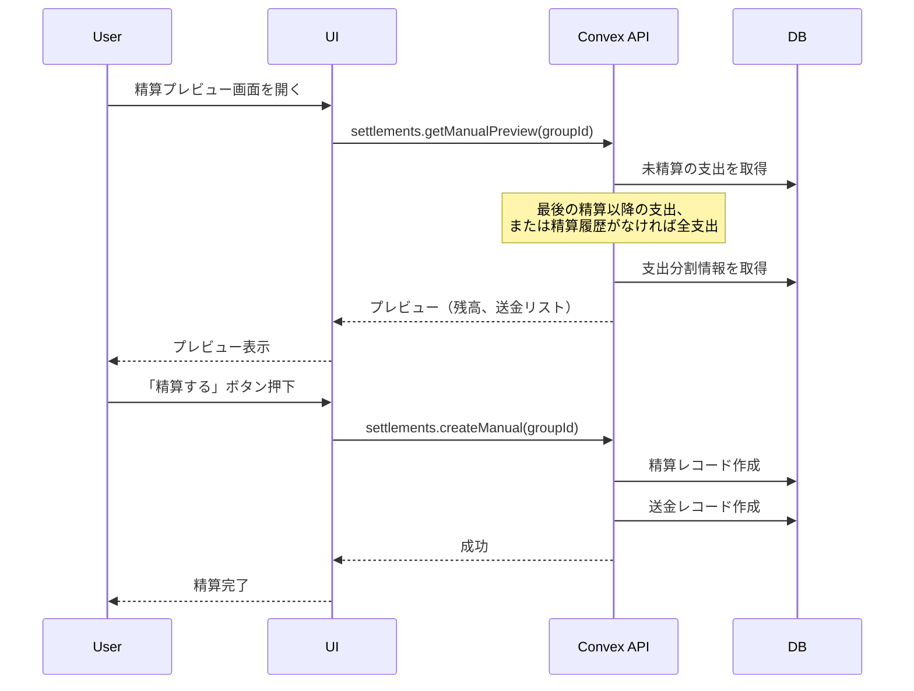
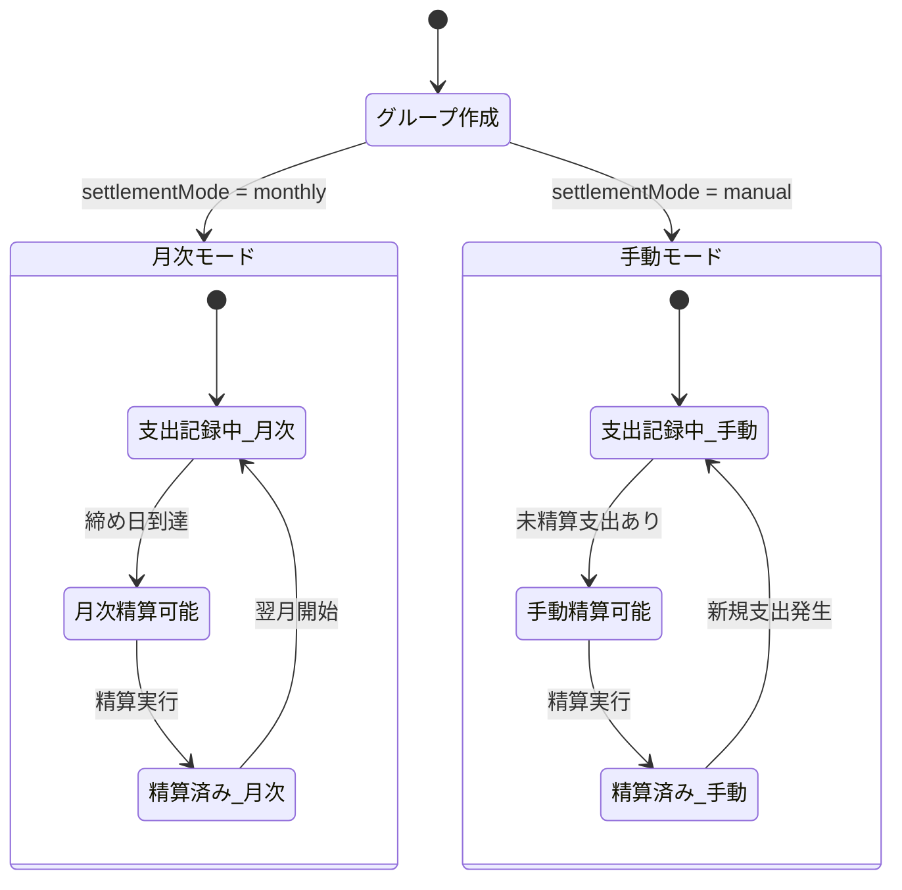

# 設計書: 精算モードの柔軟化（手動精算モード）

## Overview

グループごとに「月次精算モード」と「手動精算モード」を選択可能にする機能。
結婚式や旅行など、複数月にわたるイベントの支出を好きなタイミングでまとめて精算できるようにする。

## Purpose

### 背景

現状のOaikoは**月次精算**を前提として設計されている。

- グループ作成時に「締め日」を設定
- 毎月の締め日で区切って精算

しかし、以下のようなユースケースでは月次精算が不便：

| ユースケース | 期間       | 問題点                                   |
| ------------ | ---------- | ---------------------------------------- |
| 結婚式準備   | 6ヶ月〜1年 | 毎月精算するのが面倒、まとめて精算したい |
| 旅行         | 1〜2週間   | 旅行終了後に一括精算したい               |
| 引っ越し     | 1〜2ヶ月   | 引っ越し完了後にまとめて精算したい       |

### 目的

- **イベント単位での精算**を可能にする
- 既存の月次精算機能は維持する
- シンプルさを保ちつつ、柔軟性を追加する

### 代替案の検討

| アプローチ      | メリット                 | デメリット                   | 採否 |
| --------------- | ------------------------ | ---------------------------- | ---- |
| タグ/ラベル機能 | 1グループで完結          | 毎回タグ付けが面倒、実装複雑 | ❌   |
| 精算モード選択  | シンプル、既存機能と共存 | グループを分ける必要あり     | ✅   |
| 何もしない      | 開発コストゼロ           | ユーザー体験の妥協           | ❌   |

## What to Do

### 機能要件

#### FR-1: 精算モードの選択

グループ作成時に精算モードを選択できる。

| モード          | 説明                                       | 締め日設定 |
| --------------- | ------------------------------------------ | ---------- |
| 月次（monthly） | 従来通り、月ごとに精算期間が自動設定される | 必須       |
| 手動（manual）  | 精算ボタンを押すまで支出が累積される       | 不要       |

#### FR-2: 手動モードの精算フロー

```
支出を記録 → 累積 → 「精算する」ボタン → 未精算の全支出を対象に精算
```

- 精算実行時点までの**未精算の全支出**が対象
- 精算後、新たに記録された支出は次の精算まで累積

#### FR-3: 精算履歴の表示

手動モードでも精算履歴は保持される。

- 精算日時
- 対象期間（最古の支出日〜精算実行日）
- 精算金額・送金情報

#### FR-4: モード変更の制限

- グループ作成後のモード変更は**不可**
- 理由: 既存の精算データとの整合性が複雑になるため

### 非機能要件

#### NFR-1: 後方互換性

- 既存グループは自動的に「月次モード」として扱う
- `settlementMode` が未設定の場合は `monthly` とみなす

#### NFR-2: パフォーマンス

- 手動モードで大量の未精算支出がある場合も、精算計算は1秒以内

## How to Do It

### データモデルの変更

#### groups テーブル

```typescript
groups: defineTable({
  name: v.string(),
  description: v.optional(v.string()),
  settlementMode: v.optional(v.union(
    v.literal("monthly"),
    v.literal("manual")
  )), // 追加: デフォルト "monthly"
  closingDay: v.optional(v.number()), // 変更: 手動モードでは不要なためoptionalに
  createdAt: v.number(),
  updatedAt: v.number(),
}),
```

#### settlements テーブル

```typescript
settlements: defineTable({
  groupId: v.id("groups"),
  periodStart: v.string(), // 手動モードでは最古の未精算支出日
  periodEnd: v.string(),   // 手動モードでは精算実行日
  status: settlementStatusValidator,
  settledAt: v.optional(v.number()),
  createdBy: v.id("users"),
  createdAt: v.number(),
}).index("by_group_and_period", ["groupId", "periodStart"]),
```

※ 手動モードでも同じテーブル構造を使用（変更不要）

### ER図



### 精算フロー（手動モード）



### 状態遷移図



### API設計

#### 既存APIの変更

| API                | 変更内容                              |
| ------------------ | ------------------------------------- |
| `groups.create`    | `settlementMode` パラメータ追加       |
| `groups.getDetail` | `settlementMode` をレスポンスに含める |

#### 新規API

| API                            | 説明                         |
| ------------------------------ | ---------------------------- |
| `settlements.getManualPreview` | 手動モード用のプレビュー取得 |
| `settlements.createManual`     | 手動モード用の精算実行       |

または、既存の `getPreview` / `create` を拡張して両モードに対応させる方法もある。

### 実装方針

#### Phase 1: スキーマ変更

1. `groups` テーブルに `settlementMode` 追加
2. `closingDay` を optional に変更
3. マイグレーション: 既存グループは `settlementMode = "monthly"` を設定

#### Phase 2: グループ作成UI

1. モード選択UIを追加
2. 手動モードの場合は締め日入力を非表示に

#### Phase 3: 精算ロジック

1. `getManualPreview`: 最後の精算以降の支出を取得して計算
2. `createManual`: 期間を動的に計算して精算レコード作成

#### Phase 4: 精算UI

1. 手動モードの場合は年月選択ではなく「現在の未精算」を表示
2. 精算履歴の表示を調整

### コード変更箇所

| ファイル                            | 変更内容                    | 規模 |
| ----------------------------------- | --------------------------- | ---- |
| `convex/schema.ts`                  | settlementMode追加          | 小   |
| `convex/lib/validators.ts`          | settlementModeValidator追加 | 小   |
| `convex/groups.ts`                  | create/getDetail変更        | 小   |
| `convex/settlements.ts`             | getPreview/create拡張       | 中   |
| `convex/domain/settlement/`         | 手動モード用関数追加        | 中   |
| `app/groups/create/`                | モード選択UI                | 小   |
| `app/groups/[groupId]/settlements/` | 精算UI調整                  | 中   |

## What We Won't Do

### スコープ外

1. **グループ横断の支出俯瞰機能**
   - 複数グループの支出を合算して表示する機能は含まない
   - 将来的なダッシュボード機能として検討

2. **モード変更機能**
   - 作成後のモード変更は実装しない
   - 必要な場合は新しいグループを作成する運用

3. **タグ/ラベル機能**
   - 支出へのタグ付けは実装しない
   - グループ分離で対応

4. **メンバー共有機能**
   - 複数グループ間でのメンバー情報共有は実装しない

5. **部分精算**
   - 一部の支出だけを選んで精算する機能は実装しない
   - 未精算の全支出が対象

## Concerns

### 未解決の懸念

#### 1. 既存データのマイグレーション

**問題**: `closingDay` を optional にすると、既存グループで undefined になる可能性

**対応案**:

- マイグレーションで既存グループに明示的に `settlementMode: "monthly"` を設定
- バリデーションで月次モードの場合は `closingDay` 必須を維持

#### 2. 手動モードの期間表示

**問題**: 手動モードの精算履歴で「期間」をどう表示するか

**対応案**:

- `periodStart`: 最古の未精算支出の日付
- `periodEnd`: 精算実行日
- 表示: 「2024/06/15 〜 2025/01/10」のような形式

#### 3. 支出が0件の場合の精算

**問題**: 手動モードで未精算支出がない場合の挙動

**対応案**:

- 「精算する支出がありません」と表示
- 精算ボタンは非活性化

#### 4. 長期間の累積による表示問題

**問題**: 1年分の支出が累積した場合、リスト表示が長くなりすぎる

**対応案**:

- 精算プレビューでは集計結果のみ表示
- 詳細な支出リストは別画面で確認

### 将来的な拡張可能性

1. **精算スケジュール設定**
   - 手動モードでも「3ヶ月ごと」などのリマインダー設定

2. **イベント名の設定**
   - 手動モードのグループに「結婚式」などのイベント名を付与

3. **締め日の柔軟化**
   - 月次モードでも「毎週日曜」などの期間設定

## Reference Materials/Information

### 関連ドキュメント

- `docs/mvp-features.md` - MVP機能仕様
- `CLAUDE.md` - プロジェクト概要

### 現行コード

- `convex/schema.ts` - 現在のスキーマ定義
- `convex/settlements.ts` - 精算ロジック
- `convex/domain/settlement/calculator.ts` - 精算計算ロジック

### 参考アプリ

- Splitwise - 精算タイミングは手動、グループ単位で管理
- Shareroo - 月次精算モデル（Oaikoの参考元）
