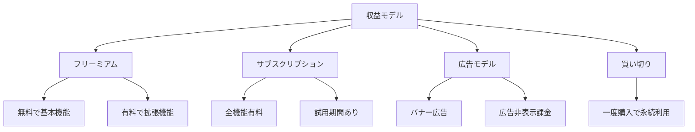
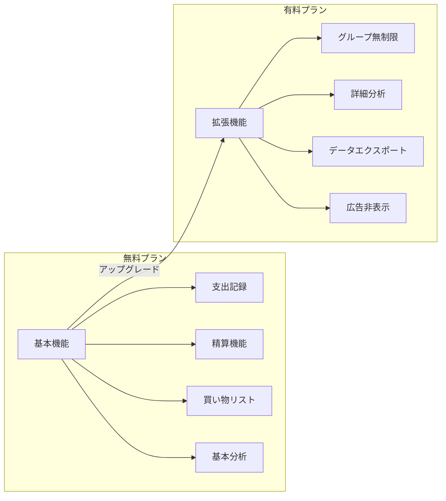
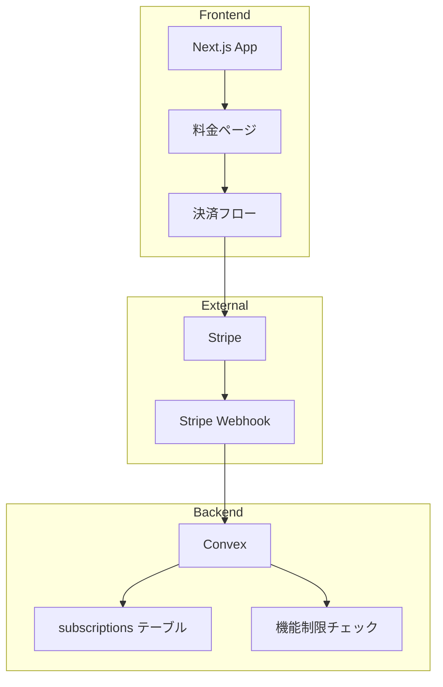
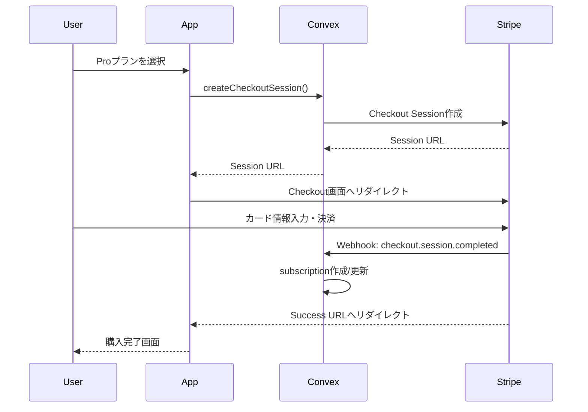
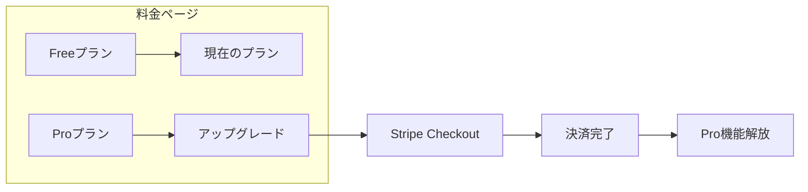

# 設計書: マネタイズ計画

## Overview

Oaikoの収益化戦略を検討・策定するための設計書。
個人開発アプリとして持続可能な運営を目指しつつ、ユーザー体験を損なわない収益モデルを設計する。

## Purpose

### 背景

現在のOaikoは完全無料で運営しているが、以下の運用コストが発生している。

| サービス | 無料枠             | 超過時の費用 |
| -------- | ------------------ | ------------ |
| Convex   | 1M 関数呼び出し/月 | 従量課金     |
| Clerk    | 10,000 MAU         | $0.02/MAU    |
| Vercel   | 100GB 帯域幅/月    | 従量課金     |

小規模（〜1000 MAU）であれば無料枠内で運用可能だが、成長した場合のコスト対策が必要。

### 目的

1. **持続可能性**: 運用コストを賄える収益構造の確立
2. **ユーザー体験**: 無料ユーザーにも十分な価値を提供
3. **成長余地**: スケール時にも破綻しないモデル設計

### 代替案：収益化しない選択

| アプローチ   | メリット               | デメリット                     |
| ------------ | ---------------------- | ------------------------------ |
| 完全無料継続 | UX最優先、シンプル     | コスト増大リスク、持続性不安   |
| 寄付モデル   | ユーザーフレンドリー   | 収益予測困難、安定しない       |
| 収益化       | 持続可能、機能拡張資金 | 実装コスト、ユーザー離脱リスク |

→ 小規模であれば当面は無料継続も選択肢。ただし将来に備えた設計は必要。

## What to Do

### 収益モデルの比較



#### 1. フリーミアム（推奨）

**概要**: 基本機能は無料、拡張機能は有料

| 項目             | 評価                   |
| ---------------- | ---------------------- |
| UXへの影響       | ◎ 無料でも十分使える   |
| 収益予測         | △ 課金率次第           |
| 実装コスト       | ○ 機能制限の実装が必要 |
| スケーラビリティ | ◎ ユーザー増で収益増   |

**Oaikoに適している理由**:

- 家計簿アプリは継続利用が前提
- 基本機能で価値を感じてもらい、ヘビーユーザーが課金
- 競合（Shareroo等）もフリーミアムが主流

#### 2. サブスクリプション（全機能有料）

**概要**: 月額/年額で全機能を提供

| 項目             | 評価                 |
| ---------------- | -------------------- |
| UXへの影響       | × 試用ハードルが高い |
| 収益予測         | ◎ 安定した収益       |
| 実装コスト       | ◎ シンプル           |
| スケーラビリティ | ◎ 予測しやすい       |

**Oaikoに適さない理由**:

- 無名アプリに最初から課金するユーザーは少ない
- 競合が無料プランを提供している

#### 3. 広告モデル

**概要**: 無料で提供し広告収益を得る

| 項目             | 評価                 |
| ---------------- | -------------------- |
| UXへの影響       | × 広告がUXを損なう   |
| 収益予測         | △ 表示数次第         |
| 実装コスト       | ○ 広告SDK導入        |
| スケーラビリティ | ○ ユーザー増で収益増 |

**Oaikoに適さない理由**:

- 家計簿は毎日使うため広告ストレスが大きい
- 小規模では広告収益が微々たるもの

#### 4. 買い切り

**概要**: 一度の購入で永続利用

| 項目             | 評価               |
| ---------------- | ------------------ |
| UXへの影響       | ○ 購入後は快適     |
| 収益予測         | × 新規ユーザー頼み |
| 実装コスト       | ◎ シンプル         |
| スケーラビリティ | × 継続収益なし     |

**Oaikoに適さない理由**:

- サーバーコストは継続的に発生
- 機能追加のモチベーションが低下

### 推奨: フリーミアムモデル



### 機能要件

#### FR-1: プラン体系

| プラン | 価格                     | 対象           |
| ------ | ------------------------ | -------------- |
| Free   | 無料                     | ライトユーザー |
| Pro    | 月額300円 or 年額2,400円 | ヘビーユーザー |

※ 価格は競合調査を踏まえて設定（後述）

#### FR-2: 無料プランの制限

| 機能                | 無料                       | Pro          |
| ------------------- | -------------------------- | ------------ |
| グループ数          | 2つまで                    | 無制限       |
| メンバー数/グループ | 5人まで                    | 無制限       |
| 支出履歴            | 過去12ヶ月                 | 無制限       |
| 分析機能            | 基本（円グラフ・棒グラフ） | 詳細レポート |
| データエクスポート  | ×                          | CSV/PDF      |
| 優先サポート        | ×                          | ○            |

**設計思想**:

- 同棲カップル（2人）なら無料で十分使える
- シェアハウス（3人以上）やヘビーユーザーが課金対象
- 基本機能は制限しない（支出記録、精算は無料）

#### FR-3: 有料機能の詳細

##### グループ無制限

- 無料: 2グループまで
- Pro: 無制限
- ユースケース: 「同棲」「友人との旅行」「職場」など複数グループを使い分けたい人

##### 詳細分析

- 無料: カテゴリ別円グラフ、月別推移（6ヶ月）
- Pro:
  - 年間レポート
  - メンバー別支出分析
  - カスタム期間指定
  - 前年比較

##### データエクスポート

- 無料: なし
- Pro: CSV/PDFでデータ出力
- ユースケース: 確定申告、家計簿の記録保存

#### FR-4: 課金・決済

| 項目         | 仕様                               |
| ------------ | ---------------------------------- |
| 決済手段     | クレジットカード（Stripe）         |
| 課金サイクル | 月次 or 年次                       |
| 試用期間     | 14日間（クレジットカード登録不要） |
| 解約         | いつでも可能、期間終了まで利用可   |
| 返金         | 原則なし（Stripeの仕様に準拠）     |

### 非機能要件

#### NFR-1: 決済セキュリティ

- PCI DSS準拠（Stripe経由で達成）
- カード情報はサーバーに保存しない

#### NFR-2: 可用性

- 決済失敗時のリトライ機構
- グレースピリオド（決済失敗後も一定期間利用可能）

## How to Do It

### システムアーキテクチャ



### データモデル

#### subscriptions テーブル

```typescript
subscriptions: defineTable({
  userId: v.id("users"),
  stripeCustomerId: v.string(),
  stripeSubscriptionId: v.optional(v.string()),
  plan: v.union(v.literal("free"), v.literal("pro")),
  status: v.union(
    v.literal("active"),
    v.literal("canceled"),
    v.literal("past_due"),
    v.literal("trialing")
  ),
  currentPeriodStart: v.optional(v.number()),
  currentPeriodEnd: v.optional(v.number()),
  cancelAtPeriodEnd: v.boolean(),
  createdAt: v.number(),
  updatedAt: v.number(),
})
  .index("by_user", ["userId"])
  .index("by_stripe_customer", ["stripeCustomerId"]),
```

### 決済フロー



### 機能制限の実装

```typescript
// convex/lib/subscription.ts
export async function checkFeatureAccess(
  ctx: QueryCtx,
  userId: Id<"users">,
  feature: "unlimited_groups" | "detailed_analytics" | "export",
): Promise<boolean> {
  const subscription = await ctx.db
    .query("subscriptions")
    .withIndex("by_user", (q) => q.eq("userId", userId))
    .unique();

  // Proプランならすべての機能にアクセス可能
  if (subscription?.plan === "pro" && subscription.status === "active") {
    return true;
  }

  // 無料プランは制限付き
  return false;
}

// グループ数チェックの例
export async function canCreateGroup(
  ctx: QueryCtx,
  userId: Id<"users">,
): Promise<boolean> {
  const isPro = await checkFeatureAccess(ctx, userId, "unlimited_groups");
  if (isPro) return true;

  // 無料プランは2グループまで
  const groupCount = await ctx.db
    .query("groupMembers")
    .withIndex("by_user", (q) => q.eq("userId", userId))
    .collect();

  return groupCount.length < 2;
}
```

### 料金ページUI



### 実装順序

#### Phase 1: 基盤構築

1. Stripe アカウント設定
2. subscriptions テーブル追加
3. Webhook エンドポイント実装
4. 機能制限ヘルパー実装

#### Phase 2: 決済フロー

1. 料金ページ作成
2. Checkout Session 実装
3. 決済完了後の処理
4. Customer Portal 連携（プラン管理）

#### Phase 3: 機能制限

1. グループ数制限
2. 詳細分析機能のPro限定化
3. エクスポート機能実装（Pro限定）

#### Phase 4: 運用

1. 解約フロー
2. 決済失敗時の処理
3. メトリクス収集

### コード変更箇所

| ファイル                     | 変更内容                   | 規模 |
| ---------------------------- | -------------------------- | ---- |
| `convex/schema.ts`           | subscriptions テーブル追加 | 小   |
| `convex/subscriptions.ts`    | 新規作成                   | 中   |
| `convex/lib/subscription.ts` | 機能制限ヘルパー           | 中   |
| `convex/groups.ts`           | グループ数制限追加         | 小   |
| `convex/analytics.ts`        | 詳細分析のPro限定化        | 小   |
| `app/pricing/`               | 料金ページ                 | 中   |
| `app/api/stripe/webhook/`    | Webhook処理                | 中   |
| `app/settings/subscription/` | プラン管理ページ           | 中   |

## What We Won't Do

### スコープ外

1. **チーム向けプラン**
   - 企業・チーム向けの上位プランは実装しない
   - まずは個人・カップル向けに集中

2. **複数通貨対応**
   - 日本円のみ対応
   - 海外展開は将来課題

3. **アプリ内課金（IAP）**
   - ネイティブアプリ化するまでは不要
   - Web決済（Stripe）のみ

4. **ポイント・クーポン機能**
   - 複雑性が増すため初期は見送り

5. **返金処理の自動化**
   - 手動対応で十分な規模

## Concerns

### 未解決の懸念

#### 1. 価格設定

**問題**: 適切な価格がわからない

**検討材料**:

| 競合アプリ    | 価格     | 機能                     |
| ------------- | -------- | ------------------------ |
| Shareroo      | 無料     | 基本機能のみ             |
| Splitwise Pro | $4.99/月 | 広告非表示、スキャン機能 |
| Tricount      | 無料     | 基本機能のみ             |

**対応案**:

- 月額300円（年額2,400円）からスタート
- ユーザーフィードバックを見て調整
- 「コーヒー1杯分」の心理的価格帯

#### 2. 課金率の予測

**問題**: 何%のユーザーが課金するか不明

**一般的な指標**:

- フリーミアムアプリの平均課金率: 2-5%
- ロイヤルユーザーほど高い

**対応案**:

- 1000 MAUで20-50人が課金と仮定
- 月額300円 × 30人 = 9,000円/月
- 最低限の運用コストはカバー可能

#### 3. 無料ユーザーへの制限の伝え方

**問題**: 制限に気づかず不満を持つ可能性

**対応案**:

- 制限に近づいたらUI上で通知
- 「Proにアップグレードで無制限」と明示
- 制限内でも十分使えることを強調

#### 4. Stripe手数料

**問題**: 少額決済で手数料比率が高い

**計算**:

- Stripe手数料: 3.6% + ¥40/件
- 月額300円の場合: 10.8円 + 40円 = 50.8円（約17%）
- 年額2,400円の場合: 86.4円 + 40円 = 126.4円（約5%）

**対応案**:

- 年額プランを推奨（割引を設定）
- 年額なら手数料率が大幅に下がる

### 将来的な検討事項

1. **ファミリープラン**
   - 複数ユーザーをまとめて課金

2. **紹介プログラム**
   - 紹介者・被紹介者に特典

3. **企業向けプラン**
   - 経費精算用途への拡張

## Reference Materials/Information

### 競合調査

- [Shareroo](https://shareroo.app/) - iOS/Android、無料
- [Splitwise](https://www.splitwise.com/) - フリーミアム、$4.99/月
- [Tricount](https://www.tricount.com/) - 無料

### 技術ドキュメント

- [Stripe Checkout](https://stripe.com/docs/payments/checkout)
- [Stripe Webhooks](https://stripe.com/docs/webhooks)
- [Stripe Customer Portal](https://stripe.com/docs/customer-management)

### 価格戦略参考

- [サブスクリプション価格設定のベストプラクティス](https://stripe.com/guides/subscription-business-models)

### 現行コード

- `convex/schema.ts` - 現在のスキーマ定義
- `convex/groups.ts` - グループ機能（制限追加対象）
- `convex/analytics.ts` - 分析機能（Pro限定化対象）

---

## 決定事項まとめ

| 項目       | 決定                                |
| ---------- | ----------------------------------- |
| 収益モデル | フリーミアム                        |
| 価格       | 月額300円 / 年額2,400円             |
| 無料制限   | 2グループ、5人/グループ、12ヶ月履歴 |
| 決済手段   | Stripe                              |
| 実装優先度 | MVP後、ユーザー増加時に実装         |

## 次のアクション

1. **今すぐ**: ユーザー獲得に集中（無料で価値を証明）
2. **100+ MAU到達時**: フィードバック収集、課金ニーズ確認
3. **500+ MAU到達時**: マネタイズ実装開始

## 開発者アカウント

開発者はStripe課金なしでPremium機能を利用できる。

### 設定方法

1. Convexダッシュボード → Data → `users`テーブル → 対象ユーザーの`_id`をコピー
2. `subscriptions`テーブル → 「Add document」で以下を追加:

| フィールド        | 値                              |
| ----------------- | ------------------------------- |
| userId            | コピーしたユーザーID            |
| stripeCustomerId  | `dev_admin`（開発者用ダミー値） |
| plan              | `premium`                       |
| status            | `active`                        |
| cancelAtPeriodEnd | `false`                         |
| createdAt         | 現在のタイムスタンプ（ミリ秒）  |
| updatedAt         | 現在のタイムスタンプ（ミリ秒）  |

### 識別方法

- `stripeCustomerId`が`dev_admin`のレコードは開発者用
- 通常のStripe課金ユーザーは`cus_`で始まるID
