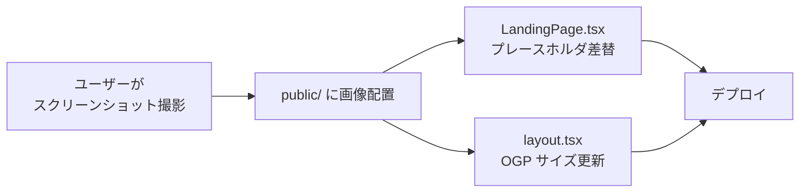
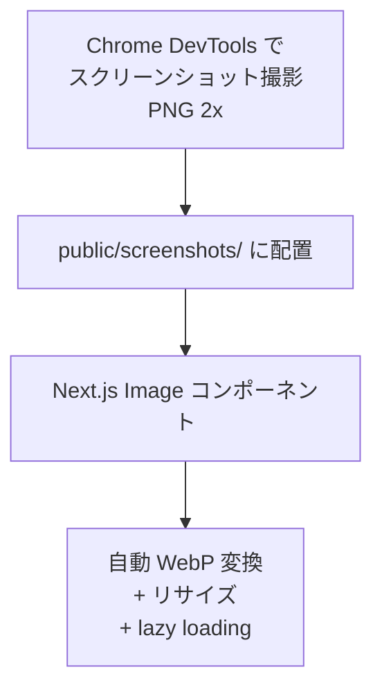

# OGP 画像更新 + LP スクリーンショット追加

## Overview

LP（ランディングページ）の説得力向上と SNS シェア時の見栄え改善を目的に、以下2点を対応する:

1. **OGP 画像の更新**: 現在の 612×408px を推奨サイズ 1200×630px に差し替え
2. **LP スクリーンショット追加**: プレースホルダー（グレーブロック）を実際のアプリ画面キャプチャに差し替え

## Purpose

### OGP 画像

- 現在のOGP画像は **612×408px** で、推奨サイズ（1200×630px）の半分以下
- X（Twitter）や LINE でシェアされたとき、画像がぼやける・小さく表示される
- SNS 経由のクリック率（CTR）に直結する要素

### LP スクリーンショット

- 現在の LP は Hero セクション・使い方セクションがグレーのプレースホルダーのまま
- 「実際にどんな画面なのか」が伝わらないため、離脱率が高くなる可能性
- 実画像に差し替えることで LP の説得力と信頼感を大幅に向上
- `alt` テキスト付きの画像は Google 画像検索からの流入にもつながる

## What to Do

### 機能要件

#### OGP 画像

- [ ] 1200×630px の新しい OGP 画像を `public/og-image.png` に配置
- [ ] `app/layout.tsx` の metadata で `width: 1200, height: 630` に更新
- [ ] デザインは現在のテイスト（青背景 + Pairbo ロゴ + コピー）を踏襲しつつ、LP と統一感を持たせる

#### LP スクリーンショット（4枚）

| #   | セクション                 | 説明               | 推奨キャプチャ画面                       | ファイル名             |
| --- | -------------------------- | ------------------ | ---------------------------------------- | ---------------------- |
| 1   | Hero（スマホモックアップ） | アプリのメイン画面 | グループ支出一覧（期間ナビ付き）         | `screenshot-hero.png`  |
| 2   | 使い方 Step 1              | グループを作成     | グループ作成画面 or 招待URL画面          | `screenshot-step1.png` |
| 3   | 使い方 Step 2              | 支出を記録         | 支出登録フォーム（金額・カテゴリ入力中） | `screenshot-step2.png` |
| 4   | 使い方 Step 3              | 月末に精算         | 精算プレビュー画面（誰→誰にいくら）      | `screenshot-step3.png` |

### 非機能要件

- **画像フォーマット**: WebP（Next.js Image で自動最適化されるが、元画像は PNG で OK）
- **画像サイズ**: 各スクリーンショットは元画像 750px 幅以上を推奨（Retina 対応）
- **パフォーマンス**: Next.js `<Image>` コンポーネントで `loading="lazy"` + `sizes` 指定
- **アクセシビリティ**: すべての画像に日本語の `alt` テキストを設定
- **SEO**: `alt` テキストに主要キーワード（共有家計簿、割り勘、傾斜折半 等）を自然に含める

## How to Do It

### ファイル構成

```
public/
├── og-image.png              ← 1200×630px に差し替え
└── screenshots/              ← 新規ディレクトリ
    ├── screenshot-hero.png
    ├── screenshot-step1.png
    ├── screenshot-step2.png
    └── screenshot-step3.png
```

### 変更対象ファイル



### 1. `app/layout.tsx` — OGP メタデータ更新

変更箇所: `metadata.openGraph.images` の `width` / `height`

```diff
 images: [
   {
     url: "/og-image.png",
-    width: 612,
-    height: 408,
+    width: 1200,
+    height: 630,
     alt: "Pairbo - 2人のための支出管理",
   },
 ],
```

### 2. `components/landing/LandingPage.tsx` — Hero セクション

現在のプレースホルダ（L288-291）を `<Image>` に差し替え:

```tsx
// Before
<div className="aspect-[9/16] bg-slate-100 flex items-center justify-center text-sm text-slate-400">
  スクリーンショット
</div>;

// After
import Image from "next/image";

<Image
  src="/screenshots/screenshot-hero.png"
  alt="Pairbo アプリの支出一覧画面 - カップルの共有家計簿"
  width={360}
  height={640}
  className="w-full h-auto"
  priority
/>;
```

- Hero 画像は `priority` を指定（ファーストビュー内の LCP 候補）
- `aspect-[9/16]` は `<Image>` の `width/height` で自然に保持

### 3. `components/landing/LandingPage.tsx` — 使い方セクション

現在のプレースホルダ（L438-441）を各ステップの画像に差し替え。

`steps` データに `image` と `alt` フィールドを追加:

```ts
const steps = [
  {
    step: "1",
    title: "グループを作成",
    description: "招待URLをパートナーに送るだけ。...",
    image: "/screenshots/screenshot-step1.png",
    alt: "Pairbo グループ作成・招待画面",
  },
  {
    step: "2",
    title: "支出を記録",
    description: "買い物したら金額とカテゴリを...",
    image: "/screenshots/screenshot-step2.png",
    alt: "Pairbo 支出登録フォーム - カテゴリ選択と金額入力",
  },
  {
    step: "3",
    title: "月末に精算",
    description: "自動計算された精算額を確認して...",
    image: "/screenshots/screenshot-step3.png",
    alt: "Pairbo 精算プレビュー画面 - 自動計算された精算額",
  },
];
```

プレースホルダ部分:

```tsx
// Before
<div className="mt-3 h-40 bg-slate-100 rounded-lg flex items-center justify-center text-sm text-slate-400">
  スクリーンショット
</div>

// After
<div className="mt-3 overflow-hidden rounded-lg border border-slate-200">
  <Image
    src={item.image}
    alt={item.alt}
    width={600}
    height={400}
    className="w-full h-auto"
  />
</div>
```

### 4. スクリーンショット撮影ガイド

ユーザーが撮影する際の推奨手順:

| #      | 画面                    | 撮影方法                                                       | 注意点                                                         |
| ------ | ----------------------- | -------------------------------------------------------------- | -------------------------------------------------------------- |
| Hero   | 支出一覧                | Chrome DevTools → iPhone 14 Pro (393×852) → スクリーンショット | シードデータを投入した状態で撮影。個人情報が映らないように注意 |
| Step 1 | グループ作成 or 招待URL | 同上                                                           | 招待URLコピーのUIが見える状態がベスト                          |
| Step 2 | 支出登録フォーム        | 同上                                                           | カテゴリ・金額・負担方法が見える状態                           |
| Step 3 | 精算プレビュー          | 同上                                                           | 「誰が誰にいくら」が見えるのがベスト                           |

**推奨解像度**: DevTools の Device Mode で「Capture screenshot」を使うと **デバイスピクセル比2x** で撮影できる（Retina 対応）

### 画像最適化フロー



Next.js の `<Image>` コンポーネントが自動的に:

- WebP / AVIF に変換
- `srcset` でレスポンシブ配信
- `loading="lazy"` でビューポート外は遅延読み込み（Hero 以外）

→ 手動での画像圧縮は不要。

## What We Won't Do

- **OGP 画像の自動生成（`@vercel/og`）**: 動的 OGP は不要（LP は1ページのみ）
- **スクリーンショットのアニメーション化**: GIF/動画は重いため今回は静止画のみ
- **デスクトップ版スクリーンショット**: モバイルファーストのため、モバイル版のみ
- **Hero セクションのデバイスモックアップ CSS 変更**: 現在のモックアップ枠はそのまま活用
- **ダークモード対応スクリーンショット**: 現状ダークモードは未実装のため不要

## Concerns

| 懸念                                             | 対応方針                                                                                                             |
| ------------------------------------------------ | -------------------------------------------------------------------------------------------------------------------- |
| スクリーンショットにテストデータが不自然に見える | シードデータをリアルな内容（「スーパー」「外食」等）に調整してから撮影                                               |
| OGP 画像のデザインツール                         | ユーザーが Figma / Canva 等で作成。現行デザインのテイスト（青背景 + ロゴ）を踏襲すれば OK                            |
| `"use client"` と `<Image>`                      | Next.js の `<Image>` は Client Component 内でも問題なく動作する                                                      |
| OGP キャッシュ                                   | SNS のOGPキャッシュは即時反映されない。X は [Card Validator](https://cards-dev.twitter.com/validator) で強制更新可能 |

## Reference Materials/Information

- [OGP 推奨画像サイズ](https://ogp.me/) — 1200×630px が標準
- [Next.js Image Optimization](https://nextjs.org/docs/app/building-your-application/optimizing/images)
- [Google 画像検索 SEO ベストプラクティス](https://developers.google.com/search/docs/appearance/google-images)
- 現行マーケティング戦略: `docs/marketing-strategy.md` Phase 2 (2-3, 2-4)
