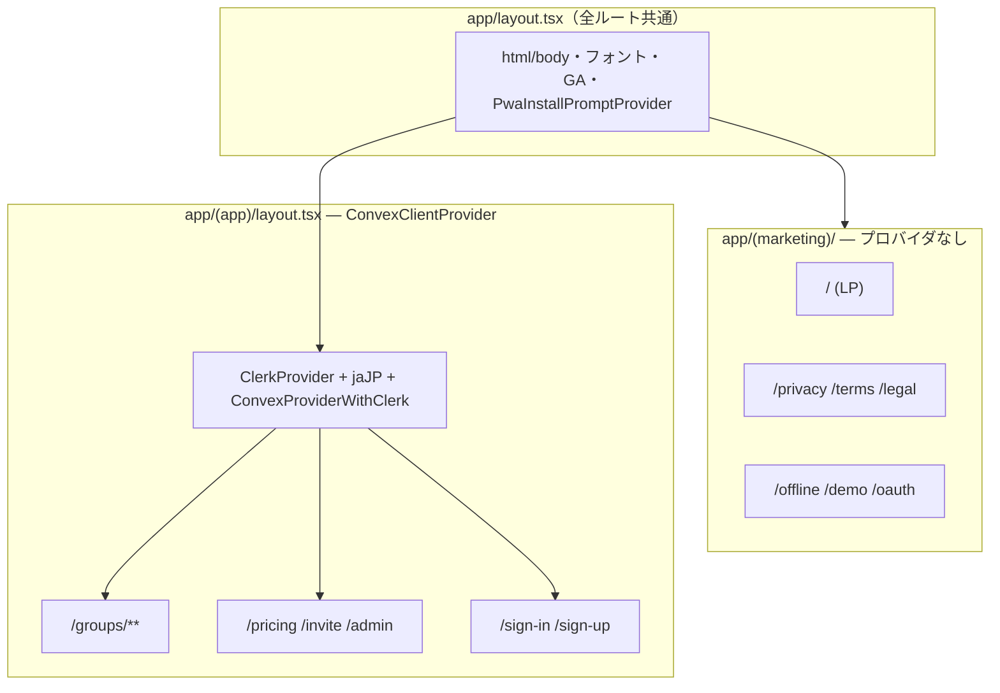
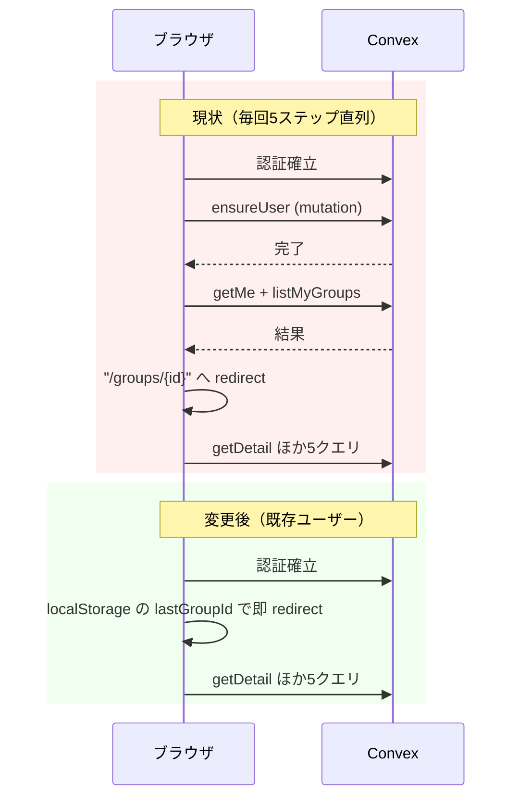

# Overview

パフォーマンス改善4項目の設計。

1. Clerk/Convexプロバイダのマーケティングページ分離（route group分割）
2. PWA `start_url` の `/groups` への変更
3. ログイン後クエリウォーターフォールの解消
4. 分析系Convexクエリの全件 `collect()` 排除

# Purpose

production buildの実測で以下を確認済み。

| ルート    | JS合計 (gzip) | 備考                                            |
| --------- | ------------- | ----------------------------------------------- |
| `/`（LP） | 349KB         | 実行対象は約311KB（38KBは`noModule`のpolyfill） |
| `/groups` | 477KB         | 実質約439KB                                     |

- LPの内訳: Clerk + `@clerk/localizations` jaJP + Convexクライアント系 約110KB、Sentry 約64KB、react-dom 63KB。**静的ページに認証・DBクライアントが載っている**
- PWAは `start_url: "/"` のため、ログイン済みユーザーの起動が LP → ログイン導線 → `/groups` → グループ自動遷移 と多段になっている
- ログイン後の `/groups` は `ensureUser` mutation の完了を全クエリのゲートにしており、毎回1往復余分にかかる
- 分析系クエリはグループの全支出を `collect()` してからJSでフィルタしており、データ蓄積に比例して読み取り量・レイテンシが悪化する構造（Convex本番insightsは現状健全。将来リスクの先回り）

# What to Do

## 機能要件

- 全ルートのURL・表示・挙動は現状維持（route groupはURLに影響しない）
- PWA起動時、ログイン済みユーザーはグループ画面へ直行。未ログインはサインインへリダイレクト
- 初回サインアップ時のユーザー自動作成（`ensureUser`）は引き続き機能する
- 分析系クエリの返却値・集計結果は変更前と完全一致

## 非機能要件

- LPの初期ロードJSを大幅削減（目標: 約150KB gzip前後）
- 既存ユーザーの `/groups` 到達で `ensureUser` の往復を排除
- 分析系クエリの読み取りドキュメント数を対象期間分に限定
- `pnpm format / lint / typecheck / test:run` 全パス

# How to Do It

## 1. route group分割によるプロバイダ分離

### 分割方針

ページのClerk/Convex依存を全数調査した結果:

| ルート                                                                                       | Clerk/Convex依存 | 配置先        |
| -------------------------------------------------------------------------------------------- | ---------------- | ------------- |
| `/`（LP）, `/privacy`, `/terms`, `/legal/*`, `/offline`, `/demo/*`, `/oauth/google/callback` | なし             | `(marketing)` |
| `/groups/**`, `/admin`, `/invite/[token]`, `/pricing`, `/sign-in`, `/sign-up`                | あり             | `(app)`       |

`/pricing` と `/invite/[token]` は公開ページだが `useQuery` / `useConvexAuth` / `UserButton` を使うため `(app)` 側。

### 変更内容

- `app/layout.tsx`: `ConvexClientProvider` の import と wrap を削除。html/body・フォント・metadata・JSON-LD・`GoogleAnalytics`・`PwaInstallPromptProvider`・`pb-14` div は現状維持
- `app/(app)/layout.tsx` 新規: `<ConvexClientProvider>{children}</ConvexClientProvider>` を返すだけのserver component
- `(marketing)` 側にlayoutは作らない（共通UIがないため不要）
- ページディレクトリを上表どおり移動（`git mv` のみ、ファイル内容の変更なし）
- `app/not-found.tsx`, `app/global-error.tsx` はapp直下に残す（プロバイダ非依存）

## 2. PWA start_url変更

- `app/manifest.ts`: `start_url: "/"` → `"/groups"`。`scope: "/"` は維持
- 未ログインで起動した場合はmiddlewareの `auth.protect()` が `/sign-in` へリダイレクト（既存挙動）

## 3. ログイン後ウォーターフォール解消

### 現状と変更後のフロー

### 3a. `ensureUser` ゲートの排除

- `convex/lib/auth.ts` に `optionalAuthQuery` を追加: Clerk identityは必須（なければ従来どおりthrow）、**usersレコード未作成の場合は `ctx.user: null` でhandlerに渡す**。既存の `authQuery` は変更しない
- `convex/users.ts` の `getMe`: `optionalAuthQuery` に移行し、user未作成なら `null` を返す
- `convex/groups.ts` の `listMyGroups`: `optionalAuthQuery` に移行し、user未作成なら `[]` を返す
- `app/groups/page.tsx`: `isUserReady` ゲートを削除し、`isAuthenticated` になり次第 `getMe` + `listMyGroups` を発行。`getMe === null` を検知した時のみ `ensureUser` を実行（refガードで1回のみ）。mutation完了後はConvexのリアクティビティでクエリ結果が自動更新されるため、再購読処理は不要
- サインアップGAイベント（`from=signup`）の発火条件は `isUserReady` → `me != null` に読み替え

`getMe` の返り値に `null` が加わるが、全消費箇所（`app/groups/page.tsx`, `app/groups/[groupId]/page.tsx`, `app/admin/layout.tsx`, `GroupList`, `GroupSettings`, `PwaOnboardingTour`, `NotificationBell`）は調査済みで、すべて `!me` / `me?.` / `me &&` によりnull安全。コード変更が必要な消費側はない（`NotificationBell` の `NonNullable<...>` 型もそのまま成立）。

### 3b. lastGroupIdによる即時リダイレクト

- `app/groups/[groupId]/page.tsx`: `getDetail` 成功時に `localStorage["pairbo.lastGroupId"]` へ保存
- `app/groups/page.tsx`: `?list=true` でない場合、クエリ結果を待たずに `lastGroupId` があれば即 `router.replace`。なければ従来ロジック（1グループ自動遷移 / `defaultGroupId`）にフォールバック
- `app/groups/[groupId]/error.tsx` 新規: `getDetail` がthrowした場合（グループ削除済み・脱退済み・不正ID）に `lastGroupId` をクリアして `/groups?list=true` へ `router.replace`。既存の「不正URLでglobal-errorに落ちる」挙動の改善も兼ねる
- デフォルトグループ設定（`setDefaultGroup`）実行時は `lastGroupId` も同じ値に更新し、設定直後の次回起動が設定と食い違わないようにする

## 4. 分析系クエリの全件collect排除

`by_group_and_date` インデックスの日付range検索（`.gte/.lte`）を使う。既存ヘルパー `getExpensesByPeriod`（`convex/lib/expenseHelper.ts`）がそのまま使える。

| 関数                                   | 現状                               | 変更後                                                                                                                                      |
| -------------------------------------- | ---------------------------------- | ------------------------------------------------------------------------------------------------------------------------------------------- |
| `analytics.getMonthlyTrend`            | 全件collect → 月ごとにJSフィルタ   | 表示Nヶ月分の各期間を先に算出し、最古のstartDate〜最新のendDateの**1回のrangeクエリ**で取得 → JSで月別バケット集計（既存ロジック維持）      |
| `analytics.getYearlyCategoryBreakdown` | 全件collect → 年でJSフィルタ       | `getExpensesByPeriod(ctx, groupId, {startDate: "YYYY-01-01", endDate: "YYYY-12-31"})`                                                       |
| `analytics.getYearlyTagBreakdown`      | 同上                               | 同上                                                                                                                                        |
| `expenses.listByCategoryAllTime`       | 全件collect → カテゴリでJSフィルタ | `by_category` インデックスで `eq(categoryId)` 取得（カテゴリはグループ所属検証済みのため結果は等価。防御的に `groupId` 一致フィルタは残す） |

- 集計ロジック（`buildCategoryBreakdown` / `calculateTagBreakdown` / バケット詰め）は一切変更しない。取得方法のみ変更
- `getMonthlyTrend` の期間またぎ: 締め日設定により月の期間は暦月とずれるが、N期間のmin(startDate)〜max(endDate)は連続区間なので1 rangeで覆える

### テスト

- 既存 `convex/__tests__/analytics.test.ts`, `expenses.test.ts` を全パスさせる（返却値の互換性検証を兼ねる）
- 追加: 期間境界（startDate当日・endDate当日・範囲外前後1日）の支出が集計に正しく入る/入らないことのテスト。締め日設定ありグループでの `getMonthlyTrend` 境界テスト

# What We Won't Do

- 全期間系クエリ（`getAllTimeCategoryBreakdown` / `getAllTimeTagBreakdown` / `listByTagAllTime` の untagged）の最適化: 仕様上全件読む必要があるため対象外
- `listByPeriod` と `getPreview` の二重取得統合（改善案5）・Sentry軽量化（改善案6）: 別タスク
- 未使用の `expenses.listByGroup` 削除: 別タスク（今回のPRに含めると差分レビューのノイズになる）
- サインイン/サインアップページからのConvexクライアント除去: 遷移中ページでコスト対効果が薄い。`(app)` に含めてシンプルに保つ
- Service Workerのdocumentキャッシュ戦略変更

# Alternatives Considered

- **`authQuery` 全体をuser未作成許容にする**: 大半のクエリはuser存在が前提であり、null許容にすると全handlerでnullチェックが必要になる。`getMe` / `listMyGroups` の2つだけを `optionalAuthQuery` に移行する方が影響範囲が小さい → 不採用
- **`ensureUser` をClerk Webhook（user.created）に移行**: Webhookの信頼性・遅延・ローカル開発の複雑さが増す。現行のlazy作成＋ゲート解除で十分 → 不採用
- **`getDetail` をthrowからnull返却に変更**（stale groupId対策）: 認可エラーの意味論が変わり全呼び出し側に影響。route segmentの `error.tsx` で境界処理する方が局所的 → 不採用
- **`getMonthlyTrend` を月ごとにN回のrangeクエリ**: 1回のrangeで十分カバーでき、往復・インデックスシークが増えるだけ → 不採用
- **プロバイダの動的import化（分割せず遅延ロード）**: hydration後に結局ロードされ、認証状態のちらつきが出る。route group分割の方が根本的 → 不採用

# Concerns

## 決定済み（ユーザー確認済み）

- **lastGroupId と defaultGroupId の優先順位**: lastGroupId優先で決定。最後に開いたグループへクエリ待ちゼロで即遷移。デフォルトグループ設定時はlastGroupIdも同期して食い違いを緩和
- **start_urlへの計測パラメータ**: 付けない。`start_url: "/groups"` のみ（PWA判定が必要ならdisplay-modeで可能）

## 残る懸念

- **インストール済みPWAの `start_url` 反映**: manifestの変更は再インストールまで反映されない場合がある（特にiOS）。既存インストールユーザーには効果が出るまでラグがある。害はない（従来動線が残るだけ）
- **`(app)` 配下ページのSSR**: `/pricing` は現状static prerender（○）。`(app)` に移してもlayoutがclient providerを含むだけならstaticのまま維持されるはずだが、ビルド後に `Route (app)` 出力で ○/ƒ が変わっていないか確認する
- **バンドル削減の実測確認**: 実装後、今回と同じ計測（prerendered HTMLの参照チャンク合計）でLP約150KB gzipを確認する

# Reference Materials/Information

- 計測方法: `pnpm build` 後、`.next/server/app/*.html` が参照する `/_next/static/chunks/*.js` の合計（gzip -9）
- Convex本番insights: 直近72hで異常なし（`https://dashboard.convex.dev/d/hip-moose-165?view=insights`）
- 依存調査: `grep -rln "useQuery|useMutation|useAuth|useUser|useSession|ClerkProvider|SignIn|SignUp|useConvexAuth" app/` の結果に基づく
- `docs/design-staging-environment.md`（デプロイフロー）、`CLAUDE.md`（PR前チェック）
