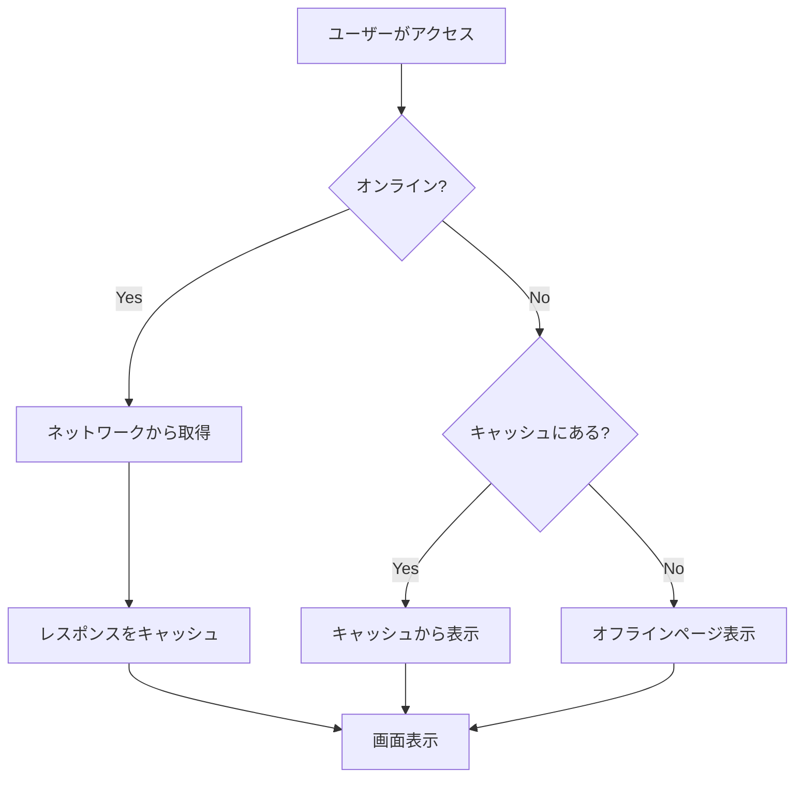
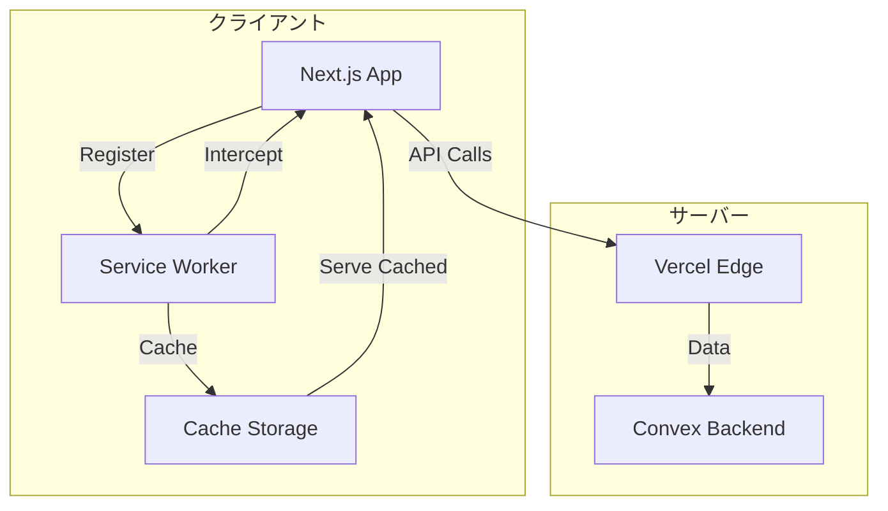

# PWA対応 設計ドキュメント

## 概要

OaikoアプリをProgressive Web App（PWA）として構成し、ネイティブアプリに近いユーザー体験を提供する。

## 目的

1. **ホーム画面追加**: アプリアイコンからワンタップで起動可能にする
2. **スタンドアロン体験**: ブラウザのUIを非表示にし、アプリらしい見た目を実現
3. **オフライン対応（基本）**: アプリシェルをキャッシュし、オフライン時も最低限の表示を可能にする
4. **将来の拡張性**: プッシュ通知やより高度なオフライン機能への足がかり

### なぜPWAか

- URLで招待できる（アプリストア不要）という差別化を維持
- インストール不要だが、ホーム画面に追加すればネイティブ風の体験
- Webの利点を活かしつつ、UXを向上

## やること

### 機能要件

1. **Web App Manifest**
   - アプリ名、アイコン、テーマカラー、起動方法の定義
   - iOS/Android両対応

2. **Service Worker**
   - アプリシェル（HTML/CSS/JS）のキャッシュ
   - オフライン時のフォールバック表示

3. **アプリアイコン**
   - 各種サイズのアイコン生成（192x192, 512x512等）
   - Apple Touch Icon対応

4. **メタタグ設定**
   - iOS向けメタタグ（apple-mobile-web-app-capable等）
   - テーマカラー、ステータスバースタイル

### 非機能要件

- Lighthouse PWAスコア: 90点以上
- インストールプロンプト対応
- HTTPS必須（Vercelでは自動）

## やり方

### 1. Web App Manifest

Next.js App Routerの`app/manifest.ts`を使用して動的に生成:

```typescript
// app/manifest.ts
import type { MetadataRoute } from "next";

export default function manifest(): MetadataRoute.Manifest {
  return {
    name: "Oaiko - 共有家計簿",
    short_name: "Oaiko",
    description: "割り勘・傾斜折半ができる共有家計簿アプリ",
    start_url: "/",
    display: "standalone",
    background_color: "#ffffff",
    theme_color: "#3b82f6", // blue-500
    orientation: "portrait",
    icons: [
      {
        src: "/icons/icon-192x192.png",
        sizes: "192x192",
        type: "image/png",
      },
      {
        src: "/icons/icon-512x512.png",
        sizes: "512x512",
        type: "image/png",
      },
      {
        src: "/icons/icon-512x512.png",
        sizes: "512x512",
        type: "image/png",
        purpose: "maskable",
      },
    ],
  };
}
```

### 2. メタタグ設定

`app/layout.tsx`のmetadataにPWA用設定を追加:

```typescript
// app/layout.tsx
export const metadata: Metadata = {
  // 既存の設定...
  appleWebApp: {
    capable: true,
    statusBarStyle: "default",
    title: "Oaiko",
  },
  formatDetection: {
    telephone: false,
  },
};

export const viewport: Viewport = {
  themeColor: "#3b82f6",
  width: "device-width",
  initialScale: 1,
  maximumScale: 1,
  userScalable: false,
};
```

### 3. Service Worker

Serwist（next-pwa後継）を使用してService Workerを実装:



#### Serwist設定

```typescript
// next.config.ts
import withSerwistInit from "@serwist/next";

const withSerwist = withSerwistInit({
  swSrc: "app/sw.ts",
  swDest: "public/sw.js",
});

export default withSerwist({
  // 既存のNext.js設定
});
```

```typescript
// app/sw.ts
import { defaultCache } from "@serwist/next/worker";
import type { PrecacheEntry, SerwistGlobalConfig } from "serwist";
import { Serwist } from "serwist";

declare global {
  interface WorkerGlobalScope extends SerwistGlobalConfig {
    __SW_MANIFEST: (PrecacheEntry | string)[] | undefined;
  }
}

declare const self: ServiceWorkerGlobalScope;

const serwist = new Serwist({
  precacheEntries: self.__SW_MANIFEST,
  skipWaiting: true,
  clientsClaim: true,
  navigationPreload: true,
  runtimeCaching: defaultCache,
});

serwist.addEventListeners();
```

### 4. アイコン構成

```
public/
├── icons/
│   ├── icon-72x72.png
│   ├── icon-96x96.png
│   ├── icon-128x128.png
│   ├── icon-144x144.png
│   ├── icon-152x152.png
│   ├── icon-192x192.png
│   ├── icon-384x384.png
│   ├── icon-512x512.png
│   └── apple-touch-icon.png (180x180)
└── favicon.ico
```

### 5. オフラインページ

```typescript
// app/offline/page.tsx
export default function OfflinePage() {
  return (
    <div className="flex flex-col items-center justify-center min-h-screen p-4">
      <h1 className="text-xl font-bold mb-4">オフラインです</h1>
      <p className="text-slate-600 text-center">
        インターネット接続を確認してください。
        接続が回復すると自動的に更新されます。
      </p>
    </div>
  )
}
```

### システム構成図



### 実装順序

```mermaid
gantt
    title PWA実装フロー
    dateFormat  X
    axisFormat %s

    section Phase 1
    Web App Manifest作成     :a1, 0, 1
    メタタグ設定            :a2, 0, 1
    アイコン生成            :a3, 0, 1

    section Phase 2
    Serwist導入            :b1, 1, 2
    Service Worker実装      :b2, 1, 2
    オフラインページ作成    :b3, 1, 2

    section Phase 3
    動作確認・テスト        :c1, 2, 3
    Lighthouse検証          :c2, 2, 3
```



## やらないこと（MVP外）

1. **プッシュ通知**
   - VAPID鍵の生成・管理が必要
   - サーバーサイドでの通知送信ロジックが必要
   - まずはPWAの基本（ホーム画面追加）を優先

2. **高度なオフライン対応**
   - オフライン時のデータ入力・同期
   - バックグラウンド同期（Background Sync API）
   - Convexのリアルタイム同期と競合する可能性

3. **インストールプロンプトのカスタマイズ**
   - ブラウザ標準のプロンプトを使用
   - カスタムUIは将来検討

## 懸念事項

### 1. Service Workerのキャッシュ戦略

**課題**: Convexのリアルタイムデータとキャッシュの整合性

**対応**:

- APIレスポンスはキャッシュしない（Network First）
- 静的アセット（JS/CSS/画像）のみキャッシュ
- Convexの接続はService Workerを介さない

### 2. iOS Safari の制限

**課題**: iOSではService Workerの機能が制限される

**対応**:

- 基本的なキャッシュ機能は動作する
- プッシュ通知はiOS 16.4以降のみ対応（MVP外なので問題なし）
- ホーム画面追加後のスタンドアロンモードは対応

### 3. ビルドサイズへの影響

**課題**: Serwistパッケージの追加によるバンドルサイズ増加

**対応**:

- Service Workerは別ファイルとしてビルドされる
- メインバンドルへの影響は最小限
- ビルド後にサイズを確認

## 参考資料

- [Next.js PWA Guide](https://nextjs.org/docs/app/guides/progressive-web-apps)
- [Serwist Documentation](https://serwist.pages.dev/)
- [Web App Manifest](https://developer.mozilla.org/en-US/docs/Web/Manifest)
- [Service Worker API](https://developer.mozilla.org/en-US/docs/Web/API/Service_Worker_API)
