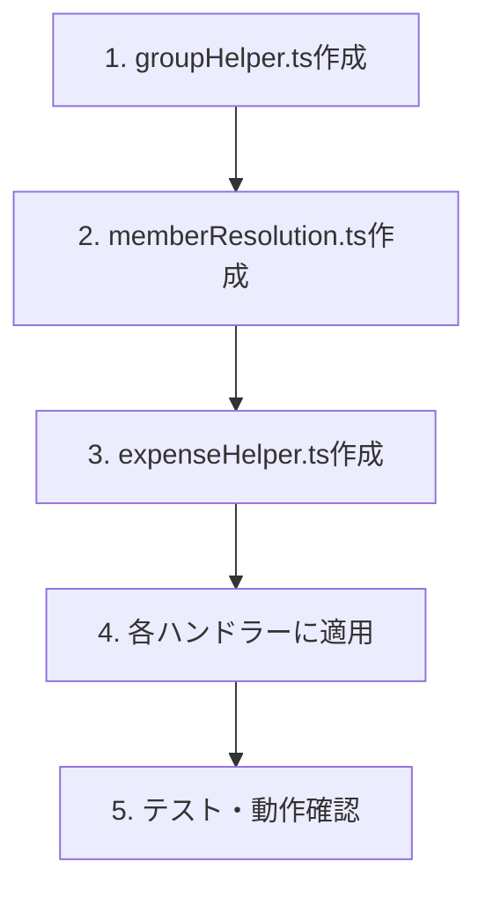

# クエリヘルパー共通化 設計ドキュメント

## 概要

Convex APIハンドラーで重複しているクエリ・データ処理ロジックを共通化し、コードの保守性を向上させる。

## 目的

### 現状の問題

複数のAPIハンドラーで同じクエリパターンが繰り返されている：

| パターン                   | 重複箇所 | 影響ファイル                               |
| -------------------------- | -------- | ------------------------------------------ |
| グループメンバーID一覧取得 | 8箇所    | expenses, settlements, groups, invitations |
| 支出分割メンバーID決定     | 2箇所    | expenses (create/update)                   |
| 期間別支出取得             | 5箇所    | expenses, settlements, analytics           |

### 問題点

- **コード重複**: 同じクエリを何度も書いている
- **変更困難**: ロジック変更時に複数箇所を修正する必要
- **バグリスク**: コピペによる不整合の可能性

## やること

### 1. グループメンバーID取得ヘルパー

```typescript
// 現状: 8箇所で重複
const memberships = await ctx.db
  .query("groupMembers")
  .withIndex("by_group_and_user", (q) => q.eq("groupId", groupId))
  .collect();
const memberIds = memberships.map((m) => m.userId);
```

**共通化後:**

```typescript
// convex/lib/groupHelper.ts
export async function getGroupMemberIds(
  ctx: { db: DatabaseReader },
  groupId: Id<"groups">,
): Promise<Id<"users">[]> {
  const memberships = await ctx.db
    .query("groupMembers")
    .withIndex("by_group_and_user", (q) => q.eq("groupId", groupId))
    .collect();
  return memberships.map((m) => m.userId);
}
```

### 2. 支出分割メンバーID決定ロジック

```typescript
// 現状: expenses.ts の create/update で完全重複（約20行×2）
let targetMemberIds: Id<"users">[];
if (splitDetails.method === "equal" && splitDetails.memberIds) {
  for (const id of splitDetails.memberIds) {
    if (!allMemberIds.includes(id)) {
      throw new Error("選択されたメンバーがグループに所属していません");
    }
  }
  targetMemberIds = splitDetails.memberIds;
} else if (splitDetails.method === "ratio") {
  targetMemberIds = splitDetails.ratios.map((r) => r.userId);
} // ... 以下省略
```

**共通化後:**

```typescript
// convex/domain/expense/memberResolution.ts
export function resolveTargetMemberIds(
  splitDetails: SplitDetails,
  allMemberIds: Id<"users">[],
): Id<"users">[] {
  // ロジックを1箇所に集約
}
```

### 3. 期間別支出取得ヘルパー

```typescript
// 現状: 5箇所で重複
const allExpenses = await ctx.db
  .query("expenses")
  .withIndex("by_group_and_date", (q) => q.eq("groupId", args.groupId))
  .collect();

const expenses = allExpenses.filter(
  (e) => e.date >= period.startDate && e.date <= period.endDate,
);
```

**共通化後:**

```typescript
// convex/lib/expenseHelper.ts
export async function getExpensesByPeriod(
  ctx: { db: DatabaseReader },
  groupId: Id<"groups">,
  period: { startDate: string; endDate: string },
): Promise<Doc<"expenses">[]> {
  // クエリとフィルタリングを1箇所に集約
}
```

## やり方

### ファイル構成

```
convex/lib/
├── authorization.ts   # 既存: 認可ヘルパー
├── groupHelper.ts     # 新規: グループ関連ヘルパー
└── expenseHelper.ts   # 新規: 支出関連ヘルパー

convex/domain/expense/
├── index.ts
├── rules.ts
├── splitCalculator.ts
├── types.ts
└── memberResolution.ts  # 新規: 分割メンバー決定ロジック
```

### 実装順序



### 対象ファイルと変更箇所

| ファイル       | 変更内容                                                              |
| -------------- | --------------------------------------------------------------------- |
| expenses.ts    | getGroupMemberIds, resolveTargetMemberIds, getExpensesByPeriod を使用 |
| settlements.ts | getGroupMemberIds, getExpensesByPeriod を使用                         |
| analytics.ts   | getExpensesByPeriod を使用                                            |
| groups.ts      | getGroupMemberIds を使用                                              |
| invitations.ts | getGroupMemberIds を使用                                              |

## やらないこと

| 項目                         | 理由                         |
| ---------------------------- | ---------------------------- |
| ユーザーマップ生成の共通化   | 今回のスコープ外（次回対応） |
| 支出分割情報取得の共通化     | 今回のスコープ外（次回対応） |
| リソース存在確認エラーの統一 | 影響範囲が広いため別途対応   |

## 参考資料

- 認可ヘルパー実装: `convex/lib/authorization.ts`
- 認可設計書: `docs/design-authorization.md`
