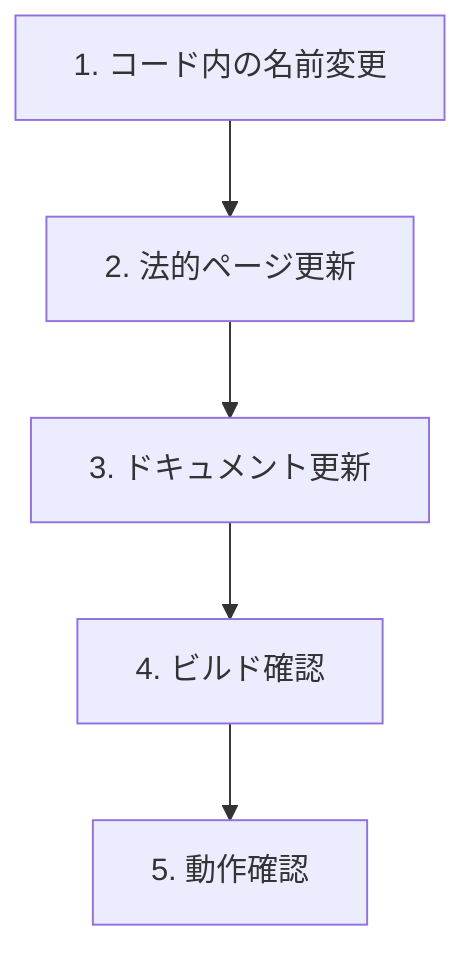

# プロダクト名変更 設計書

## Overview

プロダクト名を「Oaiko（おあいこ）」から「Pairbo（ペアボ）」に変更する。コード、ドキュメント、UI、メタデータをすべて更新する。

## Purpose

### なぜ変更するか

1. **名前の明確さ**
   - Pairbo = Pair（2人）+ 簿（家計簿）
   - 「2人で使う家計簿」が直感的に伝わる

2. **競合との差別化**
   - 「おあいこ」は一般的な日本語で検索しにくい
   - 「Pairbo」はユニークで検索・ブランディングしやすい

3. **ドメイン取得**
   - 「Pairbo」は既存サービスがなく、ドメイン取得の可能性が高い

### 名前の由来

- **Pair**: 2人、ペア、カップル
- **bo**: 簿（家計簿の「簿」）
- **読み**: ペアボ
- **コンセプト**: 2人で一緒にお金を管理する家計簿

## What to Do

### 変更対象

#### 1. コード内

| ファイル                             | 変更箇所                            |
| ------------------------------------ | ----------------------------------- |
| `package.json`                       | `name`: "oaiko" → "pairbo"          |
| `app/layout.tsx`                     | `title`, `description`              |
| `app/manifest.ts`                    | `name`, `short_name`, `description` |
| `components/ui/AppHeader.tsx`        | ロゴテキスト                        |
| `components/landing/LandingPage.tsx` | Hero、フッター                      |

#### 2. 法的ページ

| ファイル                       | 変更箇所   |
| ------------------------------ | ---------- |
| `app/privacy/page.tsx`         | サービス名 |
| `app/terms/page.tsx`           | サービス名 |
| `app/legal/tokushoho/page.tsx` | サービス名 |

#### 3. ドキュメント

| ファイル      | 変更箇所                    |
| ------------- | --------------------------- |
| `CLAUDE.md`   | プロダクト名、コンセプト    |
| `HANDOVER.md` | プロダクト名                |
| `README.md`   | プロダクト名                |
| `docs/*.md`   | 各種design doc内のOaiko参照 |

#### 4. 設定ファイル

| ファイル                      | 変更箇所               |
| ----------------------------- | ---------------------- |
| `.claude/settings.local.json` | プロジェクト名（任意） |

### 変更しない

| 項目                  | 理由                                |
| --------------------- | ----------------------------------- |
| `my-zenn-articles/`   | 外部サブモジュール。記事は公開済み  |
| Vercel URL            | `pairbo.vercel.app`に変更は別途対応 |
| Convex プロジェクト名 | 変更不要（内部名）                  |
| GitHub リポジトリ名   | 別途対応（oaiko → pairbo）          |

## How to Do It

### 1. 検索・置換パターン

| 検索       | 置換                     |
| ---------- | ------------------------ |
| `Oaiko`    | `Pairbo`                 |
| `oaiko`    | `pairbo`                 |
| `おあいこ` | `ペアボ`                 |
| `お相子`   | （削除または説明を更新） |

### 2. 変更ファイル詳細

#### package.json

```json
{
  "name": "pairbo",
  ...
}
```

#### app/layout.tsx

```typescript
export const metadata: Metadata = {
  title: "Pairbo - 2人のための共有家計簿",
  description:
    "割り勘・傾斜折半ができる共有家計簿アプリ。同棲カップル・夫婦に最適。",
};
```

#### app/manifest.ts

```typescript
export default function manifest(): MetadataRoute.Manifest {
  return {
    name: "Pairbo - 2人のための共有家計簿",
    short_name: "Pairbo",
    description: "割り勘・傾斜折半ができる共有家計簿",
    ...
  };
}
```

#### components/ui/AppHeader.tsx

```tsx
<Link href="/" className="font-bold text-lg text-slate-800">
  Pairbo
</Link>
```

#### components/landing/LandingPage.tsx

```tsx
// Hero
<h1 className="text-4xl font-bold text-slate-800 mb-4">Pairbo</h1>
<p className="text-xl text-slate-600 mb-2">
  2人のための共有家計簿
</p>

// Footer
<p className="font-bold text-white mb-1">Pairbo</p>
<p className="text-sm">割り勘・傾斜折半ができる共有家計簿</p>
<p>&copy; {new Date().getFullYear()} Pairbo. All rights reserved.</p>
```

### 3. CLAUDE.md 更新内容

```markdown
# Pairbo（ペアボ）

共有家計簿Webアプリ。

## プロジェクト概要

- **プロダクト名**: Pairbo（ペアボ）
- **名前の由来**: Pair（2人）+ 簿（家計簿）= 2人で使う家計簿
- **コンセプト**: 割り勘・傾斜折半ができる共有家計簿
- **ターゲット**: 同棲カップル、夫婦
- **差別化**: 割り勘・傾斜折半 + プラットフォーム非依存（Web）
```

### 4. 実行順序



### 5. 確認チェックリスト

- [ ] `grep -r "Oaiko\|oaiko\|おあいこ" --include="*.ts" --include="*.tsx" --include="*.md"` で残りがないか確認
- [ ] ビルドが通る
- [ ] LP、法的ページの表示確認
- [ ] PWAマニフェストの確認（DevToolsのApplicationタブ）

## What We Won't Do

| 項目                   | 理由                            |
| ---------------------- | ------------------------------- |
| GitHubリポジトリ名変更 | 別途対応。URLが変わるため慎重に |
| Vercel URL変更         | カスタムドメイン設定時に対応    |
| 過去のZenn記事修正     | 公開済み記事は修正しない        |
| ロゴ画像の作成         | 別タスクとして対応              |

## Concerns

### 懸念事項

| 懸念                 | リスク | 対策                                |
| -------------------- | ------ | ----------------------------------- |
| 置換漏れ             | 中     | grep で確認、TypeScriptエラーで検出 |
| SEOへの影響          | 低     | 本番未リリースのため問題なし        |
| 既存ユーザーへの影響 | なし   | 本番未リリース                      |

### 将来の対応

| 項目                   | タイミング                |
| ---------------------- | ------------------------- |
| カスタムドメイン取得   | リリース前（pairbo.jp等） |
| ロゴ作成               | リリース前                |
| OGP画像更新            | ロゴ作成後                |
| GitHubリポジトリ名変更 | 任意                      |

## Reference Materials/Information

### 変更対象ファイル一覧

```
package.json
app/layout.tsx
app/manifest.ts
app/privacy/page.tsx
app/terms/page.tsx
app/legal/tokushoho/page.tsx
components/ui/AppHeader.tsx
components/landing/LandingPage.tsx
CLAUDE.md
HANDOVER.md
README.md
docs/*.md（必要に応じて）
```

### 検索コマンド

```bash
# 変更漏れ確認
grep -r "Oaiko\|oaiko\|おあいこ" --include="*.ts" --include="*.tsx" --include="*.md" --include="*.json" | grep -v node_modules | grep -v my-zenn-articles
```

## 変更履歴

| 日付       | 変更内容 | 変更者 |
| ---------- | -------- | ------ |
| 2026-02-04 | 初版作成 | Claude |
