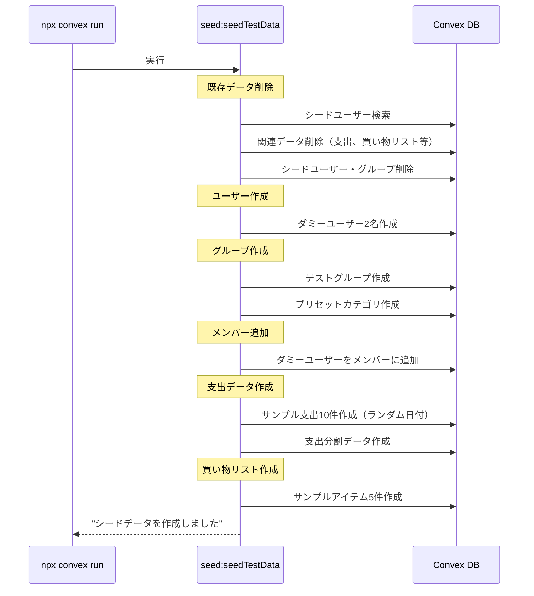
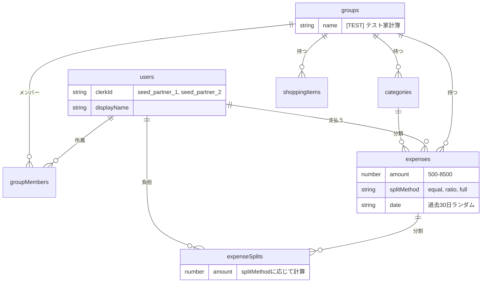

# シードデータ機能 設計書

## Overview

開発・テスト用のサンプルデータをコマンド一つで投入できる仕組み。`npx convex run` コマンドを使用して、ローカル開発環境にテストデータを簡単に作成・削除できる。

## Purpose

### なぜ必要か

1. **開発効率の向上**: UIから手動でデータを作成する手間を省く
2. **一貫したテスト環境**: 同じデータセットで繰り返しテストできる
3. **機能開発の迅速化**: 支出記録・精算など、複雑な機能の動作確認に必要なデータを即座に用意できる
4. **複数メンバーのシミュレーション**: ログインユーザー以外のダミーメンバーを追加して、共有家計簿としての動作を確認

### 代替案との比較

| 方法                         | メリット                       | デメリット                             |
| ---------------------------- | ------------------------------ | -------------------------------------- |
| **UIから手動作成**           | 実際の操作をテスト             | 時間がかかる、複雑なデータは作りにくい |
| **Convex Dashboard**         | GUIで直接DB操作可能            | 関連データの整合性を手動で管理必要     |
| **シードスクリプト（採用）** | コマンド一つで完了、再現性あり | 初期実装コストあり                     |

## What to Do

### 機能要件

#### 1. シードデータ投入（seedTestData）

```
npx convex run seed:seedTestData
```

以下のデータを作成する:

- **ダミーユーザー**: 2名（パートナー役）
- **テストグループ**: 1つ（「テスト家計簿」）
- **カテゴリ**: プリセットカテゴリ（グループ作成時に自動作成）
- **支出データ**: 10件程度（様々なカテゴリ・負担方法）
- **買い物リスト**: 5件程度

#### 2. シードデータ削除（clearTestData）

```
npx convex run seed:clearTestData
```

シードデータのみを削除し、本物のユーザーデータは保持する。

#### 3. 現在ユーザーをグループに追加（joinTestGroup）

```
npx convex run seed:joinTestGroup '{"userId": "j57abc123..."}'
```

指定したユーザーをテストグループに追加する（UIでの動作確認用）。
Convex Dashboardの users テーブルから自分の `_id` を確認してコピペする。

### 非機能要件

- **冪等性**: 複数回実行しても安全（既存データを削除して再作成）
- **識別可能性**: シードデータには特定のマーカーを付与し、削除時に識別可能にする
- **ローカル環境限定**: 本番環境では実行を制限（警告表示）

## How to Do It

### データ構造

#### シードデータの識別

シードデータには特定の `clerkId` プレフィックスを使用して識別する:

```typescript
const SEED_PREFIX = "seed_";

// シードユーザーの clerkId
const SEED_USER_IDS = {
  partner1: "seed_partner_1",
  partner2: "seed_partner_2",
} as const;

// テストグループ名
const TEST_GROUP_NAME = "[TEST] テスト家計簿";
```

### シーケンス図

#### seedTestData 実行フロー



### ER図（シードデータの関連）



### 負担分割（expenseSplits）の計算ロジック

| splitMethod | 計算方法                 | 例（3500円、2人） |
| ----------- | ------------------------ | ----------------- |
| equal       | 均等分割（端数は支払者） | 1750円, 1750円    |
| ratio       | 60:40 固定               | 2100円, 1400円    |
| full        | 支払者が全額             | 3500円, 0円       |

### ファイル構成

```
convex/
├── seed.ts              # シードデータ関連の mutation
└── lib/
    └── seedData.ts      # シードデータの定義
```

### 実装詳細

#### convex/lib/seedData.ts

```typescript
// シードデータの定義
export const SEED_PREFIX = "seed_";

export const SEED_USERS = [
  {
    clerkId: "seed_partner_1",
    displayName: "パートナーA",
    avatarUrl: undefined,
  },
  {
    clerkId: "seed_partner_2",
    displayName: "パートナーB",
    avatarUrl: undefined,
  },
] as const;

export const TEST_GROUP = {
  name: "[TEST] テスト家計簿",
  description: "シードデータ用のテストグループ",
  closingDay: 25,
} as const;

// サンプル支出データ（日付は実行時に過去30日からランダム生成）
export const SAMPLE_EXPENSES = [
  {
    categoryName: "食費",
    amount: 3500,
    memo: "スーパーで買い物",
    splitMethod: "equal",
  },
  {
    categoryName: "食費",
    amount: 2800,
    memo: "外食（ランチ）",
    splitMethod: "equal",
  },
  {
    categoryName: "光熱費",
    amount: 8500,
    memo: "電気代",
    splitMethod: "ratio",
  }, // 60:40
  {
    categoryName: "日用品",
    amount: 1200,
    memo: "洗剤・トイレットペーパー",
    splitMethod: "equal",
  },
  { categoryName: "交通費", amount: 500, memo: "バス代", splitMethod: "full" },
  { categoryName: "娯楽", amount: 4200, memo: "映画", splitMethod: "equal" },
  {
    categoryName: "食費",
    amount: 1800,
    memo: "コンビニ",
    splitMethod: "equal",
  },
  {
    categoryName: "光熱費",
    amount: 6200,
    memo: "ガス代",
    splitMethod: "ratio",
  }, // 60:40
  { categoryName: "医療費", amount: 2500, memo: "薬代", splitMethod: "full" },
  {
    categoryName: "その他",
    amount: 3000,
    memo: "プレゼント",
    splitMethod: "equal",
  },
] as const;

// ratio の場合の固定割合
export const RATIO_SPLIT = { partner1: 60, partner2: 40 } as const;

// サンプル買い物リスト
export const SAMPLE_SHOPPING_ITEMS = [
  { name: "牛乳" },
  { name: "卵" },
  { name: "食パン" },
  { name: "トイレットペーパー" },
  { name: "洗剤" },
] as const;
```

#### convex/seed.ts

```typescript
import { internalMutation } from "./_generated/server";
import { v } from "convex/values";

// シードデータ投入（既存データは削除して再作成）
export const seedTestData = internalMutation({
  args: {},
  handler: async (ctx) => {
    // 1. 既存シードデータを削除
    await clearSeedData(ctx);

    // 2. ダミーユーザー作成
    // 3. グループ作成 + プリセットカテゴリ
    // 4. メンバー追加
    // 5. 支出データ作成（ランダム日付）
    // 6. 買い物リスト作成

    return { success: true, message: "シードデータを作成しました" };
  },
});

// シードデータ削除
export const clearTestData = internalMutation({
  args: {},
  handler: async (ctx) => {
    await clearSeedData(ctx);
    return { success: true, message: "シードデータを削除しました" };
  },
});

// ユーザーをテストグループに追加
export const joinTestGroup = internalMutation({
  args: {
    userId: v.id("users"),
  },
  handler: async (ctx, args) => {
    // テストグループを検索
    // ユーザーをメンバーに追加
    return { success: true, message: "テストグループに参加しました" };
  },
});

// 内部ヘルパー: シードデータ削除
async function clearSeedData(ctx: MutationCtx) {
  // シードユーザーを検索
  // 関連するグループ、支出、買い物リスト等を削除
}
```

### 実行コマンド

```bash
# シードデータ投入（既存があれば削除して再作成）
npx convex run seed:seedTestData

# シードデータ削除
npx convex run seed:clearTestData

# ユーザーをテストグループに追加（userId は Convex Dashboard で確認）
npx convex run seed:joinTestGroup '{"userId": "j57abc123..."}'
```

## What We Won't Do

### 今回のスコープ外

1. **本番環境用シードデータ**: 本番環境へのシード投入は対象外
2. **大量データ生成**: パフォーマンステスト用の大量データ生成機能は含まない
3. **カスタムシナリオ**: ユーザーがシードデータをカスタマイズする機能は含まない
4. **精算データ**: 精算（settlements）のシードデータは今回は含まない（機能実装後に追加）
5. **招待データ**: グループ招待（groupInvitations）のシードデータは含まない

### 将来の拡張可能性

- 複数シナリオのシードデータセット（「新規ユーザー」「ヘビーユーザー」など）
- シードデータの引数によるカスタマイズ（件数指定など）
- E2Eテストとの統合

## Concerns

### 懸念事項と対策

| 懸念                             | 対策                                                                                                           |
| -------------------------------- | -------------------------------------------------------------------------------------------------------------- |
| 本番環境で誤実行                 | `internalMutation` を使用し、クライアントから直接呼び出し不可にする。CLIからの実行時に環境確認メッセージを表示 |
| シードデータと本物データの混在   | `[TEST]` プレフィックスと `seed_` clerkIdで明確に識別                                                          |
| 支出の paidBy に実ユーザーID必要 | シードユーザーのみで完結するデータセットにする。joinTestGroup で実ユーザーを追加可能にする                     |
| 日付データの鮮度                 | シード実行時の日付を基準にランダムな日付を生成（過去30日以内）                                                 |
| ratio の負担割合                 | 60:40 でハードコード                                                                                           |

### 決定事項

| 項目                 | 決定                                        |
| -------------------- | ------------------------------------------- |
| joinTestGroup の認証 | userId（Convex ドキュメントID）を引数で渡す |
| ratio の割合         | 60:40 でハードコード                        |
| 日付分布             | 過去30日からランダム                        |
| 冪等性               | 既存データを削除して再作成                  |

### 未解決の疑問

なし

## Reference Materials/Information

- [Convex CLI - npx convex run](https://docs.convex.dev/cli)
- [Convex Internal Functions](https://docs.convex.dev/functions/internal-functions)
- 既存実装: `convex/groups.ts` - グループ作成の参考
- 既存実装: `convex/lib/presetCategories.ts` - カテゴリデータの参考
