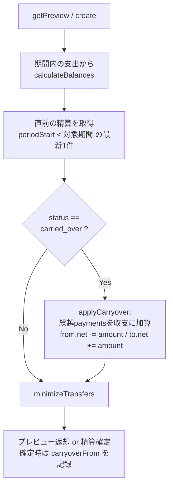
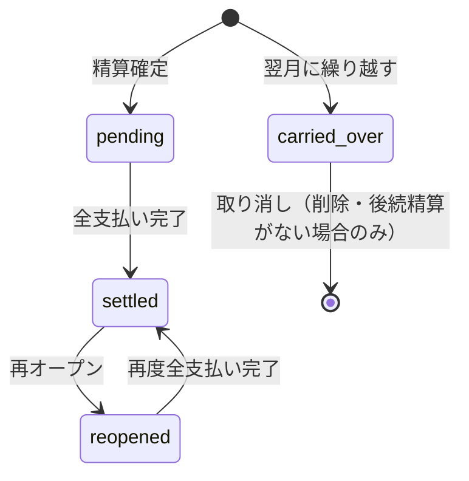

# 設計書: 精算残額の翌月繰り越し

## Overview

精算プレビュー画面で「精算する」の代わりに「翌月に繰り越す」を選ぶと、その期間の差額を支払わずに翌月の精算へ合算できる機能。ユーザー要望「精算の残金を翌月に繰り越し出来るようにして欲しい」への対応。

- 全額繰り越しのみ（部分支払いは非対応）
- 未確定プレビューからのみ繰り越し可能
- Free機能として提供

## Purpose

### 背景

- 月々の精算額が小さい場合や忙しい月は、毎月きっちり送金するのが面倒
- 現状は「精算を確定して支払う」以外の選択肢がなく、精算しないと未確定のまま溜まり続けて履歴が汚れる
- 「今月分は来月まとめて」という同棲カップルの自然な運用を仕様として吸収する

### 目的

1. 精算のタイミングをユーザーの生活リズムに合わせられるようにする
2. 「精算していない月」を明示的な状態（繰越）として記録し、履歴の一覧性を保つ

## What to Do

### 機能要件

#### FR-1: 繰り越しの実行

- 精算プレビュー画面（未確定・差額あり）に「翌月に繰り越す」ボタンを表示
- 実行すると、その期間の精算レコードを `carried_over` ステータスで作成し、算出済みの送金リスト（誰が誰にいくら）を保存する
- 差額ゼロ（送金リストが空）の期間は繰り越せない（ボタン非表示 + バックエンドでも拒否）
- 後続期間の精算（確定・繰越いずれも）が既に存在する場合は繰り越せない（合算先が既に閉じているため）

#### FR-2: 翌月への合算

- 精算プレビュー・精算確定の計算時に、直前の精算（同グループで対象期間より前の最新の精算）が `carried_over` の場合、その送金リストを収支に加算してから送金最小化を行う
- 繰越が連鎖しても正しく合算される（繰越→繰越→精算。各繰越は直前の繰越を含んだ金額で記録されるため、常に直前1件の参照で足りる）
- 間に精算がない月（支出ゼロで精算レコードなし）を挟んでも、直前の精算を参照するため正しく合算される

#### FR-3: 繰り越しの取り消し

- `carried_over` の精算は、後続期間の精算が存在しない間に限り取り消せる（レコードごと削除し、未確定状態に戻す）
- 後続の精算が作成された後は取り消し不可（繰越分が後続に焼き込まれているため）

#### FR-4: 表示

- 精算プレビュー: 繰越分を含む場合「先月までの繰越 ¥X を含む」注記を表示
- 繰越済みの期間: 精算カードに「翌月へ繰越済み」バッジ、モーダル内に状態表示と「取り消す」（取り消し可能な場合のみ）
- 精算履歴コンポーネント: `carried_over` の精算に「翌月へ繰越」ラベル（注: 現行UIでは精算確定・履歴画面は未マウントのデッドコードだが、型整合と将来の再導入に備えて対応する）

#### FR-5: 権限

- 繰り越しの実行・取り消しはグループメンバーなら誰でも可能（精算確定と同じ）

### 非機能要件

- 収支の合算はゼロサムを維持する（繰越調整は差額の移動のみで金額を生まない・失わない）
- 既存の精算データに影響しない（新ステータスの追加のみで、既存3ステータスの挙動は不変）

## How to Do It

### データ構造

スキーマ変更は最小限:

```
// convex/lib/validators.ts
settlementStatusValidator に v.literal("carried_over") を追加

// convex/schema.ts settlements テーブル
carryoverFrom: v.optional(v.id("settlements"))  // 確定時に合算した繰越精算への参照（表示用）
```

- 繰り越した金額は既存の `settlementPayments` にそのまま保存する（`isPaid: false` のまま。支払われることはない）
- 新テーブルは追加しない

### 計算フロー



- `applyCarryover(balances, carryoverPayments)` を `convex/domain/settlement/calculator.ts` に追加（純粋関数）
- 繰越paymentsの当事者が現メンバーにいない場合（脱退）は、そのユーザーの収支エントリを追加して計算に含める（金額を失わないため。表示名はフォールバック）

### 状態遷移



`carried_over` は取り消し（削除）以外の遷移を持たない終端ステータス。reopen対象外。

### 変更対象

| ファイル                                       | 変更内容                                                                                   |
| ---------------------------------------------- | ------------------------------------------------------------------------------------------ |
| `convex/lib/validators.ts`                     | `carried_over` ステータス追加                                                              |
| `convex/schema.ts`                             | `settlements.carryoverFrom` 追加                                                           |
| `convex/domain/settlement/calculator.ts`       | `applyCarryover` 追加                                                                      |
| `convex/settlements.ts`                        | `carryOver` / `cancelCarryOver` mutation追加、`getPreview` / `create` に繰越合算を組み込み |
| `components/settlements/SettlementPreview.tsx` | 「翌月に繰り越す」ボタン + 繰越注記 + 繰越済み表示・取り消し                               |
| `components/settlements/SettlementCard.tsx`    | 「翌月へ繰越」ラベル（デッドコードだが型整合のため）                                       |
| `convex/__tests__/settlements.test.ts` ほか    | テスト追加                                                                                 |
| `lib/releases.ts`                              | リリース時にお知らせ追加（ユーザー向け機能のため）                                         |
| `convex/seed.ts` / `convex/lib/seedData.ts`    | 前月分の繰越精算をシードに追加（動作確認用）                                               |

### バリデーション

- `carryOver`: 対象期間に精算が存在しないこと / 送金リストが空でないこと / グループ内に対象期間より後の精算が存在しないこと
- `cancelCarryOver`: statusが `carried_over` であること / グループ内にその精算より後の精算が存在しないこと

### テスト

- `applyCarryover` の純粋関数テスト（ゼロサム維持・脱退メンバー含む）
- 繰越作成 → 翌月プレビュー/確定に合算される
- 繰越の連鎖（2ヶ月連続繰越 → 3ヶ月目に合算）
- 精算レコードのない月を挟んだ合算
- 後続精算が存在する場合の繰越・取り消しの拒否
- 差額ゼロでの繰越拒否

## What We Won't Do

- **部分支払い（一部を支払って残額のみ繰り越し）**: 支払額入力UIと残額管理が複雑になる。2人グループでは送金1件でPayPayリンク等によるジャスト送金も容易なため需要が薄い。反応を見て検討
- **確定済み（pending）精算の繰り越し**: 状態遷移が増える。reopenで未確定に戻してから繰り越せば実現できるため不要
- **繰越の有効期限・上限**: 何ヶ月でも繰り越せる。金額が膨らむことへの注意喚起はしない（ユーザーの自己管理に委ねる）
- **手動精算モードとの統合検討**: `design-manual-settlement-mode.md` は未実装のため、月次精算のみを対象とする

## Alternatives Considered

| 案                                              | 概要                                       | 不採用の理由                                                                 |
| ----------------------------------------------- | ------------------------------------------ | ---------------------------------------------------------------------------- |
| 翌月に調整用の仮想支出を作成                    | 繰越額を「全額負担」の支出として翌月に挿入 | 既存計算をそのまま使えるが、支出一覧・分析に精算調整が混入して汚れる         |
| 繰越専用テーブル                                | carryoversテーブルで期間間の調整を管理     | settlements + 新ステータスで表現でき、テーブル追加に見合う複雑さの削減がない |
| グループに累積残高を保持（running balance方式） | 期間概念をやめて常に累積差額を表示         | 精算履歴・月次の区切りという既存のメンタルモデルを壊す。変更範囲が大きすぎる |
| 部分支払い対応                                  | 一部支払い+残額繰り越し                    | ユーザー確認の結果、全額繰り越しのみで十分（スコープ外へ）                   |

## Concerns

- **繰越当事者の脱退**: 繰越payments の from/to が現メンバーにいない場合も収支に含めて計算する方針だが、脱退者への送金がUIに出るのは不自然。実装時に表示（「退会したメンバー」ラベル）を確認する
- **締め日変更との相互作用**: closingDay を変更すると期間の区切りが変わるが、繰越は「直前の精算」を期間開始日の前後関係で参照するため破綻はしない。重複期間が生じた場合の合算は既存の締め日変更と同じ既知の制約
- **繰越可能条件の伝え方**: 「後続の精算があると繰り越せない/取り消せない」をUIでどう伝えるか。ボタン非表示 + 詳細画面での説明文を想定
- **繰越額の際限ない累積**: 何ヶ月も繰り越し続けると1回の精算額が大きくなるが、仕様として許容（上限や警告は設けない）

## Reference Materials/Information

- `convex/settlements.ts` — 精算プレビュー・確定・支払いマークの現行実装
- `convex/domain/settlement/calculator.ts` — `calculateBalances` / `minimizeTransfers` / `getSettlementPeriod`
- `docs/design-settlement-feature.md` — 精算機能の初期設計
- `docs/design-manual-settlement-mode.md` — 手動精算モード（未実装・参考）
