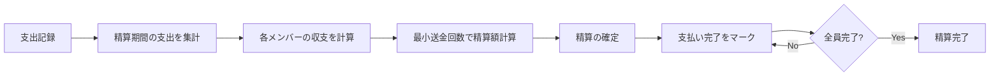
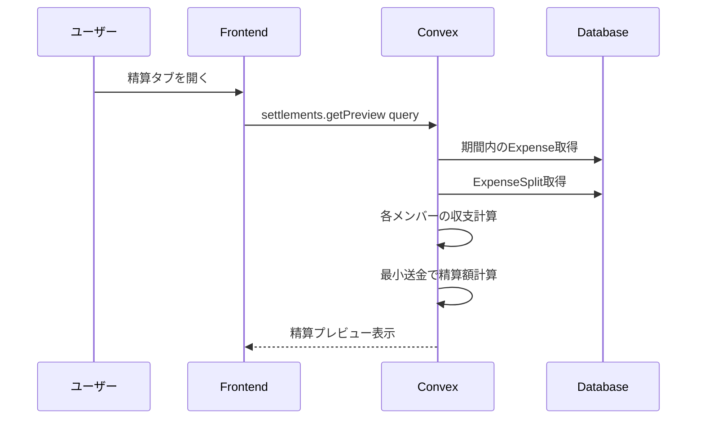
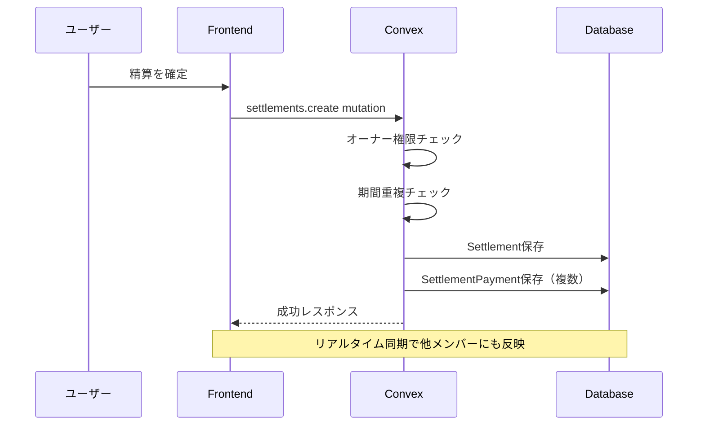
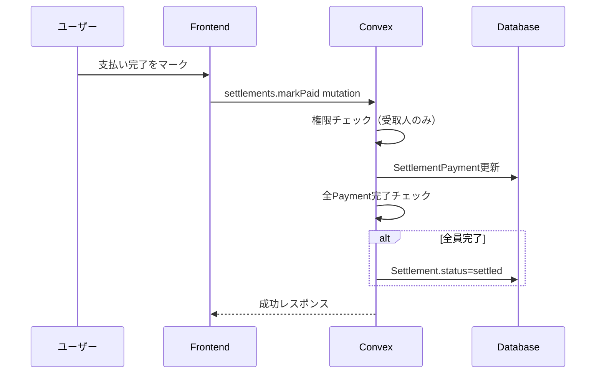

# 精算機能 設計書

## Overview

グループ内の支出データをもとに、メンバー間の貸し借りを計算し、精算を管理する機能。締め日ベースの月次精算をサポートし、「誰が誰にいくら払うか」を自動計算する。

### 全体フロー



## Purpose

### なぜ必要か

1. **共有家計簿の核心機能**: 支出を記録するだけでは不十分。誰が誰にいくら払えばよいかを知りたい
2. **公平な精算の実現**: 複数人の支出を手計算するのは大変。自動計算で正確・公平に
3. **精算忘れ防止**: ステータス管理で未精算を可視化

### ユーザーストーリー

- グループオーナーとして、月末に精算を開始して、誰がいくら払うべきか確認したい
- グループメンバーとして、自分が誰にいくら払うべきか確認したい
- グループメンバーとして、支払い完了をマークして記録を残したい
- グループメンバーとして、過去の精算履歴を確認したい

## What to Do

### 機能要件

#### 1. 精算プレビュー（未確定の精算額表示）

| 項目     | 詳細                                                     |
| -------- | -------------------------------------------------------- |
| 対象期間 | 締め日ベース（例: 25日締めなら11/26〜12/25が「12月分」） |
| 表示内容 | 各メンバーの収支、精算額（誰→誰にいくら）                |
| アクセス | グループメンバー全員が閲覧可能                           |

#### 2. 精算の確定

| 項目   | 詳細                                                |
| ------ | --------------------------------------------------- |
| 実行者 | グループオーナーのみ                                |
| 条件   | 対象期間に未精算の支出がある                        |
| 結果   | Settlement + SettlementPayment レコードが作成される |

#### 3. 支払い完了マーク

| 項目   | 詳細                                                                |
| ------ | ------------------------------------------------------------------- |
| 実行者 | 支払い先（受け取る側）のメンバー                                    |
| 操作   | 各SettlementPaymentを「支払い済み」にマーク                         |
| 効果   | 全PaymentがisPaid=trueになると、Settlement.status=settledに自動遷移 |

#### 4. 精算履歴

| 項目     | 詳細                                     |
| -------- | ---------------------------------------- |
| 表示内容 | 過去の精算一覧（期間、ステータス、詳細） |
| フィルタ | なし（全期間表示）                       |

### 非機能要件

- **正確性**: 金額計算は整数演算（円単位）、端数処理ルールを明確化
- **リアルタイム同期**: 支払い完了マークが他メンバーに即座に反映
- **パフォーマンス**: 精算計算は1秒以内
- **データ整合性**: 精算済み期間の支出は編集・削除不可

### 画面構成（ワイヤーフレーム）

#### 精算タブ（グループ詳細ページに追加）

```
┌─────────────────────────────────┐
│  テスト家計簿グループ           │
├─────────────────────────────────┤
│  [メンバー] [支出] [精算]       │
├─────────────────────────────────┤
│                                 │
│  ─── 12月分（11/26〜12/25）───  │
│                                 │
│  ┌─────────────────────────┐   │
│  │ 📊 今月の精算           │   │
│  │                         │   │
│  │ Aさん: +5,000円        │   │
│  │ Bさん: -3,000円        │   │
│  │ Cさん: -2,000円        │   │
│  │                         │   │
│  │ ─── 精算方法 ───       │   │
│  │                         │   │
│  │ B → A: 3,000円         │   │
│  │ C → A: 2,000円         │   │
│  │                         │   │
│  │ ┌───────────────────┐   │   │
│  │ │    精算を確定      │   │   │
│  │ └───────────────────┘   │   │
│  └─────────────────────────┘   │
│                                 │
│  ─── 過去の精算 ───            │
│                                 │
│  11月分 - ✅ 精算完了           │
│  10月分 - ✅ 精算完了           │
│                                 │
└─────────────────────────────────┘
```

#### 精算詳細画面

```
┌─────────────────────────────────┐
│  ←  12月分の精算                │
├─────────────────────────────────┤
│                                 │
│  期間: 2024/11/26 〜 2024/12/25 │
│  ステータス: 🔄 精算中          │
│                                 │
│  ─── 各メンバーの収支 ───      │
│                                 │
│  Aさん（支払い）: ¥15,000      │
│  Aさん（負担）  : ¥10,000      │
│  Aさん（差額）  : +¥5,000      │
│                                 │
│  Bさん（支払い）: ¥2,000       │
│  Bさん（負担）  : ¥5,000       │
│  Bさん（差額）  : -¥3,000      │
│                                 │
│  Cさん（支払い）: ¥0           │
│  Cさん（負担）  : ¥2,000       │
│  Cさん（差額）  : -¥2,000      │
│                                 │
│  ─── 精算内容 ───              │
│                                 │
│  ┌─────────────────────────┐   │
│  │ B → A: ¥3,000           │   │
│  │ ⬜ 未払い                │   │
│  │ [支払い完了にする]       │   │
│  └─────────────────────────┘   │
│                                 │
│  ┌─────────────────────────┐   │
│  │ C → A: ¥2,000           │   │
│  │ ✅ 支払い済み            │   │
│  │ 2024/12/26 10:30        │   │
│  └─────────────────────────┘   │
│                                 │
└─────────────────────────────────┘
```

## How to Do It

### データフロー

#### 精算額計算フロー



#### 精算確定フロー



#### 支払い完了フロー



### 精算額計算アルゴリズム

#### 1. 各メンバーの収支計算

```typescript
// convex/lib/settlementCalculator.ts

interface MemberBalance {
  userId: Id<"users">;
  paid: number; // 支払った金額の合計
  owed: number; // 負担すべき金額の合計
  net: number; // paid - owed（プラス=受け取る、マイナス=支払う）
}

/**
 * 期間内の支出から各メンバーの収支を計算
 */
function calculateBalances(
  expenses: Expense[],
  splits: ExpenseSplit[],
  memberIds: Id<"users">[],
): MemberBalance[] {
  const balances = new Map<Id<"users">, { paid: number; owed: number }>();

  // 初期化
  for (const memberId of memberIds) {
    balances.set(memberId, { paid: 0, owed: 0 });
  }

  // 支出ごとに集計
  for (const expense of expenses) {
    // 支払者のpaidを加算
    const payer = balances.get(expense.paidBy)!;
    payer.paid += expense.amount;

    // 各負担者のowedを加算
    const expenseSplits = splits.filter((s) => s.expenseId === expense._id);
    for (const split of expenseSplits) {
      const member = balances.get(split.userId);
      if (member) {
        member.owed += split.amount;
      }
    }
  }

  // net計算
  return Array.from(balances.entries()).map(([userId, { paid, owed }]) => ({
    userId,
    paid,
    owed,
    net: paid - owed,
  }));
}
```

#### 2. 最小送金回数での精算計算（貪欲法）

```typescript
interface Payment {
  fromUserId: Id<"users">;
  toUserId: Id<"users">;
  amount: number;
}

/**
 * 最小送金回数で精算を計算（貪欲法）
 *
 * アルゴリズム:
 * 1. 債務者（net < 0）と債権者（net > 0）に分ける
 * 2. 最大の債務者と最大の債権者をマッチング
 * 3. 小さい方の金額で送金、残りを繰り越し
 * 4. どちらかがゼロになるまで繰り返し
 */
function minimizeTransfers(balances: MemberBalance[]): Payment[] {
  const payments: Payment[] = [];

  // 債務者と債権者に分ける
  const debtors = balances
    .filter((b) => b.net < 0)
    .map((b) => ({ userId: b.userId, amount: -b.net }))
    .sort((a, b) => b.amount - a.amount); // 大きい順

  const creditors = balances
    .filter((b) => b.net > 0)
    .map((b) => ({ userId: b.userId, amount: b.net }))
    .sort((a, b) => b.amount - a.amount); // 大きい順

  let i = 0; // 債務者インデックス
  let j = 0; // 債権者インデックス

  while (i < debtors.length && j < creditors.length) {
    const debtor = debtors[i];
    const creditor = creditors[j];

    // 送金額は小さい方
    const amount = Math.min(debtor.amount, creditor.amount);

    if (amount > 0) {
      payments.push({
        fromUserId: debtor.userId,
        toUserId: creditor.userId,
        amount,
      });
    }

    // 残額を更新
    debtor.amount -= amount;
    creditor.amount -= amount;

    // ゼロになったら次へ
    if (debtor.amount === 0) i++;
    if (creditor.amount === 0) j++;
  }

  return payments;
}
```

#### 3. 締め日からの精算期間計算

```typescript
/**
 * 締め日と年月から精算期間を計算
 *
 * @param closingDay 締め日（1-28）
 * @param year 対象年
 * @param month 対象月（1-12）
 * @returns 精算期間（開始日、終了日）
 *
 * @example
 * // 締め日25日、2024年12月分
 * getSettlementPeriod(25, 2024, 12)
 * // → { startDate: "2024-11-26", endDate: "2024-12-25" }
 */
function getSettlementPeriod(
  closingDay: number,
  year: number,
  month: number,
): { startDate: string; endDate: string } {
  // 終了日 = 当月の締め日
  const endDate = new Date(year, month - 1, closingDay);

  // 開始日 = 前月の締め日 + 1日
  const startDate = new Date(year, month - 2, closingDay + 1);

  return {
    startDate: formatDate(startDate),
    endDate: formatDate(endDate),
  };
}

function formatDate(date: Date): string {
  return date.toISOString().split("T")[0];
}
```

### ファイル構成

```
app/
└── groups/
    └── [groupId]/
        ├── page.tsx                    # グループ詳細（タブで切り替え）
        └── settlements/
            └── [settlementId]/
                └── page.tsx            # 精算詳細

components/
└── settlements/
    ├── SettlementPreview.tsx           # 精算プレビュー（未確定）
    ├── SettlementDetail.tsx            # 精算詳細
    ├── SettlementPaymentCard.tsx       # 支払いカード
    ├── SettlementHistory.tsx           # 精算履歴一覧
    └── MemberBalanceList.tsx           # メンバー収支一覧

convex/
├── settlements.ts                      # 精算関連のmutation/query
└── lib/
    └── settlementCalculator.ts         # 精算計算ロジック
```

### Convex関数設計

#### settlements.ts

```typescript
import { v } from "convex/values";
import { authMutation, authQuery } from "./lib/auth";
import {
  calculateBalances,
  minimizeTransfers,
  getSettlementPeriod,
} from "./lib/settlementCalculator";

/**
 * 精算プレビュー取得（未確定の精算額）
 */
export const getPreview = authQuery({
  args: {
    groupId: v.id("groups"),
    year: v.number(),
    month: v.number(),
  },
  handler: async (ctx, args) => {
    // 1. グループメンバー確認
    // 2. グループの締め日取得
    // 3. 精算期間計算
    // 4. 期間内の支出を取得
    // 5. 収支計算
    // 6. 精算額計算
    // 7. 既存の精算があるかチェック
    return {
      period: { startDate, endDate },
      balances: memberBalances,
      payments: calculatedPayments,
      existingSettlement: existingSettlement || null,
    };
  },
});

/**
 * 精算を確定
 */
export const create = authMutation({
  args: {
    groupId: v.id("groups"),
    year: v.number(),
    month: v.number(),
  },
  handler: async (ctx, args) => {
    // 1. オーナー権限チェック
    // 2. 精算期間計算
    // 3. 期間重複チェック
    // 4. 収支・精算額計算
    // 5. Settlement保存
    // 6. SettlementPayment保存
    // 7. 監査ログ
    return settlementId;
  },
});

/**
 * 支払い完了をマーク
 */
export const markPaid = authMutation({
  args: {
    paymentId: v.id("settlementPayments"),
  },
  handler: async (ctx, args) => {
    // 1. 権限チェック（受取人のみ）
    // 2. Payment更新
    // 3. 全Payment完了チェック → Settlement完了
    // 4. 監査ログ
  },
});

/**
 * 精算一覧取得
 */
export const listByGroup = authQuery({
  args: {
    groupId: v.id("groups"),
  },
  handler: async (ctx, args) => {
    // グループの精算履歴を取得
  },
});

/**
 * 精算詳細取得
 */
export const getById = authQuery({
  args: {
    settlementId: v.id("settlements"),
  },
  handler: async (ctx, args) => {
    // 精算詳細 + 支払い情報を取得
  },
});
```

### テスト計画

#### ユニットテスト

| テスト対象            | テスト内容                     |
| --------------------- | ------------------------------ |
| `calculateBalances`   | 支出から収支が正しく計算される |
| `minimizeTransfers`   | 2人の場合の精算計算            |
| `minimizeTransfers`   | 3人の場合の精算計算            |
| `minimizeTransfers`   | 収支がゼロの場合               |
| `getSettlementPeriod` | 締め日25日の場合               |
| `getSettlementPeriod` | 締め日1日の場合（月初め）      |
| `getSettlementPeriod` | 年をまたぐ場合（1月分）        |

#### 統合テスト

| テスト対象   | テスト内容                   |
| ------------ | ---------------------------- |
| `getPreview` | 支出なしの場合、精算額ゼロ   |
| `getPreview` | 支出ありの場合、正しい精算額 |
| `create`     | オーナーのみ精算確定可能     |
| `create`     | 期間重複で精算不可           |
| `markPaid`   | 受取人のみマーク可能         |
| `markPaid`   | 全員完了で精算ステータス更新 |

### シードデータ更新

今回の実装でシードデータの更新が**必要**。

- テスト用の精算データを追加
- 精算済み・未精算のサンプルを用意

```typescript
// convex/lib/seedData.ts に追加

export const SEED_SETTLEMENTS = [
  {
    // 11月分（精算済み）
    periodStart: "2024-10-26",
    periodEnd: "2024-11-25",
    status: "settled",
  },
];

export const SEED_SETTLEMENT_PAYMENTS = [
  // 11月分の支払い
  {
    fromUser: "user_b",
    toUser: "user_a",
    amount: 3000,
    isPaid: true,
  },
];
```

## What We Won't Do

### スコープ外

| 機能                       | 理由                                 |
| -------------------------- | ------------------------------------ |
| 自動リマインダー           | 通知機能はMVP外                      |
| 精算のキャンセル           | 複雑化を避ける、確定後は取り消し不可 |
| 部分精算                   | 全額精算のみ                         |
| 外部決済連携               | PayPay等との連携はMVP外              |
| 精算レポートのエクスポート | PDF/CSV出力はMVP外                   |

### 設計上の制限

| 項目               | 制限内容           | 理由               |
| ------------------ | ------------------ | ------------------ |
| 精算単位           | 月次のみ           | シンプルさを優先   |
| 精算の取り消し     | 不可               | データ整合性維持   |
| 過去支出の編集     | 精算済み期間は不可 | 精算額の整合性維持 |
| 支払い完了のマーク | 受取人のみ         | 虚偽防止           |

## Concerns

### 懸念事項と対策

| 懸念                         | 対策                         |
| ---------------------------- | ---------------------------- |
| 精算計算の正確性             | ユニットテストで網羅的に検証 |
| 精算済み支出の編集           | 編集時にエラーを返す         |
| 支払い済みの虚偽申告         | 受取人のみがマーク可能にする |
| 大量の支出でのパフォーマンス | インデックス活用、バッチ処理 |

### 設計判断

1. **精算確定の権限**: オーナーのみ（複数人が同時に確定するとデータ重複のリスク）
2. **支払い完了の権限**: 受取人のみ（支払った側ではなく、受け取る側が確認）
3. **精算の自動完了**: 全PaymentがisPaid=trueになったら自動でstatus=settled

### 未決定事項

| 項目               | 選択肢                         | 備考               |
| ------------------ | ------------------------------ | ------------------ |
| 精算タブの位置     | グループ詳細のタブ or 別ページ | UIデザイン次第     |
| 精算期間の表示形式 | 「12月分」 or 「11/26〜12/25」 | 両方表示が望ましい |

## Reference Materials/Information

- 既存ドメインモデル: `docs/design-domain-model.md` - 精算エンティティの定義
- 既存スキーマ: `convex/schema.ts` - settlements, settlementPayments テーブル
- 支出機能: `convex/expenses.ts` - 精算計算の入力データ
- 精算アルゴリズム参考: [Splitwise algorithm](https://medium.com/@mithunmk93/algorithm-behind-splitwises-debt-simplification-feature-8ac485e97688)
