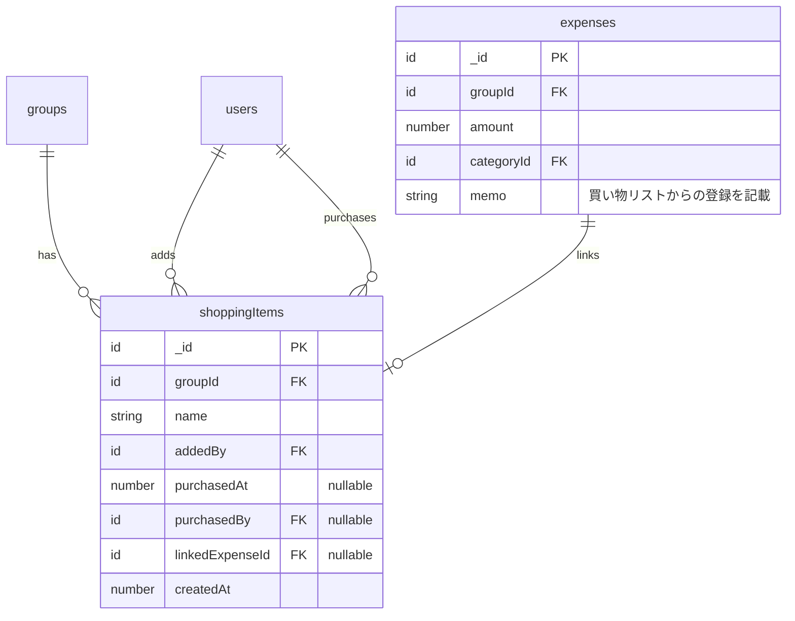
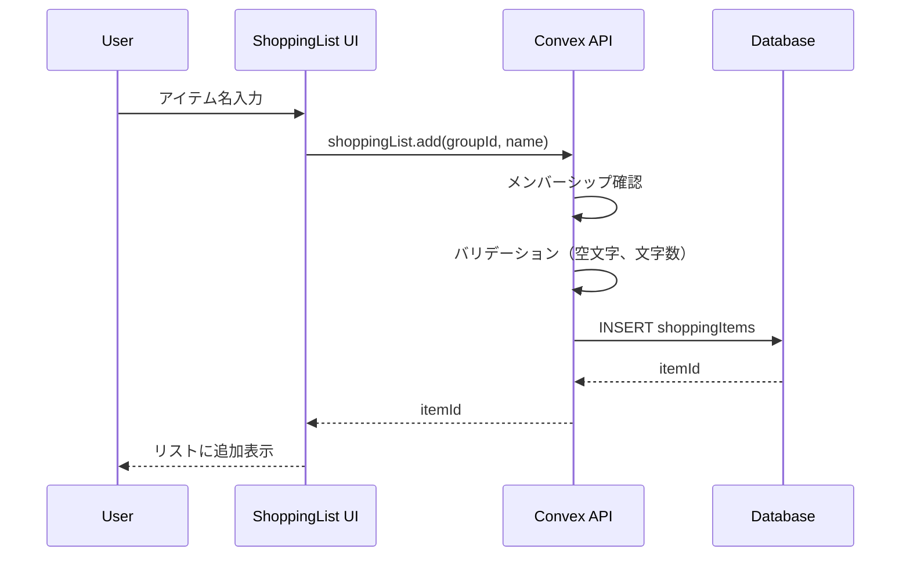
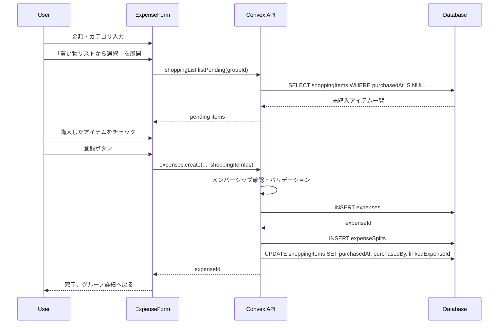

# 買い物リスト機能 設計書

## Overview

グループメンバー全員で共有できる買い物リスト機能を実装する。
アイテムの追加・購入チェック・支出連携・履歴表示を提供し、
日常の買い物管理から支出記録までをシームレスに行えるようにする。

## Purpose

### なぜこの機能が必要か

1. **買い物の共有**: 同棲カップルやシェアハウスでは「何を買うべきか」の共有が必要
2. **支出記録の効率化**: 買い物完了時にそのまま支出記録できることで入力の手間を削減
3. **二重購入の防止**: リストを共有することで同じものを買ってしまうことを防ぐ
4. **購入履歴の確認**: 過去に何を買ったかを確認できる

### 代替アプローチとの比較

| アプローチ             | メリット                     | デメリット                   |
| ---------------------- | ---------------------------- | ---------------------------- |
| 本機能（アプリ内実装） | 支出連携がスムーズ、一元管理 | 開発コスト                   |
| 外部アプリ連携         | 開発不要                     | 支出連携が手動、UX分断       |
| メモ機能として実装     | シンプル                     | 構造化されていない、連携困難 |

→ 支出連携が主目的のため、アプリ内実装が最適

## What to Do

### 機能要件

#### 1. 買い物リスト画面（リスト管理に専念）

| 機能         | 詳細                                                 |
| ------------ | ---------------------------------------------------- |
| アイテム追加 | 名前を入力してリストに追加（誰でも可能）             |
| アイテム削除 | 未購入アイテムを削除                                 |
| 購入チェック | アイテムを購入済みにする（支出登録なし）             |
| 購入解除     | 誤操作時に購入済みを未購入に戻す（支出未連携時のみ） |
| 履歴表示     | 購入済みアイテムを表示（直近30日分）                 |

#### 2. 支出登録画面から買い物リストを参照

| 機能         | 詳細                                               |
| ------------ | -------------------------------------------------- |
| リスト選択   | 支出登録時に買い物リストから購入したアイテムを選択 |
| 一括購入済み | 支出登録完了時に選択アイテムを購入済みにマーク     |
| 連携解除     | 支出削除時に買い物アイテムの連携を解除             |

**典型的なユースケース**:

```
スーパーで10個買い物、うち3個がリストにあった場合:
1. 支出登録画面を開く
2. 金額入力: ¥3,500（10個全部の合計）
3. カテゴリ選択: 🍔 食費
4. 「買い物リストから選択」で3個をチェック
5. 登録 → 支出登録 + 3個が購入済みになる
```

#### 3. 機能の分担

| 機能                     | 買い物リスト画面 | 支出登録画面 |
| ------------------------ | ---------------- | ------------ |
| アイテム追加             | ✅               | -            |
| アイテム削除             | ✅               | -            |
| 購入チェック（支出なし） | ✅               | -            |
| 購入チェック + 支出登録  | -                | ✅           |
| 履歴確認                 | ✅               | -            |

### 非機能要件

| 項目             | 要件                                                |
| ---------------- | --------------------------------------------------- |
| リアルタイム同期 | Convexの標準機能で自動対応                          |
| レスポンス       | アイテム追加・チェックは即座に反映（Optimistic UI） |
| アクセス制御     | グループメンバーのみ操作可能                        |

## How to Do It

### データモデル

既存のスキーマを活用:

```typescript
// convex/schema.ts（既存）
shoppingItems: defineTable({
  groupId: v.id("groups"),
  name: v.string(),
  addedBy: v.id("users"),
  purchasedAt: v.optional(v.number()),
  purchasedBy: v.optional(v.id("users")),
  linkedExpenseId: v.optional(v.id("expenses")),
  createdAt: v.number(),
}).index("by_group_and_purchased", ["groupId", "purchasedAt"]),
```

### ER図



### API設計

#### Query

```typescript
// 買い物リスト取得（未購入 + 直近の購入済み）
shoppingList.list(groupId: Id<"groups">): {
  pending: ShoppingItem[];    // 未購入（createdAt降順）
  purchased: ShoppingItem[];  // 購入済み直近30日（purchasedAt降順）
}

// 支出登録画面用: 未購入アイテムのみ取得
shoppingList.listPending(groupId: Id<"groups">): ShoppingItem[]
```

#### Mutation

```typescript
// アイテム追加
shoppingList.add(groupId: Id<"groups">, name: string): Id<"shoppingItems">

// アイテム削除（未購入のみ）
shoppingList.remove(itemId: Id<"shoppingItems">): void

// 購入済みにする（支出連携なし、買い物リスト画面から）
shoppingList.markPurchased(itemId: Id<"shoppingItems">): void

// 購入解除（支出未連携時のみ）
shoppingList.unmarkPurchased(itemId: Id<"shoppingItems">): void
```

#### 支出API拡張（expenses.ts）

```typescript
// 支出登録を拡張: 買い物リストアイテムの連携に対応
expenses.create(
  groupId: Id<"groups">,
  amount: number,
  categoryId: Id<"categories">,
  paidBy: Id<"users">,
  date: string,
  memo?: string,
  splitDetails?: SplitDetails,
  shoppingItemIds?: Id<"shoppingItems">[]  // 追加: 連携するアイテム
): Id<"expenses">

// 支出削除時: 連携アイテムのlinkedExpenseIdをクリア
expenses.remove(expenseId: Id<"expenses">): void  // 既存を拡張
```

### 処理フロー

#### アイテム追加フロー



#### 支出登録時の買い物リスト連携フロー



### UI設計

#### 買い物リスト画面

```
┌─────────────────────────────────┐
│ [←] 買い物リスト        [履歴] │  ← ヘッダー
├─────────────────────────────────┤
│ ┌─────────────────────────────┐ │
│ │ [+] アイテムを追加...      │ │  ← 入力フィールド
│ └─────────────────────────────┘ │
├─────────────────────────────────┤
│ ○ 牛乳                    [×] │  ← 未購入アイテム
│ ○ パン                    [×] │    ○タップで購入済み
│ ○ 卵                      [×] │    ×タップで削除
│ ○ トイレットペーパー      [×] │
├─────────────────────────────────┤
│        リストが空です          │  ← 空状態
└─────────────────────────────────┘
```

#### 支出登録画面（買い物リスト連携追加）

```
┌─────────────────────────────────┐
│ [×]      支出を登録             │
├─────────────────────────────────┤
│ 金額 *                          │
│ ┌─────────────────────────────┐ │
│ │ ¥ 3,500                     │ │
│ └─────────────────────────────┘ │
│                                 │
│ カテゴリ *                      │
│ [🍔食費][📦日用品][💡光熱費]... │
│                                 │
│ 支払者                          │
│ [自分 ▼]                        │
│                                 │
│ 日付                            │
│ [2024-01-15]                    │
│                                 │
│ メモ                            │
│ ┌─────────────────────────────┐ │
│ │                             │ │
│ └─────────────────────────────┘ │
│                                 │
│ 負担方法                        │
│ [均等][割合][金額][全額]        │
│                                 │
│ ─────────────────────────────── │
│ 📋 買い物リストから選択 [▼]    │  ← 折りたたみセクション
│ ─────────────────────────────── │
│                                 │
│      [登録する]                 │
└─────────────────────────────────┘
```

#### 買い物リスト選択（展開時）

```
│ ─────────────────────────────── │
│ 📋 買い物リストから選択 [▲]    │
│   ☑ 牛乳                        │
│   ☑ パン                        │
│   ☑ 卵                          │
│   ☐ トイレットペーパー          │
│   ────────────────────          │
│   3件選択中                     │
│ ─────────────────────────────── │
```

### コンポーネント構成

```
app/groups/[groupId]/shopping/
  └── page.tsx                    # 買い物リストページ

components/shopping/
  ├── index.ts                    # エクスポート
  ├── ShoppingList.tsx            # メインコンポーネント
  ├── ShoppingItemInput.tsx       # アイテム追加入力
  ├── ShoppingItem.tsx            # アイテム行
  └── ShoppingHistory.tsx         # 履歴表示

components/expenses/
  └── ShoppingItemSelector.tsx    # 支出登録画面用の選択UI（新規追加）

convex/
  ├── shoppingList.ts             # 買い物リストCRUD API
  ├── expenses.ts                 # 既存を拡張（shoppingItemIds対応）
  └── domain/shopping/
      ├── index.ts
      ├── types.ts                # ルール定数
      └── rules.ts                # バリデーション
```

### バリデーションルール

```typescript
// convex/domain/shopping/types.ts
export const SHOPPING_ITEM_RULES = {
  NAME_MIN_LENGTH: 1,
  NAME_MAX_LENGTH: 100,
  HISTORY_DAYS: 30, // 履歴表示日数
} as const;
```

### グループ詳細画面への導線

グループ詳細画面に買い物リストへのリンクボタンを追加:

```tsx
// components/groups/GroupDetail.tsx に追加
<Link href={`/groups/${group._id}/shopping`}>買い物リスト</Link>
```

## What We Won't Do

### MVP外の機能

| 機能                   | 理由                                 |
| ---------------------- | ------------------------------------ |
| 個別金額入力           | 複雑化を避ける。まとめて合計金額のみ |
| アイテムのカテゴリ分け | シンプルさ優先。将来検討             |
| 定期アイテム登録       | MVPでは手動追加のみ                  |
| アイテムの優先度設定   | シンプルさ優先                       |
| プッシュ通知           | MVP外（通知機能全体が対象外）        |
| 画像添付               | シンプルさ優先                       |

### 今回実装しないこと

- 複数支出への分割連携（1回の購入 = 1支出）
- アイテムの並び替え（追加順のみ）
- アイテムの編集（削除して再追加）

## Concerns

### 解決済み

| 懸念                                   | 解決策                                                    |
| -------------------------------------- | --------------------------------------------------------- |
| 支出削除時の買い物アイテム             | linkedExpenseIdをnullにして購入済み状態は維持             |
| 複数人が同時編集                       | Convexのリアルタイム同期で自動解決                        |
| リスト外アイテムを含む買い物の金額入力 | 支出登録画面から連携（案C）により合計金額を自然に入力可能 |
| まとめ購入のUX                         | 支出登録画面のチェックボックスで複数選択                  |

### 未解決・要検討

| 懸念                       | 検討事項                                                       |
| -------------------------- | -------------------------------------------------------------- |
| 履歴の表示期間             | 30日で十分か、設定可能にすべきか                               |
| 買い物リスト未使用時の表示 | 未購入アイテムがない場合、折りたたみセクションを非表示にするか |

→ MVP実装後のフィードバックで調整

## Reference Materials/Information

### 内部ドキュメント

- [MVP機能仕様](./mvp-features.md) - 買い物リスト要件
- [支出機能設計](./design-expense-feature.md) - 支出登録API参考
- [ドメインモデル設計](./design-domain-model.md) - バリデーション実装参考

### 既存実装の参考

- `convex/schema.ts` - shoppingItemsテーブル定義（既存）
- `convex/expenses.ts` - 支出登録API（連携時に参考）
- `components/expenses/ExpenseForm.tsx` - 支出フォームUI（ダイアログ参考）

### 類似アプリ参考

- Shareroo - 買い物リスト機能の参考
- Bring! - 買い物リストアプリのUX参考
