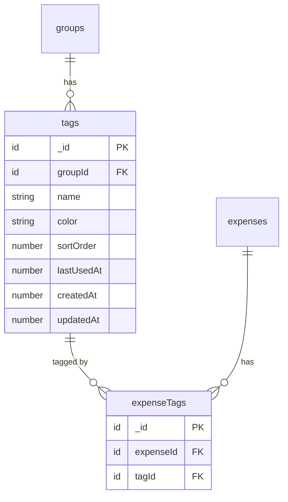
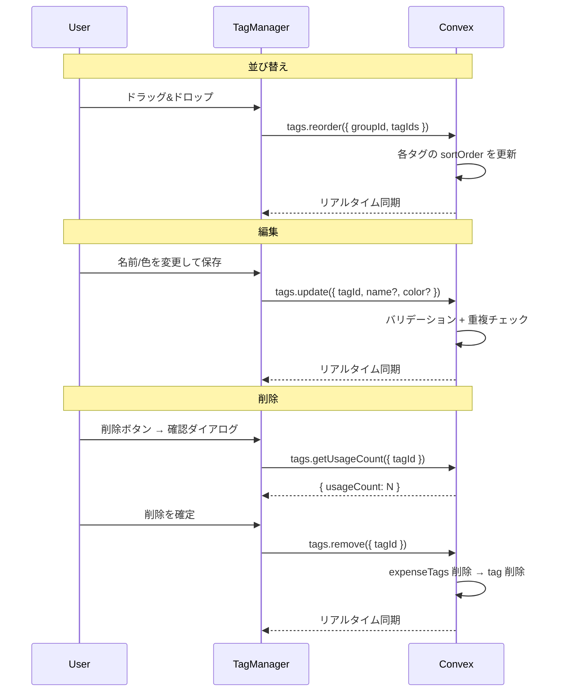
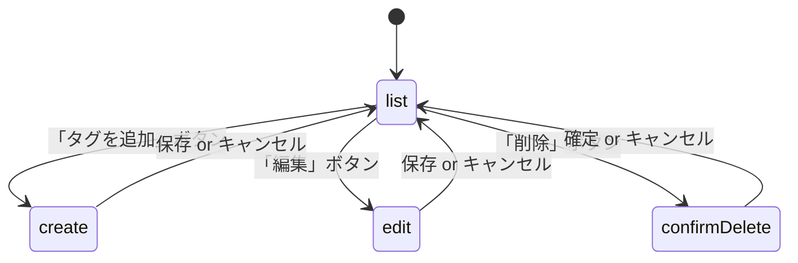

# タグ管理機能（編集・削除・並び替え）

## 概要

タグの編集（名前・色の変更）、削除、並び替え（ドラッグ&ドロップ）ができる
管理 UI を追加する。
既存の `CategoryManager` と同じパターンで `TagManager` を実装し、
グループ設定画面に配置する。

## 目的

現状、タグは支出登録フォームの `TagSelector` からしか作成できず、
名前や色の変更・削除・表示順の管理ができない。
タグが増えてくると整理する手段がないため、管理機能が必要。

**代替案との比較:**

| 方法                                  | メリット                      | デメリット                       |
| ------------------------------------- | ----------------------------- | -------------------------------- |
| **TagManager コンポーネント（採用）** | CategoryManager と一貫した UX | 新規コンポーネント追加           |
| TagSelector に編集機能を追加          | コンポーネント増えない        | TagSelector が肥大化、責務混在   |
| 専用ページ                            | 広い画面で操作しやすい        | 既存のグループ設定との導線が分散 |

## やること

### 機能要件

1. **タグ一覧表示** — グループのタグを `sortOrder` 順で表示
2. **タグ作成** — 名前入力 + 色選択（既存 `create` mutation 利用）
3. **タグ編集** — 名前と色を変更（既存 `update` mutation 利用）
4. **タグ削除** — 確認ダイアログ付き。使用件数を表示（既存 `remove` mutation 利用）
5. **タグ並び替え** — ドラッグ&ドロップで順序変更（新規 `reorder` mutation）
6. **Premium ゲート** — タグ機能は Premium 限定。非 Premium ユーザーには案内表示

### 非機能要件

- Optimistic UI: 並び替え・編集はリアルタイム反映
- モバイルファースト: タッチでのドラッグ操作に対応（`PointerSensor`）
- アクセシビリティ: キーボードでの並び替え対応（`KeyboardSensor`）

## 実装方法

### データ構造の変更

#### `tags` テーブルに `sortOrder` フィールドを追加

```
tags テーブル:
  groupId: Id<"groups">
  name: string
  color: string           // "red", "blue", etc.
  sortOrder: number       // ★ 新規追加
  lastUsedAt?: number
  createdAt: number
  updatedAt: number
```

既存タグの `sortOrder` はマイグレーション不要。
`list` クエリで `sortOrder` が `undefined` のタグは `createdAt` 順にフォールバックする。

#### ER 図



### バックエンド変更

#### 1. スキーマ変更 (`convex/schema.ts`)

`tags` テーブルに `sortOrder: v.optional(v.number())` を追加。
新規作成時は既存タグ数を `sortOrder` の初期値とする。

#### 2. `tags.list` クエリの修正 (`convex/tags.ts`)

ソート順を `lastUsedAt` 降順から `sortOrder` 昇順に変更。
`sortOrder` が未設定のタグは末尾に配置（`createdAt` 順フォールバック）。

```typescript
// Before
return tags.sort((a, b) => {
  const aTime = a.lastUsedAt ?? 0;
  const bTime = b.lastUsedAt ?? 0;
  ...
});

// After
return tags.sort((a, b) => {
  const aOrder = a.sortOrder ?? Infinity;
  const bOrder = b.sortOrder ?? Infinity;
  if (aOrder !== bOrder) return aOrder - bOrder;
  return a.createdAt - b.createdAt;
});
```

#### 3. `tags.create` ミューテーションの修正

新規作成時に `sortOrder` を設定（既存タグ数 = 末尾に追加）。

#### 4. `tags.reorder` ミューテーションの新規追加

```typescript
// args: { groupId, tagIds: Id<"tags">[] }
// tagIds の配列順で sortOrder を 0, 1, 2, ... に更新
```

`categories.reorder` と同じパターン。

#### 処理フロー



### フロントエンド変更

#### 1. `TagManager` コンポーネント（新規）

`components/tags/TagManager.tsx` に作成。
`CategoryManager` と同じダイアログベースの 3 モード構成:

- **list**: タグ一覧 + ドラッグ並び替え + 編集/削除ボタン
- **create**: タグ名入力 + 色選択
- **edit**: タグ名変更 + 色変更



#### 2. `TagColorPicker` コンポーネント（新規）

`components/tags/TagColorPicker.tsx` に作成。
18色（`TAG_COLORS`）のグリッド表示。選択中の色にチェックマーク。

#### 3. `TagForm` コンポーネント（新規）

`components/tags/TagForm.tsx` に作成。
作成・編集の共通フォーム（名前入力 + `TagColorPicker`）。

#### 4. `GroupSettings` への組み込み

カテゴリ管理の下に「タグ管理」セクションを追加。
Premium ユーザーのみ `TagManager` を表示。非 Premium には案内表示。

#### コンポーネント構造

```
GroupSettings
└─ タグ管理セクション
   ├─ Premium でない場合 → Premium 案内
   └─ Premium の場合 → TagManager
      └─ Dialog
         ├─ mode=list → SortableTagItem[] (dnd-kit)
         ├─ mode=create → TagForm
         └─ mode=edit → TagForm
         └─ DeleteConfirmDialog (使用件数表示)
```

### 変更ファイル一覧

| ファイル                              | 変更                                                                  |
| ------------------------------------- | --------------------------------------------------------------------- |
| `convex/schema.ts`                    | `tags` に `sortOrder` 追加                                            |
| `convex/tags.ts`                      | `list` のソート変更、`create` に `sortOrder` 設定、`reorder` 新規追加 |
| `components/tags/TagManager.tsx`      | **新規** — タグ管理ダイアログ                                         |
| `components/tags/TagColorPicker.tsx`  | **新規** — 色選択 UI                                                  |
| `components/tags/TagForm.tsx`         | **新規** — 作成/編集フォーム                                          |
| `components/tags/index.ts`            | **新規** — エクスポート                                               |
| `components/groups/GroupSettings.tsx` | タグ管理セクション追加                                                |
| `components/expenses/TagSelector.tsx` | 表示順を `sortOrder` に変更                                           |
| `convex/__tests__/tags.test.ts`       | `reorder` のテスト追加、`list` のソート順テスト更新                   |

## やらないこと

- **タグの一括削除** — MVP では 1 件ずつ削除で十分
- **タグのマージ（統合）** — 複数タグを 1 つにまとめる機能は将来検討
- **TagSelector の独自ソート** — TagSelector も `sortOrder` 順に統一する
  （`lastUsedAt` 順は勝手に並びが変わり予測しづらいため廃止）
- **タグのグループ間共有/コピー** — スコープ外
- **タグのアーカイブ機能** — 削除で十分
- **シードデータの更新** — タグはユーザーが自由に作成するため不要

## 懸念事項

### 1. 既存タグの sortOrder マイグレーション

既存タグには `sortOrder` がない。

→ **対策**: `v.optional(v.number())` にして、`list` クエリで `sortOrder ?? Infinity`
にフォールバック。TagManager を開いた時点で並び替え操作すれば自然に設定される。
明示的なマイグレーションは不要。

### 2. タグ削除時の影響範囲

タグを削除すると、そのタグが付いた全支出から紐付きが外れる。

→ **対策**: 削除確認ダイアログで「このタグは N 件の支出で使用されています。
削除すると紐付きが解除されます。」と表示（`getUsageCount` を利用）。

## 参考資料

- `components/categories/CategoryManager.tsx` — カテゴリ管理 UI（同パターン）
- `convex/tags.ts` — 既存タグ API
- `convex/domain/tag/types.ts` — `TAG_COLORS`, `TAG_LIMITS` 定義
- `docs/design-expense-tags.md` — タグ機能の初回設計ドキュメント
- `@dnd-kit/sortable` — ドラッグ&ドロップライブラリ（インストール済み）
